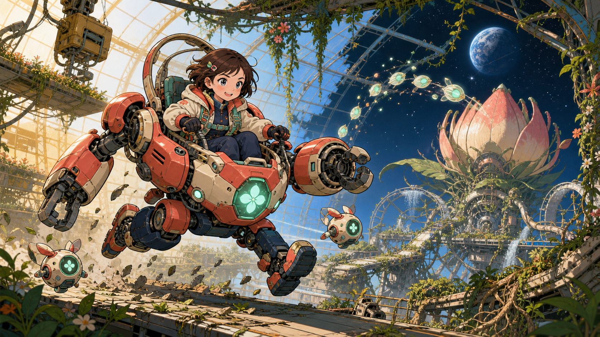
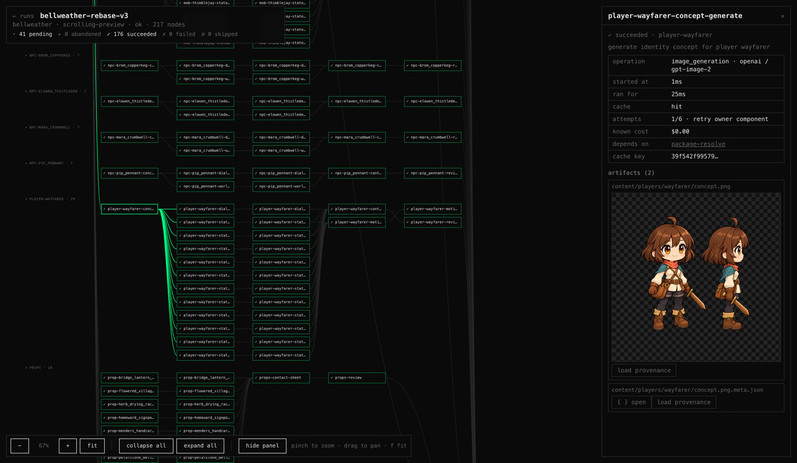

# stage-gen

`stage-gen` is an AI game asset generator with instant play: it turns a
prepared game package—art direction, maps, characters, gameplay, dialogue,
music, and reference images—into a validated set of game-ready 2D assets and a
playable runtime manifest. The reusable Python core stays general-purpose,
headless, and provider-neutral. A generated game is played by a Godot host that
reads one published run; the optional web-based run viewer inspects what a run
produced and plays nothing. Both are proofs, never the product. Today's asset space is 2D; 3D is a deferred axis the
[asset taxonomy](docs/spec/asset-taxonomy.md) already reserves a name for.



_Iron Petal Unit is the repository's canonical prepared game: one authored,
digest-bound endless-runner package that drives structural terrain generation,
asset reviews, runtime composition, and playable preview._

## From concept to playable world

The visual target is not the final deliverable. Stage Gen separates the world
into runtime layers, characters, mobs, props, items, UI, portals, terrain, and
soundtrack assets, validates their contracts, and binds the accepted results
into a portable prepared-game manifest.


_Bellweather remains the bundled side-view platformer reference and showcase._

## Game-ready systems, not loose images

Generation produces assets with explicit runtime roles. Player actions remain
transparent animation atlases. A platformer may compose a canonical 47-mask
terrain vocabulary; a runner may instead paint one native-alpha structural span
per admitted segment. In both modes deterministic authored occupancy—not the
image—owns platforms, steps, pits, and collision.


[`library/games/main.toml`](library/games/main.toml) selects the
[canonical bundled demo package](docs/game-package.md). Its closed input
contract is the source of truth for validation, planning, generation, and the
runtime adapter; generated runs never silently become schema authority.

## Quickstart

### Try the headless package without credentials

Requirements are Python 3.12 or newer and
[`uv`](https://docs.astral.sh/uv/). These commands do not call a hosted
provider or create a populated environment file:

```sh
uv sync --all-extras
uv run stage-gen --help
uv run stage-gen doctor
```

### Validate and plan the prepared reference game

No provider key is required for these commands. Before a later live-provider checkpoint, create
`.env` only when it does not already exist; never overwrite an existing file:

```sh
test -e .env || cp .env.example .env
```

The canonical game input is a directory or ZIP whose root contains `game.toml`. Package
validation, digesting, graph planning, and dry execution are provider-free:

```sh
uv run stage-gen package validate --input library/games/iron-petal-unit
uv run stage-gen package digest --input library/games/iron-petal-unit
uv run stage-gen package plan --input library/games/iron-petal-unit --genre runner
uv run stage-gen generate \
  --input library/games/iron-petal-unit \
  --genre runner \
  --dry-run \
  --output /tmp/iron-petal-unit-dry-run
```

The plan expands Iron Petal Unit into the exact 109-node structural-ground, layer, avatar,
catalog, soundtrack, validation, review, and manifest DAG. `--dry-run` executes it with
deterministic fake operations and writes a sanitized trace. There is no bare-prompt fallback.
Without `--dry-run`, an invalid package or unsupported route fails before provider execution;
only an admitted, explicitly selected graph can spend.

A live runner call is single-shot, requires provider credentials, and may spend money; omitting
`--dry-run` intentionally executes the selected runner graph and assembles one immutable
`sideview-runner-runtime-v13` run. The platformer recipe remains checkpointed:
`--checkpoint world` and `--checkpoint content` execute paid dependency closures,
`--checkpoint soundtrack` is that content closure narrowed to the tracks so a rewritten
creative brief cannot regenerate reviewed art, `--checkpoint world-review` and
`--checkpoint content-review` run the semantic reviews over a closure the cache already
holds, and `--checkpoint integration` runs the terminal manifest node over the cache with
every provider backend refusing, publishing `prepared-game-runtime-v12` without spending.

GPT Image 2.5 Sunburst at `quality="max"` is the quality-first image product. Each image node
declares its capability and exact-canvas requirements before planning seals one provider route.
The checked-in defaults use OpenAI Images for native alpha, masks, and exact sizes outside the
OpenRouter canary set, while admitted opaque/reference roles use OpenRouter. Setting
`STAGE_GEN_IMAGE_PROVIDER=openai`, `fal`, or `openrouter` replans those nodes onto that provider;
an unsupported combination is refused offline and never falls through to another route. OpenAI
and fal both provide native-alpha generation and masked editing. Flare and the Responses image
tool are not registered. The standalone compatibility background-removal command remains
available:

```sh
uv run stage-gen remove-background \
  --input ./input.png --output ./out/subject.png
```

Video is the most expensive route here — a ten-second 720p clip is $1.00 — and it takes no
seed, so an identical brief is a fresh draw at full price. It is therefore drawn and judged
outside a run, and the file that wins is linked into a package rather than re-bought on
every cold cache:

```sh
uv run stage-gen generate-video --output ./explore/clip-audition/a1.mp4 \
  --duration 10 --resolution 720p --aspect-ratio 16:9 \
  --reference ./library/games/ember-hollow/references/style-plate.png \
  "the brief, verbatim"
uv run stage-gen inspect-video --input ./explore/clip-audition/a1.mp4 \
  --output ./explore/clip-audition/a1.contact.png
```

`inspect-video` makes no provider call: it measures the clip and lays its frames out on a
contact sheet, sampled exactly as the pipeline's own reviewer samples them, so a clip is
judged by looking at it. See [the shell contract](docs/spec/game/shell.md) for how a package
adopts the winner, and note that drawing a clip inside a run stays fully supported for any
shot that does not name one.

The dry-run directory contains `package.json`, `execution-plan.json`,
`execution-projection.json`, `execution-trace.jsonl`, and `execution-summary.json`. See the
[canonical generation pipeline](docs/spec/game/generation-pipeline.md) for the executable graph,
resource limits, cache lineage, retry ownership, and operation counts. `stage-gen export-view
--run RUN_DIR` additionally derives `execution-view.json`; see
[Reading a run back](#reading-a-run-back).

## Generation cost

Budget approximately **USD 13** for a complete first generation of Iron Petal Unit. The
provider-free planner exposes the current estimate before any live request is made:

| Iron Petal Unit runner | Planned amount |
| --- | ---: |
| Planned graph | 109 nodes |
| Local validation and assembly | 56 operations |
| GPT Image 2.5 Sunburst generation | 39 operations |
| Structured generation and review | 7 operations |
| Tool-loop review | 2 operations |
| Music generation | 2 operations |
| Sound-effect generation | 3 operations |
| Estimated provider spend | **USD 7.20–12.81** |
| Practical first-run budget | **About USD 8–13** |

This is a conservative planning allowance, not a provider quote. Active model pricing, retries,
and deliberate semantic regenerations can change the final charge. Valid cache hits do not repeat
provider work, so focused revisions and resumed runs are normally cheaper than the first complete
generation. The generated `execution-projection.json` is the authority for the selected package;
the [canonical generation pipeline](docs/spec/game/generation-pipeline.md) explains its assumptions.

## Reading a run back

A run appends a sanitized trace while it executes. `stage-gen export-view --run RUN_DIR` joins
that trace with the plan it ran into `execution-view.json`: a derived, read-only document holding
each node's state, timings, cache disposition, attempts, known cost, produced artifacts, and the
dependency that blocked it. The web adapter renders that document as the graph the run actually
was — one lane per domain, one chip per node, and an inspector over whichever node is selected.



_`out/bellweather-rebase-v3` exported and opened at `/runs/<tag>`. The viewer reads documents the
CLI wrote; it holds no engine state and generates nothing._

Runs are read from `out/`, or from `STAGE_GEN_OUT_DIR` when it is set. A run whose trace stops
without a result is reported as interrupted rather than in flight: the document states only what
its own records support, and the reader judges liveness from when the trace was last appended.

## What it provides

- Typed, provider-neutral components for image and structured generation,
  background removal, experimental music generation, and semantically reviewed
  one-axis image repetition.
- Deterministic image/audio inspection, normalization, persistence, retries,
  cancellation, path confinement, and redaction.
- Seven recipes compiled onto that engine: `sideview-platformer` and `sideview-runner`
  build distinct prepared-game members from a `game.toml` package, `dialogue-scene`
  builds an adult, non-explicit scene bundle from an authored request,
  `pointclick-room` builds a fixed painted puzzle room from an authored room package,
  `oblique-survival` builds a billboard-sprite survival world under a fixed
  elevated-oblique perspective camera — ground material, props and their interaction
  states, four-way actors, an authored crafting table, a season calendar, weather,
  music and sound — from an authored survival package, `universe` builds an
  explorable storyworld package with one concept image per admitted entity, and
  `storefront` draws the outward face of a game — app icon, store preview stills,
  feature banner and listing copy — from that game's own art.
  Each declares its own graph document kind, so no recipe can read another's plan.
- An application-agnostic asset-graph engine, `gnode`: declared `model@provider` routes with the
  features each supports, offline projection, resource-aware scheduling, content-and-lineage cache
  keys, an append-only trace, and the derived run view above.
- One CLI, which is the only way to start a run.
- A replaceable Next.js/React/Tailwind/Phaser preview that consumes completed manifests
  without moving gameplay assumptions into Python components.
- A reusable, provider-neutral [authored character library](docs/character-library.md)
  shared by `dialogue-scene` requests and prepared game packages alike.
- One [canonical bundled demo package](docs/game-package.md), selected by
  `library/games/main.toml`, that current-schema validation and future demo serving can share.
- A canonical [game contract](docs/game-contract.md) that separates game-wide
  presentation, cast, motion, scenarios, gameplay, content catalogs, and consumer bindings,
  plus an executable [authored `game.toml` schema](docs/spec/game/authored-contract-schema.md).
- A machine-checked [canonical game-generation pipeline](docs/spec/game/generation-pipeline.md)
  covering the current side-view platformer and runner DAGs, typed nodes, operation contracts,
  internal fan-out, and execution semantics.
- A [point-and-click puzzle room recipe](docs/spec/game/pointclick-room.md) whose authored
  `pointclick-room-v3` package is proven finishable before any generation is paid for, and
  whose `pointclick-room-runtime-v3` manifest a browser consumer replays with the same state
  machine the proof searched.
- A separate, game-global [authored soundtrack catalog](docs/game-soundtrack.md)
  with stable track IDs and digest-bound generation, plus [authored maps](docs/game-maps.md)
  that carry art direction and a terrain request and never own geometry.
- A current-only [dialogue-character runtime pipeline](docs/dialogue-character-runtime-pipeline.md)
  for reviewed character-bundle import into the platformer runtime manifest.
- An agent-facing [Game Concept Studio](concept-studio/README.md), governed by the root
  [`game-concept-studio` skill](.agents/skills/game-concept-studio/SKILL.md), for pre-production
  concept text and cover exploration before any game package is authored.

## Recipe boundary

The stable product boundary is coherent **2D asset generation**. Genre,
viewpoint and camera, composition rules, and validation harnesses belong to
individual recipes. `sideview-platformer` is the side-view reference integration;
`sideview-runner` is the reaction-fair auto-run integration;
`dialogue-scene` is a separate adult, non-explicit visual-novel bundle recipe;
`pointclick-room` is a fixed-room, cursor-driven puzzle recipe;
`oblique-survival` is the ground-plane survival recipe under an elevated-oblique
perspective camera; `storefront` is the one recipe that draws nothing playable —
the face a finished game is listed behind. No recipe may define another's
assumptions or artifact layout.

The point-and-click recipe (`2d/roomview/pointclick`) is one of the seven.
One room is one authored package under `library/games/<game_id>/`: a
`pointclick-room-v3` `room.toml` — a backdrop brief, hotspots carrying an
art-direction rectangle and a separate runtime hit area, items, and interactions
written in a closed grammar of two verbs and four effects — beside the
`references/` it is drawn against. The recipe searches the
room's reachable state space and refuses a room that cannot reach its win
condition, so the puzzle is proven finishable before a cent is spent; generation
supplies art and narration only, and the art direction arrives as an authored
image rather than an adjective. The run publishes a `pointclick-room-runtime-v3`
manifest that the Godot room host replays with the same state machine the
proof searched.

```sh
uv run stage-gen pointclick-room generate \
  --input library/games/clockmakers_attic \
  --output out/clockmakers-attic
```

Add `--dry-run` for the free rehearsal. See the
[point-and-click puzzle room specification](docs/spec/game/pointclick-room.md).

## A survival world on a ground plane

The survival recipe (`2d/obliqueview/survival`) is the sixth. One world is one
authored package under `library/games/<game_id>/`: an
`oblique-survival-package-v2` `survival.toml` beside the files it names — the
actors and their facing sets, the props and their interaction states, the ground
as material plates and the forage sheet, the items and the crafting table, a
season calendar, weather, music and sound. Everything drawn is a flat card
standing on a 3D ground plane under a fixed elevated-oblique perspective camera,
so a prop is never seen from behind however far the camera turns. The run
publishes an `oblique-survival-manifest-v3` manifest that the Godot host under
`godot` plays; this recipe has no browser player.

```sh
uv run stage-gen oblique-survival generate \
  --input library/games/ember-hollow \
  --output out/ember-hollow-v1 \
  --scope full
```

Add `--dry-run` for the free rehearsal, and `--scope minimal` for the narrowest
rung of the ladder — a narrow scope shares every node it keeps with a wide one,
so it warms the cache rather than paying twice. See the
[oblique-survival specification](docs/spec/survival/generation-v1.md) and the
[Godot host](docs/godot-host.md).

## The face a finished game is listed behind

The storefront recipe is the seventh and the only one that draws nothing
playable: the app icon, the store preview stills, the feature banner and the
listing copy that sits beside them. One storefront is one authored package —
a `storefront-source-v1` `storefront.toml` beside a positioning note and the
game's own art — and it reads none of that game's runtime contracts, so it can
be drawn before the game it fronts is finished.

It is the cheapest recipe in the repository, because there is nothing to
compose. Each surface is one brief drawn at one canvas. What holds the set
together is a single *reading* of the reference art, compiled once into a
direction all four pictures inherit; what keeps a storefront from refusing the
output is a closed table of exact canvases and a deterministic cut to them, since
each draw canvas is admitted as an exact route requirement before a provider can run.

```sh
uv run stage-gen storefront generate \
  --input library/games/ember-hollow \
  --output out/ember-hollow-storefront-v1
```

Add `--dry-run` for the free rehearsal. A rejected picture is redrawn by
advancing its draw index — `--draw-ledger <prior run>/draw-ledger.json --reroll
icon` — which moves that one surface and leaves everything else a cache hit.

A preview still of *real play* is declared in the package vocabulary and refused
while planning, by name: a deterministic play-and-capture harness does not exist
yet, and answering a package that asked for a captured frame with a drawn one
would be a silent substitution. The screens *inside* a game — the opening
cinematic, the title screen, the loading screen — are a different owner's: the
[game shell](docs/spec/game/shell.md). See the
[storefront specification](docs/spec/storefront/generation-v1.md).

## Authored dialogue in the same game


Bellweather's authored sequence contracts bind speaker, expression, dialogue,
node flow, and outcomes to stable NPC and player artwork. The runtime resolves
Mara Crumbwell's interaction from
[`gameplay.toml`](library/games/bellweather/gameplay.toml), loads
[`sunpetal_welcome.scenario`](library/games/bellweather/scenarios/sunpetal_welcome.scenario),
and presents the conversation inside the same generated map and gameplay
session shown above.

Dialogue remains authored game content rather than an image-generation side
effect: NPC identities and expression vocabularies live in
[`content/npcs.toml`](library/games/bellweather/content/npcs.toml), interaction
wiring lives in `gameplay.toml`, and the conversation itself lives under
`scenarios/` as an authored script proven finishable before any spend.

## Reusable authored characters

A character profile is a member of the game package that binds it, named by
exact relative path and exact bytes. Packages live in an explicit workspace root
and are intentionally excluded from wheel and sdist packages. In a source
checkout, validate the shipped profile with:

```sh
uv run stage-gen character-profile validate \
  --input library/games/larkfield/character.toml \
  --package-root library/games/larkfield
uv run stage-gen character-profile digest \
  --input library/games/larkfield/character.toml \
  --package-root library/games/larkfield
```

Installed CLI users pass their own package directory with `--package-root`.
Profiles describe durable identity only; per-shot direction, pose conditioning,
image observation, and consistency reports remain
[future research](docs/research/dialogue-character-direction.md).

## Authored game contracts

A profile says who the player is. The
[canonical bundled demo package](docs/game-package.md), selected by
`library/games/main.toml`, is the repository source of truth for the exact
authored request and game/soundtrack/map closure used by tests and the future
hosted demo. The [game contract](docs/game-contract.md) is the current-only
domain authority beneath that selector: it says how presentation, cast,
motion, scenarios, gameplay, catalogs, and consumer bindings compose without
making one recipe or runtime the source of truth. The implemented
[authored contract schema](docs/spec/game/authored-contract-schema.md) fixes the
current run's camera, style keywords, cast-wide build in heads, and supported
role render profiles in `library/games/<game_id>/game.toml`. Authored libraries
are excluded from wheel and sdist packages exactly as character profiles are.

Music remains a sibling contract: platformer members use root `soundtrack.toml`,
while runner members use `runner/soundtrack.toml`. Platformer maps are another
optional sibling under `library/games/<game_id>/maps/`: the soundtrack owns tracks,
each map owns references to an allowed track pool, and neither adds fields to the
visual game contract. Only the exact current identities listed in
the [canonical package policy](docs/game-package.md#current-only-policy) are
valid. See [Authored game soundtracks](docs/game-soundtrack.md),
[Authored game maps](docs/game-maps.md), and the current-only
[dialogue-character runtime pipeline](docs/dialogue-character-runtime-pipeline.md).

These systems remain optional outside the selected demo. An absent soundtrack,
map book, or reviewed dialogue-character binding omits its stages and manifest
block from the current envelope; absence never asks a validator or consumer to
interpret an old schema.

```sh
uv run stage-gen package validate --input library/games/iron-petal-unit
uv run stage-gen package digest --input library/games/iron-petal-unit
uv run stage-gen package plan --input library/games/iron-petal-unit --genre runner
```

The package resolver validates the exact game and selected genre closure—including gameplay,
content, soundtrack, and referenced media—before any provider operation. Optional platformer
maps and sequences are admitted only when that member declares them.

## Architecture

Python is the sole headless implementation, split into an application and the
asset-graph engine it runs on. Node and TypeScript are confined to `web/`.

```text
src/gnode/              the ringed asset-graph SDK
  graph.py             typed nodes, declared resources, content identity
  node_types.py        node type declarations, policies, and registry dispatch
  build.py             typed graph construction and template stamping
  schedule.py          offline projection and the live scheduler
  trace.py             append-only run trace and post-run summary
  view.py              derived read-only run view for a client
  binding.py           legacy operation bindings used outside the image-route catalog
  routes.py            exact product policies, provider routes, and portable route snapshots
  route_constraints.py generic exact-canvas admission constraints
  contracts/           persisted contract bases and provenance records
  reliability/         retries, cancellation, redaction, paths, persistence
  modalities/          provider-neutral model protocols and retry-owning services
  providers/           OpenAI, OpenRouter, fal, and ElevenLabs adapters
src/stage_gen/          the application, consuming `gnode`
  image_product.py     active image-product identities and provider endpoint spellings
  model_routes.py      checked-in Sunburst route catalog and capability policies
  components/          application components and capability-specific processing
  providers/           adapters for application-owned component protocols
                       (the provider-neutral conditioned image-repeat repair)
  media/               deterministic image/audio inspection and normalization
  recipes/             application compositions and exported manifests; the
                       recipe executor and provider-free dry run live at its root
  orchestration/       package resolution, execution documents, composition
  interfaces/          the argparse CLI, the only automation surface
  resources/           wheel-packaged templates and approved fallback music
web/                    optional browser preview consumer
library/games/          source-checkout or external authored package workspace
```

Consumers import rings 0 and 1 through `from gnode import X`, and provider
adapters through the declared `gnode.providers.openai`,
`gnode.providers.openrouter`, `gnode.providers.fal`, and
`gnode.providers.elevenlabs` surfaces. Other engine submodules are private, and
the engine imports no application package. A contract test enforces both
directions.

Dependencies point inward: providers implement modality or application component
protocols, recipes compose components, and `orchestration.runtime` joins concrete
providers to recipes for the interfaces. Components and recipes do not import providers or
the web preview. The Python `image_repeat` service admits unchanged sources or
performs an explicitly requested endpoint-conditioned repair. Repair keeps the
provider-owned RGB appearance, deterministically reconstructs alpha topology
from the source endpoint profiles, anchors only its endpoint bands to the source
in premultiplied RGBA, and then requires deterministic continuity plus independent
intended-loop review.

See [Architecture](ARCHITECTURE.md), the
[system overview](docs/spec/system-overview.md), and the
[component contract](docs/component-contract.md).

## Optional web preview

Web development and deterministic gameplay automation require Bun 1.4.0 (the
version pinned by `web/package.json`). Install the locked dependencies and the
matching Playwright Chromium browser once:

```sh
cd web
bun install --frozen-lockfile
bun run dev
```

`ffmpeg` and `ffprobe` must be on `PATH` for generated-music normalization and
inspection, for generated sound-effect level admission, and for every clip measurement —
`inspect-video`, the admission gate, and the contact sheets both of them build. Verify the
optional adapter with:

```sh
cd web
bun run check
bun test
bun run build --webpack
```

`web/` starts no run and, since decision 0061, plays fewer of them each time a
genre is promoted: the preview boots one published `prepared-game-runtime-v12`
package, `/runs/<tag>/artifacts` lists what a run produced, and `/runs` renders
exported run views. The runner, the room, the dialogue scene and the case are
played by their Godot hosts and have no browser route; the platformer's preview
is the last one left. Browser code never receives provider credentials, and the
docs gate checks that nothing under `web/lib/shell` can spawn a process.

`godot` is the repository's second consumer and starts no run either. It plays
one published run directory, named on its command line, in whichever host that
genre has, and commits no media of its own; see [Godot host](docs/godot-host.md),
[decision 0057](docs/decisions/0057-the-survival-game-runs-on-godot.md) and
[decision 0061](docs/decisions/0061-every-genre-runs-on-godot-and-web-is-the-viewer.md).

## Configuration and providers

`.env.example` is the configuration reference. The Python application imports
only the allowlisted provider keys from a root `.env`; existing process
environment values take precedence. Endpoints, registered model overrides, the optional scalar
image-provider override, output paths, timeouts, force mode, transparency mode, and the optional
web executable are read from the process environment.

- Image workloads are resolved from capability first and provider second. The graph records one
  exact route snapshot per used binding, and runtime dispatch must match it.
- OpenAI Images is the default for native-alpha generation, masked edits, and custom exact sizes
  that are not in the OpenRouter canary set.
- OpenRouter backs structured generation, experimental music generation,
  and the designated opaque/reference image roles whose exact sizes were verified.
- fal is an explicit selectable Sunburst image provider with native transparency and masks, and
  separately backs the `ai` transparency strategy's removal step and `remove-background`.
- `STAGE_GEN_IMAGE_PROVIDER` changes the selected image provider only when the requested
  capabilities and exact size are admitted; changing it requires a new plan. Credentials are
  checked only after planning has selected and sealed the route. A missing key refuses dispatch
  of that route, and no provider is an automatic fallback for another.
- `chroma` is an explicit degraded local-keying fallback, never an automatic
  replacement for failed AI removal.
- Music generation remains experimental until its current provider envelope
  passes the documented key-backed contract smoke.

Provider and model contracts can change independently of this repository.
Review [Provider operations](docs/models/providers.md) before changing an adapter.

## Reliability and provenance

Every provider operation has one initial attempt plus at most five retries
with capped backoff. Network failures and silent contract failures—including
empty media, malformed JSON, schema mismatch, invalid base64, unsupported
media, and failed caller validation—remain inside that single retry owner.

An artifact succeeds only after contract validation and rollback-safe
artifact-plus-sidecar persistence. Provenance records the sealed route, provider/model and API
surface identity, effective output options, sanitized prompts and parameters, input hashes,
attempts, validation,
tool/component identity, deterministic post-processing, output digests, and any
explicit rights decision. It never persists credentials, authorization headers,
signed URLs, temporary paths, or embedded media. Provenance supports
reproducibility; it is not a redistribution grant.

## Testing

Run the locked credential-free Python handoff gate:

```sh
uv run python scripts/check.py
```

It **checks** formatting, runs lint and strict typing, executes all non-live
tests, builds the sdist and wheel, verifies packaged resources, and exercises
CLI smoke commands. It does not rewrite source formatting.

Provider-backed tests require explicit opt-in. Confirm that live tests remain
safely skipped with:

```sh
STAGE_GEN_RUN_LIVE=0 uv run pytest -m live -q
```

Focused commands and the intentional `STAGE_GEN_RUN_LIVE=1` workflow are in
[Testing](docs/testing.md). Generated visual output still requires independent
review by an agent other than its producer.

## Documentation and publication policy

- [Documentation index](docs/README.md)
- [Asset contracts](docs/spec/asset-contracts.md)
- [Oblique-survival generation](docs/spec/survival/generation-v1.md)
- [Godot host](docs/godot-host.md)
- [Verified single-axis image repeat](docs/image-repeat.md)
- [Scene-layer contract](docs/scene-layers.md)
- [Verification rules](VERIFICATION.md)
- [Generated-media publication](docs/generated-media-publication.md)
- [Repository storage policy](docs/repository-storage.md)
- [OSS and IP policy](docs/oss-ip.md)

Prompts, fixtures, examples, and committed outputs must use original,
brand-neutral briefs. BSD-3-Clause covers repository source; it does not
automatically license generated artifacts, user inputs, provider outputs,
models, or third-party services.

## License

Source code is available under the [BSD 3-Clause License](LICENSE).
