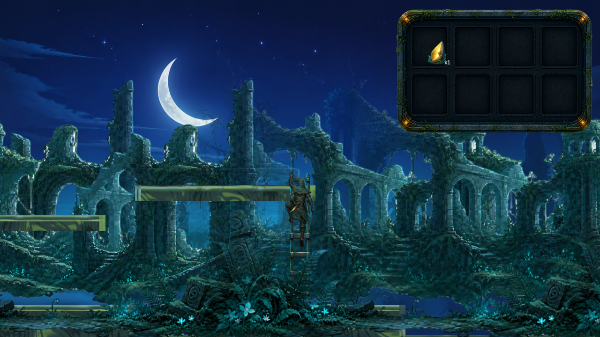
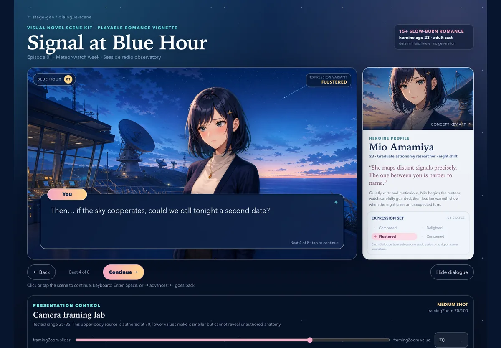

# stage-gen

`stage-gen` is a general-purpose, headless Python pipeline and component library
for producing coherent 2D game assets with validation, deterministic
post-processing, and content-bound provenance. The repository includes one
reference scrolling-game recipe and an optional web-based scrolling-game
preview; gameplay remains a consumer of the generated artifacts, not part of
the reusable core.



_Current deterministic 20-asset model demo. The screenshot is a canvas-only
capture from the multi-tier gameplay fixture. Its adjacent
[provenance and review record](docs/media/gameplay-model-demo.png.meta.json)
binds the published bytes to the verified source state._

[`library/games/main.toml`](library/games/main.toml) selects the repository's one
[canonical bundled demo package](docs/game-package.md). That digest-locked closure is the
single source of truth for current game-schema tests, authored validation, and a future hosted
demo; examples and generated runs do not replace it as schema authority.

[Watch the historical deterministic 30-second capture (18-asset build)](docs/media/gameplay-showcase.mp4).
Its [poster](docs/media/gameplay-showcase.poster.png), adjacent provenance
sidecars, and [artifact-specific media notice](docs/media/gameplay-showcase.LICENSE.md)
remain bound to that older capture. They must not be presented as a recording
of the current 20-asset fixture.

## Quickstart

### Try the headless package without credentials

Requirements are Python 3.12 or newer and
[`uv`](https://docs.astral.sh/uv/). These commands do not call a hosted
provider or create a populated environment file:

```sh
uv sync --all-extras
uv run stage-gen recipes
uv run stage-gen benchmark smoke
```

### Generate the reference recipe

Create `.env` only when it does not already exist, then populate the required
keys. Do not overwrite an existing file:

```sh
test -e .env || cp .env.example .env
```

The CLI default is `--transparency ai`; it requires both `OPENROUTER_API_KEY`
and `FAL_KEY`. A doctor run with blank keys intentionally reports an incomplete
configuration and exits with status 2.

```sh
uv run stage-gen doctor --transparency ai --json
uv run stage-gen generate --recipe scrolling-preview \
  "original rain-dark stone ruins with pale moss"
```

Scrolling preview accepts a prompt-only current request. To include the optional pre-image style
selector, use a JSON or TOML input containing:

```json
{
  "prompt": "original rain-dark stone ruins with pale moss",
  "style_anchor": {
    "schema_version": 1,
    "kind": "automatic_style_anchor_v1"
  }
}
```

When `style_anchor` is absent, the current recipe uses its current default rendering direction;
no older request schema is selected. When present, the selector chooses only a tracked
rendering-medium vocabulary mode. Recipe content and optional
[theme art-direction compilation](docs/theme-art-direction.md) remain separate.

A separate `village` opt-in — `{"schema_version": 1, "kind": "village_hub_v1"}` — adds a
[village hub](docs/spec/asset-contracts.md#optional-village-hub) of four residents and eight
fixtures to the same run. When `village` is absent, the current run omits its village stages,
artifacts, and manifest block. Presence means inclusion in the same current contract, not a
different or older manifest version.

Use `--transparency chroma` for the explicit degraded local-keying path.
`FAL_KEY` is not required for an explicit `--transparency chroma` run, although
OpenRouter remains required for image and structured generation. Standalone
background removal always requires `FAL_KEY`, independent of the recipe's
transparency setting:

```sh
uv run stage-gen remove-background \
  --input ./input.png --output ./out/subject.png
```

Generated runs default to `out/<prompt-tag>-<mode>/`. Every run writes an
atomic `run.json`; scrolling-preview emits only the exact current manifest V7
envelope. Optional current systems such as soundtrack, map book, population,
village, and reviewed dialogue-character imports are omitted when not authored
and validated; their absence never selects an older envelope. Generated
artifacts retain adjacent provenance. A bare prompt is the current CLI shorthand
for `generate --recipe scrolling-preview`.

## What it provides

- Typed, provider-neutral components for image and structured generation,
  background removal, experimental music generation, and semantically reviewed
  one-axis image repetition.
- Deterministic image/audio inspection, normalization, persistence, retries,
  cancellation, path confinement, and redaction.
- Recipe orchestration with progress, cache validation, atomic summaries,
  manifests, artifact hashes, and adjacent provenance.
- A CLI plus an optional loopback HTTP/SSE service.
- A replaceable Next.js/React/Phaser preview that consumes completed manifests
  without moving gameplay assumptions into Python components.
- A reusable, provider-neutral [authored character library](docs/character-library.md)
  shared by opt-in dialogue-scene and scrolling-preview requests.
- One [canonical bundled demo package](docs/game-package.md), selected by
  `library/games/main.toml`, that current-schema validation and future demo serving can share.
- A canonical [game contract](docs/game-contract.md) that separates game-wide
  presentation, cast, motion, sequences, gameplay, content catalogs, and consumer bindings,
  plus an executable [authored `game.toml` schema](docs/spec/game/authored-contract-schema.md).
- A separate, game-global [authored soundtrack catalog](docs/game-soundtrack.md)
  with stable track IDs and digest-bound generation, plus [authored map books](docs/game-maps.md)
  that order map identities and select game-global track pools without owning geometry.
- A current-only [dialogue-character runtime pipeline](docs/dialogue-character-runtime-pipeline.md)
  for reviewed character-bundle import into manifest V7.
- An agent-facing [Game Concept Studio](concept-studio/README.md), governed by the root
  [`game-concept-studio` skill](.agents/skills/game-concept-studio/SKILL.md), for pre-production
  concept text and cover exploration before any game package is authored.

## Recipe boundary

The stable product boundary is coherent **2D asset generation**. Genre,
viewpoint and camera, composition rules, and validation harnesses belong to
individual recipes. `scrolling-preview` is the side-view reference integration;
`dialogue-scene` is a separate adult, non-explicit visual-novel bundle recipe.
Neither recipe may define the other's assumptions or artifact layout.

## Showcase: adult dating-sim dialogue demo



**After the Seminar** is a deterministic adult dating-sim technology demo built
from a study-lounge background, one adult character identity, four transparent
expression variants, caller-authored dialogue, and presentation data. Mio
Amamiya is a 23-year-old graduate astronomy researcher talking with another
adult participant in a coastal university study lounge after an evening
graduate seminar. Each dialogue beat selects a discrete `neutral`,
`delighted`, `flustered`, or `concerned` variant; these are reusable sprite
states, not animation frames and not a rig.

The image above and `web/public/dialogue-scene/demo/anime/` remain a historical
showcase with preserved provenance, not a portable v1 wire schema. The current
route binds the versioned v2 study-lounge set without rewriting that history.

Run the optional web app and open `/dialogue-scene/demo` to play the vertical
slice. The same page keeps the numeric framing control and camera-term
prompt mapping over `25..85`, while a deterministic viewport owns the final
crop. Mio's committed sprites are authored upper-body at baseline `70`, so
looser values make that source smaller but correctly do not claim to reveal
unauthored full-body pixels.

The provider-backed `dialogue-scene` headless recipe uses strict lower_snake_case
wire V2 for legacy appearance requests and wire V3/recipe V4 for reusable
character-profile requests.
The deterministic web installer is implemented. Start with the
[operator workflow](docs/dialogue-theme-pipeline.md) and its
[legacy request example](examples/dialogue-theme/adult-university-date.json) or
[profile-enabled request](examples/dialogue-theme/profile-enabled-date.toml).
The recipe pairs one appearance concept with a finite expression-variant set;
choices, rigging, lip sync, and motion stay outside the committed slice. The
boundaries are also recorded in the
[asset contract](docs/spec/dialogue-scene-assets.md),
[preview contract](docs/dialogue-scene-preview.md),
[framing control](docs/dialogue-scene-framing.md), and
[deferred animation notes](docs/dialogue-scene-animation.md).

From `web/`, the shortest generation and installation commands are:

```sh
bun run stage-gen -- generate --recipe dialogue-scene \
  --input ../examples/dialogue-theme/adult-university-date.json --transparency ai
bun run dialogue-theme -- install --bundle ../out/<generated-tag>/bundle.json
```

## Reusable authored characters

Profiles live in an explicit workspace root and are intentionally excluded from
wheel and sdist packages. In a source checkout, validate the repository sample and
generate both profile-aware recipes with:

```sh
uv run stage-gen character-profile validate \
  --input library/characters/mira-vale-cartographer/profile.toml \
  --character-library-root .
uv run stage-gen character-profile digest \
  --input library/characters/mira-vale-cartographer/profile.toml \
  --character-library-root .
uv run stage-gen generate --recipe scrolling-preview \
  --input examples/scrolling-preview/profile-enabled-coast.toml \
  --character-library-root . --transparency ai
uv run stage-gen generate --recipe dialogue-scene \
  --input examples/dialogue-theme/profile-enabled-date.toml \
  --character-library-root . --transparency ai
```

Installed CLI users must provide their own workspace root containing
`library/characters/`, either with `--character-library-root` or
`STAGE_GEN_CHARACTER_LIBRARY_ROOT`. Profiles describe durable identity only;
per-shot direction, pose conditioning, image observation, and consistency
reports remain [future research](docs/spec/dialogue-character-direction.md).

## Authored game contracts

A profile says who the player is. The
[canonical bundled demo package](docs/game-package.md), selected by
`library/games/main.toml`, is the repository source of truth for the exact
authored request and game/soundtrack/map closure used by tests and the future
hosted demo. The [game contract](docs/game-contract.md) is the current-only
domain authority beneath that selector: it says how presentation, cast,
motion, sequences, gameplay, catalogs, and consumer bindings compose without
making one recipe or runtime the source of truth. The implemented
[authored contract schema](docs/spec/game/authored-contract-schema.md) fixes the
current run's camera, style keywords, cast-wide build in heads, and supported
role render profiles in `library/games/<game_id>/game.toml`. Authored libraries
are excluded from wheel and sdist packages exactly as character profiles are.

Music remains a sibling contract at `library/games/<game_id>/soundtrack.toml`.
Maps are another sibling under `library/games/<game_id>/maps/`: the soundtrack
owns tracks, each map owns references to an allowed track pool, and neither adds
fields to the visual game contract. Only the exact current identities listed in
the [canonical package policy](docs/game-package.md#current-only-policy) are
valid. See [Authored game soundtracks](docs/game-soundtrack.md),
[Authored game maps](docs/game-maps.md), and the current-only
[dialogue-character runtime pipeline](docs/dialogue-character-runtime-pipeline.md).

These systems remain optional outside the selected demo. An absent soundtrack,
map book, or reviewed dialogue-character binding omits its stages and manifest
block from the current envelope; absence never asks a validator or consumer to
interpret an old schema.

```sh
uv run stage-gen game validate \
  --input library/games/whimsical-storybook-fantasy/game.toml \
  --game-library-root .
uv run stage-gen game digest \
  --input library/games/whimsical-storybook-fantasy/game.toml \
  --game-library-root .
uv run stage-gen soundtrack validate \
  --input library/games/whimsical-storybook-fantasy/soundtrack.toml \
  --game-library-root .
uv run stage-gen soundtrack digest \
  --input library/games/whimsical-storybook-fantasy/soundtrack.toml \
  --game-library-root .
uv run stage-gen generate --recipe scrolling-preview \
  --input examples/scrolling-preview/game-directed-village.toml \
  --game-library-root . --transparency ai
```

The root may also come from `STAGE_GEN_GAME_LIBRARY_ROOT`. Every authored word
is checked against the closed vocabulary in
`src/stage_gen/resources/prompting/game_vocabulary_v1.json`, so a contract
cannot introduce a style keyword, body kind, stance, or held prop the pipeline
has not reviewed.

## Architecture

Python under `src/stage_gen/` is the sole headless implementation. Node and
TypeScript are confined to `web/`.

```text
src/stage_gen/
  contracts/           typed artifact and provenance contracts
  components/          provider-neutral image, structured, removal, music,
                       and verified single-axis image-repeat operations
  providers/           OpenRouter and FAL HTTP adapters
  media/               deterministic image/audio inspection and normalization
  reliability/         retries, cancellation, redaction, paths, and persistence
  recipes/             application compositions and exported manifests
  orchestration/       run preparation, concrete composition, and run.json
  interfaces/          CLI and optional HTTP/SSE API
  benchmarks/          credential-free and opt-in evaluation suites
  resources/           wheel-packaged templates and approved fallback music
web/                    optional browser preview consumer
library/characters/     source-checkout or external authored profile workspace
```

Dependencies point inward: providers implement component protocols, recipes
compose components, and `orchestration.runtime` joins concrete providers to
recipes for the interfaces. Components and recipes do not import providers or
the web preview. The Python `image_repeat` service admits unchanged sources or
performs an explicitly requested endpoint-conditioned repair. Repair keeps the
provider-owned RGB appearance, deterministically reconstructs alpha topology
from the source endpoint profiles, anchors only its endpoint bands to the source
in premultiplied RGBA, and then requires deterministic continuity plus independent
intended-loop review.

See [Architecture](ARCHITECTURE.md), the
[system overview](docs/spec/system-overview.md), and the
[component contract](docs/component-contract.md).

## Optional web preview

Web development and deterministic gameplay automation require Bun 1.3.3 (the
version pinned by `web/package.json`). Install the locked dependencies and the
matching Playwright Chromium browser once:

```sh
cd web
bun install --frozen-lockfile
bunx playwright install chromium
bun run dev
```

`ffmpeg` and `ffprobe` must be on `PATH` for gameplay recording and generated
music normalization/inspection. Verify the optional adapter with:

```sh
cd web
bun run check
bun test
bun run build
bun run gameplay:verify
```

`gameplay:verify` runs the current 900-frame fixed-step transcript twice and
requires identical selected-frame hashes. It validates the current demo; the
historical capture's immutable evidence remains in its adjacent sidecars.

Create a reusable 30-second local report with:

```sh
cd web
bun run gameplay:record
```

The default writes `gameplay-report.mp4`, `gameplay-report.poster.png`, and
`gameplay-report.recording.json` under the ignored `output/playwright/`
directory. Reports bind fixture, timeline, source, transcript, checkpoint, and
media-probe hashes and remain `unreviewed` until independently reviewed.
Run `bun run gameplay:record -- --help` for custom-source, output, and dry-run
options.

The web server launches `uv run stage-gen generate ...` from the repository
root with an argument array and no shell. Browser code receives manifests,
progress, and confined artifacts—not provider credentials.

## Configuration and providers

`.env.example` is the configuration reference. The Python application imports
only `OPENROUTER_API_KEY` and `FAL_KEY` from a root `.env`; existing process
environment values take precedence. Endpoints, model overrides, output paths,
timeouts, force mode, transparency mode, and the optional web executable are
read from the process environment.

- OpenRouter backs image, structured, and experimental music generation.
- FAL backs the default recipe `ai` transparency mode and the standalone
  `remove-background` capability.
- `chroma` is an explicit degraded local-keying fallback, never an automatic
  replacement for failed AI removal.
- Music generation remains experimental until its current provider envelope
  passes the documented key-backed contract smoke.

Provider and model contracts can change independently of this repository.
Review [Provider operations](docs/providers.md) before changing an adapter.

The optional API is loopback-only unless public binding is explicitly
authorized:

```sh
uv run stage-gen serve --host 127.0.0.1 --port 4317
```

## Reliability and provenance

Every provider operation has one initial attempt plus at most five retries
with capped backoff. Network failures and silent contract failures—including
empty media, malformed JSON, schema mismatch, invalid base64, unsupported
media, and failed caller validation—remain inside that single retry owner.

An artifact succeeds only after contract validation and rollback-safe
artifact-plus-sidecar persistence. Provenance records provider/model identity,
sanitized prompts and parameters, input hashes, attempts, validation,
tool/component identity, deterministic post-processing, output digests, and any
explicit rights decision. It never persists credentials, authorization headers,
signed URLs, temporary paths, or embedded media. Provenance supports
reproducibility; it is not a redistribution grant.

## Testing

Run the locked credential-free Python handoff gate:

```sh
uv run python scripts/check.py
```

It **checks** formatting, runs lint and strict typing, executes all non-live
tests, builds the sdist and wheel, verifies packaged resources, and exercises
CLI smoke commands. It does not rewrite source formatting.

Provider-backed tests require explicit opt-in. Confirm that live tests remain
safely skipped with:

```sh
STAGE_GEN_RUN_LIVE=0 uv run pytest -m live -q
```

Focused commands and the intentional `STAGE_GEN_RUN_LIVE=1` workflow are in
[Testing](docs/testing.md). Generated visual output still requires independent
review by an agent other than its producer.

## Documentation and publication policy

- [Documentation index](docs/README.md)
- [Asset contracts](docs/spec/asset-contracts.md)
- [Verified single-axis image repeat](docs/image-repeat.md)
- [Scene-layer contract](docs/scene-layers.md)
- [Verification rules](VERIFICATION.md)
- [Generated-media publication](docs/generated-media-publication.md)
- [Repository storage policy](docs/repository-storage.md)
- [OSS and IP policy](docs/oss-ip.md)

Prompts, fixtures, examples, and committed outputs must use original,
brand-neutral briefs. BSD-3-Clause covers repository source; it does not
automatically license generated artifacts, user inputs, provider outputs,
models, or third-party services.

## License

Source code is available under the [BSD 3-Clause License](LICENSE).
