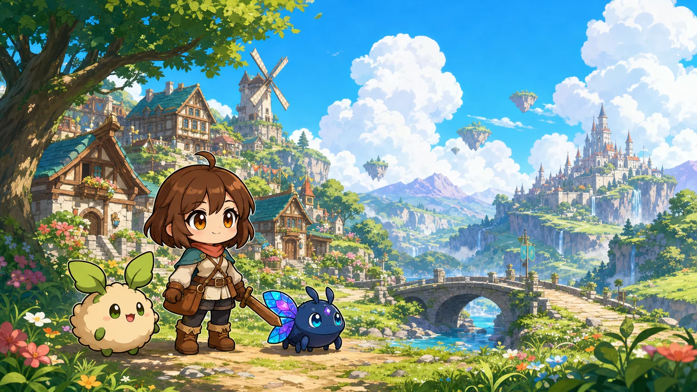
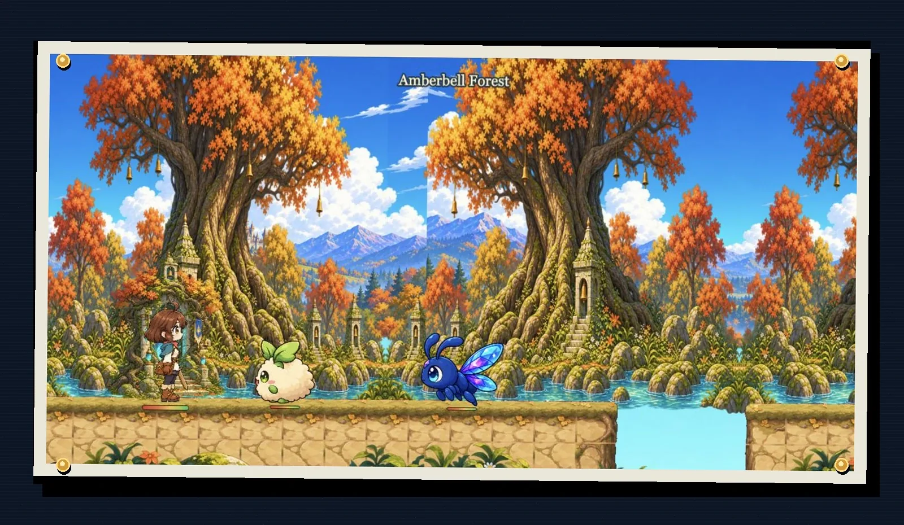
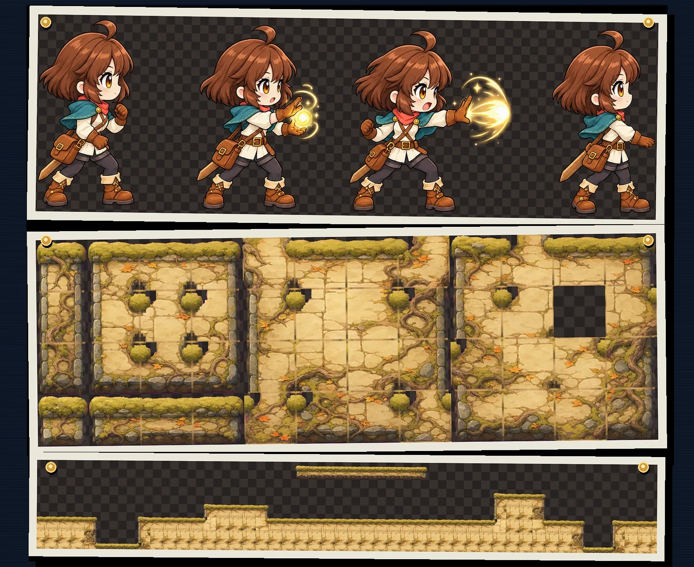
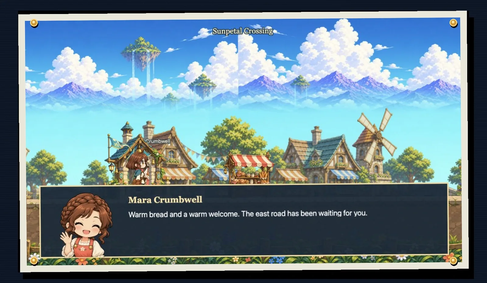

# stage-gen

`stage-gen` turns a prepared game package—art direction, maps, characters,
gameplay, dialogue, music, and reference images—into a validated set of
game-ready 2D assets and a playable runtime manifest. The reusable Python core
stays general-purpose, headless, and provider-neutral. The optional web-based scrolling-game
preview demonstrates what a consumer can build from those artifacts.



_Bellweather is the repository's canonical prepared game: one authored,
digest-bound package that drives the generation graph, asset reviews, runtime
composition, and gameplay preview._

## From concept to playable world

The visual target is not the final deliverable. Stage Gen separates the world
into runtime layers, characters, mobs, props, items, UI, portals, terrain, and
soundtrack assets, validates their contracts, and binds the accepted results
into a portable prepared-game manifest.



## Game-ready systems, not loose images

Generation produces assets with explicit runtime roles. Player actions remain
transparent animation atlases. Ground material becomes a canonical 47-mask
terrain vocabulary, then deterministic authored occupancy composes that
vocabulary into playable platforms, steps, and pits.



[`library/games/main.toml`](library/games/main.toml) selects the
[canonical bundled demo package](docs/game-package.md). Its closed input
contract is the source of truth for validation, planning, generation, and the
runtime adapter; generated runs never silently become schema authority.

## Quickstart

### Try the headless package without credentials

Requirements are Python 3.12 or newer and
[`uv`](https://docs.astral.sh/uv/). These commands do not call a hosted
provider or create a populated environment file:

```sh
uv sync --all-extras
uv run stage-gen recipes
uv run stage-gen benchmark smoke
```

### Validate and plan the prepared reference game

No provider key is required for these commands. Before a later live-provider checkpoint, create
`.env` only when it does not already exist; never overwrite an existing file:

```sh
test -e .env || cp .env.example .env
```

The canonical game input is a directory or ZIP whose root contains `game.toml`. Package
validation, digesting, graph planning, and dry execution are provider-free:

```sh
uv run stage-gen package validate --input library/games/bellweather
uv run stage-gen package digest --input library/games/bellweather
uv run stage-gen package plan --input library/games/bellweather
uv run stage-gen generate \
  --input library/games/bellweather \
  --dry-run \
  --output /tmp/bellweather-dry-run
```

The plan expands Bellweather into the exact map, actor, catalog, soundtrack, validation, review,
and manifest DAG. `--dry-run` executes the graph with deterministic fake operations and writes a
sanitized trace. Calling package generation without `--dry-run` currently fails before provider
construction; live map and content handlers are connected in the following implementation
checkpoints. There is no bare-prompt fallback.

GPT Image 2 native alpha remains the quality-first live route once those handlers are enabled.
The standalone compatibility background-removal command remains available:

```sh
uv run stage-gen remove-background \
  --input ./input.png --output ./out/subject.png
```

The dry-run directory contains `package.json`, `execution-plan.json`,
`execution-projection.json`, `execution-trace.jsonl`, and `execution-summary.json`. See the
[canonical generation pipeline](docs/spec/game/generation-pipeline.md) for the executable graph,
resource limits, cache lineage, retry ownership, and operation counts.

## What it provides

- Typed, provider-neutral components for image and structured generation,
  background removal, experimental music generation, and semantically reviewed
  one-axis image repetition.
- Deterministic image/audio inspection, normalization, persistence, retries,
  cancellation, path confinement, and redaction.
- Recipe orchestration with progress, cache validation, atomic summaries,
  manifests, artifact hashes, and adjacent provenance.
- A CLI plus an optional loopback HTTP/SSE service.
- A replaceable Next.js/React/Phaser preview that consumes completed manifests
  without moving gameplay assumptions into Python components.
- A reusable, provider-neutral [authored character library](docs/character-library.md)
  shared by opt-in dialogue-scene and scrolling-preview requests.
- One [canonical bundled demo package](docs/game-package.md), selected by
  `library/games/main.toml`, that current-schema validation and future demo serving can share.
- A canonical [game contract](docs/game-contract.md) that separates game-wide
  presentation, cast, motion, sequences, gameplay, content catalogs, and consumer bindings,
  plus an executable [authored `game.toml` schema](docs/spec/game/authored-contract-schema.md).
- A machine-checked [canonical game-generation pipeline](docs/spec/game/generation-pipeline.md)
  covering the current scrolling DAG, operation contracts, internal fan-out, and execution semantics.
- A separate, game-global [authored soundtrack catalog](docs/game-soundtrack.md)
  with stable track IDs and digest-bound generation, plus [authored map books](docs/game-maps.md)
  that order map identities and select game-global track pools without owning geometry.
- A current-only [dialogue-character runtime pipeline](docs/dialogue-character-runtime-pipeline.md)
  for reviewed character-bundle import into manifest V7.
- An agent-facing [Game Concept Studio](concept-studio/README.md), governed by the root
  [`game-concept-studio` skill](.agents/skills/game-concept-studio/SKILL.md), for pre-production
  concept text and cover exploration before any game package is authored.

## Recipe boundary

The stable product boundary is coherent **2D asset generation**. Genre,
viewpoint and camera, composition rules, and validation harnesses belong to
individual recipes. `scrolling-preview` is the side-view reference integration;
`dialogue-scene` is a separate adult, non-explicit visual-novel bundle recipe.
Neither recipe may define the other's assumptions or artifact layout.

## Authored dialogue in the same game



Bellweather's authored sequence contracts bind speaker, expression, dialogue,
node flow, and outcomes to stable NPC and player artwork. The runtime resolves
Mara Crumbwell's interaction from
[`gameplay.toml`](library/games/bellweather/gameplay.toml), loads
[`sunpetal-welcome.toml`](library/games/bellweather/sequences/sunpetal-welcome.toml),
and presents the conversation inside the same generated map and gameplay
session shown above.

Dialogue remains authored game content rather than an image-generation side
effect: NPC identities and expression vocabularies live in
[`content/npcs.toml`](library/games/bellweather/content/npcs.toml), interaction
wiring lives in `gameplay.toml`, and node order lives under `sequences/`.

## Reusable authored characters

Profiles live in an explicit workspace root and are intentionally excluded from
wheel and sdist packages. In a source checkout, validate the repository sample and
validate the repository sample with:

```sh
uv run stage-gen character-profile validate \
  --input library/characters/mira-vale-cartographer/profile.toml \
  --character-library-root .
uv run stage-gen character-profile digest \
  --input library/characters/mira-vale-cartographer/profile.toml \
  --character-library-root .
```

Installed CLI users must provide their own workspace root containing
`library/characters/`, either with `--character-library-root` or
`STAGE_GEN_CHARACTER_LIBRARY_ROOT`. Profiles describe durable identity only;
per-shot direction, pose conditioning, image observation, and consistency
reports remain [future research](docs/spec/dialogue-character-direction.md).

## Authored game contracts

A profile says who the player is. The
[canonical bundled demo package](docs/game-package.md), selected by
`library/games/main.toml`, is the repository source of truth for the exact
authored request and game/soundtrack/map closure used by tests and the future
hosted demo. The [game contract](docs/game-contract.md) is the current-only
domain authority beneath that selector: it says how presentation, cast,
motion, sequences, gameplay, catalogs, and consumer bindings compose without
making one recipe or runtime the source of truth. The implemented
[authored contract schema](docs/spec/game/authored-contract-schema.md) fixes the
current run's camera, style keywords, cast-wide build in heads, and supported
role render profiles in `library/games/<game_id>/game.toml`. Authored libraries
are excluded from wheel and sdist packages exactly as character profiles are.

Music remains a sibling contract at `library/games/<game_id>/soundtrack.toml`.
Maps are another sibling under `library/games/<game_id>/maps/`: the soundtrack
owns tracks, each map owns references to an allowed track pool, and neither adds
fields to the visual game contract. Only the exact current identities listed in
the [canonical package policy](docs/game-package.md#current-only-policy) are
valid. See [Authored game soundtracks](docs/game-soundtrack.md),
[Authored game maps](docs/game-maps.md), and the current-only
[dialogue-character runtime pipeline](docs/dialogue-character-runtime-pipeline.md).

These systems remain optional outside the selected demo. An absent soundtrack,
map book, or reviewed dialogue-character binding omits its stages and manifest
block from the current envelope; absence never asks a validator or consumer to
interpret an old schema.

```sh
uv run stage-gen package validate --input library/games/bellweather
uv run stage-gen package digest --input library/games/bellweather
uv run stage-gen package plan --input library/games/bellweather
```

The package resolver validates the exact game, gameplay, map, content, sequence, soundtrack, and
referenced-media closure before any provider operation.

## Architecture

Python under `src/stage_gen/` is the sole headless implementation. Node and
TypeScript are confined to `web/`.

```text
src/stage_gen/
  contracts/           typed artifact and provenance contracts
  components/          provider-neutral image, structured, removal, music,
                       and verified single-axis image-repeat operations
  providers/           OpenRouter and FAL HTTP adapters
  media/               deterministic image/audio inspection and normalization
  reliability/         retries, cancellation, redaction, paths, and persistence
  recipes/             application compositions and exported manifests
  orchestration/       run preparation, concrete composition, and run.json
  interfaces/          CLI and optional HTTP/SSE API
  benchmarks/          credential-free and opt-in evaluation suites
  resources/           wheel-packaged templates and approved fallback music
web/                    optional browser preview consumer
library/characters/     source-checkout or external authored profile workspace
```

Dependencies point inward: providers implement component protocols, recipes
compose components, and `orchestration.runtime` joins concrete providers to
recipes for the interfaces. Components and recipes do not import providers or
the web preview. The Python `image_repeat` service admits unchanged sources or
performs an explicitly requested endpoint-conditioned repair. Repair keeps the
provider-owned RGB appearance, deterministically reconstructs alpha topology
from the source endpoint profiles, anchors only its endpoint bands to the source
in premultiplied RGBA, and then requires deterministic continuity plus independent
intended-loop review.

See [Architecture](ARCHITECTURE.md), the
[system overview](docs/spec/system-overview.md), and the
[component contract](docs/component-contract.md).

## Optional web preview

Web development and deterministic gameplay automation require Bun 1.3.3 (the
version pinned by `web/package.json`). Install the locked dependencies and the
matching Playwright Chromium browser once:

```sh
cd web
bun install --frozen-lockfile
bunx playwright install chromium
bun run dev
```

`ffmpeg` and `ffprobe` must be on `PATH` for gameplay recording and generated
music normalization/inspection. Verify the optional adapter with:

```sh
cd web
bun run check
bun test
bun run build
bun run gameplay:verify
```

`gameplay:verify` runs the current 900-frame fixed-step transcript twice and
requires identical selected-frame hashes. It validates the current demo; the
historical capture's immutable evidence remains in its adjacent sidecars.

Create a reusable 30-second local report with:

```sh
cd web
bun run gameplay:record
```

The default writes `gameplay-report.mp4`, `gameplay-report.poster.png`, and
`gameplay-report.recording.json` under the ignored `output/playwright/`
directory. Reports bind fixture, timeline, source, transcript, checkpoint, and
media-probe hashes and remain `unreviewed` until independently reviewed.
Run `bun run gameplay:record -- --help` for custom-source, output, and dry-run
options.

The former prompt-launching web adapter is not an active generation authority after the prepared
package cutover. The active preview consumes the provider-free `prepared-game-runtime-v1`
integration output. Browser code never receives provider credentials.

## Configuration and providers

`.env.example` is the configuration reference. The Python application imports
only the allowlisted provider keys from a root `.env`; existing process
environment values take precedence. Endpoints, model overrides, output paths,
timeouts, force mode, transparency mode, and the optional web executable are
read from the process environment.

- The direct OpenAI Images route backs the default `native` mode and returns
  provider-generated alpha.
- OpenRouter backs structured generation, experimental music generation, and
  image generation for the explicit compatibility modes.
- FAL backs the explicit recipe `ai` compatibility mode and the standalone
  `remove-background` capability.
- `chroma` is an explicit degraded local-keying fallback, never an automatic
  replacement for failed AI removal.
- Music generation remains experimental until its current provider envelope
  passes the documented key-backed contract smoke.

Provider and model contracts can change independently of this repository.
Review [Provider operations](docs/providers.md) before changing an adapter.

The optional API is loopback-only unless public binding is explicitly
authorized:

```sh
uv run stage-gen serve --host 127.0.0.1 --port 4317
```

## Reliability and provenance

Every provider operation has one initial attempt plus at most five retries
with capped backoff. Network failures and silent contract failures—including
empty media, malformed JSON, schema mismatch, invalid base64, unsupported
media, and failed caller validation—remain inside that single retry owner.

An artifact succeeds only after contract validation and rollback-safe
artifact-plus-sidecar persistence. Provenance records provider/model identity,
sanitized prompts and parameters, input hashes, attempts, validation,
tool/component identity, deterministic post-processing, output digests, and any
explicit rights decision. It never persists credentials, authorization headers,
signed URLs, temporary paths, or embedded media. Provenance supports
reproducibility; it is not a redistribution grant.

## Testing

Run the locked credential-free Python handoff gate:

```sh
uv run python scripts/check.py
```

It **checks** formatting, runs lint and strict typing, executes all non-live
tests, builds the sdist and wheel, verifies packaged resources, and exercises
CLI smoke commands. It does not rewrite source formatting.

Provider-backed tests require explicit opt-in. Confirm that live tests remain
safely skipped with:

```sh
STAGE_GEN_RUN_LIVE=0 uv run pytest -m live -q
```

Focused commands and the intentional `STAGE_GEN_RUN_LIVE=1` workflow are in
[Testing](docs/testing.md). Generated visual output still requires independent
review by an agent other than its producer.

## Documentation and publication policy

- [Documentation index](docs/README.md)
- [Asset contracts](docs/spec/asset-contracts.md)
- [Verified single-axis image repeat](docs/image-repeat.md)
- [Scene-layer contract](docs/scene-layers.md)
- [Verification rules](VERIFICATION.md)
- [Generated-media publication](docs/generated-media-publication.md)
- [Repository storage policy](docs/repository-storage.md)
- [OSS and IP policy](docs/oss-ip.md)

Prompts, fixtures, examples, and committed outputs must use original,
brand-neutral briefs. BSD-3-Clause covers repository source; it does not
automatically license generated artifacts, user inputs, provider outputs,
models, or third-party services.

## License

Source code is available under the [BSD 3-Clause License](LICENSE).
