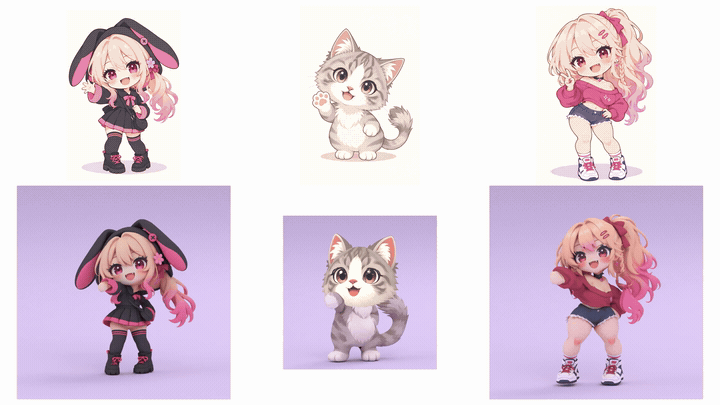
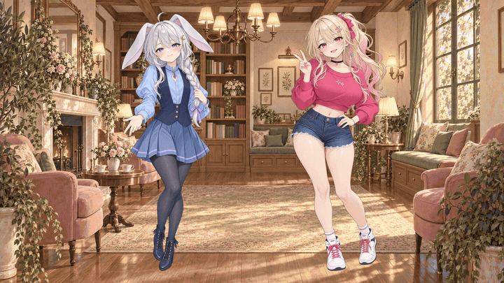

# Stage Gen

Stage Gen is a general asset generation SDK and authoring toolkit. Build your own
pipeline from GNode nodes, reusable components and bounded recipes, then inspect its
outputs in the optional web-based run viewer. Your application decides how assets
become a game, animation, tool or other experience.


_[Iron Petal Unit](godot/games/iron_petal_unit/README.md), one of the example games built with Stage Gen assets._

The product accepts caller-owned Python pipeline definitions and explicit input,
output and cache directories. TOML may describe the assets of a particular recipe;
there is no universal gameplay document required by the public SDK.

This repository houses two separately owned products: **Stage Gen**, the main
asset product described here, and the **[Godot example project](godot/README.md)**,
a maintained consumer project with its own games, runtime packages, templates and
tools. Godot demonstrates ways to use Stage Gen; its gameplay architecture can
evolve within that project without becoming part of the asset SDK's contract.
The [Godot project charter](godot/CHARTER.md) defines that continuing boundary.

## 3D SD characters



Explore the 3D character workflow and inspect textured, rigged chibi models:

- [3D character guide](docs/character-3d.md): the brief-to-rig workflow, setup,
  supported profile and current limits.
- Example GLBs and review notes: [Nami — bunny hood](library/characters/nami/README.md#3d-sd)
  and [Riko — pink sweater](library/characters/riko/README.md#3d-sd).

The reference-led examples are development results that needed rig cleanup, beyond
the guide's narrower supported profile. Their GLBs include rig-check clips and a
cheer; the Samba motion shown in demos is applied separately. New generation uses
local Python, Blender and your own paid-provider keys.

## Movie sprites



Looping body motion with separately controlled eyes and mouth: Yuzu blinks,
Riko winks, and both demonstrate A/O mouth shapes in this twelve-second preview.
The characters are composited over an [Afterlight](godot/games/afterlight/README.md)
background.

`movie_sprite` is an experimental workflow; its generation module is not yet
promoted into the public SDK. It uses the existing facial repaint pipeline.
See the [preview details](.github/assets/readme/README.md#movie-sprite-preview).

## Start with a local asset pipeline

Python 3.12 or newer is required. From this checkout:

```sh
uv sync --frozen
uv run stage-gen --help
uv run python src/stage_gen/recipes/looping_parallax/examples/supplied_layers/make_inputs.py /tmp/parallax-inputs
uv run stage-gen pipeline plan src/stage_gen/recipes/looping_parallax/examples/supplied_layers/pipeline.py --input /tmp/parallax-inputs
uv run stage-gen pipeline run src/stage_gen/recipes/looping_parallax/examples/supplied_layers/pipeline.py --input /tmp/parallax-inputs --output /tmp/parallax-run --cache-dir /tmp/parallax-cache
uv run stage-gen pipeline inspect /tmp/parallax-run
```

Use a new output directory for each run. The example uses supplied, procedurally
authored layers and makes no provider calls. It produces repeating images, placement
metadata and a preview. Layer extraction from a final reference image is a separate
generation step and is not implemented by this example.

Author your own definition with `stage_gen.pipeline.define`, then use `plan`, `run`
and `inspect` from Python or the CLI. Plan a subset with `--target NODE_ID`. Outputs
retain trace, projection, validated cache entries and portable provenance. Read the
[SDK guide](src/stage_gen/pipeline/README.md) and
[recipe example](src/stage_gen/recipes/looping_parallax/README.md).

Planning is offline. Provider nodes require explicit `--live` or
`allow_provider_calls=True` and an author-configured service. The SDK injects services
at the application boundary; credentials never belong in inputs or viewer code.
The existing universe and storefront recipes also expose explicit `--dry-run`
commands for deterministic fake operations. See [provider setup](docs/models/providers.md).

## Inspect outputs and consume assets

The [web viewer](docs/web-viewer.md) reads completed or running output directories.
Generic media and metadata stay inspectable without a built-in recipe identity;
bounded inspectors can understand parallax or animation metadata.

Godot consumers live under [godot](godot/README.md). The
[asset consumer template](godot/templates/asset_consumer/README.md) shows a local
preparation script and GDScript loading an explicit asset. Games own their scenes,
controls, combat, narrative binding and asset-to-game wiring. The optional
[Scenario framework](godot/packages/scenario_runtime/README.md) and its independent
compiler belong to that Godot project. Games invoke authored sequences and grant
presentation capabilities while retaining their world and input policy; Stage Gen
does not require a scenario or gameplay contract.

Each [example game](godot/games/README.md) owns its inputs, preparation script and
Godot project. Install the optional game tooling when preparing those games:

```sh
uv sync --frozen --group games
uv run --group games python godot/games/bellweather/pipeline/prepare.py
```

Concept Studio is an optional application in [apps/concept_studio](apps/concept_studio/README.md).
Install it with `uv sync --group apps`. Its concept workflow has its own workspace
and is not a mandatory phase of asset generation.

## Repository and checks

Start with the [directory preview](docs/repository-layout.md),
[architecture](ARCHITECTURE.md), [documentation index](docs/README.md), and
[contribution guide](CONTRIBUTING.md). The product gate does not need Bun or Godot:

```sh
uv run python scripts/check.py
```

[Verification](VERIFICATION.md) defines separate product, viewer, Godot, game,
application and documentation gates, plus the aggregate gate. Source code licensing
is distinct from asset rights; see [media publication](docs/generated-media-publication.md).
