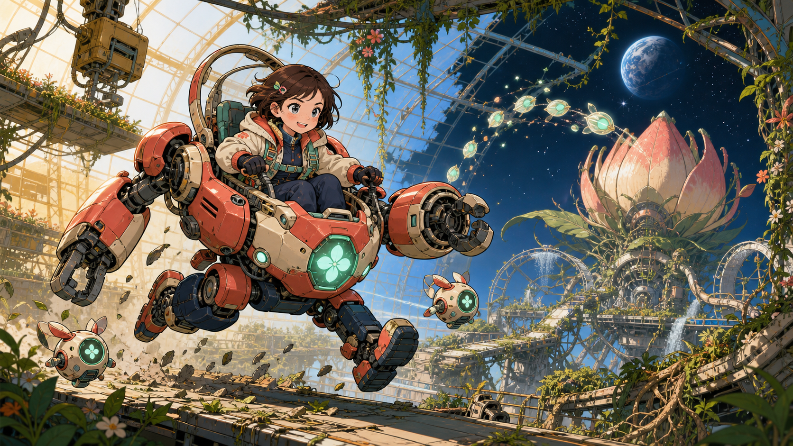
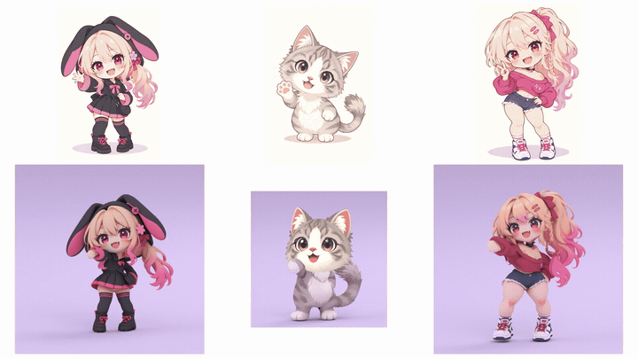
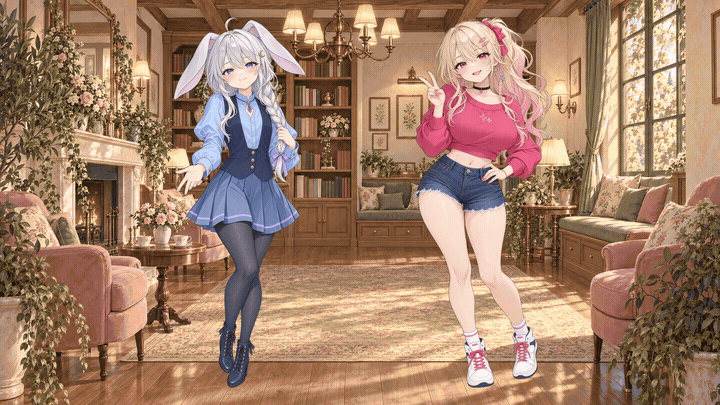

# Stage Gen

Stage Gen is a general asset generation toolkit. Each workflow turns a small input into a
named deliverable, such as a transparent idle loop, a rigged 3D character or a set of
repeating parallax layers, and every workflow is a GNode graph you can run and inspect. All
but 3D character plan offline before any spend, and most reuse a node cache across runs.
Inspect runs in the viewer, the local read-only client that `stage-gen view` opens. Your
application decides how the assets become a game, an animation or a tool.



_[Iron Petal Unit](godot/games/iron_petal_unit/README.md), one of the example games built with Stage Gen assets._

## Workflows

Each workflow is one folder under `src/stage_gen/workflows/` with its declaration, page,
contract and examples. This table is checked against each folder's `workflow.toml`.

<!-- workflows:begin -->
| Workflow | Id | Promise |
| --- | --- | --- |
| [3D character](src/stage_gen/workflows/character_3d/page.mdx) | `character-3d` | One written brief in. One rigged, reviewed character out. |
| [Looping parallax](src/stage_gen/workflows/looping_parallax/page.mdx) | `looping-parallax` | Layer pictures in. Repeating layers and their scroll placement out. |
| [Movie sprite](src/stage_gen/workflows/movie_sprite/page.mdx) | `movie-sprite` | One character picture in. A transparent idle loop out. |
| [Portrait motion](src/stage_gen/workflows/portrait_motion/page.mdx) | `portrait-motion` | One finished sprite in. Eyes and mouth a game can drive separately out. |
| [Storefront](src/stage_gen/workflows/storefront/page.mdx) | `storefront` | A game's own art and a short brief in. Store icon, stills, banner and listing copy out. |
| [Universe](src/stage_gen/workflows/universe/page.mdx) | `universe` | A poster, a synopsis and a direction in. A reviewed storyworld and one concept image per entity out. |
<!-- workflows:end -->





The [3D character](src/stage_gen/workflows/character_3d/page.mdx) and
[movie sprite](src/stage_gen/workflows/movie_sprite/page.mdx) workflows made these; the
[preview notes](.github/assets/readme/README.md) say how.

## Install and try it

Python 3.12 or newer and [uv](https://docs.astral.sh/uv/) are required. From this checkout:

```sh
uv sync --frozen
uv run stage-gen list
uv run stage-gen show looping-parallax
uv run python src/stage_gen/workflows/looping_parallax/inputs/supplied_layers/make_inputs.py out/looping-parallax-input
uv run stage-gen run looping-parallax --input out/looping-parallax-input --output out/looping-parallax-try --cache-dir out/cache
uv run stage-gen inspect out/looping-parallax-try --verify
```

That run is offline: committed scripts draw the input layers, and no provider is called.
Every workflow takes the same verbs, `plan`, `run` and `inspect` (3D character prepares
with `run --prepare-only` instead of `plan`; each workflow's flags are in
`stage-gen <command> <workflow> --help`). Planning never spends; a
provider call needs the workflow's explicit opt-in, such as `--live`, and your own keys
(see [provider setup](docs/models/providers.md)). Write your own graph with the
[SDK](docs/sdk/guide.md) and run it with `stage-gen run file <file.py:attr>`.

## Read more

- [Getting started](docs/getting-started.md) and the [glossary](docs/glossary.md).
- [Viewer](docs/viewer.md): `stage-gen view`, the local read-only client over run folders.
- [Site](docs/site.md): the static landing and documentation site built from the catalog
  and the example store.
- [Architecture](ARCHITECTURE.md), the [documentation index](docs/README.md), the
  [directory preview](docs/repository-layout.md) and the [contribution guide](CONTRIBUTING.md).
- [Verification](VERIFICATION.md): `uv run python scripts/check.py` is the product gate and
  needs neither Bun nor Godot. Source licensing is distinct from asset rights; see
  [media publication](docs/generated-media-publication.md).

## Godot example project

The repository also houses a separately owned consumer product, the
[Godot example project](godot/README.md): its [example games](godot/games/README.md),
runtime packages, templates and tools show ways to use Stage Gen assets, under its own
[charter](godot/CHARTER.md). Games own their scenes, controls, narrative and asset wiring;
Stage Gen requires no game or gameplay contract.
