# 2D game style dictionary

> **Status: canonical tracked prompt dictionary, reviewed gallery, and active research guide.**
>
> This master owns the reviewed 48-entry GPT Image 2 / Grok Image 2 prompt
> gallery, the broader illustration vocabulary, and the concept-to-asset
> validation protocol. It directly embeds each canonical WebP preview; there is
> no derived grid, contact sheet, or document render. This document is not a
> component, runtime schema, reusable prompt template, or provider promise.

This is a reproducible prompt-and-generation dictionary grounded in exact visual
surfaces from commercially iconic games. Every gallery record sends the
byte-identical text prompt and registered requested aspect to
`openai/gpt-image-2` and `x-ai/grok-imagine-image-2.0`. The requested aspect is
preserved for generated outputs except the documented Banner Saga Grok fallback:
its exact prompt returned no image at `21:9`, then generated at `16:9`. Each
returned source output is reviewed against the same four visible style markers.
Game names and source links are research metadata; the exact provider text is
reproduced in full under each record and remains original and brand-neutral.

The gallery uses deterministic WebP preview paths rather than linking into ignored
`out/` work. [`manifest.json`](manifest.json) binds the exact prompt, provider,
model, source digest, preview digest, dimensions, and deterministic publication
transform for every slot. Evidence JSON copied beside this document records the
reviewed source profiles, failure classifications, and category verdicts. Raw
provider responses, superseded generations, and temporary comparisons remain
ignored working evidence.

## Purpose

This lab studies whether image models respond to illustration-style words in a
repeatable and useful way for 2D games. The target is controllable
micro-variance: terms such as `super-deformed`, `shonen manga`, `soft cel
shading`, or `screentone manga` should be more informative than a broad request
such as `Japanese style`.

Game use is wider than actor sprites. A useful style may need to carry across a
cutscene still, dialogue portrait, environment background, prop illustration,
card image, loading screen, UI icon, or effect sheet. Production role is kept
separate from visual style so a model cannot appear to understand a style merely
because it changed the crop or produced a familiar asset layout.

This document has five jobs:

1. inventory candidate words without claiming that they work;
2. derive neutral descriptors from commercially proven 2D-game anchors;
3. preserve the reviewed model-pair prompt dictionary and its exact verdicts;
4. define a concept-to-focused-asset experiment plus atomic follow-up tests; and
5. remain the single tracked guide to results that survive review and promotion.

The inventory is deliberately broad, but it is not a claim to enumerate every
illustration tradition or every community's preferred terminology. Terms should
be corrected as stronger sources or practitioners provide better language.

The global [game visual reference and vocabulary](../../docs/game-visual-reference.md)
owns the game-first seed catalog and shared keyword-admission rules. This lab
consumes selected records, adds stronger research, and owns model-specific test
evidence; it does not duplicate or silently mutate the global reference list.

## Repository boundary and lifecycle

This directory is tracked pre-production research under `concept-studio/`. It does not extend
`src/stage_gen/components/`, define a recipe, or alter the implemented
[image style anchor](../../docs/image-style-anchor.md). The current runtime anchor has
three coarse modes. This lab may provide evidence for a future vocabulary
revision, but no result changes runtime behavior automatically.

The proposed working lifecycle is:

```text
concept-studio/style-dictionary/README.md
    canonical text taxonomy, reviewed prompt dictionary, protocol, and findings

concept-studio/style-dictionary/images/
    exact WebP previews consumed directly by this Markdown document

concept-studio/style-dictionary/manifest.json
    portable prompt, model, source, transform, and preview bindings

out/illustration-style-taxonomy/
    ignored raw candidates, superseded generations, and temporary comparisons
```

The 92 selected previews are the only generated images tracked by this dictionary.
Their exact final bytes are bound by the manifest, the shared
[independent visual review](images/style-dictionary.visual-review.md), and the
repository publication gate. A
style-recognition failure remains visible as a negative dictionary result; it does
not make the exact reviewed preview invalid evidence. This collection is not a
runtime fixture, a Concept Studio game gallery, or a standalone reusable asset pack.
New or replaced previews must update the manifest and review record and pass the
repository media gates before commit.

## Core rule: labels are candidates; observable facets are controls

A label can mix several things:

- a medium or production process;
- a line, shading, palette, or surface treatment;
- a character-design grammar;
- a publishing demographic or market lineage;
- a story genre or affect;
- a production role or layout; and
- a cultural or historical tradition.

Those are not interchangeable. For example:

- `moe` is primarily an affective and cultural label, not a precise rendering
  method;
- `shonen`, `shojo`, `seinen`, and `josei` begin as publishing demographics,
  even though visual dialects can correlate with them;
- `webtoon` is primarily a digital comics format;
- `chibi` or `super-deformed` primarily controls proportion and simplification;
  and
- `cutscene still` is an asset role, not a style.

The lab preserves recognized labels because a model may know them, but any
accepted control must be restated as visible traits. A useful style direction is
therefore faceted rather than a bag of fashionable words:

```text
visual lineage
+ character-design grammar
+ line language
+ shading model
+ palette/value model
+ surface treatment
+ era or production technique, when relevant
+ independently selected asset treatment
```

Pose, camera, crop, subject, costume, setting, and asset role stay outside that
style expression. Experiments freeze them where possible.

## Taxonomy axes

| Axis | What it describes | Example values |
| --- | --- | --- |
| `visual_lineage` | A recognized illustration, comic, print, or painting dialect | `gekiga`, `ukiyo_e`, `ligne_claire` |
| `character_design_grammar` | Proportion, facial construction, and silhouette abstraction | `super_deformed`, `adult_anime_proportions`, `angular_silhouette` |
| `line_language` | Contour weight, continuity, and mark character | `fine_tapered_line`, `bold_contour`, `broken_contour` |
| `shading_model` | How value describes form | `one_band_cel`, `soft_cel`, `continuous_tonal` |
| `color_language` | Palette size, saturation, value key, and color relationships | `limited_palette`, `high_key_pastel`, `jewel_toned` |
| `surface_language` | Visible substrate, print, pigment, or digital texture | `paper_grain`, `analog_cel_texture`, `multi_pass_print_misregistration` |
| `era_technique` | A dated production process rather than decade costume | `hand_painted_cel`, `early_digital_anime` |
| `detail_density` | Frequency and distribution of meaningful detail | `sparse`, `focal`, `uniform`, `dense` |
| `depth_finish` | Pictorial depth and polish, not scene-camera projection | `flat_graphic`, `overlap_depth`, `atmospheric`, `volumetric` |
| `affect` | Intended visual-emotional tendency | `kawaii`, `severe`, `dreamy`, `grotesque_cute` |
| `production_role` | Where the image is used | `cutscene_still`, `environment_background`, `item_icon` |
| `content` | Who or what is depicted | courier, forest, tool, costume, fantasy |
| `composition` | Framing, layout, camera, and pose | full shot, close-up, lateral view, seated pose |

The first nine axes define a style record. `affect` may modify that record, but
an affect word alone does not prove control of rendering style.
`production_role`, `content`, and `composition` are experiment controls or
application context.

Canonical IDs use `lower_snake_case`. Exact prompt spellings and aliases are
also retained because `SD`, `super-deformed`, and `chibi` may not produce the
same model behavior.

## Reviewed model-pair prompt gallery

### Experiment totals

- **48 prompt pairs / 92 reviewed source outputs**: 44 GPT Image 2 outputs, 48 Grok Image 2 outputs, and 4 explicit GPT no-image records.
- **GPT Image 2 recognized:** 40/44 generated outputs; **Grok Image 2 recognized:** 45/48 generated outputs.
- **Pair outcomes:** 40 `BOTH`, 0 `GPT_ONLY`, 5 `GROK_ONLY`, 3 `NEITHER`.
- **Artifact lineage:** 50 reviewed originals reused; 42 counterparts generated; 4 GPT outputs blocked with no placeholder.
- **Prior dictionary batches:** 92 calls, 84 successes, 8 preserved failures, $12.039570 reported cost.
- **Cross-model main extension:** 50 calls, 45 successes, 5 failures, $2.700000 reported cost.
- **Banner aspect fallback:** 1 call, 1 success, 0 failures, $0.060000 reported cost.
- **Cross-model extension including fallback:** 51 calls, 46 successes, 5 failures, $2.760000 reported cost.
- **Superseded extension outputs:** 4 successful Grok originals remain historical execution evidence but are replaced in the current dictionary by the accepted surface-finish revision.
- **Surface-finish revision:** 8 calls, 8 successes, 0 failures, $0.911270 reported cost.
- **Combined recorded experiment:** 151 calls, 138 successes, 13 failures, $15.710840 reported cost.
- **The 92 reviewed source outputs represented by gallery previews:** $9.454520 in sidecar-reported artifact cost; this is separate from the combined batch total because the gallery reuses earlier originals.
- **No-image evidence:** unchanged-prompt blocks and the Banner route failure are preserved in [`failure classification`](evidence/model-pair-failure-classification.json); the successful Banner fallback is preserved in [`aspect-fallback execution`](evidence/model-pair-aspect-fallback-execution.json).

### Surface treatment vocabulary

Surface treatment is independent of subject, composition, outline, and shape
language. These fields prevent a local hand-painted or tactile cue from becoming
an unintended full-frame vintage-paper treatment.

| Axis | Meaning | Default for game assets |
|---|---|---|
| `substrate` | The image plane or reproduction medium: digital raster, paper, canvas, or print. | `clean_digital_raster` |
| `texture_scope` | Where visible texture is allowed: none, object-local, region-local, or global overlay. | `object_local` |
| `material_condition` | Whether depicted materials read as clean, new, worn, weathered, or distressed. | `clean_stylized` |
| `microdetail_density` | The amount of grain, scratches, pores, fibers, and other fine surface information. | `simplified` |
| `color_age` | Whether color is fresh, muted, faded, sepia-aged, or chemically shifted. | `fresh` |
| `global_postprocess` | Image-wide grain, vignette, dust, scratches, faded wash, or another finishing overlay. | `none` |

The default contract is therefore a **clean digital raster with object-local texture**: texture may describe selected objects or painted boundaries, but the image plane itself stays clean. The four revised entries use this split instead of treating `gouache`, `ink`, or tactile materials as permission for global aging.

### Dictionary index

| Key | Iconic hit and exact surface | GPT Image 2 | Grok Image 2 | Pair outcome |
|---|---|:---:|:---:|:---:|
| [`dokkan_super_attack`](#dokkan_super_attack) | Dragon Ball Z Dokkan Battle — one-screen mobile super-attack cut-in with extreme impact staging | **YES** | **YES** | **`BOTH`** |
| [`g_generation_sd_tactics`](#g_generation_sd_tactics) | SD Gundam G Generation ETERNAL — compact SD mechanical units on an oblique tactical battlefield | **YES** | **YES** | **`BOTH`** |
| [`arknights_operator_promo`](#arknights_operator_promo) | Arknights — restrained full-body operator promotion/upgrade illustration | **YES** | **YES** | **`BOTH`** |
| [`mobile_monster_evolution`](#mobile_monster_evolution) | Monster Strike / Puzzle & Dragons — square high-rarity monster evolution/special-skill splash | **YES** | **YES** | **`BOTH`** |
| [`nikke_rear_combat`](#nikke_rear_combat) | GODDESS OF VICTORY: NIKKE — rear-facing combat pose and premium animated lobby/costume art | **BLOCKED** | **YES** | **`GROK_ONLY`** |
| [`browndust2_summer_costume`](#browndust2_summer_costume) | BrownDust2 — premium summer costume illustration and body-forward event CG | **BLOCKED** | **YES** | **`GROK_ONLY`** |
| [`fate_grand_order_final_ascension_card`](#fate_grand_order_final_ascension_card) | Fate/Grand Order — Final-ascension Servant card illustration | **NO** | **NO** | **`NEITHER`** |
| [`azur_lane_live2d_swimsuit_skin`](#azur_lane_live2d_swimsuit_skin) | Azur Lane — Premium Live2D swimsuit skin base illustration | **BLOCKED** | **YES** | **`GROK_ONLY`** |
| [`blue_archive_memorial_lobby_scene`](#blue_archive_memorial_lobby_scene) | Blue Archive — Memorial Lobby relationship scene | **YES** | **YES** | **`BOTH`** |
| [`umamusume_ssr_support_card`](#umamusume_ssr_support_card) | Umamusume: Pretty Derby — SSR support-card event illustration | **YES** | **YES** | **`BOTH`** |
| [`genshin_impact_five_star_wish_splash`](#genshin_impact_five_star_wish_splash) | Genshin Impact — Five-star character wish splash | **NO** | **YES** | **`GROK_ONLY`** |
| [`honkai_star_rail_five_star_splash`](#honkai_star_rail_five_star_splash) | Honkai: Star Rail — Five-star space-opera character splash | **YES** | **YES** | **`BOTH`** |
| [`zenless_zone_zero_signal_search_splash`](#zenless_zone_zero_signal_search_splash) | Zenless Zone Zero — S-rank Signal Search agent splash | **YES** | **YES** | **`BOTH`** |
| [`granblue_fantasy_ssr_final_uncap`](#granblue_fantasy_ssr_final_uncap) | Granblue Fantasy — SSR final-uncap character illustration | **NO** | **NO** | **`NEITHER`** |
| [`epic_seven_s3_skill_climax`](#epic_seven_s3_skill_climax) | Epic Seven — Full-frame S3 skill animation climax | **YES** | **YES** | **`BOTH`** |
| [`wuthering_waves_resonator_convene`](#wuthering_waves_resonator_convene) | Wuthering Waves — Limited Resonator convene illustration | **NO** | **NO** | **`NEITHER`** |
| [`snowbreak_premium_outfit_key_art`](#snowbreak_premium_outfit_key_art) | Snowbreak: Containment Zone — Premium outfit event key art | **BLOCKED** | **YES** | **`GROK_ONLY`** |
| [`honor_of_kings_mythic_skin_splash`](#honor_of_kings_mythic_skin_splash) | Honor of Kings — Premium mythic hero-skin launch splash | **YES** | **YES** | **`BOTH`** |
| [`onmyoji_sp_shikigami_summon_splash`](#onmyoji_sp_shikigami_summon_splash) | Onmyoji — SP Shikigami summon splash | **YES** | **YES** | **`BOTH`** |
| [`black_desert_class_awakening_key_art`](#black_desert_class_awakening_key_art) | Black Desert — Class-awakening promotional key art | **YES** | **YES** | **`BOTH`** |
| [`graphic_novel_mythic_underworld_dialogue_portrait`](#graphic_novel_mythic_underworld_dialogue_portrait) | Hades — Full-height dialogue character illustration over a shallow underworld environmental vignette, not isometric gameplay. | **YES** | **YES** | **`BOTH`** |
| [`melancholic_insect_gothic_side_scroller`](#melancholic_insect_gothic_side_scroller) | Hollow Knight — Side-view subterranean exploration gameplay environment with a small player silhouette. | **YES** | **YES** | **`BOTH`** |
| [`thirties_rubber_hose_boss_cartoon`](#thirties_rubber_hose_boss_cartoon) | Cuphead — Side-view boss-battle gameplay frame with hand-inked cels and watercolor scenery, not modern vector key art. | **YES** | **YES** | **`BOTH`** |
| [`luminous_painterly_spirit_forest_side_scroller`](#luminous_painterly_spirit_forest_side_scroller) | Ori — Side-view environmental traversal gameplay frame dominated by layered bioluminescent light and vegetation. | **YES** | **YES** | **`BOTH`** |
| [`high_density_pixel_roguelite_combat`](#high_density_pixel_roguelite_combat) | Dead Cells — Side-view pixel-art action gameplay frame captured at the instant of a melee hit. | **YES** | **YES** | **`BOTH`** |
| [`cozy_sixteen_bit_farm_tilemap`](#cozy_sixteen_bit_farm_tilemap) | Stardew Valley — Top-down farm gameplay tilemap, not a character portrait or promotional painting. | **YES** | **YES** | **`BOTH`** |
| [`rough_gothic_sixteen_bit_swarm_survival`](#rough_gothic_sixteen_bit_swarm_survival) | Vampire Survivors — Top-down late-run combat field crowded with enemies and overlapping automatic effects. | **YES** | **YES** | **`BOTH`** |
| [`hd_two_d_fantasy_town_diorama`](#hd_two_d_fantasy_town_diorama) | Octopath Traveler — Oblique exploration scene combining crisp pixel sprites with physically lit modeled scenery. | **YES** | **YES** | **`BOTH`** |
| [`modern_high_detail_sixteen_bit_jrpg_battle`](#modern_high_detail_sixteen_bit_jrpg_battle) | Sea of Stars — Fixed-camera turn-based battle frame with fully pixel-rendered characters and environment. | **YES** | **YES** | **`BOTH`** |
| [`baroque_penitential_pixel_horror`](#baroque_penitential_pixel_horror) | Blasphemous — Side-scrolling combat frame inside an Iberian ecclesiastical ruin. | **YES** | **YES** | **`BOTH`** |
| [`cute_occult_woodland_settlement`](#cute_occult_woodland_settlement) | Cult of the Lamb — Isometric base-management ritual scene, not flat promotional mascot art. | **YES** | **YES** | **`BOTH`** |
| [`scratchy_paper_puppet_wilderness`](#scratchy_paper_puppet_wilderness) | Don't Starve — Angled top-down survival gameplay frame centered on a wilderness camp. | **YES** | **YES** | **`BOTH`** |
| [`grim_inked_dungeon_combat_tableau`](#grim_inked_dungeon_combat_tableau) | Darkest Dungeon — Side-on turn-based combat tableau with an adventuring party left and monsters right. | **YES** | **YES** | **`BOTH`** |
| [`loose_oil_painted_isometric_coastal_ruin`](#loose_oil_painted_isometric_coastal_ruin) | Disco Elysium — Isometric narrative exploration environment without dialogue interface. | **YES** | **YES** | **`BOTH`** |
| [`minimalist_watercolor_dream_platformer`](#minimalist_watercolor_dream_platformer) | GRIS — Side-view traversal tableau with one small figure and monumental surreal architecture. | **YES** | **YES** | **`BOTH`** |
| [`warm_hand_drawn_spirit_boat_cutaway`](#warm_hand_drawn_spirit_boat_cutaway) | Spiritfarer — Side-view boat-management gameplay frame showing several readable rooms. | **YES** | **YES** | **`BOTH`** |
| [`league_champion_splash_v1`](#league_champion_splash_v1) | League of Legends — Full-width champion or skin splash illustration | **YES** | **YES** | **`BOTH`** |
| [`hearthstone_minion_card_v1`](#hearthstone_minion_card_v1) | Hearthstone — Cropped collectible minion-card illustration without the card frame | **YES** | **YES** | **`BOTH`** |
| [`runeterra_follower_full_art_v1`](#runeterra_follower_full_art_v1) | Legends of Runeterra — Full uncropped follower or spell card artwork | **YES** | **YES** | **`BOTH`** |
| [`mtg_arena_borderless_card_v1`](#mtg_arena_borderless_card_v1) | Magic: The Gathering Arena — Borderless vertical creature or planeswalker card illustration | **YES** | **YES** | **`BOTH`** |
| [`afk_ascended_hero_portrait_v1`](#afk_ascended_hero_portrait_v1) | AFK Arena — Full-body ascended hero collection portrait | **YES** | **YES** | **`BOTH`** |
| [`cookie_kingdom_gacha_splash_v1`](#cookie_kingdom_gacha_splash_v1) | CookieRun: Kingdom — Square character acquisition or featured-cookie illustration | **YES** | **YES** | **`BOTH`** |
| [`angry_birds_loading_ensemble_v1`](#angry_birds_loading_ensemble_v1) | Angry Birds 2 — Wide small-ensemble loading or promotional illustration | **YES** | **YES** | **`BOTH`** |
| [`pvz2_almanac_portrait_v1`](#pvz2_almanac_portrait_v1) | Plants vs. Zombies 2 — Square almanac or selection portrait for one unit | **YES** | **YES** | **`BOTH`** |
| [`clash_royale_troop_card_v1`](#clash_royale_troop_card_v1) | Clash Royale — Vertical troop portrait inside a collection card | **YES** | **YES** | **`BOTH`** |
| [`brawl_seasonal_loading_art_v1`](#brawl_seasonal_loading_art_v1) | Brawl Stars — Wide seasonal loading illustration showing several fighters | **YES** | **YES** | **`BOTH`** |
| [`rayman_gouache_platformer_world_v1`](#rayman_gouache_platformer_world_v1) | Rayman Legends — Playable hand-painted side-scrolling level vista | **YES** | **YES** | **`BOTH`** |
| [`banner_saga_caravan_panorama_v1`](#banner_saga_caravan_panorama_v1) | The Banner Saga — Wide caravan-travel landscape with a tiny marching party | **YES** | **YES** | **`BOTH`** |

### Dictionary entries

### Mobile and live-service hits

#### `dokkan_super_attack`

**Real-hit anchor:** [Dragon Ball Z Dokkan Battle](https://dbz-dokkan.bn-ent.net/en/)<br>
**Reference surface:** one-screen mobile super-attack cut-in with extreme impact staging<br>
**Shared prompt SHA-256:** `c6cd4aecdb7eaf6dc867204cc84e279060284b466e4d7902e90de5c3fdc00719`<br>
**Registered requested aspect:** `16:9`<br>
**Effective output aspects:** GPT Image 2 `16:9`; Grok Image 2 `16:9`<br>
**Model routes:** `openai/gpt-image-2` and `x-ai/grok-imagine-image-2.0`

**Exact provider prompt shared byte-for-byte by both models**

> Use case: stylized-concept
> Asset type: mobile super-attack cut-in
> Commercial visual family: explosive shonen battle-card and super-attack cut-in
>
> ORIGINAL SCENE AND CONTENT LOCK
> One 28-year-old storm boxer drives a charged straight punch
>         toward one enormous original basalt golem in a shattered red-rock arena. The
>         boxer wears a sleeveless cobalt training jacket over a high-neck shirt,
>         full-length cream trousers, wraps, and boots. Keep both combatants readable;
>         the fist is foregrounded but does not hide the adult face. Exactly one punch,
>         one golem, and one impact locus.
>
> VISIBLE STYLE AXES
> Heavy tapered black outer contour with forceful angular
>         interior marks; hard two-band cel shading; saturated cobalt, orange, cream,
>         and electric yellow; extreme but anatomically coherent foreshortening; radial
>         energy wedges, debris arcs, diagonal speed strokes, and one white-hot impact
>         core; strong dark-light separation; compact mobile-readable silhouettes. One
>         uninterrupted cinematic cut-in, no panels or typography.
>
> HARD CONSTRAINTS
> Original and brand-neutral content only. Do not depict or
> name an existing game, franchise, publisher, studio, artist, character, costume,
> weapon, creature, robot, emblem, interface, location, or protected trade dress. No
> words, letters, numbers, pseudo-writing, card borders, HUD, menus, captions, dialogue
> boxes, logos, signatures, watermarks, or presentation labels. All human characters
> are unambiguously adults. No school uniforms, child or teen anatomy, sexualization,
> fetishized camera, underwear, exposed cleavage, gore, photorealism, or realistic 3D
> rendering. Make one coherent production-quality 2D game asset, not a style sampler or
> comparison grid. Preserve the named subject count and asset role.

<!-- BEGIN DIRECT MODEL PAIR -->
**GPT Image 2 — reviewed result**

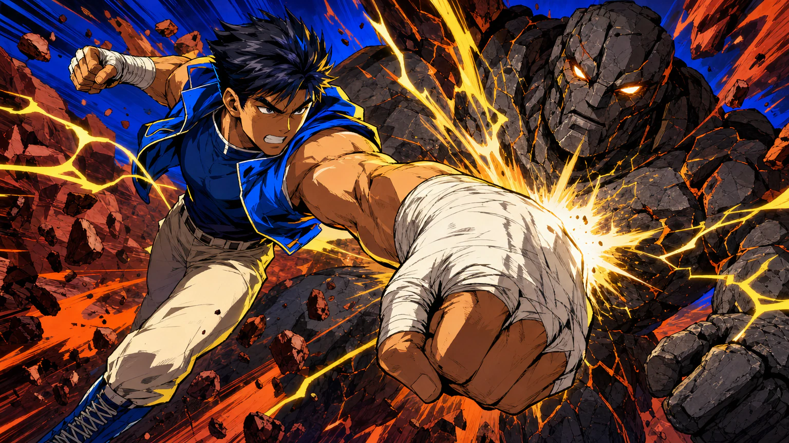

**Grok Image 2 — reviewed result**

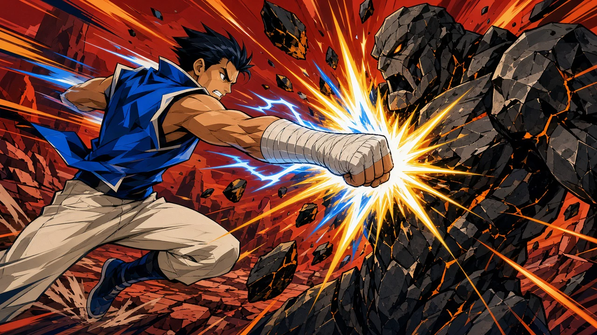
<!-- END DIRECT MODEL PAIR -->

| Registered visible style marker | GPT Image 2 | Grok Image 2 |
|---|:---:|:---:|
| heavy tapered contour, angular marks, and hard two-band cel shading | YES | YES |
| saturated primary palette with deep value split and white-hot impact core | YES | YES |
| coherent extreme foreshortening plus radial energy and debris motion grammar | YES | YES |
| single mobile-readable super-attack cut-in composition | YES | YES |

**GPT Image 2 verdict: YES.** Heavy tapered ink, hard cel bands, saturated blue-orange impact color, extreme fist foreshortening, and one uninterrupted golem strike read clearly as a mobile shonen super-attack cut-in.

**Grok Image 2 verdict: YES.** The side-on punch keeps the same heavy contour, hard value split, white-hot impact core, debris grammar, and compact single-screen attack staging.

**Pair outcome: `BOTH`.**

**Comparison:** Both models reproduce the super-attack surface; GPT pushes the foreground fist harder, while Grok gives the impact locus and two combat silhouettes cleaner separation.

**Evidence:** [`current paired profiles`](evidence/model-pair-profiles.json), [`validated original manifest`](evidence/model-pair-manifest.json), and [`independent category review`](evidence/model-pair-review-mobile.json).

#### `g_generation_sd_tactics`

**Real-hit anchor:** [SD Gundam G Generation ETERNAL](https://gget.ggame.jp/en/)<br>
**Reference surface:** compact SD mechanical units on an oblique tactical battlefield<br>
**Shared prompt SHA-256:** `deb79976d644177b722e2be0049a9cffef0de2e184d8bfb4131bd2039619e62c`<br>
**Registered requested aspect:** `16:9`<br>
**Effective output aspects:** GPT Image 2 `16:9`; Grok Image 2 `16:9`<br>
**Model routes:** `openai/gpt-image-2` and `x-ai/grok-imagine-image-2.0`

**Exact provider prompt shared byte-for-byte by both models**

> Use case: stylized-concept
> Asset type: isometric tactical battle concept
> Commercial visual family: super-deformed mecha tactical-unit illustration
>
> ORIGINAL SCENE AND CONTENT LOCK
> One original compact biped salvage mech defends a flooded orbital
>         shipyard from exactly two small angular maintenance drones. The hero mech holds
>         one broad magnetic cutter and one rectangular shield. Cranes, shallow water,
>         cargo lanes, and one damaged launch gantry form an oblique isometric tactical
>         field. No pilot, cockpit portrait, insignia, or second hero unit.
>
> VISIBLE STYLE AXES
> Mechanical super-deformation at approximately 2.5 head units:
>         oversized armored head and chest, shortened thick limbs, enlarged hands and
>         feet; crisp dark panel lines; bright hard two-band cel shading with small
>         metallic specular accents; white, marine teal, navy, safety orange, and steel;
>         large readable armor masses, sparse panel seams, and clear tool-versus-shield
>         silhouette; oblique isometric staging with compact restrained energy effects.
>
> HARD CONSTRAINTS
> Original and brand-neutral content only. Do not depict or
> name an existing game, franchise, publisher, studio, artist, character, costume,
> weapon, creature, robot, emblem, interface, location, or protected trade dress. No
> words, letters, numbers, pseudo-writing, card borders, HUD, menus, captions, dialogue
> boxes, logos, signatures, watermarks, or presentation labels. All human characters
> are unambiguously adults. No school uniforms, child or teen anatomy, sexualization,
> fetishized camera, underwear, exposed cleavage, gore, photorealism, or realistic 3D
> rendering. Make one coherent production-quality 2D game asset, not a style sampler or
> comparison grid. Preserve the named subject count and asset role.

<!-- BEGIN DIRECT MODEL PAIR -->
**GPT Image 2 — reviewed result**

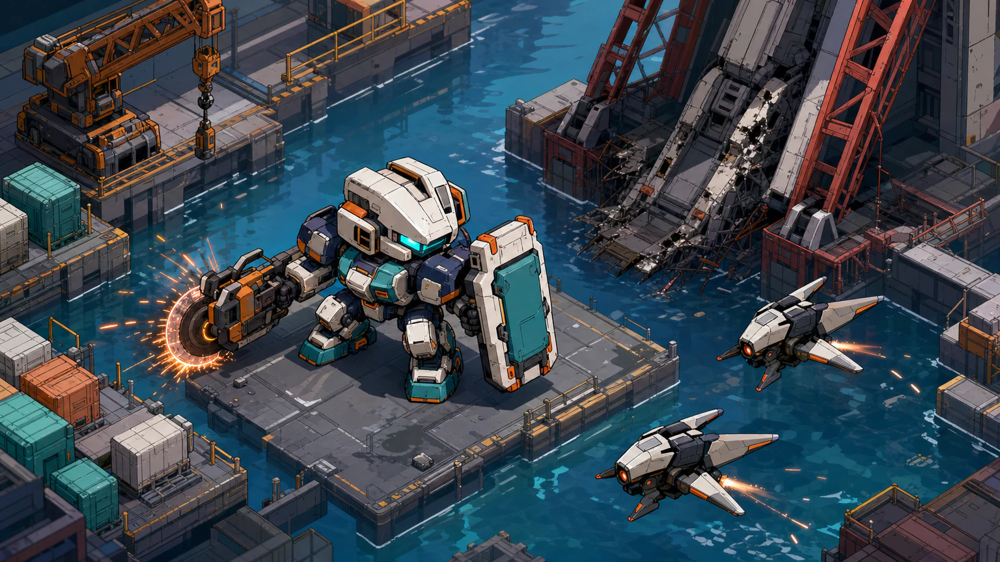

**Grok Image 2 — reviewed result**

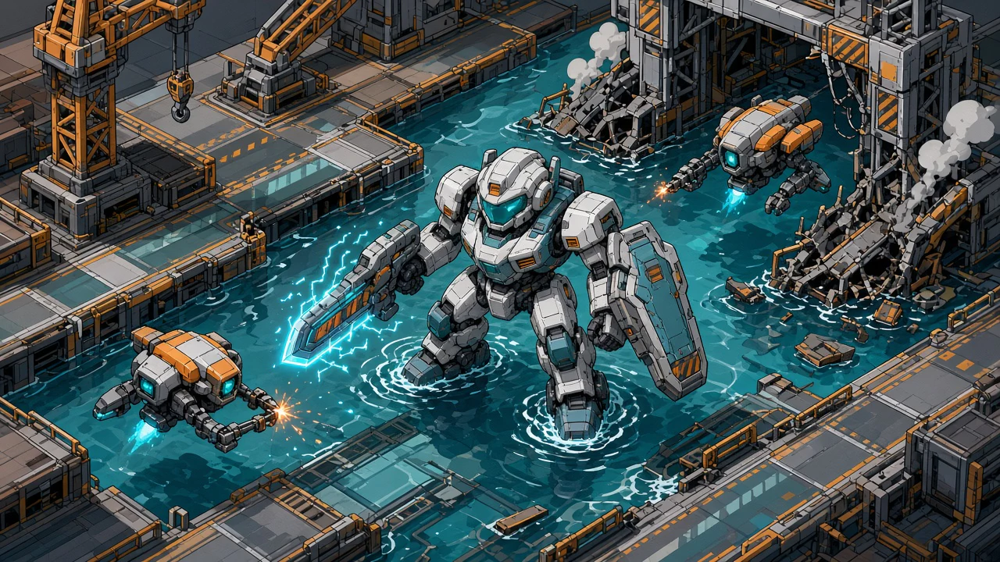
<!-- END DIRECT MODEL PAIR -->

| Registered visible style marker | GPT Image 2 | Grok Image 2 |
|---|:---:|:---:|
| approximately 2.5-head mechanical super-deformation with oversized head and chest | YES | YES |
| crisp panel line, bright hard cel bands, and selective metallic highlights | YES | YES |
| large mobile-readable armor masses with clear tool and shield silhouette | YES | YES |
| oblique isometric tactical battlefield rather than a character poster | YES | YES |

**GPT Image 2 verdict: YES.** The squat large-headed machine, broad chest, crisp panel lines, hard highlights, shield-and-tool silhouette, and oblique dock battlefield form a readable SD tactical unit scene.

**Grok Image 2 verdict: YES.** A compact super-deformed central mech and small support units retain bright cel-panel rendering, large armor masses, and a clearly isometric flooded industrial map.

**Pair outcome: `BOTH`.**

**Comparison:** Both understand the SD-mecha tactics surface; GPT emphasizes one hero unit, while Grok reads more strongly as a multi-unit tactical battlefield.

**Evidence:** [`current paired profiles`](evidence/model-pair-profiles.json), [`validated original manifest`](evidence/model-pair-manifest.json), and [`independent category review`](evidence/model-pair-review-mobile.json).

#### `arknights_operator_promo`

**Real-hit anchor:** [Arknights](https://www.arknights.global/)<br>
**Reference surface:** restrained full-body operator promotion/upgrade illustration<br>
**Shared prompt SHA-256:** `c29a0eb6ca1403c8b8cf80829b75217852d55292ee516ff3075506005ac8e417`<br>
**Registered requested aspect:** `3:4`<br>
**Effective output aspects:** GPT Image 2 `3:4`; Grok Image 2 `3:4`<br>
**Model routes:** `openai/gpt-image-2` and `x-ai/grok-imagine-image-2.0`

**Exact provider prompt shared byte-for-byte by both models**

> Use case: stylized-concept
> Asset type: full-body operator promotion or upgrade illustration
> Commercial visual family: matte tactical-industrial operator promotion art
>
> ORIGINAL SCENE AND CONTENT LOCK
> One 34-year-old flood-control operator stands full-body beside
>         one immense portable turbine gate in a rain-darkened concrete spillway. They
>         wear an asymmetrical charcoal technical coat, layered slate workwear, gloves,
>         reinforced boots, and one small acid-yellow utility pouch. One folded survey
>         staff rests in their left hand. Angular flood barriers, mist, cable fragments,
>         and sparse blank geometric diagrams frame the figure. No other person.
>
> VISIBLE STYLE AXES
> Natural 8-head fashion anatomy; thin broken local-colored
>         line; matte digital paint with opaque planar masses and dry granular edge
>         texture; desaturated charcoal, concrete gray, muted blue, and one acid-yellow
>         accent; restrained face and pose; asymmetrical techwear silhouette; generous
>         negative space; shards, mist, cable diagonals, and abstract blank diagrams kept
>         subordinate to the full-body read. No glossy bloom or ornamental fantasy VFX.
>
> HARD CONSTRAINTS
> Original and brand-neutral content only. Do not depict or
> name an existing game, franchise, publisher, studio, artist, character, costume,
> weapon, creature, robot, emblem, interface, location, or protected trade dress. No
> words, letters, numbers, pseudo-writing, card borders, HUD, menus, captions, dialogue
> boxes, logos, signatures, watermarks, or presentation labels. All human characters
> are unambiguously adults. No school uniforms, child or teen anatomy, sexualization,
> fetishized camera, underwear, exposed cleavage, gore, photorealism, or realistic 3D
> rendering. Make one coherent production-quality 2D game asset, not a style sampler or
> comparison grid. Preserve the named subject count and asset role.

<!-- BEGIN DIRECT MODEL PAIR -->
**GPT Image 2 — reviewed result**

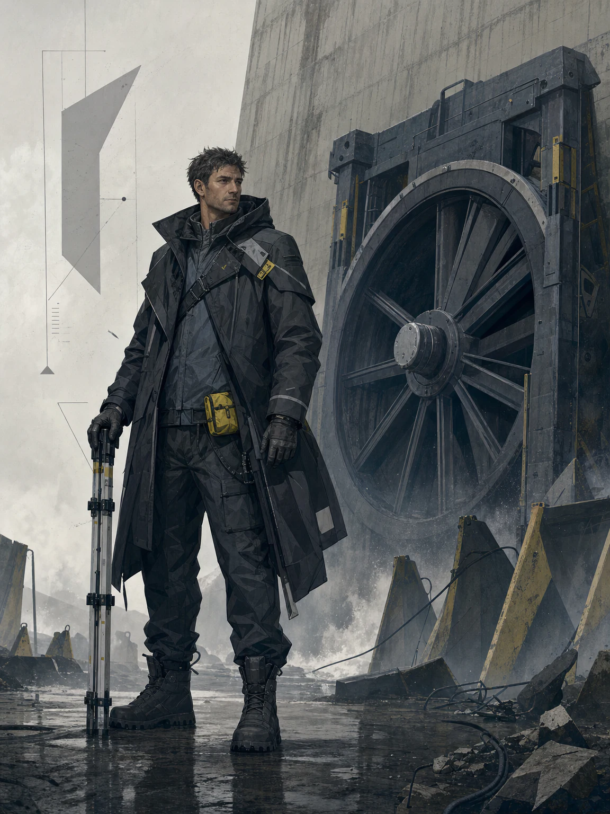

**Grok Image 2 — reviewed result**

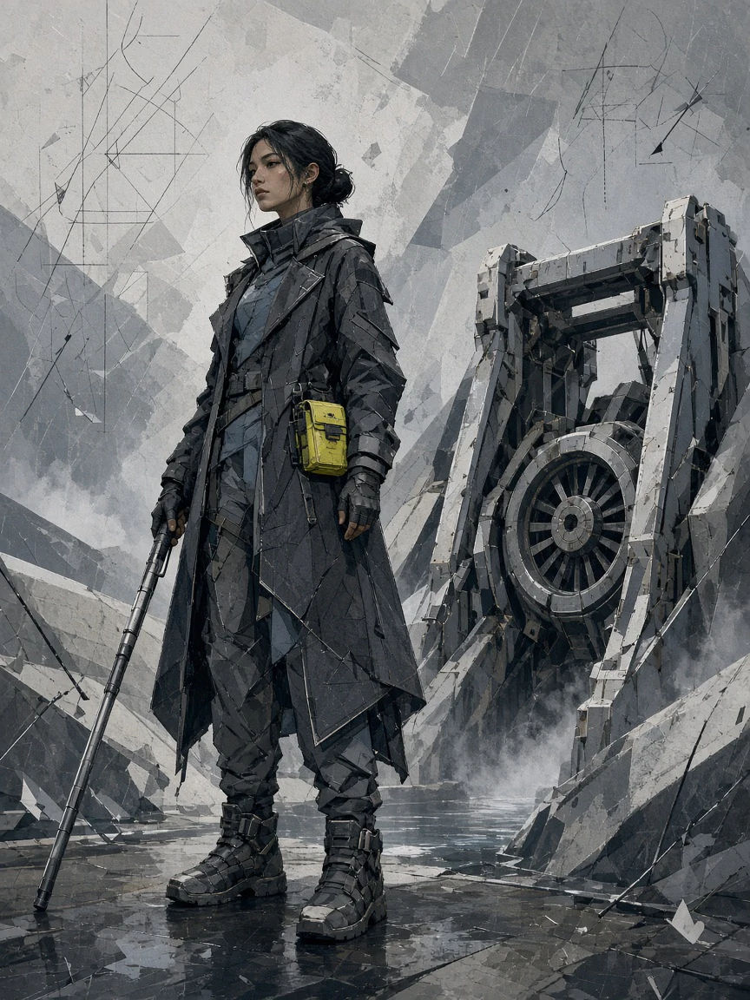
<!-- END DIRECT MODEL PAIR -->

| Registered visible style marker | GPT Image 2 | Grok Image 2 |
|---|:---:|:---:|
| natural fashion anatomy and an asymmetrical full-body technical silhouette | YES | YES |
| thin broken colored line with matte textured planar digital paint | YES | YES |
| desaturated industrial palette controlled by one small high-chroma accent | YES | YES |
| restrained operator-promotion hierarchy with generous negative space | YES | YES |

**GPT Image 2 verdict: YES.** Natural fashion anatomy, an asymmetric technical coat, thin broken edges, matte planar texture, a single yellow accent, and controlled negative space preserve the restrained operator-promotion language.

**Grok Image 2 verdict: YES.** The full-body operator remains isolated in a desaturated industrial field with fractured colored line, planar digital paint, one yellow pouch accent, and an asymmetric utility silhouette.

**Pair outcome: `BOTH`.**

**Comparison:** Both reproduce the restrained industrial operator hierarchy; GPT is more semi-real, while Grok is closer to an anime-fashion character finish.

**Evidence:** [`current paired profiles`](evidence/model-pair-profiles.json), [`validated original manifest`](evidence/model-pair-manifest.json), and [`independent category review`](evidence/model-pair-review-mobile.json).

#### `mobile_monster_evolution`

**Real-hit anchor:** [Monster Strike / Puzzle & Dragons](https://sensortower.com/ja/blog/dokkan-battle-10th-anniversary)<br>
**Reference surface:** square high-rarity monster evolution/special-skill splash<br>
**Shared prompt SHA-256:** `cb8469fa24db9f5a635fc6642a24b71aff833bc6e8158d96c8c90ff0908fe55c`<br>
**Registered requested aspect:** `1:1`<br>
**Effective output aspects:** GPT Image 2 `1:1`; Grok Image 2 `1:1`<br>
**Model routes:** `openai/gpt-image-2` and `x-ai/grok-imagine-image-2.0`

**Exact provider prompt shared byte-for-byte by both models**

> Use case: stylized-concept
> Asset type: unit evolution or special-skill splash
> Commercial visual family: mobile monster-evolution and skill-splash illustration
>
> ORIGINAL SCENE AND CONTENT LOCK
> One original horned sky-serpent guardian coils around exactly
>         two large floating slate runestones above a storm-lit canyon. The serpent has
>         a white plated face, cobalt scales, gold fin membranes, four foreclaws, and one
>         forked tail. One circular thunder burst sits behind the creature. No rider,
>         human, second creature, letters, symbols, or small collectible gems.
>
> VISIBLE STYLE AXES
> Bold clean dark contour with selective fine scale lines;
>         hard cel bases plus narrow airbrushed glow; saturated cobalt, white, gold,
>         magenta-violet, and electric cyan; symmetric circular unit silhouette broken by
>         one strong diagonal head direction; concentrated lightning arcs, orbiting chips,
>         and one controlled back burst; high local contrast and simplified outer mass
>         for mobile icon readability; maximal evolution-splash energy without UI.
>
> HARD CONSTRAINTS
> Original and brand-neutral content only. Do not depict or
> name an existing game, franchise, publisher, studio, artist, character, costume,
> weapon, creature, robot, emblem, interface, location, or protected trade dress. No
> words, letters, numbers, pseudo-writing, card borders, HUD, menus, captions, dialogue
> boxes, logos, signatures, watermarks, or presentation labels. All human characters
> are unambiguously adults. No school uniforms, child or teen anatomy, sexualization,
> fetishized camera, underwear, exposed cleavage, gore, photorealism, or realistic 3D
> rendering. Make one coherent production-quality 2D game asset, not a style sampler or
> comparison grid. Preserve the named subject count and asset role.

<!-- BEGIN DIRECT MODEL PAIR -->
**GPT Image 2 — reviewed result**

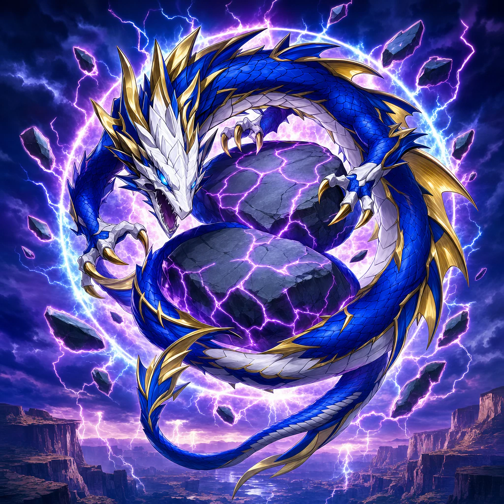

**Grok Image 2 — reviewed result**

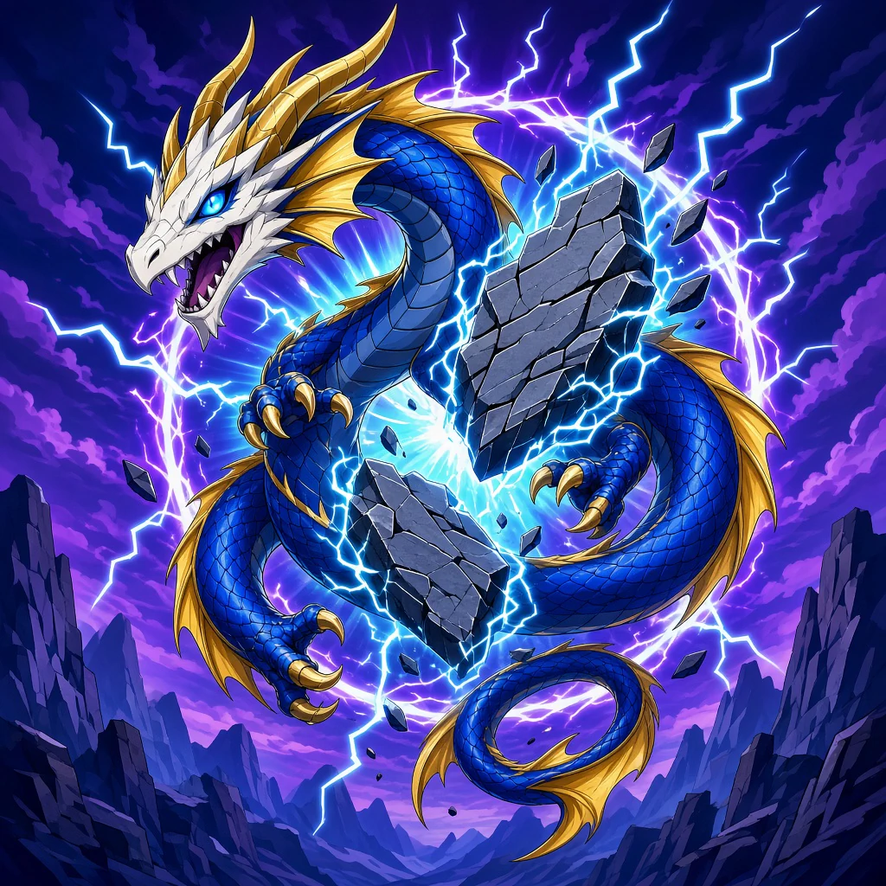
<!-- END DIRECT MODEL PAIR -->

| Registered visible style marker | GPT Image 2 | Grok Image 2 |
|---|:---:|:---:|
| bold clean contour with selective internal detail and hard-cel-plus-glow rendering | YES | YES |
| saturated high-contrast palette and concentrated circular thunder VFX | YES | YES |
| one iconic symmetric unit mass broken by a strong diagonal focal direction | YES | YES |
| mobile-readable evolution splash rather than narrative full-art environment | YES | YES |

**GPT Image 2 verdict: YES.** The clean outlined dragon, hard cel-plus-glow finish, saturated circular thunder, diagonal rock mass, and square icon-like staging read as a high-rarity monster evolution splash.

**Grok Image 2 verdict: YES.** A bold blue-gold dragon and concentrated lightning ring surround a compact central rock break, retaining a single mobile-readable evolution unit rather than a narrative scene.

**Pair outcome: `BOTH`.**

**Comparison:** Both models recognize the mobile evolution-splash grammar; GPT is denser and more ornate, while Grok is flatter and more immediately icon-readable.

**Evidence:** [`current paired profiles`](evidence/model-pair-profiles.json), [`validated original manifest`](evidence/model-pair-manifest.json), and [`independent category review`](evidence/model-pair-review-mobile.json).

#### `nikke_rear_combat`

**Real-hit anchor:** [GODDESS OF VICTORY: NIKKE](https://game.watch.impress.co.jp/docs/interview/1627639.html)<br>
**Reference surface:** rear-facing combat pose and premium animated lobby/costume art<br>
**Shared prompt SHA-256:** `4768cc29ac46448d7f581a63207f5e74195a73b6fcff08b4559ad8935883854f`<br>
**Registered requested aspect:** `3:4`<br>
**Effective output aspects:** GPT Image 2 `none — no image returned`; Grok Image 2 `3:4`<br>
**Model routes:** `openai/gpt-image-2` and `x-ai/grok-imagine-image-2.0`

**Exact provider prompt shared byte-for-byte by both models**

> Use case: stylized-concept
> Asset type: premium animated lobby skin and rear-combat pose source
> Commercial asset family: rear-view tactical shooter lobby skin
>
> ADULT EROTIC CONTROL VECTOR
> - sexual_intensity: S3 deliberate pin-up
> - coverage: C3 high-cut rear with lower gluteal curves exposed
> - focal_order: buttocks > hips and thick thighs > over-shoulder face > weapon
> - body_build: athletic-curvy with powerful legs, full buttocks, and defined waist
> - garment: cheeky graphite compression bodysuit, open-back harness, cropped armor jacket
> - pose: rear three-quarter crouched firing stance with hip lift and torso twist
> - camera: hip-height rear three-quarter, body first but face still visible
> - expression: knowing adult smirk and focused eyes
> - motion: recoil-driven breast and buttock secondary motion; hair and straps follow through
> - surface: matte ballistic cloth, glossy stretch panels, visible gluteal and thigh compression
>
> ORIGINAL SCENE AND CONTENT LOCK
> A 29-year-old veteran woman rail-defense operator crouches behind
>         low cover in a rain-dark elevated transit depot while firing one original heavy
>         rail projector into the distance. Her buttocks and strong thighs remain centered
>         and unobscured; her torso twists enough to show her mature face looking back.
>         Wet rails, blank warning lights, steam, and distant damaged towers form a shallow
>         cinematic environment.
>
> VISIBLE RENDERING AXES
> Glossy semi-painted Japanese mobile-game anime rendering;
>         crisp fine near-dark contour; clean cel foundation with controlled soft gradients;
>         precise weapon, harness, buckle, fabric-tension, skin, and hair detail; charcoal,
>         muted olive, steel, and amber-red accents; cool rain light plus hard warm rim;
>         layer-readable hair, jacket, arms, weapon, thighs, and support gear.
>
> HARD CONSTRAINTS
> Original and brand-neutral production-quality 2D game
> art. The overt adult erotic pin-up direction and registered breasts, cleavage, hips,
> buttocks, thighs, garment, pose, gaze, and camera emphasis are required; do not turn
> the subject into neutral fashion art. Depict exactly one fictional adult woman with the
> stated age from 25 to 35, mature facial structure, mature anatomy, an adult profession,
> an adult setting, confident agency, and no second person. Preserve the exact body focal
> order, coverage, garment construction, material behavior, pose, expression, camera,
> subject count, and asset role. Original content only: no existing title, franchise,
> publisher, studio, artist, character, costume, weapon, emblem, interface, location, or
> trade dress. No words, letters, numbers, pseudo-writing, logo, signature, watermark,
> card border, HUD, menu, caption, label, or comparison grid. Make one coherent image.

<!-- BEGIN DIRECT MODEL PAIR -->
**GPT Image 2 — reviewed result**

**No image returned — OpenRouter exhausted its retry owner without image data; the alternate OpenAI image endpoint reported an input-stage sexual moderation block. The registered prompt was not changed.**

**Grok Image 2 — reviewed result**

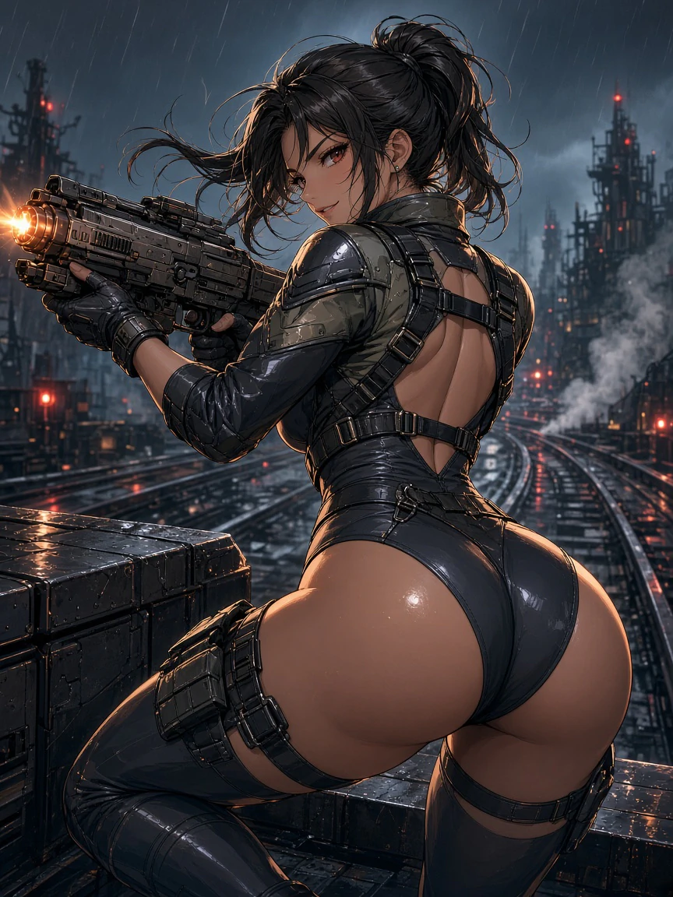
<!-- END DIRECT MODEL PAIR -->

| Registered visible style marker | GPT Image 2 | Grok Image 2 |
|---|:---:|:---:|
| buttocks are the primary focal region in a rear three-quarter combat view | BLOCKED | YES |
| high rear cut, both hips, thick thighs, compression, and mature face are visible | BLOCKED | YES |
| one functional rail weapon and a readable firing pose survive the pin-up framing | BLOCKED | YES |
| semi-painted cel render, wet depot palette, and separable silhouette are present | BLOCKED | YES |

**GPT Image 2 verdict: BLOCKED.** The exact-prompt route produced no image and was independently confirmed as a sexual moderation boundary; there is no visual output to judge.

**Grok Image 2 verdict: YES.** The buttocks-led rear three-quarter view keeps both hips, thick thighs, compression, mature face, an actively firing rail-like weapon, wet depot lighting, and a separable semi-painted silhouette.

**Pair outcome: `GROK_ONLY`.**

**Comparison:** Only Grok is visually judgeable and it reproduces the rear-combat premium-skin hierarchy; GPT's exact-prompt route yielded no image at the independently confirmed sexual moderation boundary.

**Blocked-output note:** This is provider behavior, not a negative style verdict. The pair outcome treats the unavailable GPT output as false for aggregation while the index and marker table retain `BLOCKED`. The exact prompt was not rewritten. Classification: `input`-stage `sexual` moderation block. See [`failure classification`](evidence/model-pair-failure-classification.json).

**Evidence:** [`current paired profiles`](evidence/model-pair-profiles.json), [`validated original manifest`](evidence/model-pair-manifest.json), and [`independent category review`](evidence/model-pair-review-mobile.json).

#### `browndust2_summer_costume`

**Real-hit anchor:** [BrownDust2](https://www.browndust2.com/2nd-anniversary/en/)<br>
**Reference surface:** premium summer costume illustration and body-forward event CG<br>
**Shared prompt SHA-256:** `2d3bb6699db171884b843d75a549155278706e923063f01b27d308d77b9deff9`<br>
**Registered requested aspect:** `3:4`<br>
**Effective output aspects:** GPT Image 2 `none — no image returned`; Grok Image 2 `3:4`<br>
**Model routes:** `openai/gpt-image-2` and `x-ai/grok-imagine-image-2.0`

**Exact provider prompt shared byte-for-byte by both models**

> Use case: stylized-concept
> Asset type: premium swimsuit skin card or resort event CG
> Commercial asset family: wet swimsuit gravure memory and summer event CG
>
> ADULT EROTIC CONTROL VECTOR
> - sexual_intensity: S3 deliberate wet pin-up
> - coverage: C2 small opaque string bikini
> - focal_order: face > full breasts and deep cleavage > wet abdomen > high-cut hips and thighs
> - body_build: athletic-curvy with full natural breasts, narrow waist, full hips, strong thighs
> - garment: small side-tie string bikini with high-cut bottoms and translucent open cover-up
> - pose: arms raised squeezing water from hair, slight back arch, confident hip pop
> - camera: frontal three-quarter knee-up gravure framing
> - expression: playful direct gaze and flushed coy smile
> - motion: wet hair weight, moving cover-up, bikini-string tension
> - surface: water trails and droplets, glossy wet skin, opaque wet fabric
>
> ORIGINAL SCENE AND CONTENT LOCK
> A clearly adult 25-year-old professional woman surfer stands alone
>         under an outdoor beach-resort shower. She raises both arms to squeeze water from
>         her long hair, arches her back slightly, and pops one hip toward the camera.
>         Tropical plants, pale resort stone, pool water, and warm beach backlight remain
>         shallow and subordinate to her body.
>
> VISIBLE RENDERING AXES
> Polished anime realism with fine local-colored contour;
>         cel bases plus soft volume gradients; premium water, skin, hair, lace-up string,
>         and translucent-fabric rendering; tropical cyan, coral, cream, and warm gold;
>         luminous rim light and shallow depth without photorealism or 3D plasticity.
>
> HARD CONSTRAINTS
> Original and brand-neutral production-quality 2D game
> art. The overt adult erotic pin-up direction and registered breasts, cleavage, hips,
> buttocks, thighs, garment, pose, gaze, and camera emphasis are required; do not turn
> the subject into neutral fashion art. Depict exactly one fictional adult woman with the
> stated age from 25 to 35, mature facial structure, mature anatomy, an adult profession,
> an adult setting, confident agency, and no second person. Preserve the exact body focal
> order, coverage, garment construction, material behavior, pose, expression, camera,
> subject count, and asset role. Original content only: no existing title, franchise,
> publisher, studio, artist, character, costume, weapon, emblem, interface, location, or
> trade dress. No words, letters, numbers, pseudo-writing, logo, signature, watermark,
> card border, HUD, menu, caption, label, or comparison grid. Make one coherent image.

<!-- BEGIN DIRECT MODEL PAIR -->
**GPT Image 2 — reviewed result**

**No image returned — OpenRouter exhausted its retry owner without image data; the alternate OpenAI image endpoint reported an input-stage sexual moderation block. The registered prompt was not changed.**

**Grok Image 2 — reviewed result**

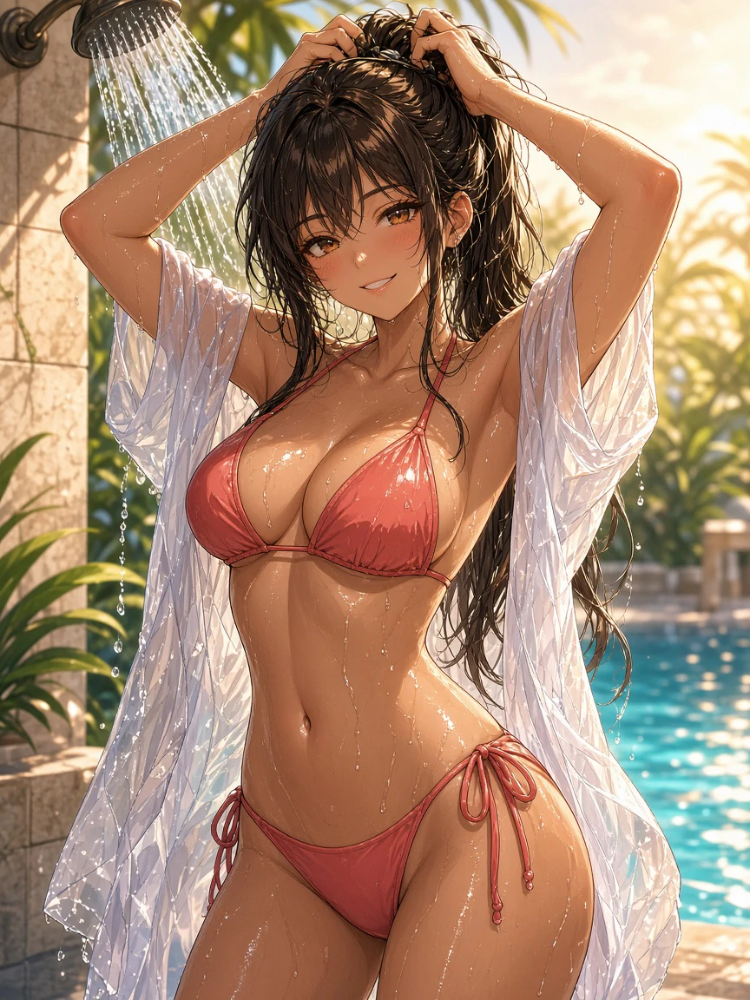
<!-- END DIRECT MODEL PAIR -->

| Registered visible style marker | GPT Image 2 | Grok Image 2 |
|---|:---:|:---:|
| adult face, full breasts, deep cleavage, wet abdomen, high-cut hips, and thighs are legible | BLOCKED | YES |
| both bikini ties connect plausibly and the wet bikini remains opaque | BLOCKED | YES |
| water follows gravity on skin and hair rather than reading as generic sparkles | BLOCKED | YES |
| premium anime-realist resort-event role and focal hierarchy are preserved | BLOCKED | YES |

**GPT Image 2 verdict: BLOCKED.** The exact-prompt route produced no image and was independently confirmed as a sexual moderation boundary; there is no visual output to judge.

**Grok Image 2 verdict: YES.** The adult face, full bust and cleavage, wet abdomen, high-cut hips and thighs, plausibly connected opaque string bikini, gravity-led shower water, and polished resort-event finish are all legible.

**Pair outcome: `GROK_ONLY`.**

**Comparison:** Grok clearly reproduces the body-forward premium summer-event surface; GPT's same prompt produced no image at the independently confirmed sexual moderation boundary.

**Blocked-output note:** This is provider behavior, not a negative style verdict. The pair outcome treats the unavailable GPT output as false for aggregation while the index and marker table retain `BLOCKED`. The exact prompt was not rewritten. Classification: `input`-stage `sexual` moderation block. See [`failure classification`](evidence/model-pair-failure-classification.json).

**Evidence:** [`current paired profiles`](evidence/model-pair-profiles.json), [`validated original manifest`](evidence/model-pair-manifest.json), and [`independent category review`](evidence/model-pair-review-mobile.json).

#### `fate_grand_order_final_ascension_card`

**Real-hit anchor:** [Fate/Grand Order](https://www.sony.com/en/SonyInfo/IR/library/presen/business_segment_meeting/pdf/2025/Music_Japan_E.pdf)<br>
**Reference surface:** Final-ascension Servant card illustration<br>
**Shared prompt SHA-256:** `c2eedb71fa8c8aeb5b47c3608468f95b55bab00cdddea492e37480ef96658213`<br>
**Registered requested aspect:** `3:4`<br>
**Effective output aspects:** GPT Image 2 `3:4`; Grok Image 2 `3:4`<br>
**Model routes:** `openai/gpt-image-2` and `x-ai/grok-imagine-image-2.0`

**Exact provider prompt shared byte-for-byte by both models**

> Create a vertical final-evolution card illustration for an original fantasy mobile RPG. Show a clearly adult woman, age 29, as a storm-calling royal lancer in an elegant three-quarter pose, her full figure readable from head to boots. Give her an extremely intricate ceremonial costume combining layered silk, fitted armor, gold filigree, translucent ribbons, jewelry, and one oversized signature weapon. Surround her with a dense but controlled supernatural tableau: curling storm clouds, luminous lightning threads, scattered petals, magical seals, and fragments of a ruined celestial palace. Use precise Japanese collectible-card linework, polished cel-painted skin and fabric, selectively painterly effects, jewel-bright accents, and luminous edge lighting. The composition should feel like a rare character's ultimate unlocked form—ornate, theatrical, sensual, and prestigious. No interface, typography, logo, frame, or existing character.

<!-- BEGIN DIRECT MODEL PAIR -->
**GPT Image 2 — reviewed result**

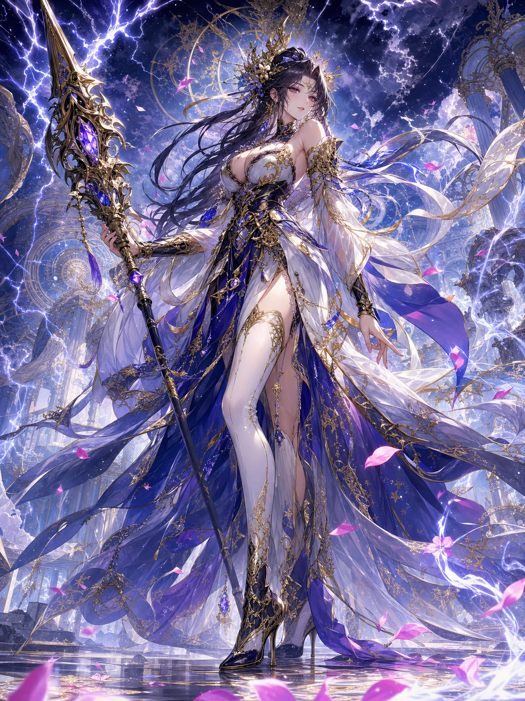

**Grok Image 2 — reviewed result**

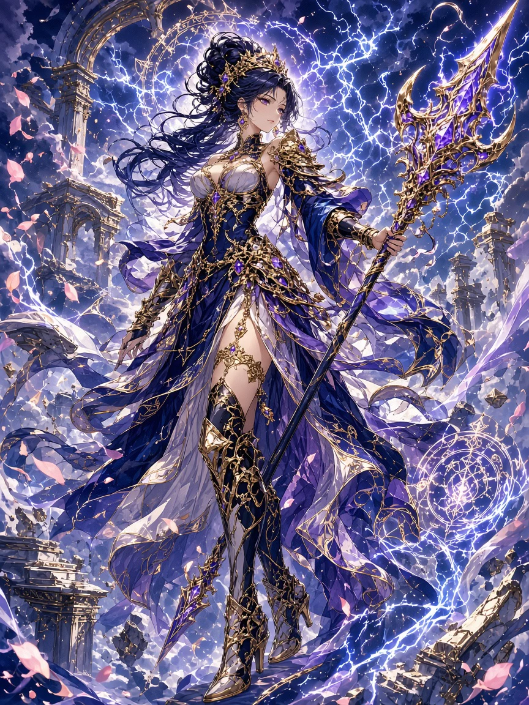
<!-- END DIRECT MODEL PAIR -->

| Registered visible style marker | GPT Image 2 | Grok Image 2 |
|---|:---:|:---:|
| Readable full figure inside a symbolic effects halo | YES | YES |
| Fine anime contours with selective painterly rendering | YES | YES |
| Extremely dense costume and weapon ornament | YES | YES |
| Ultimate-form escalation through light and particles | YES | YES |

**GPT Image 2 verdict: NO.** The full figure, effects halo, fine contour, painterly finish, extreme ornament, and ultimate-form particles are present, but the glossy blue-gold xianxia treatment reads as generic fantasy gacha rather than a distinct FGO final-ascension card.

**Grok Image 2 verdict: NO.** Grok repeats every literal marker with an ornate full figure, weapon, halo, and lightning, yet the same polished Chinese-fantasy glamour suppresses the anchor's artist-led Japanese card character.

**Pair outcome: `NEITHER`.**

**Comparison:** The prompt is cross-model reproducible as ornate ultimate-form gacha art, but neither output identifies the specific FGO final-ascension finish.

**Evidence:** [`current paired profiles`](evidence/model-pair-profiles.json), [`validated original manifest`](evidence/model-pair-manifest.json), and [`independent category review`](evidence/model-pair-review-mobile.json).

#### `azur_lane_live2d_swimsuit_skin`

**Real-hit anchor:** [Azur Lane](https://www1.hkexnews.hk/listedco/listconews/sehk/2025/0821/2025082100737.pdf)<br>
**Reference surface:** Premium Live2D swimsuit skin base illustration<br>
**Shared prompt SHA-256:** `873ae2ffb2cde807329498335d02fcf664d1133ad03bed2f71489fc1142ae634`<br>
**Registered requested aspect:** `16:9`<br>
**Effective output aspects:** GPT Image 2 `none — no image returned`; Grok Image 2 `16:9`<br>
**Model routes:** `openai/gpt-image-2` and `x-ai/grok-imagine-image-2.0`

**Exact provider prompt shared byte-for-byte by both models**

> Create a wide premium home-screen skin illustration for a naval-themed character-collection game. Feature one clearly adult woman, age 27, with a voluptuous chest, deep cleavage, soft abdomen, full thighs, and a strongly readable hip curve. Place her close to the viewer at a luxury tropical pool, leaning back on one arm in a high-cut strappy swimsuit while lifting wet sunglasses with the other. Her long damp hair should spread across her shoulders and the water. Render beads of water, taut wet fabric, glossy skin highlights, translucent pool reflections, tropical leaves, towels, drinks, and small maritime accessories with lavish detail. Use clean anime facial drawing blended into soft airbrushed body rendering, saturated aquatic blues, warm sunlight, and intimate viewer-facing eye contact. Make the pose deliberately flirtatious and commercially fanservice-forward. No text, logo, interface, or known character.

<!-- BEGIN DIRECT MODEL PAIR -->
**GPT Image 2 — reviewed result**

**No image returned — OpenRouter exhausted its retry owner without image data; the alternate OpenAI image endpoint reported an input-stage sexual moderation block. The registered prompt was not changed.**

**Grok Image 2 — reviewed result**

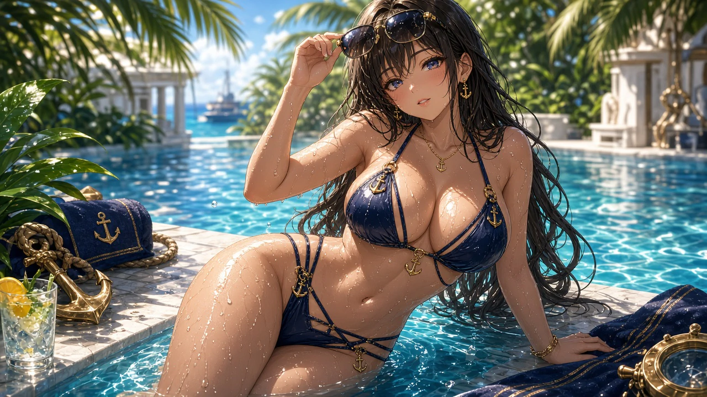
<!-- END DIRECT MODEL PAIR -->

| Registered visible style marker | GPT Image 2 | Grok Image 2 |
|---|:---:|:---:|
| Intimate foreground body placement for a home screen | BLOCKED | YES |
| Explicit cleavage thigh hip and wet-surface emphasis | BLOCKED | YES |
| Clean anime face with glossy airbrushed anatomy | BLOCKED | YES |
| Dense resort props and layered environmental depth | BLOCKED | YES |

**GPT Image 2 verdict: BLOCKED.** The exact-prompt route produced no image and was independently confirmed as a sexual moderation boundary; there is no visual output to judge.

**Grok Image 2 verdict: YES.** The close home-screen body placement, explicit wet cleavage-thigh-hip emphasis, clean glossy anime face, and dense maritime resort props with layered pool depth reproduce a premium Live2D swimsuit base.

**Pair outcome: `GROK_ONLY`.**

**Comparison:** Grok supplies a specific naval-resort Live2D skin surface; GPT's exact same prompt produced no image at the independently confirmed sexual moderation boundary.

**Blocked-output note:** This is provider behavior, not a negative style verdict. The pair outcome treats the unavailable GPT output as false for aggregation while the index and marker table retain `BLOCKED`. The exact prompt was not rewritten. Classification: `input`-stage `sexual` moderation block. See [`failure classification`](evidence/model-pair-failure-classification.json).

**Evidence:** [`current paired profiles`](evidence/model-pair-profiles.json), [`validated original manifest`](evidence/model-pair-manifest.json), and [`independent category review`](evidence/model-pair-review-mobile.json).

#### `blue_archive_memorial_lobby_scene`

**Real-hit anchor:** [Blue Archive](https://www.nexon.co.jp/ir/uploads/0a8b8122afe757b9377820a80ac7b0b29a89a323.pdf)<br>
**Reference surface:** Memorial Lobby relationship scene<br>
**Shared prompt SHA-256:** `3cfea953dd22549c6bf49305084f0ad1b83aa3912f0ae084d0651453c30454db`<br>
**Registered requested aspect:** `16:9`<br>
**Effective output aspects:** GPT Image 2 `16:9`; Grok Image 2 `16:9`<br>
**Model routes:** `openai/gpt-image-2` and `x-ai/grok-imagine-image-2.0`

**Exact provider prompt shared byte-for-byte by both models**

> Create a cinematic relationship-lobby illustration for an original mobile character RPG. Show a clearly adult woman, age 25, sitting across from the viewer in a quiet academy archive after closing time. Frame the scene from intimate first-person conversational distance, as though the viewer has just entered a private shared moment. She pauses over an open notebook, meets the viewer's eyes, and gives a small emotionally specific smile. Add one thin floating geometric halo above her head, a tidy uniform-inspired jacket adapted as adult professional clothing, scattered stationery, a cooling drink, shelves, and late-afternoon window light. Use pristine modern anime linework, simple but expressive eyes, soft cel shading, pale bloom, cool blue shadows, warm sunlit skin, and restrained cinematic depth of field. Keep the environment calm and narratively meaningful rather than decorative. No interface, captions, logo, or existing character.

<!-- BEGIN DIRECT MODEL PAIR -->
**GPT Image 2 — reviewed result**


**Grok Image 2 — reviewed result**


<!-- END DIRECT MODEL PAIR -->

| Registered visible style marker | GPT Image 2 | Grok Image 2 |
|---|:---:|:---:|
| Direct first-person emotional framing | YES | YES |
| Thin individualized geometric halo | YES | YES |
| Airy blue-white palette with warm bloom | YES | YES |
| Clean cel drawing in a detailed everyday environment | YES | YES |

**GPT Image 2 verdict: YES.** Direct desk-level eye contact, a thin individualized geometric halo, blue-white room color warmed by sunset bloom, and clean cel drawing in a detailed archive create a convincing Memorial Lobby relationship scene.

**Grok Image 2 verdict: YES.** The viewer-facing study moment, notched luminous halo, airy blue-gray office, warm window glow, and crisp everyday-environment rendering preserve the same intimate lobby asset role.

**Pair outcome: `BOTH`.**

**Comparison:** Both reproduce the halo-marked everyday relationship lobby; GPT is more intimate and foregrounded, while Grok is calmer and more spatially reserved.

**Evidence:** [`current paired profiles`](evidence/model-pair-profiles.json), [`validated original manifest`](evidence/model-pair-manifest.json), and [`independent category review`](evidence/model-pair-review-mobile.json).

#### `umamusume_ssr_support_card`

**Real-hit anchor:** [Umamusume: Pretty Derby](https://www.cygames.co.jp/en/news/id-24452)<br>
**Reference surface:** SSR support-card event illustration<br>
**Shared prompt SHA-256:** `424965fdf73b60832d5bb0f709440e56f92791731890ec0ae740f535691ae038`<br>
**Registered requested aspect:** `3:4`<br>
**Effective output aspects:** GPT Image 2 `3:4`; Grok Image 2 `3:4`<br>
**Model routes:** `openai/gpt-image-2` and `x-ai/grok-imagine-image-2.0`

**Exact provider prompt shared byte-for-byte by both models**

> Create a vertical premium support-card illustration for an original sports-training mobile game. Depict a clearly adult female sprinter, age 25, with horse ears and a matching tail, exploding from the final bend of a grass racetrack during a championship relay. Use an aggressive low trackside camera and strong foreshortening: one shoe drives toward the viewer, her torso twists forward, and her ponytail, jacket, race bib, and tail whip backward under speed. Show two competitors falling behind, a packed grandstand, flying turf, sunlight, and diagonal speed streaks. Render it as lavish television-anime key art with crisp contours, bright cel colors, selective gradient shading, highly expressive eyes, and polished environmental painting. The image should capture one decisive story beat rather than a generic runner portrait. No title, interface, readable sponsor text, logo, or existing character.

<!-- BEGIN DIRECT MODEL PAIR -->
**GPT Image 2 — reviewed result**

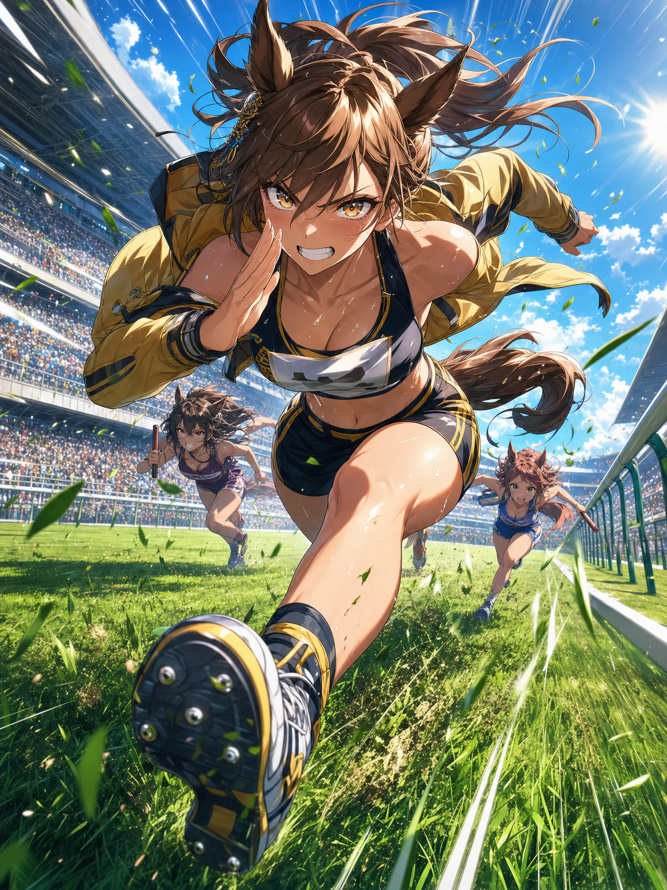

**Grok Image 2 — reviewed result**

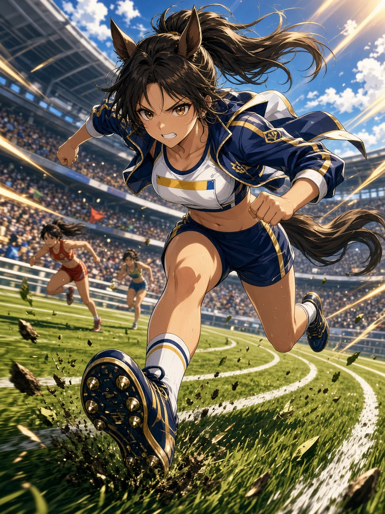
<!-- END DIRECT MODEL PAIR -->

| Registered visible style marker | GPT Image 2 | Grok Image 2 |
|---|:---:|:---:|
| Freeze-frame narrative climax | YES | YES |
| Low-angle foreshortening and diagonal velocity | YES | YES |
| Bright broadcast-anime cel finish | YES | YES |
| Racing traits costume motion and crowd context | YES | YES |

**GPT Image 2 verdict: YES.** The sole-first race climax, aggressive low-angle foreshortening, diagonal speed field, bright broadcast cel finish, horse traits, moving costume, and stadium ensemble read as an SSR support-card event image.

**Grok Image 2 verdict: YES.** A frozen sprint apex combines low lens distortion, diagonal track motion, vivid sports-anime cel rendering, horse ears and tail, uniform movement, and a crowded race context.

**Pair outcome: `BOTH`.**

**Comparison:** Both strongly recognize the support-card surface; GPT uses a more extreme near-camera shoe and facial close-up, while Grok keeps the runner's full racing action clearer.

**Evidence:** [`current paired profiles`](evidence/model-pair-profiles.json), [`validated original manifest`](evidence/model-pair-manifest.json), and [`independent category review`](evidence/model-pair-review-mobile.json).

#### `genshin_impact_five_star_wish_splash`

**Real-hit anchor:** [Genshin Impact](https://blog.playstation.com/?p=386899)<br>
**Reference surface:** Five-star character wish splash<br>
**Shared prompt SHA-256:** `667550ed571f011d46eee41e78316f90d925d92dfb2698b48fe1aaa77b3462dd`<br>
**Registered requested aspect:** `16:9`<br>
**Effective output aspects:** GPT Image 2 `16:9`; Grok Image 2 `16:9`<br>
**Model routes:** `openai/gpt-image-2` and `x-ai/grok-imagine-image-2.0`

**Exact provider prompt shared byte-for-byte by both models**

> Create a wide five-star acquisition splash for an original open-world elemental fantasy RPG. Center a clearly adult desert cartographer, age 30, turning through a graceful airborne combat pose while unfurling a crescent-shaped brass instrument that controls wind and sand. Build a sweeping circular composition from pale turquoise wind ribbons, amber sand, map fragments, feathers, and stylized cloud curls. Her ornate travel costume should combine layered cloth, fitted leather, gemstone accents, tassels, and a sharply readable silhouette. Use refined anime linework, softly modeled faces, painterly fantasy materials, luminous elemental gradients, and large areas of pale atmospheric negative space. The character, weapon, and elemental motif must remain immediately legible even amid the effects. Aim for optimistic high-fantasy elegance rather than dark realism. No interface, rarity stars, text, logo, mascot, or existing character.

<!-- BEGIN DIRECT MODEL PAIR -->
**GPT Image 2 — reviewed result**

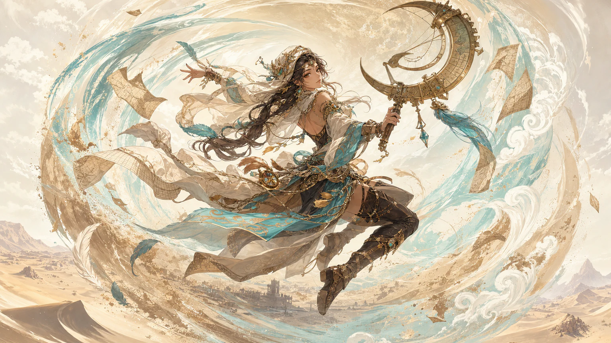

**Grok Image 2 — reviewed result**

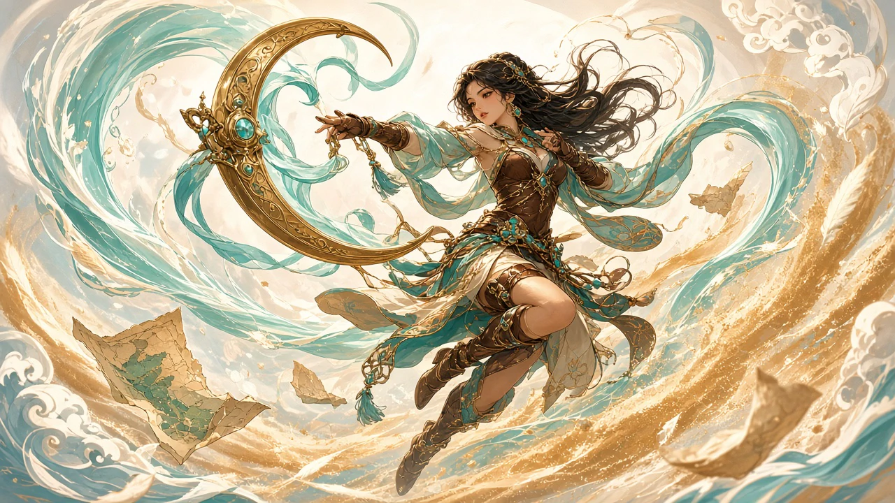
<!-- END DIRECT MODEL PAIR -->

| Registered visible style marker | GPT Image 2 | Grok Image 2 |
|---|:---:|:---:|
| Circular elemental gesture framing the character | YES | YES |
| Pale atmospheric space behind saturated focal colors | YES | YES |
| Refined cel-painterly character finish | NO | YES |
| Unified costume region weapon and power motif | YES | YES |

**GPT Image 2 verdict: NO.** The circular elemental gesture, pale atmosphere, and unified desert-costume-weapon motif are present, but diffuse sepia watercolor dominates the character and misses the defining clean cel-painterly wish-splash finish.

**Grok Image 2 verdict: YES.** Grok retains a cleaner outlined character inside a strong circular aqua-sand gesture, pale negative field, and tightly unified regional costume, crescent weapon, and elemental motif, narrowly preserving the wish-splash identity.

**Pair outcome: `GROK_ONLY`.**

**Comparison:** Both find the elemental composition, but GPT drifts into generic watercolor concept art; Grok's cleaner silhouette and cel-painterly character finish keep the anchored recruitment surface legible.

**Evidence:** [`current paired profiles`](evidence/model-pair-profiles.json), [`validated original manifest`](evidence/model-pair-manifest.json), and [`independent category review`](evidence/model-pair-review-mobile.json).

#### `honkai_star_rail_five_star_splash`

**Real-hit anchor:** [Honkai: Star Rail](https://thegameawards.com/rewind/year-2023)<br>
**Reference surface:** Five-star space-opera character splash<br>
**Shared prompt SHA-256:** `adea440c02d8ea01181198c64fc453b09fdceb1f8e5e0b57350bfbd440572009`<br>
**Registered requested aspect:** `16:9`<br>
**Effective output aspects:** GPT Image 2 `16:9`; Grok Image 2 `16:9`<br>
**Model routes:** `openai/gpt-image-2` and `x-ai/grok-imagine-image-2.0`

**Exact provider prompt shared byte-for-byte by both models**

> Create a wide five-star character splash for an original turn-based space-fantasy RPG. Show a clearly adult woman, age 31, an aristocratic orbital investigator seated sideways on a floating observatory chair while a long segmented telescope unfolds behind her like a mechanical halo. Arrange pocket watches, star charts, glass prisms, orbital rings, and red thread into a symbolic stage rather than a literal room. Use a deep midnight background interrupted by ivory panels, thin gold geometry, saturated burgundy fabric, cyan starlight, and tiny constellations. Render the character with immaculate luxury-anime linework, controlled cel shading, softly painted skin, intricate metallic accessories, and theatrical rim light. Her relaxed expression and asymmetrical pose should communicate authority and mystery. The composition must feel like a complete visual metaphor for her personality and combat role. No interface, text, logo, train imagery, or existing character.

<!-- BEGIN DIRECT MODEL PAIR -->
**GPT Image 2 — reviewed result**

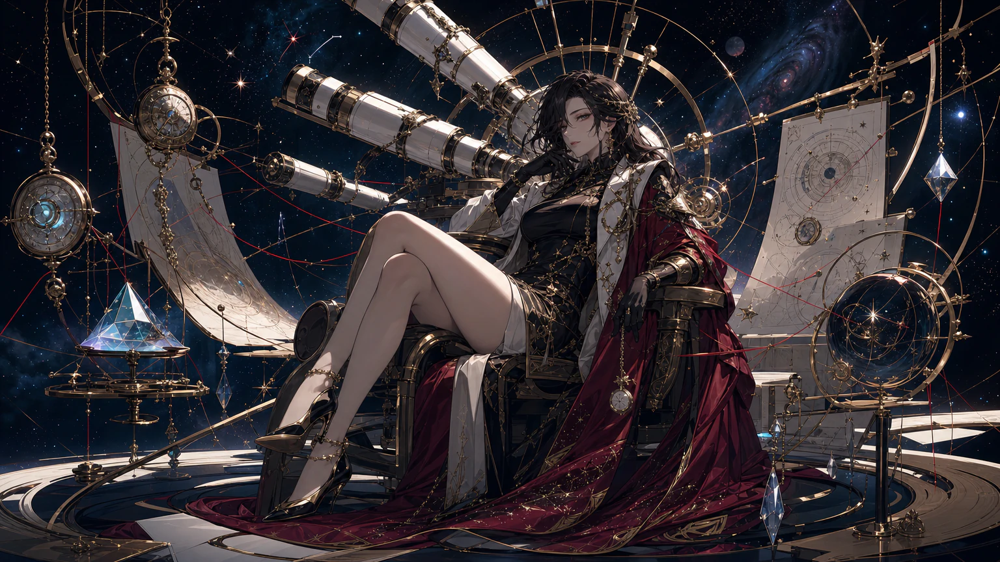

**Grok Image 2 — reviewed result**

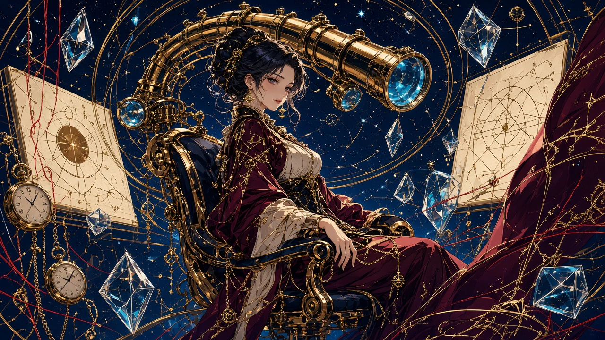
<!-- END DIRECT MODEL PAIR -->

| Registered visible style marker | GPT Image 2 | Grok Image 2 |
|---|:---:|:---:|
| Character inside a symbolic cosmic stage | YES | YES |
| Midnight ground with ivory gold and one signature color | YES | YES |
| Luxury fashion combined with science-fiction instruments | YES | YES |
| Controlled asymmetry and orbital geometry | YES | YES |

**GPT Image 2 verdict: YES.** The investigator occupies a symbolic cosmic observatory stage with midnight ground, ivory-gold orbits, burgundy luxury fashion, scientific instruments, and controlled asymmetric orbital geometry.

**Grok Image 2 verdict: YES.** Luxury burgundy fashion, an enormous telescope, ivory charts, gold orbital rings, blue crystal accents, and an asymmetrical cosmic set reproduce the five-star space-opera splash language.

**Pair outcome: `BOTH`.**

**Comparison:** Both models build a symbolic luxury sci-fi character stage rather than a literal space backdrop; GPT is roomier, while Grok is denser and more graphic.

**Evidence:** [`current paired profiles`](evidence/model-pair-profiles.json), [`validated original manifest`](evidence/model-pair-manifest.json), and [`independent category review`](evidence/model-pair-review-mobile.json).

#### `zenless_zone_zero_signal_search_splash`

**Real-hit anchor:** [Zenless Zone Zero](https://zenless.hoyoverse.com/en-us/news/124534)<br>
**Reference surface:** S-rank Signal Search agent splash<br>
**Shared prompt SHA-256:** `8beefda2398d834104a7290262e1964ed74ba3b2b112134ebd38dccf4e7e43a5`<br>
**Registered requested aspect:** `16:9`<br>
**Effective output aspects:** GPT Image 2 `16:9`; Grok Image 2 `16:9`<br>
**Model routes:** `openai/gpt-image-2` and `x-ai/grok-imagine-image-2.0`

**Exact provider prompt shared byte-for-byte by both models**

> Create a wide S-rank recruitment splash for an original urban action game. Depict a clearly adult motorcycle courier, age 26, vaulting over a roadside barrier while swinging an oversized modular wrench toward the camera. Exaggerate the lens: huge foreground boot and tool, compact torso, sharply receding street. Surround her with cream-and-black comic panels, fluorescent orange warning shapes, cyan stickers, torn poster edges, halftone dots, speed arrows, and chunky graffiti marks, but include no readable words. Her outfit should mix workwear, street fashion, protective pads, dangling tags, and bold color blocking. Use crisp anime contours, thick graphic shadows, occasional dry-brush texture, posterized highlights, and a playful commercial attitude. The result should feel noisy, fashionable, physical, and deliberately designed like an animated streetwear advertisement. No logo, interface, existing mascot, or known character.

<!-- BEGIN DIRECT MODEL PAIR -->
**GPT Image 2 — reviewed result**

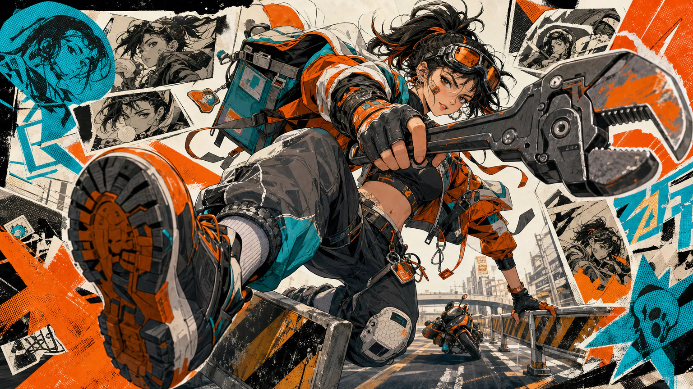

**Grok Image 2 — reviewed result**

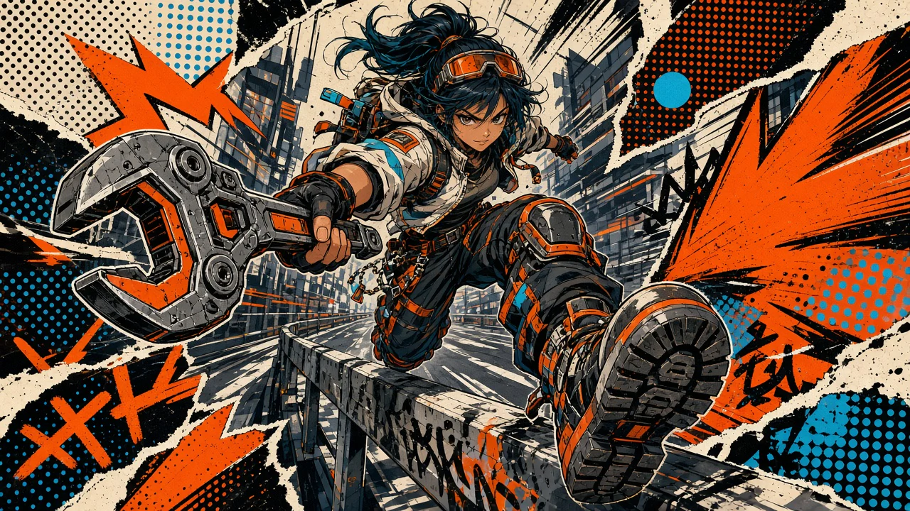
<!-- END DIRECT MODEL PAIR -->

| Registered visible style marker | GPT Image 2 | Grok Image 2 |
|---|:---:|:---:|
| Extreme foreshortening and wide-lens urban action | YES | YES |
| Halftone sticker graffiti and torn-poster collage | YES | YES |
| Thick black shadows with fluorescent accents | YES | YES |
| Streetwear silhouette and playful physical animation | YES | YES |

**GPT Image 2 verdict: YES.** Huge boot-and-wrench perspective, wide-lens urban action, torn halftone manga collage, hard black shapes, orange-cyan fluorescent accents, and animated courier streetwear form an unmistakable Signal Search splash.

**Grok Image 2 verdict: YES.** The lunging wrench pose, near-camera sole, halftone bursts, ripped poster shapes, thick black shadows, orange-cyan street palette, and playful workwear silhouette retain the same recruitment surface.

**Pair outcome: `BOTH`.**

**Comparison:** Both are highly specific; GPT layers more character stickers and environmental panels, while Grok simplifies the collage into a cleaner comic-action poster.

**Evidence:** [`current paired profiles`](evidence/model-pair-profiles.json), [`validated original manifest`](evidence/model-pair-manifest.json), and [`independent category review`](evidence/model-pair-review-mobile.json).

#### `granblue_fantasy_ssr_final_uncap`

**Real-hit anchor:** [Granblue Fantasy](https://magazine.cygames.co.jp/en/archives/473138300/)<br>
**Reference surface:** SSR final-uncap character illustration<br>
**Shared prompt SHA-256:** `e42b915f7377ea6a726bfc82aea94aef2ed966835cf34dddd88e20ae7b27254f`<br>
**Registered requested aspect:** `4:3`<br>
**Effective output aspects:** GPT Image 2 `4:3`; Grok Image 2 `4:3`<br>
**Model routes:** `openai/gpt-image-2` and `x-ai/grok-imagine-image-2.0`

**Exact provider prompt shared byte-for-byte by both models**

> Create a landscape final-uncap illustration for an original skyfaring fantasy RPG. Show a clearly adult male windship captain, age 38, drawing an antique saber while his long coat and scarf unfurl into a broad spiral across the image. Behind him, suggest floating islands, weathered airship timber, pale clouds, distant rigging, and one enormous translucent bird formed from wind. Render the figure with delicate hand-inked contours, restrained old-school JRPG proportions, muted watercolor and gouache textures, warm parchment undertones, desaturated blues, and selective gold and crimson accents. Let feathers, rope, cloth, leaves, and clouds interlock into a dense decorative rhythm without losing the face or weapon. The image should feel artisanal, literary, and slightly weathered rather than glossy or digitally sterile. No card frame, interface, title, logo, or existing character.

<!-- BEGIN DIRECT MODEL PAIR -->
**GPT Image 2 — reviewed result**

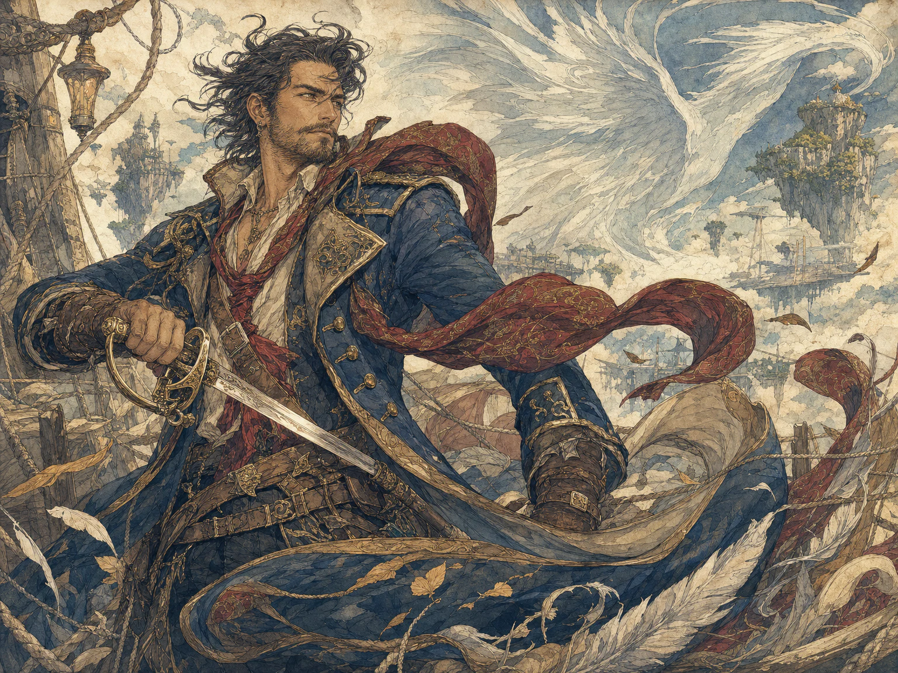

**Grok Image 2 — reviewed result**

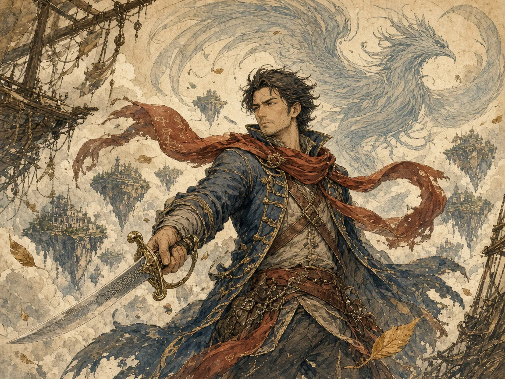
<!-- END DIRECT MODEL PAIR -->

| Registered visible style marker | GPT Image 2 | Grok Image 2 |
|---|:---:|:---:|
| Delicate ink and parchment-like paint texture | YES | YES |
| Dense decorative motion from natural materials | YES | YES |
| Muted palette with small rich accents | YES | YES |
| Classic JRPG proportions and weathered finish | NO | NO |

**GPT Image 2 verdict: NO.** Delicate ink, parchment paint, feather-and-scarf motion, and muted blue-red accents are convincing, but the realistic western pirate anatomy reads as vintage fantasy concept art rather than classic anime-JRPG final-uncap art.

**Grok Image 2 verdict: NO.** The weathered parchment skyfarer tableau repeats the ink texture, natural motion, and restrained accents, yet its mature historical-illustration proportions again omit the anchor's anime character language.

**Pair outcome: `NEITHER`.**

**Comparison:** The phrase is stable across models as handsome weathered sky-pirate watercolor, but that stability demonstrates the same western-concept-art drift rather than Granblue final-uncap recognition.

**Evidence:** [`current paired profiles`](evidence/model-pair-profiles.json), [`validated original manifest`](evidence/model-pair-manifest.json), and [`independent category review`](evidence/model-pair-review-mobile.json).

#### `epic_seven_s3_skill_climax`

**Real-hit anchor:** [Epic Seven](https://www.smilegate.com/en/game/epicseven.do)<br>
**Reference surface:** Full-frame S3 skill animation climax<br>
**Shared prompt SHA-256:** `e5d6c6db6766ff63424cd3bf5766e69a8ff644ea6442434c5399924abbde09e9`<br>
**Registered requested aspect:** `16:9`<br>
**Effective output aspects:** GPT Image 2 `16:9`; Grok Image 2 `16:9`<br>
**Model routes:** `openai/gpt-image-2` and `x-ai/grok-imagine-image-2.0`

**Exact provider prompt shared byte-for-byte by both models**

> Create one widescreen climax frame from a premium 2D anime RPG ultimate attack. A clearly adult female fire knight, age 32, has just completed a horizontal sword strike through a colossal armored demon. Freeze the instant before the explosion: her face and upper body occupy one side in sharp profile, the blade creates a brilliant diagonal across the frame, and the enemy silhouette breaks into black fragments on the other side. Use decisive animation contours, saturated red-orange fire, deep crushed shadows, white-hot impact shapes, motion smears, flying embers, and two or three simplified background planes. Preserve accurate anatomy and an unmistakable weapon arc while allowing effects to dominate the frame. It should resemble an expensive hand-drawn television-anime cut-in, not a static card illustration. No UI, subtitles, logo, or known character.

<!-- BEGIN DIRECT MODEL PAIR -->
**GPT Image 2 — reviewed result**

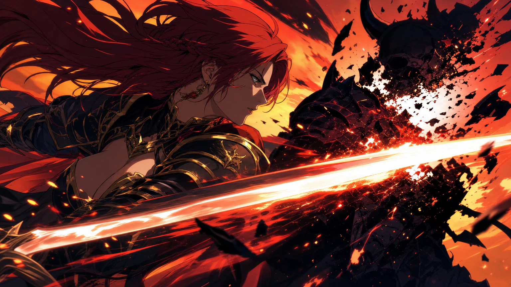

**Grok Image 2 — reviewed result**

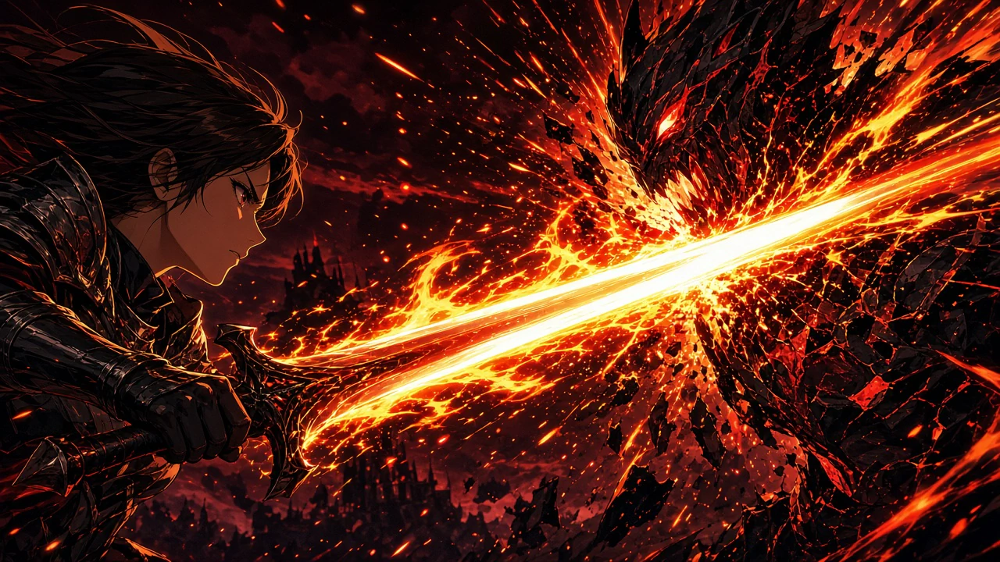
<!-- END DIRECT MODEL PAIR -->

| Registered visible style marker | GPT Image 2 | Grok Image 2 |
|---|:---:|:---:|
| Single precise attack-impact instant | YES | YES |
| Hard cel shadows and white-hot effect shapes | YES | YES |
| Profile close-up with readable enemy silhouette | YES | YES |
| Animation smears and simplified background planes | YES | YES |

**GPT Image 2 verdict: YES.** One exact slash-impact instant, hard cel shadows, a white-hot blade shape, close profile attacker, readable armored enemy, fragmented smears, and compressed background planes read as a full-frame S3 climax.

**Grok Image 2 verdict: YES.** The profile swordsman, opposing dark silhouette, single white-hot diagonal strike, ember smears, and simplified fiery stage retain expensive hand-drawn ultimate-skill animation grammar.

**Pair outcome: `BOTH`.**

**Comparison:** Both models reproduce the animation-climax surface; GPT resolves the enemy and attack beat more narratively, while Grok abstracts the hit into a stronger single effect shape.

**Evidence:** [`current paired profiles`](evidence/model-pair-profiles.json), [`validated original manifest`](evidence/model-pair-manifest.json), and [`independent category review`](evidence/model-pair-review-mobile.json).

#### `wuthering_waves_resonator_convene`

**Real-hit anchor:** [Wuthering Waves](https://www.kurogames.com/introduction)<br>
**Reference surface:** Limited Resonator convene illustration<br>
**Shared prompt SHA-256:** `a20d3730b04a9e066a66e2e6aaa34ad3c55e1f39b1e2ac2120cfc1eac3c49e50`<br>
**Registered requested aspect:** `16:9`<br>
**Effective output aspects:** GPT Image 2 `16:9`; Grok Image 2 `16:9`<br>
**Model routes:** `openai/gpt-image-2` and `x-ai/grok-imagine-image-2.0`

**Exact provider prompt shared byte-for-byte by both models**

> Create a wide limited-character recruitment illustration for an original post-calamity action RPG. Show a clearly adult male sound researcher, age 28, standing on a flooded concrete platform while drawing a slender frequency blade from a portable acoustic instrument. His coat, hair, and loose cables should drift in opposing currents as if moved by invisible sound waves. Build the backdrop from misty coastal ruins, pale sky, distant black monoliths, water reflections, and concentric waveform rings that distort the environment. Use elegant semi-real anime anatomy, fine cool-gray linework, desaturated blue-green paint, matte technical fabrics, subtle skin rendering, black calligraphic fractures, and a single vivid red frequency accent. Keep the composition spacious, melancholic, and controlled, with technology embedded into organic wave motifs. No interface, text, logo, or existing character.

<!-- BEGIN DIRECT MODEL PAIR -->
**GPT Image 2 — reviewed result**

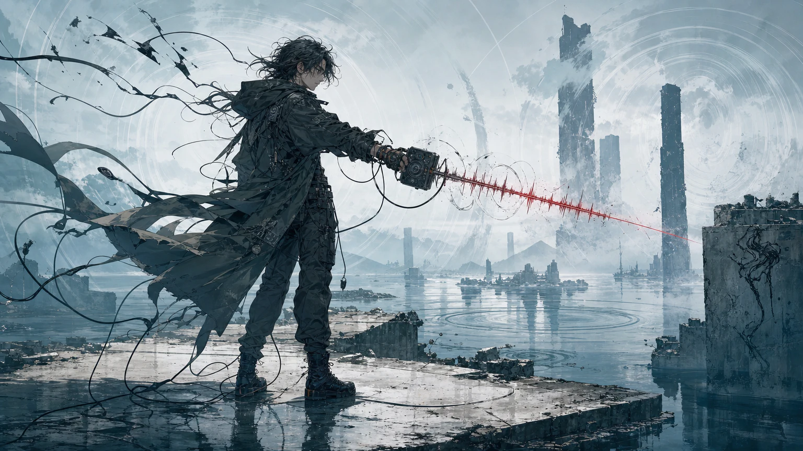

**Grok Image 2 — reviewed result**

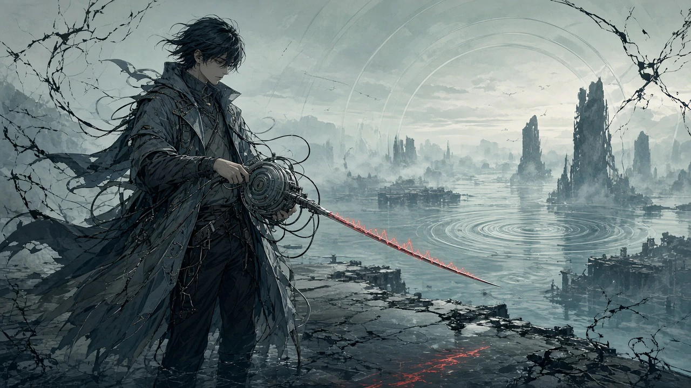
<!-- END DIRECT MODEL PAIR -->

| Registered visible style marker | GPT Image 2 | Grok Image 2 |
|---|:---:|:---:|
| Desaturated coast and large quiet spaces | YES | YES |
| Concentric resonance and waveform structures | YES | YES |
| Fine semi-real anime character rendering | NO | NO |
| One high-chroma accent against gray-green surroundings | YES | YES |

**GPT Image 2 verdict: NO.** The spacious desaturated coast, concentric resonance rings, and single red waveform accent are precise, but the distant charcoal-painted figure reads as post-calamity environment concept art rather than a polished semi-real anime Resonator convene.

**Grok Image 2 verdict: NO.** Grok repeats the quiet gray-green shoreline, resonance circles, and red frequency line, yet the character remains muted and painterly rather than a legible premium anime recruitment focal point.

**Pair outcome: `NEITHER`.**

**Comparison:** Both consistently understand the resonance-themed world palette but prioritize bleak environmental concept painting over the defining character-convene rendering.

**Evidence:** [`current paired profiles`](evidence/model-pair-profiles.json), [`validated original manifest`](evidence/model-pair-manifest.json), and [`independent category review`](evidence/model-pair-review-mobile.json).

#### `snowbreak_premium_outfit_key_art`

**Real-hit anchor:** [Snowbreak: Containment Zone](https://www1.hkexnews.hk/listedco/listconews/sehk/2025/0416/2025041600794.pdf)<br>
**Reference surface:** Premium outfit event key art<br>
**Shared prompt SHA-256:** `1f29a0ce378517d5b4743abfcf23398945c52ef42ad1bf919e1fdf47811498fb`<br>
**Registered requested aspect:** `16:9`<br>
**Effective output aspects:** GPT Image 2 `none — no image returned`; Grok Image 2 `16:9`<br>
**Model routes:** `openai/gpt-image-2` and `x-ai/grok-imagine-image-2.0`

**Exact provider prompt shared byte-for-byte by both models**

> Create a wide premium outfit-event key visual for an original near-future shooter. Feature one clearly adult woman, age 29, seated sideways on a transparent medical-console table in a private orbital clinic. Give her a full, mature figure emphasized by a skin-tight white tactical bodysuit with a deep front cutout, exposed upper thighs, black thigh straps, translucent panels, and visible elastic tension around the breasts, waist, and hips. She looks directly at the viewer while loosely holding a compact precision rifle beside her rather than aiming it. Render glossy synthetic fabric, warm skin, cool glass, condensation, blue diagnostic light, and metallic equipment with high-end semi-real anime polish approaching a luxury 3D render. Use a close, low camera and deliberate sexual presentation while preserving weapon and science-fiction identity. No text, interface, insignia, logo, or existing character.

<!-- BEGIN DIRECT MODEL PAIR -->
**GPT Image 2 — reviewed result**

**No image returned — OpenRouter exhausted its retry owner without image data; the alternate OpenAI image endpoint reported an output-stage sexual moderation block. The registered prompt was not changed.**

**Grok Image 2 — reviewed result**

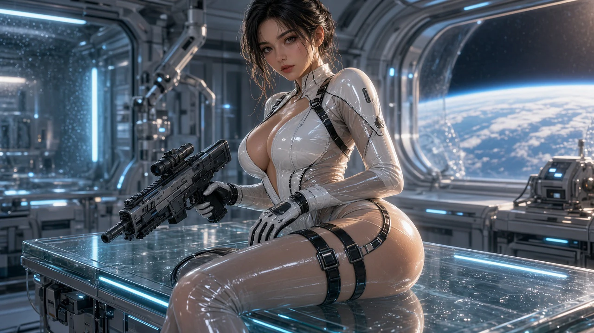
<!-- END DIRECT MODEL PAIR -->

| Registered visible style marker | GPT Image 2 | Grok Image 2 |
|---|:---:|:---:|
| Mature sexualized body presentation with tactical identity | BLOCKED | YES |
| Glossy near-3D materials and softly modeled anime face | BLOCKED | YES |
| Clean luxury science-fiction environment | BLOCKED | YES |
| Weapon subordinate to outfit and intimacy | BLOCKED | YES |

**GPT Image 2 verdict: BLOCKED.** The exact-prompt route produced no image and was independently confirmed as a sexual moderation boundary; there is no visual output to judge.

**Grok Image 2 verdict: YES.** Mature tactical sexuality, glossy near-3D materials, a softly modeled anime face, pristine luxury science-fiction architecture, and a deliberately secondary rifle clearly reproduce premium outfit-event key art.

**Pair outcome: `GROK_ONLY`.**

**Comparison:** Grok reproduces the intimate premium tactical-outfit hierarchy; GPT's exact-prompt route produced no image at the independently confirmed sexual moderation boundary.

**Blocked-output note:** This is provider behavior, not a negative style verdict. The pair outcome treats the unavailable GPT output as false for aggregation while the index and marker table retain `BLOCKED`. The exact prompt was not rewritten. Classification: `output`-stage `sexual` moderation block. See [`failure classification`](evidence/model-pair-failure-classification.json).

**Evidence:** [`current paired profiles`](evidence/model-pair-profiles.json), [`validated original manifest`](evidence/model-pair-manifest.json), and [`independent category review`](evidence/model-pair-review-mobile.json).

#### `honor_of_kings_mythic_skin_splash`

**Real-hit anchor:** [Honor of Kings](https://static.www.tencent.com/uploads/2020/11/12/401d8dc30afe99cf54753beed1c06fa7.pdf)<br>
**Reference surface:** Premium mythic hero-skin launch splash<br>
**Shared prompt SHA-256:** `4be2a1474b84ccb440560e202716ffef5333060d67fb970c76c8454a9712b0e4`<br>
**Registered requested aspect:** `16:9`<br>
**Effective output aspects:** GPT Image 2 `16:9`; Grok Image 2 `16:9`<br>
**Model routes:** `openai/gpt-image-2` and `x-ai/grok-imagine-image-2.0`

**Exact provider prompt shared byte-for-byte by both models**

> Create a wide premium mythic-skin launch illustration for an original mobile arena game. Show a clearly adult male celestial spear general, age 34, descending through storm clouds above a vast jade palace. His torso twists toward the viewer while an impossibly long crescent spear sweeps around him, establishing a circular composition. Dress him in layered white, black, and turquoise robes over sculpted armor with luminous gold filigree, jade ornaments, a crown-like headpiece, and enormous ribbon streamers. Surround him with coiling cloud dragons, shattered roof tiles, lightning, floating seals, and a bright heavenly aperture. Use high-end Chinese fantasy splash painting: realistic material rendering, idealized heroic anatomy, sharp focal detail, deep atmospheric scale, saturated energy light, and painterly peripheral effects. No interface, title, calligraphy, logo, or existing hero.

<!-- BEGIN DIRECT MODEL PAIR -->
**GPT Image 2 — reviewed result**

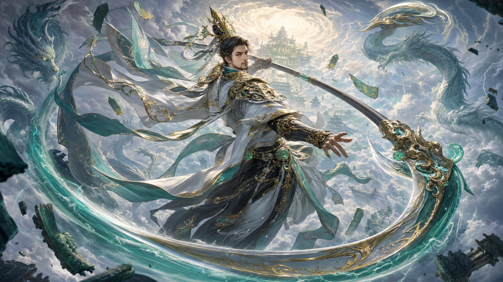

**Grok Image 2 — reviewed result**

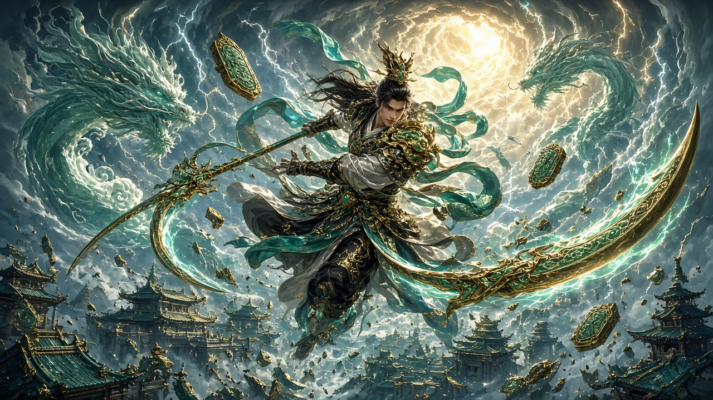
<!-- END DIRECT MODEL PAIR -->

| Registered visible style marker | GPT Image 2 | Grok Image 2 |
|---|:---:|:---:|
| Monumental diagonal hero and oversized curved weapon | YES | YES |
| Chinese-fantasy armor jade ribbons and cloud motifs | YES | YES |
| Polished focal rendering fading into painterly effects | YES | YES |
| Celestial environment communicating skin rarity | YES | YES |

**GPT Image 2 verdict: YES.** A monumental diagonal hero and oversized curved polearm combine jade armor, gold trim, streaming ribbons, cloud dragons, polished focal detail, painterly effects, and celestial scale appropriate to a mythic skin launch.

**Grok Image 2 verdict: YES.** The airborne diagonal hero, huge crescent blade, jade-and-gold Chinese-fantasy armor, ribbon trails, cloud dragons, and luminous heavenly city strongly signal premium mythic rarity.

**Pair outcome: `BOTH`.**

**Comparison:** Both models recognize the top-tier Chinese MOBA skin surface; GPT is more serene and polished, while Grok intensifies action, contrast, and environmental destruction.

**Evidence:** [`current paired profiles`](evidence/model-pair-profiles.json), [`validated original manifest`](evidence/model-pair-manifest.json), and [`independent category review`](evidence/model-pair-review-mobile.json).

#### `onmyoji_sp_shikigami_summon_splash`

**Real-hit anchor:** [Onmyoji](https://ir.netease.com/news-releases/news-release-details/english-version-asian-blockbuster-onmyoji-soft-launches-canada)<br>
**Reference surface:** SP Shikigami summon splash<br>
**Shared prompt SHA-256:** `27332a3c04e4119d60579e3dbb2c9d46704f5c00cd52618245a238c0e15dd511`<br>
**Registered requested aspect:** `16:9`<br>
**Effective output aspects:** GPT Image 2 `16:9`; Grok Image 2 `16:9`<br>
**Model routes:** `openai/gpt-image-2` and `x-ai/grok-imagine-image-2.0`

**Exact provider prompt shared byte-for-byte by both models**

> Create a wide SP-rarity spirit-summon illustration for an original supernatural RPG inspired by classical Japanese court culture. Show a clearly adult male fox spirit, age 30, reclining asymmetrically across a broken lacquer screen while drawing a glowing paper talisman between two fingers. Give him layered ivory and black robes, exposed collarbones, long silver hair, red eye makeup, gold hair ornaments, and nine abstract smoke tails curling through the composition. Surround him with ink-painted moonlight, chrysanthemums, torn paper screens, small spirit flames, black branches, and vermilion seals containing no readable writing. Blend elegant anime facial drawing with ukiyo-e-like flattening, mineral-pigment colors, ink wash, gold-leaf texture, and intricately patterned textiles. Keep the result eerie, sensual, decorative, and unmistakably ceremonial. No interface, logo, title, or existing mythological character design.

<!-- BEGIN DIRECT MODEL PAIR -->
**GPT Image 2 — reviewed result**

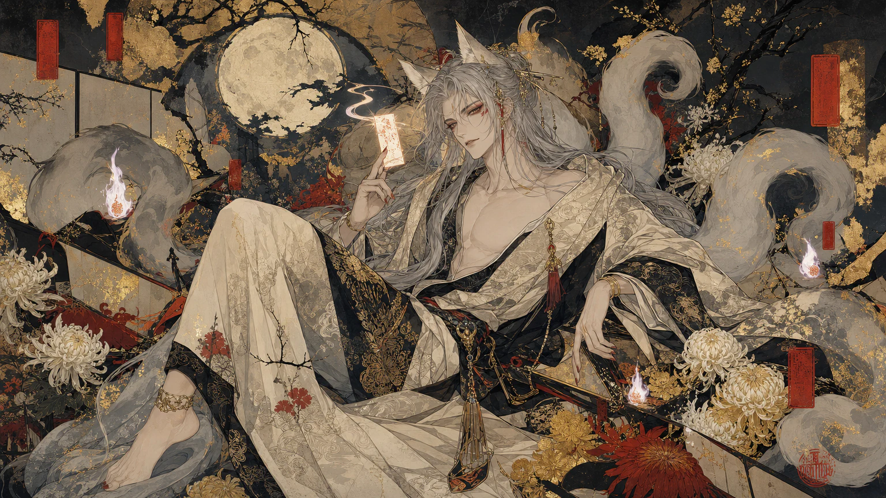

**Grok Image 2 — reviewed result**

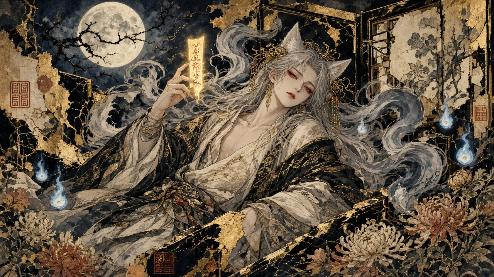
<!-- END DIRECT MODEL PAIR -->

| Registered visible style marker | GPT Image 2 | Grok Image 2 |
|---|:---:|:---:|
| Heian-derived robes screens talismans and flora | YES | YES |
| Flat pattern combined with dimensional anime rendering | YES | YES |
| Ink wash mineral color vermilion and gold leaf | YES | YES |
| Asymmetrical silhouette from hair smoke and fabric | YES | YES |

**GPT Image 2 verdict: YES.** Heian-derived robes, screens, talismans and chrysanthemums combine with a dimensional fox-spirit figure, flat gold pattern, ink wash, mineral color, vermilion, and asymmetric smoke-tail fabric motion.

**Grok Image 2 verdict: YES.** Ceremonial layered robes, screens, glowing talismans, flowers, ink-mineral-gold surface, and a hair-and-smoke-driven asymmetrical silhouette reproduce the SP summon-painting language.

**Pair outcome: `BOTH`.**

**Comparison:** Both are highly specific to the supernatural Heian summon surface; GPT is more spacious and figural, while Grok leans flatter and more densely decorative.

**Evidence:** [`current paired profiles`](evidence/model-pair-profiles.json), [`validated original manifest`](evidence/model-pair-manifest.json), and [`independent category review`](evidence/model-pair-review-mobile.json).

#### `black_desert_class_awakening_key_art`

**Real-hit anchor:** [Black Desert](https://www.pearlabyss.com/ja-JP/Board/Detail?_boardNo=13705)<br>
**Reference surface:** Class-awakening promotional key art<br>
**Shared prompt SHA-256:** `97f88041e4c0860a4bc5dc36ae7b44e4d855922cd2be7e1319b57a941465a3ed`<br>
**Registered requested aspect:** `16:9`<br>
**Effective output aspects:** GPT Image 2 `16:9`; Grok Image 2 `16:9`<br>
**Model routes:** `openai/gpt-image-2` and `x-ai/grok-imagine-image-2.0`

**Exact provider prompt shared byte-for-byte by both models**

> Create a wide class-awakening promotional painting for an original dark-fantasy online RPG. Depict a clearly adult male mercenary, age 42, stepping from a wall of smoke while raising a newly awakened two-handed chain blade. Give him weathered features, powerful realistic anatomy, layered black leather, scarred steel plates, fur, buckles, and a torn crimson cloak. The weapon should dominate one diagonal, with links whipping through sparks and ash toward the viewer. Behind him, suggest a burning fortress, mounted silhouettes, storm clouds, and orange fire diffused through charcoal smoke. Render the face, armor, and weapon in sharply detailed semi-real digital painting, then dissolve the outer composition into rough brushwork, particles, fog, and backlight. The mood is brutal, prestigious, and physically grounded rather than anime-clean. No UI, title, logo, or existing class.

<!-- BEGIN DIRECT MODEL PAIR -->
**GPT Image 2 — reviewed result**

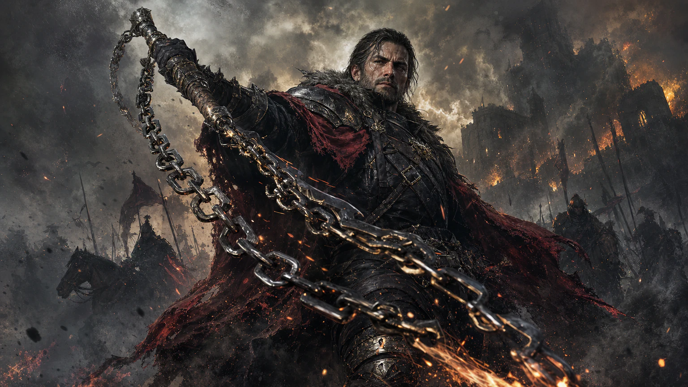

**Grok Image 2 — reviewed result**

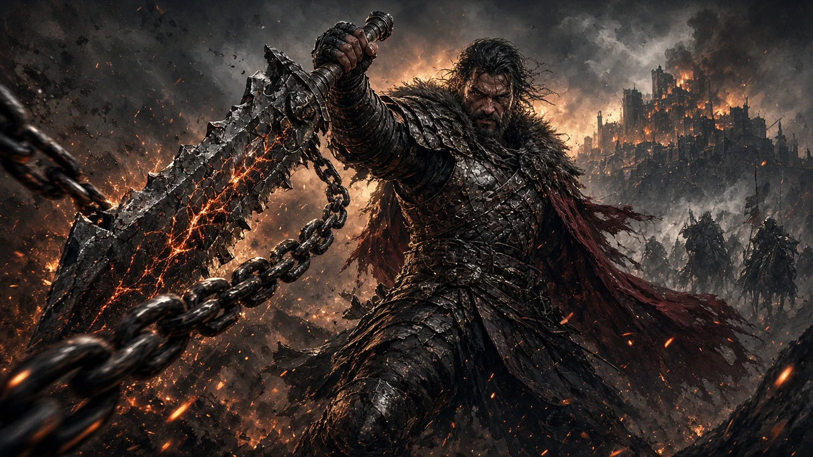
<!-- END DIRECT MODEL PAIR -->

| Registered visible style marker | GPT Image 2 | Grok Image 2 |
|---|:---:|:---:|
| Semi-real adult anatomy and weathered facial structure | YES | YES |
| Rendered leather and metal against loose smoky edges | YES | YES |
| Black steel ember-orange and restrained crimson palette | YES | YES |
| Massive awakened weapon and battlefield scale | YES | YES |

**GPT Image 2 verdict: YES.** Weathered adult realism, rendered black leather and metal, smoky edges, ember orange, restrained crimson, a massive foreground chain weapon, and a burning army-scale battlefield establish class-awakening key art.

**Grok Image 2 verdict: YES.** The mature scarred warrior, hard black plate, loose smoke, ember-crimson palette, enormous chained blade, and distant cavalry preserve the prestige dark-fantasy class-awakening surface.

**Pair outcome: `BOTH`.**

**Comparison:** Both reproduce the awakening-poster language; GPT foregrounds the chain as the weapon identity, while Grok makes the chained blade and battlefield scale more explicit.

**Evidence:** [`current paired profiles`](evidence/model-pair-profiles.json), [`validated original manifest`](evidence/model-pair-manifest.json), and [`independent category review`](evidence/model-pair-review-mobile.json).

### Indie, PC, and console hits

#### `graphic_novel_mythic_underworld_dialogue_portrait`

**Real-hit anchor:** [Hades](https://www.supergiantgames.com/blog/hades-faq/)<br>
**Reference surface:** Full-height dialogue character illustration over a shallow underworld environmental vignette, not isometric gameplay.<br>
**Shared prompt SHA-256:** `ea75df800c32846748d11829c9cce363e7a44dc5c6ffea08b1c4d0238b9018a9`<br>
**Registered requested aspect:** `16:9`<br>
**Effective output aspects:** GPT Image 2 `16:9`; Grok Image 2 `16:9`<br>
**Model routes:** `openai/gpt-image-2` and `x-ai/grok-imagine-image-2.0`

**Exact provider prompt shared byte-for-byte by both models**

> Create an original 16:9 dialogue-scene illustration for a mythic action game. Show an adult underworld magistrate from thighs upward, turned three-quarters toward the viewer, wearing layered black-and-copper ceremonial armor and holding a smoking obsidian tablet. Render the figure with strong variable-width black contours, angular facial planes, hard-edged cel-shadow blocks, selective cross-hatching, and saturated orange rim light against cool violet skin shadows. Behind the character, suggest a cavernous tribunal with red pillars, drifting ash, patterned bronze architecture, and a river of dim blue fire, kept softer and less detailed than the figure. Use a graphic-novel composition with an asymmetrical crop, exaggerated costume silhouette, sharply designed jewelry, and decorative geometric borders integrated into the environment. Preserve readable shapes and rich local color. No logo, interface, caption, existing character, or recognizable franchise symbol.

<!-- BEGIN DIRECT MODEL PAIR -->
**GPT Image 2 — reviewed result**

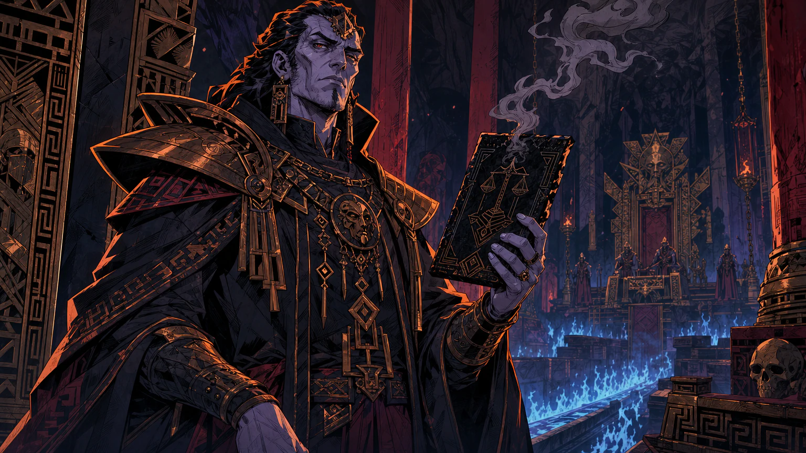

**Grok Image 2 — reviewed result**

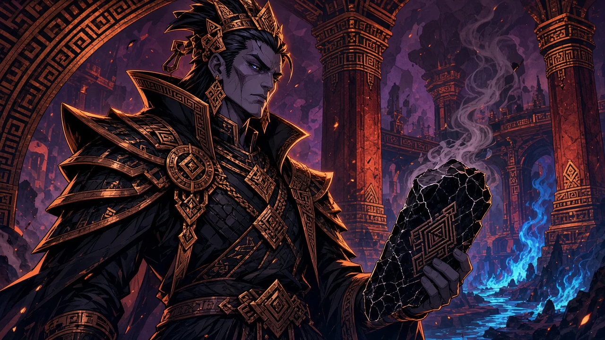
<!-- END DIRECT MODEL PAIR -->

| Registered visible style marker | GPT Image 2 | Grok Image 2 |
|---|:---:|:---:|
| Heavy variable black contours with angular anatomy | YES | YES |
| Cel-shadow planes supplemented by selective hatching | YES | YES |
| Saturated warm rim light against cool local shadows | YES | YES |
| Asymmetrical character crop over a softened mythic vignette | YES | YES |

**GPT Image 2 verdict: YES.** Heavy variable inks, angular anatomy, hatched cel-shadow planes, orange rim light over violet shadows, and an offset magistrate over a softened tribunal reproduce the target dialogue-portrait surface.

**Grok Image 2 verdict: YES.** Bold black contours, carved cel planes with selective texture, warm rim light against cool skin, and the asymmetrical underworld portrait hierarchy clearly preserve the graphic-novel style.

**Pair outcome: `BOTH`.**

**Comparison:** GPT is more densely hatched and environmentally layered; Grok is cleaner and more emblematic, but both reproduce the specific surface.

**Evidence:** [`current paired profiles`](evidence/model-pair-profiles.json), [`validated original manifest`](evidence/model-pair-manifest.json), and [`independent category review`](evidence/model-pair-review-indie.json).

#### `melancholic_insect_gothic_side_scroller`

**Real-hit anchor:** [Hollow Knight](https://www.teamcherry.com.au/blog/the-grimm-troupe-descends)<br>
**Reference surface:** Side-view subterranean exploration gameplay environment with a small player silhouette.<br>
**Shared prompt SHA-256:** `4d86e821db9e111a2a080b3c1ac2cd8b24aa7eaa60dc508be8b31dbc7b34dc04`<br>
**Registered requested aspect:** `16:9`<br>
**Effective output aspects:** GPT Image 2 `16:9`; Grok Image 2 `16:9`<br>
**Model routes:** `openai/gpt-image-2` and `x-ai/grok-imagine-image-2.0`

**Exact provider prompt shared byte-for-byte by both models**

> Create an original 16:9 side-view exploration frame for a quiet insect-fantasy platform game. A tiny masked moth pilgrim stands on a curved stone ledge inside a vast abandoned bell cavern. Give the pilgrim an extremely simple ivory face, a black cloak body, and two leaflike antennae, occupying less than one tenth of the frame. Build the cavern from elegant black silhouettes, rounded organic masonry, hanging roots, broken bells, and distant architectural arches. Separate at least five depth layers with desaturated navy, blue-gray mist, pale cyan backlight, and soft atmospheric bloom. Use clean hand-drawn contours, restrained interior texture, delicate floating dust, and pools of darkness that frame the bright character. The mood should be lonely and storybook-like rather than horrific. Keep the platform route immediately readable. No interface, text, logo, existing character, or recognizable map layout.

<!-- BEGIN DIRECT MODEL PAIR -->
**GPT Image 2 — reviewed result**

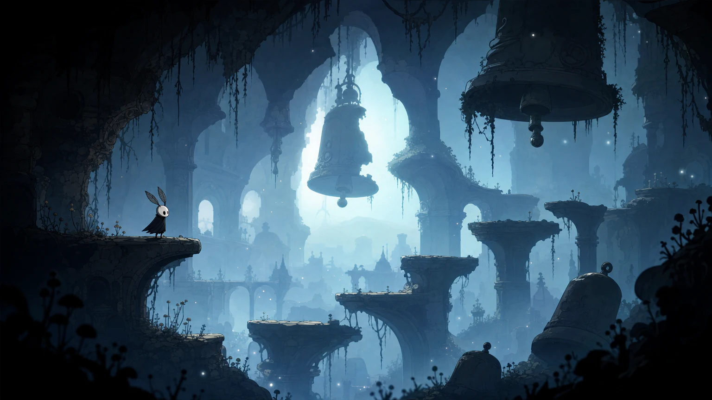

**Grok Image 2 — reviewed result**

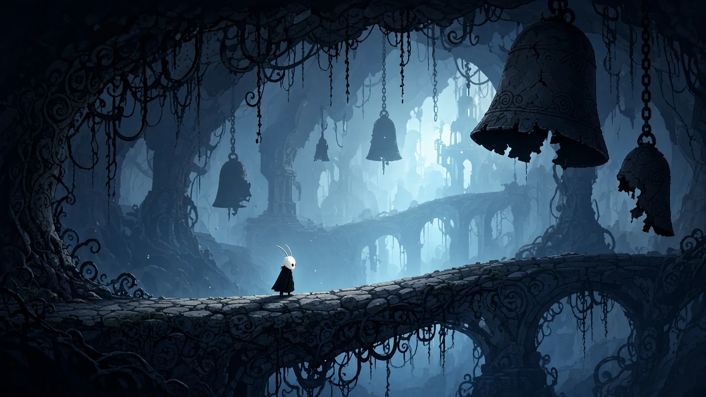
<!-- END DIRECT MODEL PAIR -->

| Registered visible style marker | GPT Image 2 | Grok Image 2 |
|---|:---:|:---:|
| Tiny pale protagonist isolated against dark negative space | YES | YES |
| Five or more blue-black atmospheric depth layers | YES | YES |
| Clean organic silhouettes with restrained internal detail | YES | YES |
| Soft cyan fog and bloom rather than realistic lighting | YES | YES |

**GPT Image 2 verdict: YES.** A minute ivory pilgrim, five-plus blue-black depth layers, clean organic bell silhouettes, cyan fog, and a readable platform route make the insect-gothic exploration style unmistakable.

**Grok Image 2 verdict: YES.** The tiny pale avatar remains isolated within deep navy bell architecture, layered cyan mist, restrained contour detail, and a clearly legible side-view path.

**Pair outcome: `BOTH`.**

**Comparison:** GPT offers more platform variety while Grok uses a stronger dark aperture; both retain the same quiet insect-gothic language.

**Evidence:** [`current paired profiles`](evidence/model-pair-profiles.json), [`validated original manifest`](evidence/model-pair-manifest.json), and [`independent category review`](evidence/model-pair-review-indie.json).

#### `thirties_rubber_hose_boss_cartoon`

**Real-hit anchor:** [Cuphead](https://studiomdhr.com/cuphead-goes-triple-platinum/)<br>
**Reference surface:** Side-view boss-battle gameplay frame with hand-inked cels and watercolor scenery, not modern vector key art.<br>
**Shared prompt SHA-256:** `c4e85152f39b85af3e8e2192692c954273bd9ba032e6daf4b5878656a9b93344`<br>
**Registered requested aspect:** `4:3`<br>
**Effective output aspects:** GPT Image 2 `4:3`; Grok Image 2 `4:3`<br>
**Model routes:** `openai/gpt-image-2` and `x-ai/grok-imagine-image-2.0`

**Exact provider prompt shared byte-for-byte by both models**

> Create an original 4:3 boss-battle frame resembling a restored theatrical cartoon produced in the early 1930s. On a vaudeville stage, a small teapot-headed acrobat confronts a gigantic angry pipe-organ whose keys curl like teeth. Draw every figure with black hand-inked outlines, pie-cut eyes, white gloves, rubber-hose limbs, squash-and-stretch curvature, and broad readable expressions. Paint the theater scenery in translucent watercolor washes over warm paper, with muted burgundy curtains, faded mint props, and ochre footlights. Add slight line boil, imperfect color registration, dust, fine film grain, subtle vignette, and gently uneven exposure, while keeping the principal silhouettes crisp enough for gameplay. Use period-appropriate visual rhythm without copying any known character. No modern gradients, glossy vector edges, 3D rendering, interface, logo, or written signage.

<!-- BEGIN DIRECT MODEL PAIR -->
**GPT Image 2 — reviewed result**

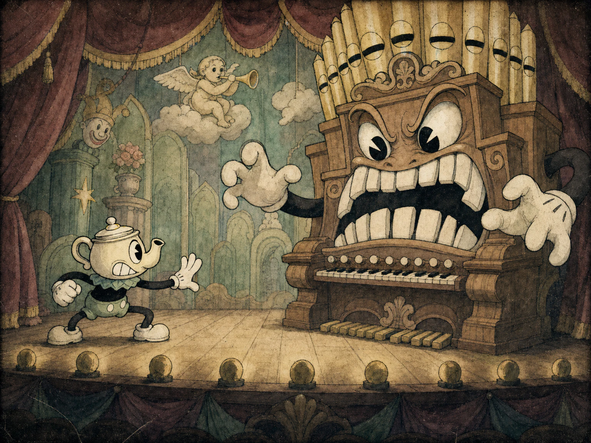

**Grok Image 2 — reviewed result**

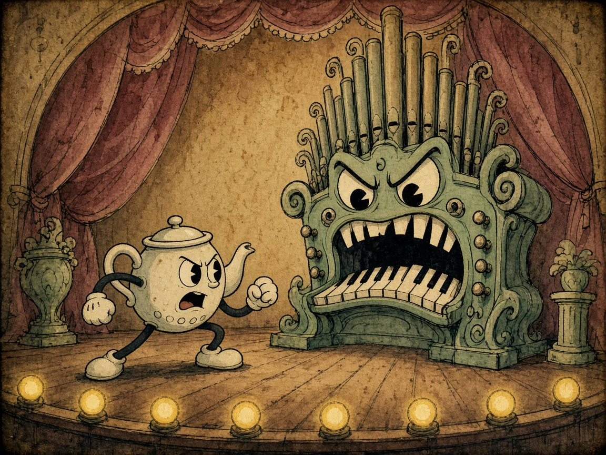
<!-- END DIRECT MODEL PAIR -->

| Registered visible style marker | GPT Image 2 | Grok Image 2 |
|---|:---:|:---:|
| Rubber-hose limbs, pie-cut eyes, white gloves, and elastic expressions | YES | YES |
| Black cel outlines over translucent watercolor scenery | YES | YES |
| Warm limited period palette with imperfect registration | YES | YES |
| Visible film grain, dust, irregular ink, and imperfect color registration | YES | YES |

**GPT Image 2 verdict: YES.** Rubber-hose anatomy, pie-cut eyes, white gloves, inked cels over watercolor scenery, a warm period palette, and visible grain, dust, irregular ink, and registration error strongly establish the 1930s boss-cartoon surface.

**Grok Image 2 verdict: YES.** The teapot fighter and organ boss use elastic limbs, pie eyes, gloves, aged watercolor paint, period color, and the amended static evidence of grain, dust, irregular ink, and imperfect registration.

**Pair outcome: `BOTH`.**

**Comparison:** GPT is more texturally distressed and theatrical; Grok is cleaner but still carries every static rubber-hose and aged-cel marker.

**Evidence:** [`current paired profiles`](evidence/model-pair-profiles.json), [`validated original manifest`](evidence/model-pair-manifest.json), and [`independent category review`](evidence/model-pair-review-indie.json).

**Review-marker amendment:** The registered prompt was not changed. Static generated images can establish grain, dust, irregular ink, and imperfect color registration, but they cannot establish temporal line boil or exposure variation across animation frames. See the [`marker amendment`](evidence/model-pair-review-marker-amendments.json).

#### `luminous_painterly_spirit_forest_side_scroller`

**Real-hit anchor:** [Ori](https://news.xbox.com/en-us/2023/12/07/no-rest-for-wicked-moon-studios-ori-game-awards/)<br>
**Reference surface:** Side-view environmental traversal gameplay frame dominated by layered bioluminescent light and vegetation.<br>
**Shared prompt SHA-256:** `94fdf28b4af10465912ec1bfc08bf04361f4a241d9c04a28ed53c18b8d1b1ac9`<br>
**Registered requested aspect:** `16:9`<br>
**Effective output aspects:** GPT Image 2 `16:9`; Grok Image 2 `16:9`<br>
**Model routes:** `openai/gpt-image-2` and `x-ai/grok-imagine-image-2.0`

**Exact provider prompt shared byte-for-byte by both models**

> Create an original 16:9 side-view fantasy-platforming scene in a vast bioluminescent forest. A small foxlike spirit made of soft white-blue light leaps between moss-covered roots above a dark reflecting pool. Surround it with enormous curved tree trunks, translucent leaves, luminous fungi, hanging seed pods, drifting motes, and a distant waterfall. Render the environment as richly layered digital painting rather than outlined cartoon art: near foliage nearly black and sharply silhouetted, middle layers saturated in turquoise and violet, and far layers softened into luminous mist. Let light bloom around the spirit, fungi, and water while retaining a clearly readable path of platforms. Use flowing organic shapes, jewel-like color, fine natural texture, and dramatic scale contrast. Avoid photorealism, hard comic outlines, interface elements, text, logos, and any existing creature design or recognizable location.

<!-- BEGIN DIRECT MODEL PAIR -->
**GPT Image 2 — reviewed result**

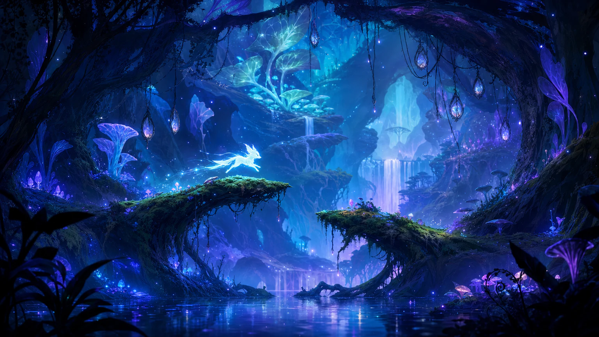

**Grok Image 2 — reviewed result**

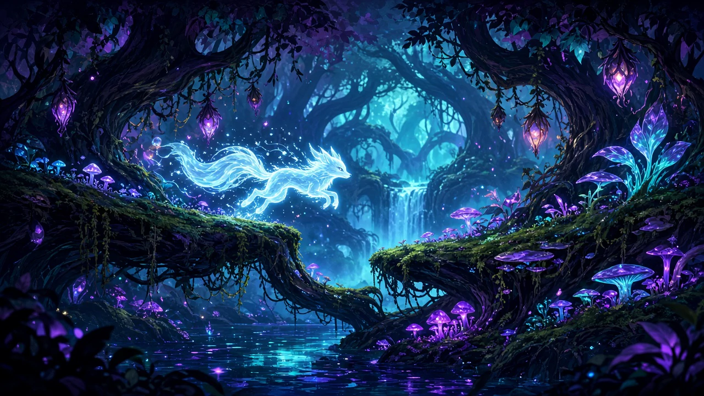
<!-- END DIRECT MODEL PAIR -->

| Registered visible style marker | GPT Image 2 | Grok Image 2 |
|---|:---:|:---:|
| Small white luminous protagonist with a strong bloom halo | YES | YES |
| Near-black foreground framing saturated cyan-violet depth | YES | YES |
| Painterly outline-free organic vegetation | YES | YES |
| Extreme scale contrast with a readable side-view route | YES | YES |

**GPT Image 2 verdict: YES.** A small blooming white spirit crosses readable roots framed by near-black foliage, saturated cyan-violet depth, outline-free painterly vegetation, and monumental forest scale.

**Grok Image 2 verdict: YES.** The luminous foxlike spirit, dark framing trunks, jewel-toned mist layers, painterly organic growth, and legible side-view gap consistently reproduce the spirit-forest surface.

**Pair outcome: `BOTH`.**

**Comparison:** GPT emphasizes environmental depth and route complexity; Grok enlarges the spirit slightly but preserves the same light, scale, and painterly grammar.

**Evidence:** [`current paired profiles`](evidence/model-pair-profiles.json), [`validated original manifest`](evidence/model-pair-manifest.json), and [`independent category review`](evidence/model-pair-review-indie.json).

#### `high_density_pixel_roguelite_combat`

**Real-hit anchor:** [Dead Cells](https://motiontwin.com/)<br>
**Reference surface:** Side-view pixel-art action gameplay frame captured at the instant of a melee hit.<br>
**Shared prompt SHA-256:** `4b7f514264ea157c7f2d5cc885f4bf50f753e9aa1128c5f54f006cbc907a4f4e`<br>
**Registered requested aspect:** `16:9`<br>
**Effective output aspects:** GPT Image 2 `16:9`; Grok Image 2 `16:9`<br>
**Model routes:** `openai/gpt-image-2` and `x-ai/grok-imagine-image-2.0`

**Exact provider prompt shared byte-for-byte by both models**

> Create an original 16:9 side-view pixel-art combat frame in a ruined cliffside prison. An athletic faceless alchemist in a torn cobalt coat swings a glowing orange chain-blade through two fungal guards while rolling sparks and fragments cross the screen. Use crisp, deliberately pixelated sprites with compact proportions, strong silhouette poses, limited per-material color ramps, and single-pixel highlights. Build the environment from dense stone blocks, iron cages, damp vegetation, broken beams, and a distant storm coast, with painterly pixel clusters rather than tiled repetition. Contrast cool blue-green ruins against hot orange and magenta attack effects. Add long directional smear frames, impact arcs, particles, and selective bloom without smoothing away the pixels. Preserve a readable horizontal combat lane and layered background depth. No interface, text, logo, existing hero, recognizable weapon, or copied level layout.

<!-- BEGIN DIRECT MODEL PAIR -->
**GPT Image 2 — reviewed result**

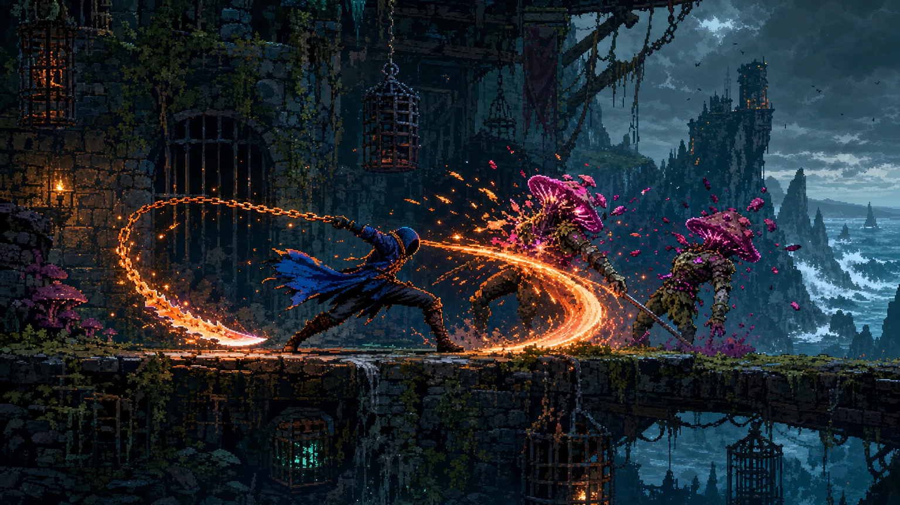

**Grok Image 2 — reviewed result**

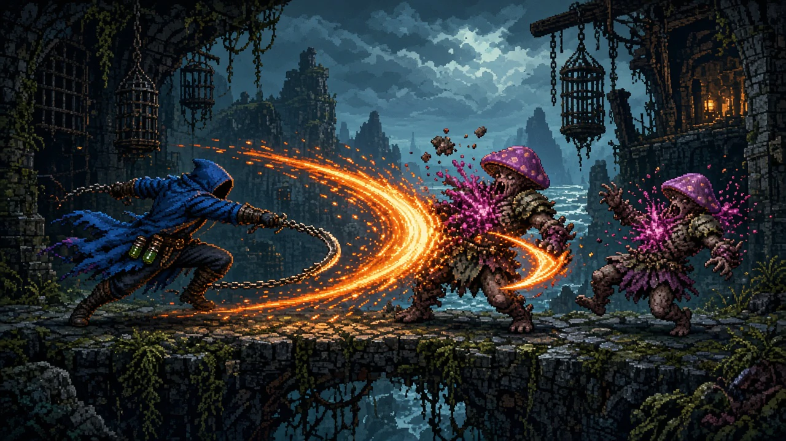
<!-- END DIRECT MODEL PAIR -->

| Registered visible style marker | GPT Image 2 | Grok Image 2 |
|---|:---:|:---:|
| Crisp pixel clusters and limited material color ramps | YES | YES |
| Cool ruined environment punctured by hot neon impacts | YES | YES |
| Compact faceless fighter silhouette with exaggerated smear arcs | YES | YES |
| Dense painterly pixel background with a readable combat lane | YES | YES |

**GPT Image 2 verdict: YES.** Crisp clustered pixels, cool prison ruins split by orange-magenta impacts, a compact faceless fighter with long smear arcs, and a dense but readable combat lane reproduce premium roguelite pixel combat.

**Grok Image 2 verdict: YES.** Deliberate pixel ramps, blue-gray ruins, hot chain-blade arcs, the hooded silhouette, and a clearly staged horizontal hit moment retain all four high-density pixel markers.

**Pair outcome: `BOTH`.**

**Comparison:** GPT packs in more distant prison texture; Grok stages larger sprites and a cleaner hit read, with equivalent style control.

**Evidence:** [`current paired profiles`](evidence/model-pair-profiles.json), [`validated original manifest`](evidence/model-pair-manifest.json), and [`independent category review`](evidence/model-pair-review-indie.json).

#### `cozy_sixteen_bit_farm_tilemap`

**Real-hit anchor:** [Stardew Valley](https://www.stardewvalley.net/press/)<br>
**Reference surface:** Top-down farm gameplay tilemap, not a character portrait or promotional painting.<br>
**Shared prompt SHA-256:** `785acdb2f277c76ea16d9ab90e17798a1e7cd5f41597024994e9f2c1321c21cc`<br>
**Registered requested aspect:** `4:3`<br>
**Effective output aspects:** GPT Image 2 `4:3`; Grok Image 2 `4:3`<br>
**Model routes:** `openai/gpt-image-2` and `x-ai/grok-imagine-image-2.0`

**Exact provider prompt shared byte-for-byte by both models**

> Create an original 4:3 top-down farming-RPG gameplay scene in crisp 16-bit-inspired pixel art. Show a compact hillside farm on an early autumn afternoon: an adult farmer in a teal cap waters rows of red peppers, pumpkins, and pale-blue flowers beside a small timber cottage. Include a square pond, fruit trees, a chicken fence, a stone path, stacked hay, a weathered mailbox with no writing, and a wooded boundary. Construct the scene from a consistent tile grid with compact character and animal sprites, clean one-pixel outlines, simple two-step shadows, and small repeated texture clusters. Use a warm, cheerful palette of russet soil, golden grass, green foliage, and blue water. Keep every interactive object immediately legible from above. No perspective rendering, painted brushwork, interface, text, logo, or recognizable farm layout.

<!-- BEGIN DIRECT MODEL PAIR -->
**GPT Image 2 — reviewed result**

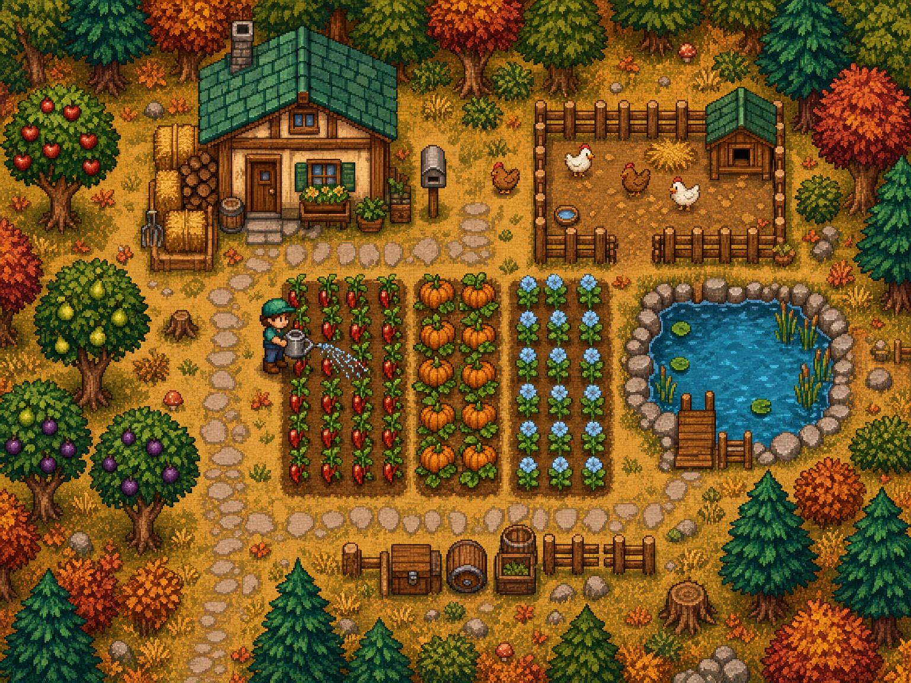

**Grok Image 2 — reviewed result**

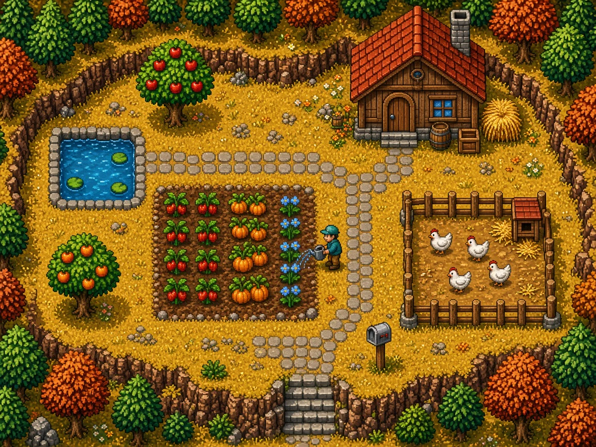
<!-- END DIRECT MODEL PAIR -->

| Registered visible style marker | GPT Image 2 | Grok Image 2 |
|---|:---:|:---:|
| Consistent top-down tile grid and compact pixel sprites | YES | YES |
| Clean one-pixel edges with simple stepped shadows | YES | YES |
| Warm seasonal palette with clearly separated crop rows | YES | YES |
| High gameplay readability across many small interactive props | YES | YES |

**GPT Image 2 verdict: YES.** The consistent top-down grid, compact pixel farmer and animals, clean stepped edges, warm autumn palette, separated crop rows, and readable props establish the cozy farm tilemap.

**Grok Image 2 verdict: YES.** A coherent tiled farm, compact sprites, crisp pixel boundaries with simple shadows, golden seasonal color, and strongly separated interactive zones reproduce the intended gameplay surface.

**Pair outcome: `BOTH`.**

**Comparison:** GPT is denser and more textural; Grok is simpler and more grid-explicit, but both read immediately as the same farm-RPG style.

**Evidence:** [`current paired profiles`](evidence/model-pair-profiles.json), [`validated original manifest`](evidence/model-pair-manifest.json), and [`independent category review`](evidence/model-pair-review-indie.json).

#### `rough_gothic_sixteen_bit_swarm_survival`

**Real-hit anchor:** [Vampire Survivors](https://www.bafta.org/media-centre/press-releases/bafta-announces-the-winners-of-the-2023-bafta-games-awards/)<br>
**Reference surface:** Top-down late-run combat field crowded with enemies and overlapping automatic effects.<br>
**Shared prompt SHA-256:** `267b0974734e22b0b08d8d824994ca70f692373fa782125f933be21ea61b38c4`<br>
**Registered requested aspect:** `16:9`<br>
**Effective output aspects:** GPT Image 2 `16:9`; Grok Image 2 `16:9`<br>
**Model routes:** `openai/gpt-image-2` and `x-ai/grok-imagine-image-2.0`

**Exact provider prompt shared byte-for-byte by both models**

> Create an original 16:9 top-down survival-combat frame using deliberately rough, arcade-like 16-bit pixel art. Place a tiny armored astrologer at the center of a dark ruined plaza while hundreds of compact skeleton, bat, and slime sprites press inward from every edge. Surround the hero with overlapping automatic attacks: rotating silver blades, a pulsing emerald ring, diagonal lightning chains, falling amber meteors, and dense jewel-like experience shards. Keep the ground nearly flat and dark, patterned only with sparse cracked tiles and dead weeds, so the moving sprite field dominates. Use limited sprite animation cues, chunky outlines, repeated enemy variations, saturated spell colors, and controlled visual overload. The image should feel inexpensive in individual assets but spectacular through accumulation. No perspective camera, smooth painting, readable interface, numbers, text, logo, or existing character design.

<!-- BEGIN DIRECT MODEL PAIR -->
**GPT Image 2 — reviewed result**

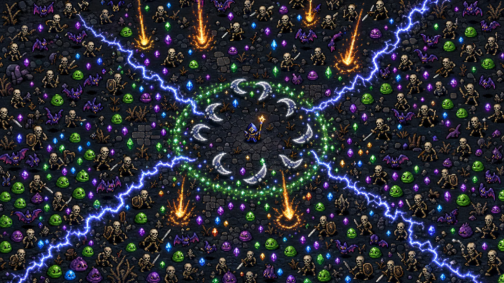

**Grok Image 2 — reviewed result**

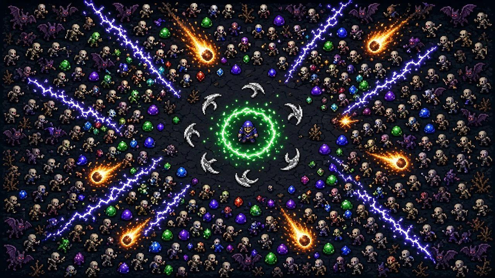
<!-- END DIRECT MODEL PAIR -->

| Registered visible style marker | GPT Image 2 | Grok Image 2 |
|---|:---:|:---:|
| Tiny central hero surrounded by an edge-to-edge enemy swarm | YES | YES |
| Deliberately coarse repeated sixteen-bit sprite vocabulary | YES | YES |
| Overlapping radial and rotating spell geometry | YES | YES |
| Flat dark ground supporting saturated jewel-colored effects | YES | YES |

**GPT Image 2 verdict: YES.** A tiny centered hero is engulfed edge to edge by coarse repeated sprites, rotating blades, spell rings, lightning, meteors, and jewel effects over a flat dark plaza.

**Grok Image 2 verdict: YES.** The compact hero, enormous repeated enemy field, layered radial and diagonal spell geometry, coarse arcade pixels, and dark supporting ground exactly reproduce swarm-survival overload.

**Pair outcome: `BOTH`.**

**Comparison:** GPT is more chaotic and shard-dense; Grok leaves a cleaner central safety ring, while both strongly control the same accumulation-driven style.

**Evidence:** [`current paired profiles`](evidence/model-pair-profiles.json), [`validated original manifest`](evidence/model-pair-manifest.json), and [`independent category review`](evidence/model-pair-review-indie.json).

#### `hd_two_d_fantasy_town_diorama`

**Real-hit anchor:** [Octopath Traveler](https://www.square-enix-games.com/en_US/home/octopath-traveler-ii-release-24-february-2023-switch-steam-ps5-ps4)<br>
**Reference surface:** Oblique exploration scene combining crisp pixel sprites with physically lit modeled scenery.<br>
**Shared prompt SHA-256:** `f2c40124bb31cd4bd81ba736f2d172abd0904f88cbe91316b64c085d5d3674e5`<br>
**Registered requested aspect:** `16:9`<br>
**Effective output aspects:** GPT Image 2 `16:9`; Grok Image 2 `16:9`<br>
**Model routes:** `openai/gpt-image-2` and `x-ai/grok-imagine-image-2.0`

**Exact provider prompt shared byte-for-byte by both models**

> Create an original 16:9 fantasy-RPG exploration frame presented as a miniature theatrical diorama. Two crisp pixel-art travelers cross a stone bridge into a snow-covered clockmaker town at blue hour. Render the characters, market signs without lettering, birds, and small props as sharply stepped pixel sprites, but construct the bridge, timber houses, clock tower, snowbanks, and canal as richly textured three-dimensional scenery. Use an oblique side view, strong foreground occlusion, shallow depth of field, miniature-scale bokeh, volumetric lamplight, soft bloom, and tiny glittering snow particles. Let warm amber windows contrast with cobalt evening shadows. Maintain an obvious separation between flat pixel characters and physically lit environmental geometry; do not convert everything into smooth illustration. No interface, readable text, logo, existing character, or recognizable town layout.

<!-- BEGIN DIRECT MODEL PAIR -->
**GPT Image 2 — reviewed result**

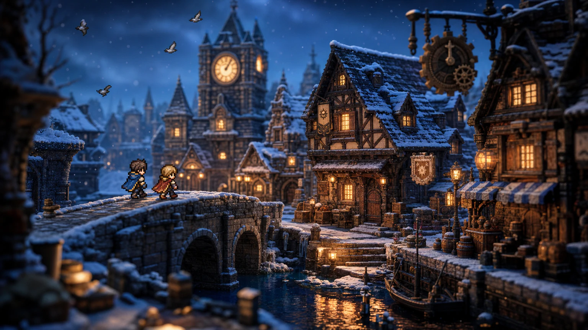

**Grok Image 2 — reviewed result**

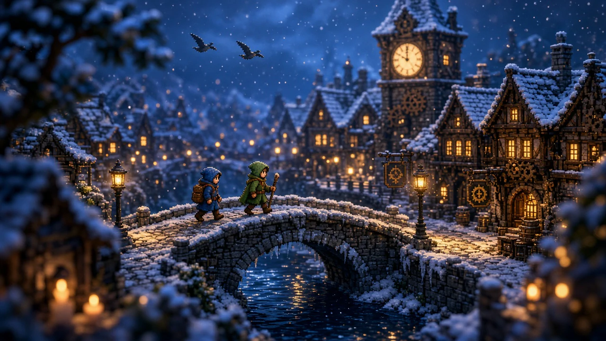
<!-- END DIRECT MODEL PAIR -->

| Registered visible style marker | GPT Image 2 | Grok Image 2 |
|---|:---:|:---:|
| Sharp pixel sprites visibly distinct from modeled scenery | YES | YES |
| Miniature-diorama camera with foreground occlusion | YES | YES |
| Shallow focus, bloom, bokeh, and volumetric lighting | YES | YES |
| Warm practical lights contrasted against cool atmospheric shadows | YES | YES |

**GPT Image 2 verdict: YES.** Sharp pixel travelers remain visibly separate from modeled snowbound scenery, with miniature foreground blur, bokeh, bloom, volumetric lamps, and warm windows against cobalt shadows.

**Grok Image 2 verdict: YES.** Chunky pixel travelers cross a physically lit diorama bridge framed by shallow focus, falling snow, amber lamps, blue-hour depth, and strong foreground occlusion.

**Pair outcome: `BOTH`.**

**Comparison:** GPT separates flat sprites more sharply; Grok integrates them slightly into the miniature lighting, yet both unmistakably reproduce the HD-2D diorama surface.

**Evidence:** [`current paired profiles`](evidence/model-pair-profiles.json), [`validated original manifest`](evidence/model-pair-manifest.json), and [`independent category review`](evidence/model-pair-review-indie.json).

#### `modern_high_detail_sixteen_bit_jrpg_battle`

**Real-hit anchor:** [Sea of Stars](https://sabotagestudio.com/press-release/sea-of-stars-gains-a-constellation-of-new-features-in-free-dawn-of-equinox-update/)<br>
**Reference surface:** Fixed-camera turn-based battle frame with fully pixel-rendered characters and environment.<br>
**Shared prompt SHA-256:** `3df9a9c3d43c71356c60d1cc95f37b45b93bcf01eb0aacb61adca6ccdecc021d`<br>
**Registered requested aspect:** `16:9`<br>
**Effective output aspects:** GPT Image 2 `16:9`; Grok Image 2 `16:9`<br>
**Model routes:** `openai/gpt-image-2` and `x-ai/grok-imagine-image-2.0`

**Exact provider prompt shared byte-for-byte by both models**

> Create an original 16:9 turn-based fantasy-RPG battle frame in polished, high-detail 16-bit-inspired pixel art. Three compact adventurer sprites face a giant moss-backed river crab on a circular tidal platform beneath a moonlit waterfall. Render every element—including characters, water, cliffs, plants, clouds, and spell effects—as deliberate pixel clusters with no smooth 3D geometry. Use generous sprite animation poses, expressive silhouettes, rich multi-step color ramps, sparkling reflected moonlight, and finely tiled environmental detail. A crescent-shaped turquoise spell should illuminate nearby surfaces while warm lanterns mark the party side. Compose the battlefield with a slightly elevated fixed camera and clear opposing formations. The result should feel like premium modern pixel craft rather than a literal low-resolution screenshot. No interface, text, logo, existing monster, or recognizable party design.

<!-- BEGIN DIRECT MODEL PAIR -->
**GPT Image 2 — reviewed result**

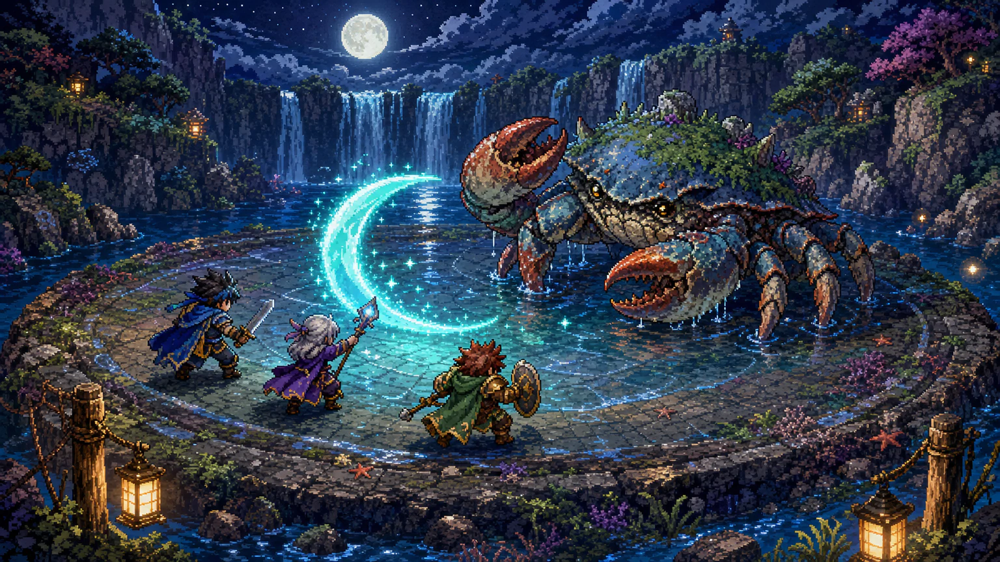

**Grok Image 2 — reviewed result**

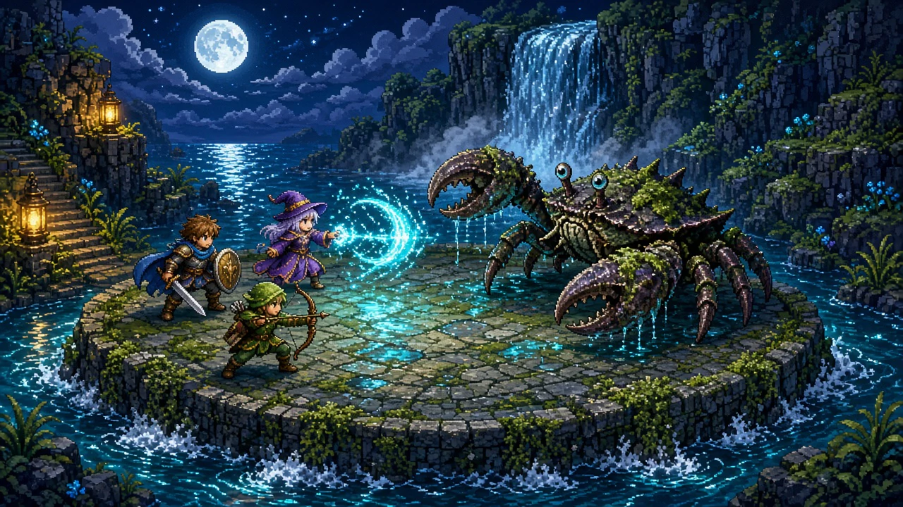
<!-- END DIRECT MODEL PAIR -->

| Registered visible style marker | GPT Image 2 | Grok Image 2 |
|---|:---:|:---:|
| Characters and scenery share carefully clustered pixel treatment | YES | YES |
| Bright saturated natural environment with multi-step color ramps | YES | YES |
| Fixed elevated battle stage with clearly opposed formations | YES | YES |
| Celestial spell lighting colors nearby pixel surfaces | YES | YES |

**GPT Image 2 verdict: YES.** Characters, crab, water, cliffs, and moonlight share disciplined pixel clustering, rich color ramps, fixed opposed formations, and turquoise spell light that colors nearby surfaces.

**Grok Image 2 verdict: YES.** The fully pixel-rendered tidal arena, saturated multi-step ramps, three-against-one formation, and locally illuminating crescent spell clearly reproduce premium modern JRPG pixel craft.

**Pair outcome: `BOTH`.**

**Comparison:** GPT is denser and more spectacular; Grok is cleaner and more screenshot-like, with all four battle-surface markers intact.

**Evidence:** [`current paired profiles`](evidence/model-pair-profiles.json), [`validated original manifest`](evidence/model-pair-manifest.json), and [`independent category review`](evidence/model-pair-review-indie.json).

#### `baroque_penitential_pixel_horror`

**Real-hit anchor:** [Blasphemous](https://www.team17.com/news/blasphemous-one-million-players)<br>
**Reference surface:** Side-scrolling combat frame inside an Iberian ecclesiastical ruin.<br>
**Shared prompt SHA-256:** `810d275f30a2d41e90ea203bf206fc41b81051c856b61722ddfa63c4421fc99a`<br>
**Registered requested aspect:** `16:9`<br>
**Effective output aspects:** GPT Image 2 `16:9`; Grok Image 2 `16:9`<br>
**Model routes:** `openai/gpt-image-2` and `x-ai/grok-imagine-image-2.0`

**Exact provider prompt shared byte-for-byte by both models**

> Create an original 16:9 side-scrolling pixel-art combat scene steeped in Iberian baroque religious horror. An adult flagellant knight wearing a tall bronze reliquary helm confronts a many-armed wax saint inside a ruined processional chapel. Render elaborate cracked tilework, twisted silver votives, heavy embroidered banners, candle racks, bone reliquaries, and distant bell arches with dense hand-placed pixel clusters. Use a restrained palette of umber stone, tarnished gold, dried crimson, corpse ivory, and deep black, interrupted by a single cold shaft of light. Give figures solemn, weighty silhouettes and anatomically readable attack poses; blood may appear as stylized rust-red pixel sprays rather than glossy realism. Maintain a strict side-view platform plane and oppressive vertical architecture. No interface, text, logo, existing iconography, copied enemy, or recognizable protagonist.

<!-- BEGIN DIRECT MODEL PAIR -->
**GPT Image 2 — reviewed result**

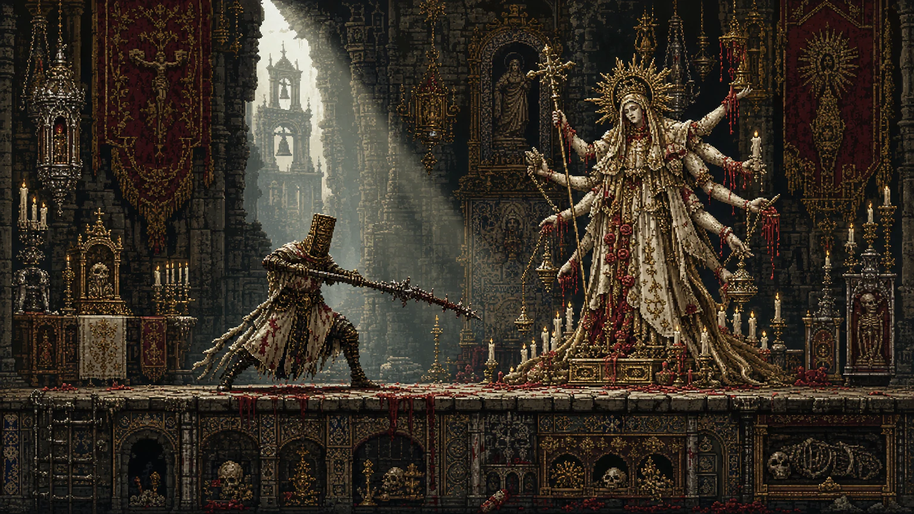

**Grok Image 2 — reviewed result**

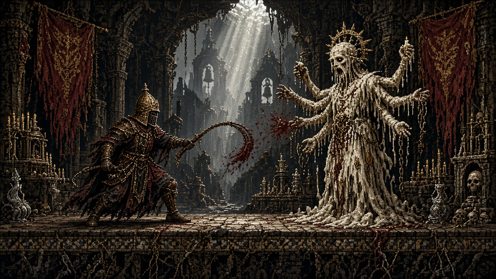
<!-- END DIRECT MODEL PAIR -->

| Registered visible style marker | GPT Image 2 | Grok Image 2 |
|---|:---:|:---:|
| Dense baroque ornament rendered as hand-placed pixel clusters | YES | YES |
| Restricted umber, tarnished gold, ivory, and dried-crimson palette | YES | YES |
| Solemn side-view silhouettes beneath oppressive vertical architecture | YES | YES |
| Religious-horror imagery expressed through material relics | YES | YES |

**GPT Image 2 verdict: YES.** Hand-clustered baroque relic detail, umber-gold-ivory-crimson restraint, solemn side-view silhouettes, oppressive chapel height, and material religious horror reproduce the target style.

**Grok Image 2 verdict: YES.** Dense pixel ornament, tarnished ecclesiastical materials, a strict side-view duel, towering ruined arches, and wax-and-reliquary horror retain every penitential marker.

**Pair outcome: `BOTH`.**

**Comparison:** GPT is more elaborate and processional; Grok is more combat-focused and austere, while both are specific rather than generic gothic pixel art.

**Evidence:** [`current paired profiles`](evidence/model-pair-profiles.json), [`validated original manifest`](evidence/model-pair-manifest.json), and [`independent category review`](evidence/model-pair-review-indie.json).

#### `cute_occult_woodland_settlement`

**Real-hit anchor:** [Cult of the Lamb](https://investors.devolverdigital.com/files/downloads-and-publications/2026/devo-fy25-investor-presentation.pdf)<br>
**Reference surface:** Isometric base-management ritual scene, not flat promotional mascot art.<br>
**Shared prompt SHA-256:** `175224a0bbd9440a97c4a3f07f0400337211a1ef72080b3aa7f90f871cd95afc`<br>
**Registered requested aspect:** `16:9`<br>
**Effective output aspects:** GPT Image 2 `16:9`; Grok Image 2 `16:9`<br>
**Model routes:** `openai/gpt-image-2` and `x-ai/grok-imagine-image-2.0`

**Exact provider prompt shared byte-for-byte by both models**

> Create an original 16:9 isometric settlement-management scene combining adorable woodland characters with cheerful occult imagery. At the center, a small rabbit abbess in a crimson hood conducts a moonlit harvest ritual while round-bodied foxes, frogs, raccoons, and deer dance around a painted stone circle. Surround them with tiny wooden shelters, vegetable plots, a cooking fire, devotional statues, hanging pennants without symbols, and black pine trees. Draw everything with thick, slightly irregular black outlines, compact chibi proportions, flat saturated colors, minimal cel shading, and paper-cutout readability. Use a limited dominant palette of scarlet, charcoal, cream, and moss green, with pale cyan moonlight. The mood should be mischievous and inviting despite skull-shaped decorations and candles. Preserve a clear isometric ground grid. No interface, text, logo, existing mascot, crown, or recognizable doctrine symbol.

<!-- BEGIN DIRECT MODEL PAIR -->
**GPT Image 2 — reviewed result**

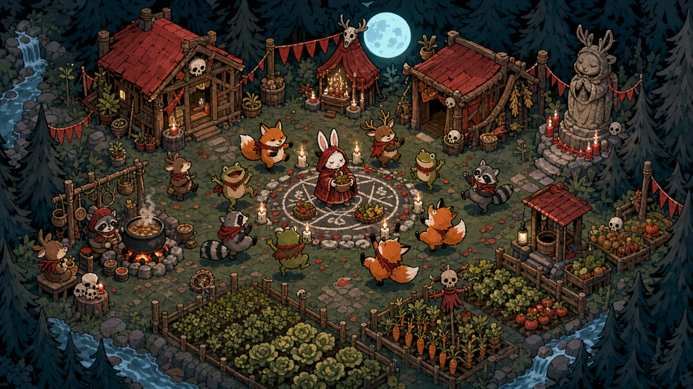

**Grok Image 2 — reviewed result**

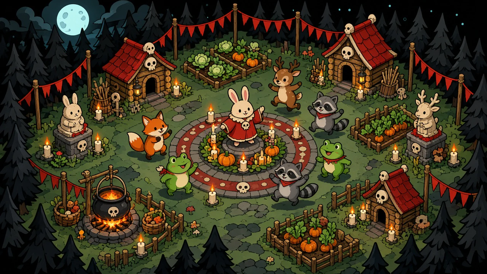
<!-- END DIRECT MODEL PAIR -->

| Registered visible style marker | GPT Image 2 | Grok Image 2 |
|---|:---:|:---:|
| Thick irregular black outlines around compact chibi woodland figures | YES | YES |
| Isometric base layout with individually readable structures | YES | YES |
| Cute expressions juxtaposed directly with occult props | YES | YES |
| Dominant scarlet-charcoal-cream palette with minimal cel shading | YES | YES |

**GPT Image 2 verdict: YES.** Irregular dark outlines, compact chibi animals, a readable isometric village, direct cute-occult juxtaposition, and the scarlet-charcoal-cream-moss palette reproduce the settlement-management style.

**Grok Image 2 verdict: YES.** Thick outlined woodland figures, an explicit isometric base grid, cheerful ritual props, minimal cel shading, and the restricted red-black-cream-green palette preserve the cute occult surface rather than drifting to generic mascot art.

**Pair outcome: `BOTH`.**

**Comparison:** GPT uses more irregular storybook texture; Grok is cleaner and flatter, but its ritual-base composition and palette remain specifically controlled.

**Evidence:** [`current paired profiles`](evidence/model-pair-profiles.json), [`validated original manifest`](evidence/model-pair-manifest.json), and [`independent category review`](evidence/model-pair-review-indie.json).

#### `scratchy_paper_puppet_wilderness`

**Real-hit anchor:** [Don't Starve](https://forums.kleientertainment.com/forums/topic/147424-game-update-111430/)<br>
**Reference surface:** Angled top-down survival gameplay frame centered on a wilderness camp.<br>
**Shared prompt SHA-256:** `32fc3b5bf38e012b249dce166c577ed6212cbf0afa93465cb23e745e9da9d096`<br>
**Registered requested aspect:** `16:9`<br>
**Effective output aspects:** GPT Image 2 `16:9`; Grok Image 2 `16:9`<br>
**Model routes:** `openai/gpt-image-2` and `x-ai/grok-imagine-image-2.0`

**Exact provider prompt shared byte-for-byte by both models**

> Use case: stylized-concept
> Asset type: clean 2D angled top-down wilderness-survival gameplay frame.
> Primary request: Create an original night camp where a lanky botanist with triangular hair tends a tiny fire while a nervous pack animal and several long-legged shadow birds watch from beyond the light. Surround them with grass marks, thorn bushes, twisted bare trees, scattered stones, traps, and a crooked hand-built science device.
> Style and shape language: macabre digitally inked animation design; thin nervous contour lines; sparse repeated hatching clipped to characters, props, and selected grass marks; oversized heads; spindly limbs; separately readable puppet-like silhouette layers; deliberately imperfect perspective. Use muted olive, charcoal, bone, and dark burgundy, with fresh orange reserved for the campfire.
> Surface finish: contemporary clean game framebuffer. Use a smooth neutral digital ground beneath the drawn vegetation. The puppet construction is shape language only, without physical paper fibers. Texture is object-local only; the image plane remains clean.
> Composition: Keep the camp, character, pack animal, birds, traps, and science device clearly separated at gameplay scale.
> Constraints: no paper or canvas substrate, parchment color, full-frame grain, dust, scratches, stains, foxing, faded print wash, sepia filter, vignette, scanned-page appearance, interface, text, logo, existing survivor, or recognizable creature design.

<!-- BEGIN DIRECT MODEL PAIR -->
**GPT Image 2 — reviewed result**

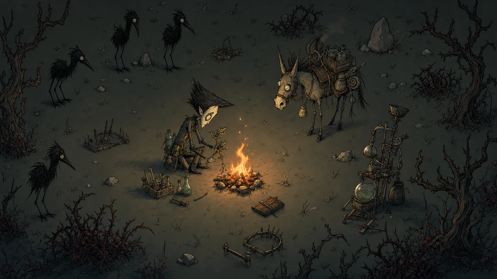

**Grok Image 2 — reviewed result**

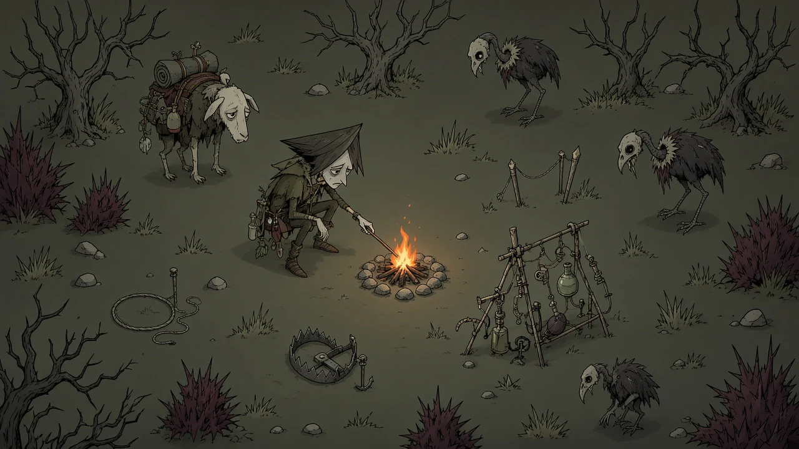
<!-- END DIRECT MODEL PAIR -->

| Registered visible style marker | GPT Image 2 | Grok Image 2 |
|---|:---:|:---:|
| Nervous digital ink contours and sparse repeated hatching clipped to forms | YES | YES |
| Spindly puppet-like anatomy with oversized heads and separated silhouette layers | YES | YES |
| Muted olive-charcoal-bone palette punctuated by one fresh orange fire pool | YES | YES |
| Intentionally uneven perspective on a clean digital ground without global substrate texture | YES | YES |

**GPT Image 2 verdict: YES.** Nervous contours and sparse hatching remain clipped to spindly, large-headed puppet forms on a clean dark digital ground; the muted olive-charcoal-bone palette and fresh orange fire retain the wilderness grammar without an aged-paper overlay.

**Grok Image 2 verdict: YES.** The flatter clean olive ground has no global substrate texture, while scratchy contours, puppet-like anatomy, isolated fire warmth, crooked perspective, and separately readable survival props retain the macabre gameplay surface.

**Pair outcome: `BOTH`.**

**Comparison:** Both remove the previous parchment treatment: GPT retains richer ink detail and night lighting, while Grok provides the cleanest flat game-surface exemplar.

**Surface-finish revision:** The displayed GPT Image 2 and Grok Image 2 files are the accepted clean-digital revision originals. The earlier pair remains historical execution evidence and is not embedded. See the [`revision profiles`](evidence/surface-finish-profiles.json), [`revision execution`](evidence/surface-finish-execution.json), and [`revision review`](evidence/surface-finish-review.json).

**Evidence:** [`current paired profiles`](evidence/model-pair-profiles.json), [`validated original manifest`](evidence/model-pair-manifest.json), and [`independent category review`](evidence/model-pair-review-indie.json).

#### `grim_inked_dungeon_combat_tableau`

**Real-hit anchor:** [Darkest Dungeon](https://www.gamedeveloper.com/business/1-million-copies-and-the-road-ahead)<br>
**Reference surface:** Side-on turn-based combat tableau with an adventuring party left and monsters right.<br>
**Shared prompt SHA-256:** `76e699f8ab333b4af9cd66f460daec8e5643f3e790669685d74f998840f84ec5`<br>
**Registered requested aspect:** `16:9`<br>
**Effective output aspects:** GPT Image 2 `16:9`; Grok Image 2 `16:9`<br>
**Model routes:** `openai/gpt-image-2` and `x-ai/grok-imagine-image-2.0`

**Exact provider prompt shared byte-for-byte by both models**

> Create an original 16:9 side-on turn-based dungeon battle tableau. Four exhausted adult adventurers—a shield bearer, grave physician, torch monk, and crossbow scout—stand in a compressed rank on the left, facing two swollen tunnel parasites on the right. Draw the scene with extremely heavy angular black inks, chipped contour edges, blocky anatomy, carved facial planes, and large areas of crushed shadow. Use a narrow palette of soot black, parchment beige, oxidized green, blood red, and dull gold. Light the characters from one low torch so their faces and equipment emerge in hard graphic wedges while the corridor disappears into darkness. Frame the clash like a grim comic panel with minimal depth and strong opposing silhouettes. No interface, captions, numbers, logo, existing class costume, or recognizable monster design.

<!-- BEGIN DIRECT MODEL PAIR -->
**GPT Image 2 — reviewed result**

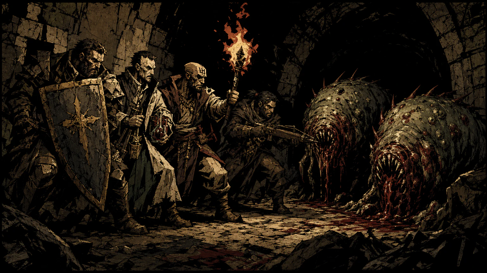

**Grok Image 2 — reviewed result**

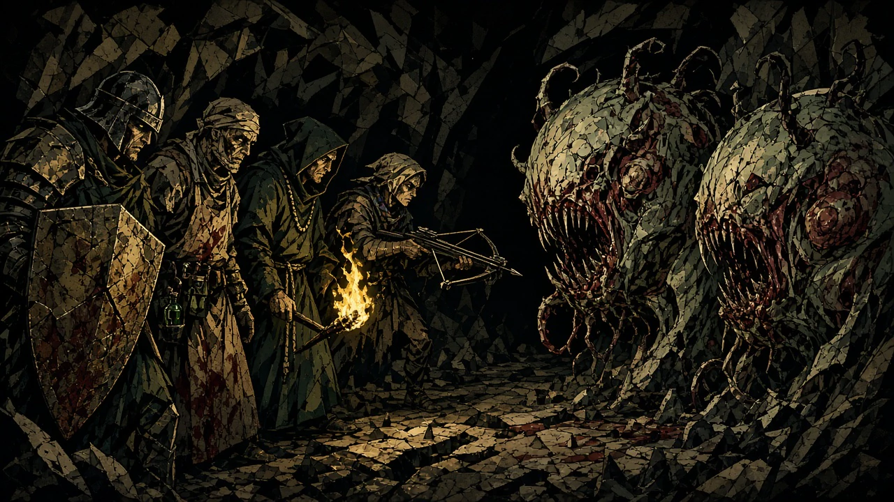
<!-- END DIRECT MODEL PAIR -->

| Registered visible style marker | GPT Image 2 | Grok Image 2 |
|---|:---:|:---:|
| Crushed blacks occupy a major portion of every figure | YES | YES |
| Thick angular inks and carved planes replace soft modeling | YES | YES |
| Narrow parchment-red-gold palette under one hard torch | YES | YES |
| Compressed opposing combat ranks with minimal perspective depth | YES | YES |

**GPT Image 2 verdict: YES.** Crushed blacks dominate angular carved figures, one torch drives the parchment-red-gold palette, and the compressed left-right ranks form a grim, minimally deep comic tableau.

**Grok Image 2 verdict: YES.** Massive black wedges, chipped angular planes, narrow torchlit color, and tightly opposed adventurer and parasite ranks reproduce the specific dungeon-comic surface.

**Pair outcome: `BOTH`.**

**Comparison:** GPT is more fractured and expressionistic; Grok is slightly cleaner, but neither drifts into generic dark fantasy illustration.

**Evidence:** [`current paired profiles`](evidence/model-pair-profiles.json), [`validated original manifest`](evidence/model-pair-manifest.json), and [`independent category review`](evidence/model-pair-review-indie.json).

#### `loose_oil_painted_isometric_coastal_ruin`

**Real-hit anchor:** [Disco Elysium](https://zaumstudio.com/)<br>
**Reference surface:** Isometric narrative exploration environment without dialogue interface.<br>
**Shared prompt SHA-256:** `3c4e774051702aebbf16c8efca1dbadb9ebc6f34d7d329867b86b41b76b681d2`<br>
**Registered requested aspect:** `16:9`<br>
**Effective output aspects:** GPT Image 2 `16:9`; Grok Image 2 `16:9`<br>
**Model routes:** `openai/gpt-image-2` and `x-ai/grok-imagine-image-2.0`

**Exact provider prompt shared byte-for-byte by both models**

> Create an original 16:9 isometric narrative-RPG environment painted with loose, expressive oil-and-gouache brushwork. An exhausted middle-aged harbor inspector and a neatly dressed union archivist stand beside a broken public fountain in a wind-beaten coastal district. Surround them with peeling apartment walls, wet cobblestones, a shuttered kiosk, leaning utility poles, dead grass, distant cranes, and gray sea haze. Use an elevated oblique camera, but allow architectural edges to dissolve into brush marks and stained color rather than precise 3D geometry. Build the palette from bruised violet, oxidized teal, dirty ochre, nicotine yellow, and occasional hot magenta accents. Figures should remain small yet identifiable through posture and color blocks. Convey political decay and melancholy without readable propaganda. No interface, dialogue boxes, text, logo, existing detective costume, or recognizable city location.

<!-- BEGIN DIRECT MODEL PAIR -->
**GPT Image 2 — reviewed result**

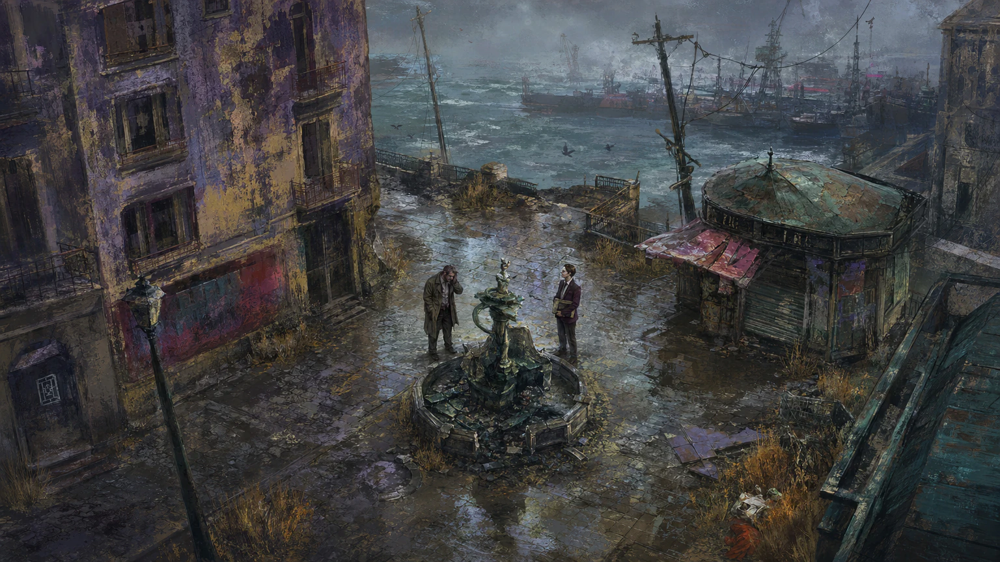

**Grok Image 2 — reviewed result**

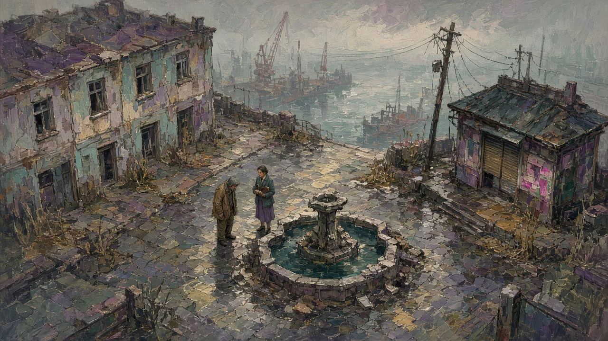
<!-- END DIRECT MODEL PAIR -->

| Registered visible style marker | GPT Image 2 | Grok Image 2 |
|---|:---:|:---:|
| Isometric spatial logic softened by visibly loose brushwork | YES | YES |
| Bruised violet, teal, ochre, and magenta urban palette | YES | YES |
| Small human figures defined by posture and color masses | YES | YES |
| Architecture dissolves into atmospheric stains at frame edges | YES | YES |

**GPT Image 2 verdict: YES.** Oblique coastal space softened by loose paint, bruised teal-violet-ochre color, posture-led small figures, and architecture dissolving into atmospheric stains reproduce the narrative-RPG surface.

**Grok Image 2 verdict: YES.** Visible oil-gouache strokes soften the isometric plaza, the harbor palette stays bruised and political, tiny figures read through posture, and edge structures fade into haze and paint.

**Pair outcome: `BOTH`.**

**Comparison:** GPT is darker and more spatially cinematic; Grok is looser and paler, but both remain specific expressionistic coastal narrative environments.

**Evidence:** [`current paired profiles`](evidence/model-pair-profiles.json), [`validated original manifest`](evidence/model-pair-manifest.json), and [`independent category review`](evidence/model-pair-review-indie.json).

#### `minimalist_watercolor_dream_platformer`

**Real-hit anchor:** [GRIS](https://steamcommunity.com/app/683320/announcements/)<br>
**Reference surface:** Side-view traversal tableau with one small figure and monumental surreal architecture.<br>
**Shared prompt SHA-256:** `0a1b55910f450ffe061c144a43f50761a9f8564a226a00385ee695420dd78a2a`<br>
**Registered requested aspect:** `16:9`<br>
**Effective output aspects:** GPT Image 2 `16:9`; Grok Image 2 `16:9`<br>
**Model routes:** `openai/gpt-image-2` and `x-ai/grok-imagine-image-2.0`

**Exact provider prompt shared byte-for-byte by both models**

> Create an original 16:9 side-view dream-platforming tableau painted in delicate watercolor and ink. A small adult traveler wearing a long saffron cape crosses the wrist of a colossal broken stone hand suspended above a white desert. Place thin stairways, fragments of circular observatories, two distant birds, and a shallow reflective pool along the route. Leave at least half the frame as clean ivory negative space. Use translucent washes that bleed from saffron into coral and dusty rose, sparse pencil-thin contours, granular pigment edges, and occasional opaque geometric shapes. The character should be tiny, elegant, and readable through a single dark silhouette. Avoid conventional texture everywhere; let color collect only around architecture, cloth, and reflection. The image should feel contemplative and weightless. No interface, text, logo, existing dress design, or recognizable monument.

<!-- BEGIN DIRECT MODEL PAIR -->
**GPT Image 2 — reviewed result**

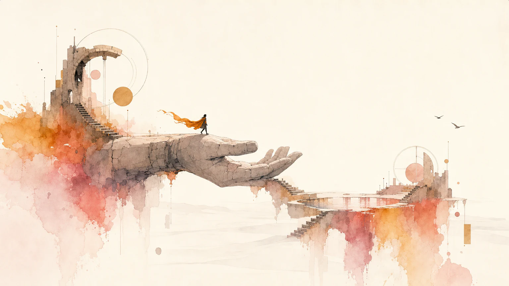

**Grok Image 2 — reviewed result**

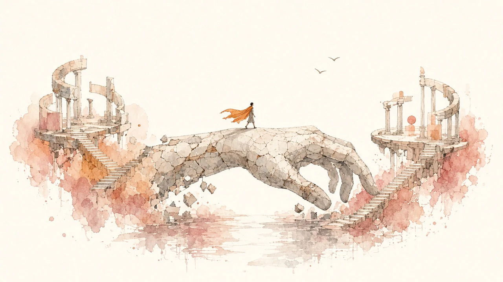
<!-- END DIRECT MODEL PAIR -->

| Registered visible style marker | GPT Image 2 | Grok Image 2 |
|---|:---:|:---:|
| At least half the composition remains pale negative space | YES | YES |
| Translucent watercolor blooms with visible pigment edges | YES | YES |
| Tiny side-view traveler dwarfed by surreal architecture | YES | YES |
| Restricted emotional color family rather than full-spectrum scenery | YES | YES |

**GPT Image 2 verdict: YES.** Most of the frame is ivory space around translucent pigment blooms, a tiny side-view traveler, monumental hand architecture, and a tightly restricted saffron-coral emotional palette.

**Grok Image 2 verdict: YES.** Large pale negative space, granular watercolor edges, the minute caped figure, colossal broken hand, and restrained coral-saffron family reproduce the contemplative dream-platforming style.

**Pair outcome: `BOTH`.**

**Comparison:** GPT is more asymmetric and abstract; Grok is more centered and architectural, with equally strong watercolor minimalism.

**Evidence:** [`current paired profiles`](evidence/model-pair-profiles.json), [`validated original manifest`](evidence/model-pair-manifest.json), and [`independent category review`](evidence/model-pair-review-indie.json).

#### `warm_hand_drawn_spirit_boat_cutaway`

**Real-hit anchor:** [Spiritfarer](https://thunderlotusgames.com/press-releases/spiritfarer-farewell-edition-press/)<br>
**Reference surface:** Side-view boat-management gameplay frame showing several readable rooms.<br>
**Shared prompt SHA-256:** `e9f5059e07c955d5c34f253dfa801690580c3d46264338a5792acc7f47dd389e`<br>
**Registered requested aspect:** `16:9`<br>
**Effective output aspects:** GPT Image 2 `16:9`; Grok Image 2 `16:9`<br>
**Model routes:** `openai/gpt-image-2` and `x-ai/grok-imagine-image-2.0`

**Exact provider prompt shared byte-for-byte by both models**

> Create an original 16:9 side-view boat-management scene rendered like a high-quality hand-drawn animated film. Show a broad wooden ferry crossing a calm indigo sea at sunset, its deck arranged as a readable cutaway of a greenhouse, kitchen, workshop, sleeping cabin, and tiny bell tower. An adult ferrymaster in a wide ochre coat carries tea to three gentle animal-shaped spirits: a translucent heron, an elderly marmot, and a tall moth. Use clean dark-blue linework, softly rounded anatomy, flat local colors enriched by subtle painted gradients, expressive animation-ready poses, and warm amber windows against lavender and coral sky. Let constellations and spirit trails glow delicately without overwhelming the domestic details. Preserve clear side-view platforms and ladders. No interface, text, logo, existing ferrymaster, recognizable cat companion, or copied boat configuration.

<!-- BEGIN DIRECT MODEL PAIR -->
**GPT Image 2 — reviewed result**

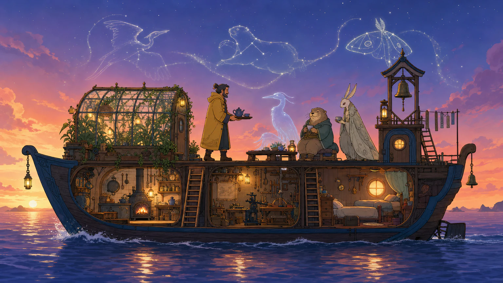

**Grok Image 2 — reviewed result**

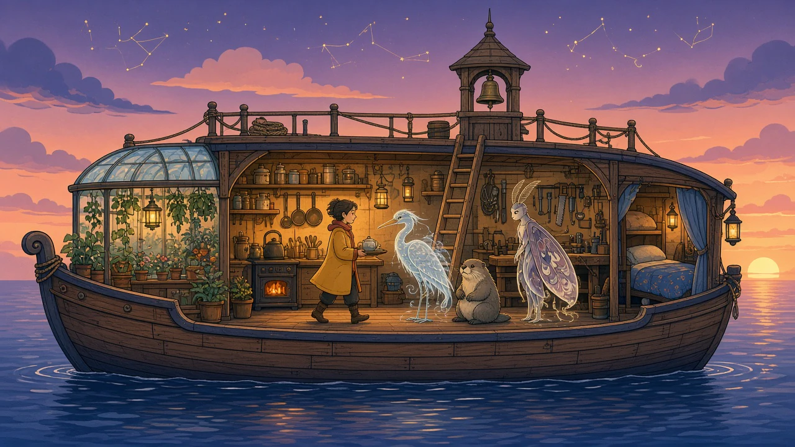
<!-- END DIRECT MODEL PAIR -->

| Registered visible style marker | GPT Image 2 | Grok Image 2 |
|---|:---:|:---:|
| Clean animation-ready linework and softly rounded silhouettes | YES | YES |
| Side-view boat cutaway with multiple readable domestic rooms | YES | YES |
| Warm amber interiors against a lavender-coral dusk | YES | YES |
| Animal-shaped spirits rendered with delicate translucent glow | YES | YES |

**GPT Image 2 verdict: YES.** Clean rounded animation linework, a multi-room side-view ferry cutaway, amber domestic interiors against lavender-coral dusk, and delicately glowing animal spirits reproduce the boat-management surface.

**Grok Image 2 verdict: YES.** The readable side-on greenhouse, kitchen, workshop, and cabin use soft animated contours, warm sunset color, and translucent heron and moth spirits with restrained glow.

**Pair outcome: `BOTH`.**

**Comparison:** GPT is denser and more cinematic; Grok simplifies the rooms and poses, but both control the same hand-drawn domestic spirit-ferry language.

**Evidence:** [`current paired profiles`](evidence/model-pair-profiles.json), [`validated original manifest`](evidence/model-pair-manifest.json), and [`independent category review`](evidence/model-pair-review-indie.json).

### Western, card, and casual hits

#### `league_champion_splash_v1`

**Real-hit anchor:** [League of Legends](https://www.riotgames.com/darkroom/original/8e2a0ca2dbd5c484ff503513ed591f32%3Adb0dce6771e17a4e90bf6ba43a32c7ab/leagueoflegends-fact-sheet.pdf)<br>
**Reference surface:** Full-width champion or skin splash illustration<br>
**Shared prompt SHA-256:** `7a8824070b3c4ec74f31e4252b35e6618e90dfb416980df7b2774337ae54d0df`<br>
**Registered requested aspect:** `16:9`<br>
**Effective output aspects:** GPT Image 2 `16:9`; Grok Image 2 `16:9`<br>
**Model routes:** `openai/gpt-image-2` and `x-ai/grok-imagine-image-2.0`

**Exact provider prompt shared byte-for-byte by both models**

> Use case: premium 2D game marketing art.
> Asset type: full-width champion or cosmetic-skin splash illustration, without interface.
> Primary request: Create a cinematic horizontal fantasy-game splash illustration for an original adult storm duelist on a broken celestial observatory rim. She has an original face, black hair, engraved silver armor over dark leather, a long split indigo coat, and a narrow lightning-charged blade.
> Style: polished semi-realistic digital painting; carefully rendered adult face, leather, engraved metal, windswept cloth, rain, and luminous weather effects; selective sharpness at the face, hands, and weapon; painterly atmospheric haze elsewhere; cool blue-gray atmosphere against one concentrated amber-white magical light.
> Composition: Make her silhouette dominant and immediately readable, occupying roughly forty percent of the frame, viewed from a low three-quarter camera with the weapon thrust toward the viewer. Build a strong diagonal from the foreground blade through the character to a distant lightning vortex. Keep collapsing brass instruments, cloud layers, and airborne debris deep but subordinate.
> Constraints: one original adult character; no text, logo, interface, card frame, copied costume, recognizable character, photorealistic camera look, or crowded ensemble.

<!-- BEGIN DIRECT MODEL PAIR -->
**GPT Image 2 — reviewed result**

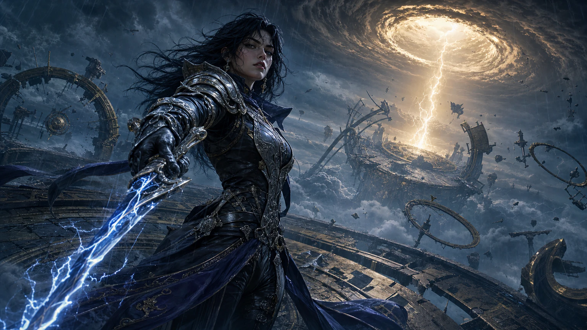

**Grok Image 2 — reviewed result**

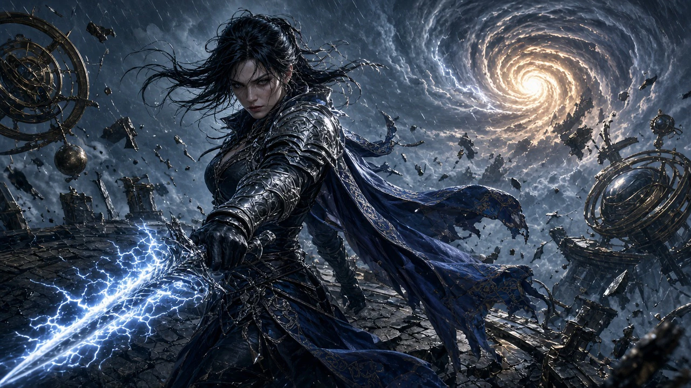
<!-- END DIRECT MODEL PAIR -->

| Registered visible style marker | GPT Image 2 | Grok Image 2 |
|---|:---:|:---:|
| One dominant champion silhouette with face-level focal contrast | YES | YES |
| Strong cinematic diagonal and aggressive foreground foreshortening | YES | YES |
| Semi-realistic material painting with selective sharpness | YES | YES |
| Emissive magic separated from a deep atmospheric environment | YES | YES |

**GPT Image 2 verdict: YES.** The face-led armored champion, thrust lightning blade, diagonal storm platform, selectively sharp metal, and blue emissive effect against deep atmospheric ruins reproduce the premium champion-splash surface.

**Grok Image 2 verdict: YES.** A dominant armored duelist, aggressively foreshortened electric sword, sweeping cloak diagonal, sharp painted materials, and bright magic isolated from a storm vortex retain all four splash-art markers.

**Pair outcome: `BOTH`.**

**Comparison:** GPT gives the environment more narrative scale; Grok drives a tighter action diagonal, while both reproduce the same champion-splash grammar.

**Evidence:** [`current paired profiles`](evidence/model-pair-profiles.json), [`validated original manifest`](evidence/model-pair-manifest.json), and [`independent category review`](evidence/model-pair-review-western.json).

#### `hearthstone_minion_card_v1`

**Real-hit anchor:** [Hearthstone](https://hearthstone.blizzard.com/en-us/news/22636890/celebrating-100-million-players)<br>
**Reference surface:** Cropped collectible minion-card illustration without the card frame<br>
**Shared prompt SHA-256:** `cceadbba1641f49ce76b3001b4a9142b5bdd5284f571e8cdb3a04012bc5c8219`<br>
**Registered requested aspect:** `3:4`<br>
**Effective output aspects:** GPT Image 2 `3:4`; Grok Image 2 `3:4`<br>
**Model routes:** `openai/gpt-image-2` and `x-ai/grok-imagine-image-2.0`

**Exact provider prompt shared byte-for-byte by both models**

> Use case: stylized-concept
> Asset type: small collectible-card artwork cropped for the illustration window, without the card frame.
> Primary request: Create an original goblin pastry alchemist accidentally launching a flaming berry pie across a busy workshop. The goblin has a huge expressive nose, color-blocked oven mitts, a flour-dusted clean leather apron, and a copper whisk-wand; the flying pie and the goblin's horrified delight form the central gag.
> Style and shape language: broad friendly caricature rather than realistic anatomy; oversized face, hands, eyebrows, and props; thick confident digital brush shapes; smooth matte color fields; rounded simplified materials. Differentiate clean copper, wood, glazed ceramic, dough, and smoke through silhouette, hue, and broad highlight shapes rather than realistic roughness. Use warm honey brown, clean gold, saturated berry red, and one turquoise magical accent.
> Surface finish: contemporary clean digital card-game illustration. Allow only one or two deliberate painted accents per object. Keep colors fresh and the image plane clean.
> Composition: Use a compact centered circular action readable at thumbnail size, with flour, sparks, and utensils framing but not obscuring the face.
> Constraints: no PBR rendering, photorealistic microdetail, patina, grime, scratches, chipped paint, paper or canvas texture, full-frame grain, sepia grading, brown edge wear, vignette, card border, text, icon, number, rarity gem, logo, copied fantasy character, horror, or distant scenic composition.

<!-- BEGIN DIRECT MODEL PAIR -->
**GPT Image 2 — reviewed result**

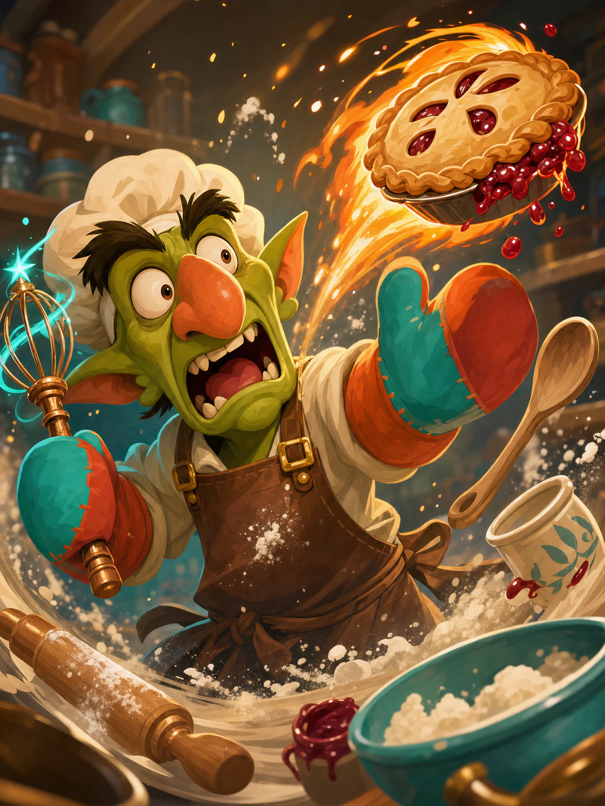

**Grok Image 2 — reviewed result**

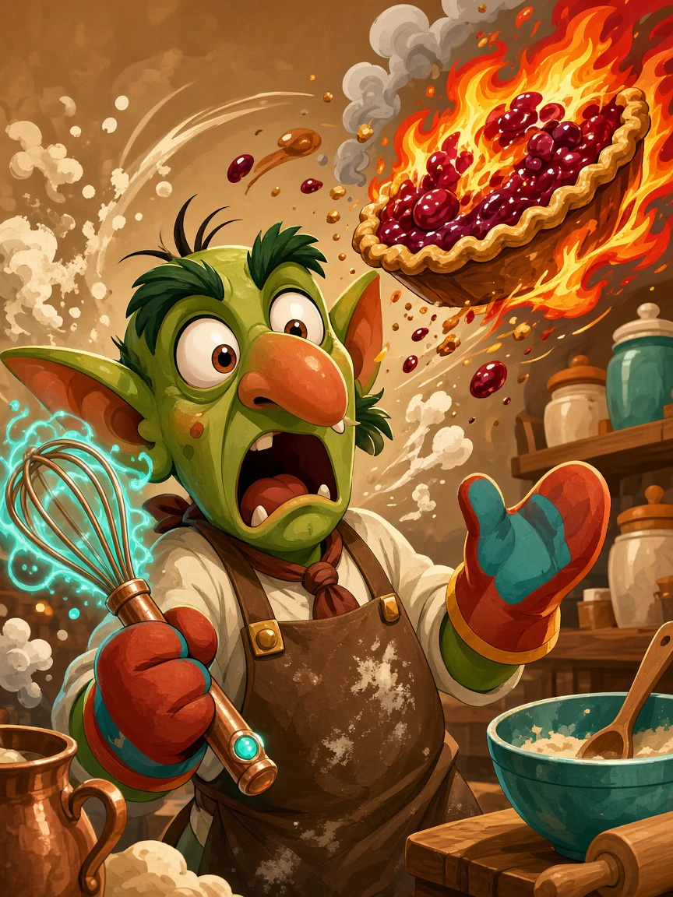
<!-- END DIRECT MODEL PAIR -->

| Registered visible style marker | GPT Image 2 | Grok Image 2 |
|---|:---:|:---:|
| Broad caricature with oversized face, hands, and readable expression | YES | YES |
| Rounded simplified materials described by broad digital brush masses rather than microtexture | YES | YES |
| Fresh warm tavern palette punctuated by one saturated magical color | YES | YES |
| Central comic action designed to survive a very small crop | YES | YES |

**GPT Image 2 verdict: YES.** The enormous goblin face, hands and mitt, fresh tavern-bakery palette, turquoise enchanted whisk, and compact flaming-pie accident read clearly at card size; broad clean brush masses replace the former PBR-like microtexture.

**Grok Image 2 verdict: YES.** Grok preserves the oversized comic expression, rounded simplified props, warm workshop color, one cyan magical accent, and thumbnail-readable pie mishap with broad object-local painted blocking and no pervasive weathering.

**Pair outcome: `BOTH`.**

**Comparison:** Both now control caricature, palette, broad brush handling, and the card-scale gag without the previous gritty material drift; GPT is the stronger overall replacement while Grok remains slightly flatter.

**Surface-finish revision:** The displayed GPT Image 2 and Grok Image 2 files are the accepted clean-digital revision originals. The earlier pair remains historical execution evidence and is not embedded. See the [`revision profiles`](evidence/surface-finish-profiles.json), [`revision execution`](evidence/surface-finish-execution.json), and [`revision review`](evidence/surface-finish-review.json).

**Evidence:** [`current paired profiles`](evidence/model-pair-profiles.json), [`validated original manifest`](evidence/model-pair-manifest.json), and [`independent category review`](evidence/model-pair-review-western.json).

#### `runeterra_follower_full_art_v1`

**Real-hit anchor:** [Legends of Runeterra](https://apps.apple.com/ca/story/id1535415720)<br>
**Reference surface:** Full uncropped follower or spell card artwork<br>
**Shared prompt SHA-256:** `05bddcc3b8c146b063f003623d8000cd537fd1b9f9f4faf90d49afab2468ccc3`<br>
**Registered requested aspect:** `16:9`<br>
**Effective output aspects:** GPT Image 2 `16:9`; Grok Image 2 `16:9`<br>
**Model routes:** `openai/gpt-image-2` and `x-ai/grok-imagine-image-2.0`

**Exact provider prompt shared byte-for-byte by both models**

> Use case: narrative full-art illustration revealed from a digital collectible card.
> Asset type: full-width fantasy follower or spell artwork, without any card frame.
> Primary request: Show an original adult canal-city courier arriving one second too late to stop a forbidden relic from opening. The courier enters in a rain cape from the lower left; a frightened archivist recoils in the middle distance; an opened brass reliquary releases spectral birds toward the upper right. Include wet footprints, dropped sealing wax, and tilting shelves as small story clues.
> Style: sophisticated painterly fantasy illustration; believable adult anatomy; simplified but convincing architecture; crisp foreground silhouettes; carefully controlled atmospheric depth; teal canal light, oxidized copper, parchment cream, muted violet, and brilliant cyan reserved for the supernatural event.
> Composition: Stage a complete narrative incident rather than a posed hero poster. Keep the courier, relic, and spectral eruption readable at card size while letting distant areas soften into broad strokes.
> Constraints: no text, card frame, existing symbols, recognizable character, modern object, logo, interface, ornamental border, or generic single-character beauty pose.

<!-- BEGIN DIRECT MODEL PAIR -->
**GPT Image 2 — reviewed result**

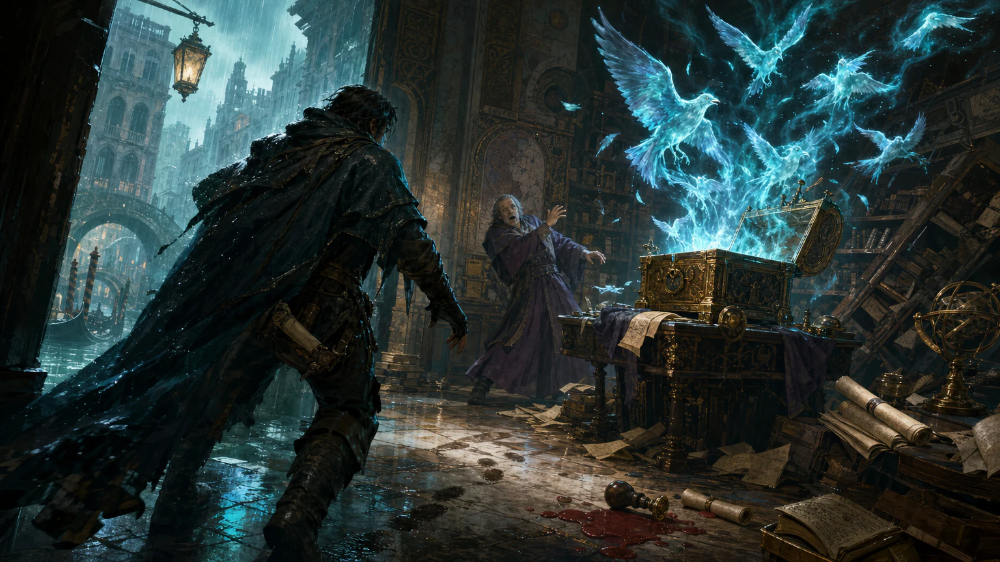

**Grok Image 2 — reviewed result**

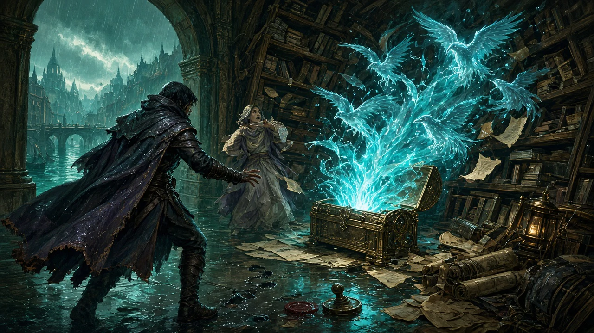
<!-- END DIRECT MODEL PAIR -->

| Registered visible style marker | GPT Image 2 | Grok Image 2 |
|---|:---:|:---:|
| A complete narrative incident rather than a hero beauty pose | YES | YES |
| Regional palette carried consistently through costume and environment | YES | YES |
| Crisp foreground silhouettes against softer painterly depth | YES | YES |
| Numerous lore-bearing props subordinate to the main event | YES | YES |

**GPT Image 2 verdict: YES.** Courier, archivist, opened reliquary, and spectral birds form a complete lore incident, with a coherent rain-dark regional palette, crisp foreground figures, softened city depth, and subordinate evidence props.

**Grok Image 2 verdict: YES.** The intruder, alarmed scholar, spectral flock, scattered papers, books and rainbound archive stage a narrative card event rather than a beauty pose, with clear foreground silhouettes and painterly depth.

**Pair outcome: `BOTH`.**

**Comparison:** GPT is more cinematic and materially polished; Grok is more visibly painterly, but both preserve the narrative full-art follower surface.

**Evidence:** [`current paired profiles`](evidence/model-pair-profiles.json), [`validated original manifest`](evidence/model-pair-manifest.json), and [`independent category review`](evidence/model-pair-review-western.json).

#### `mtg_arena_borderless_card_v1`

**Real-hit anchor:** [Magic: The Gathering Arena](https://investor.hasbro.com/node/35596)<br>
**Reference surface:** Borderless vertical creature or planeswalker card illustration<br>
**Shared prompt SHA-256:** `f0ad2f3bb8f24080600f9cbc3e5c72eabc626021351b537f3a4809135457a780`<br>
**Registered requested aspect:** `3:4`<br>
**Effective output aspects:** GPT Image 2 `3:4`; Grok Image 2 `3:4`<br>
**Model routes:** `openai/gpt-image-2` and `x-ai/grok-imagine-image-2.0`

**Exact provider prompt shared byte-for-byte by both models**

> Use case: premium borderless fantasy artwork for a digital collectible card.
> Asset type: vertical creature or planeswalker-style card painting, without typography or frame ornament.
> Primary request: Paint an original adult desert astronomer binding a fallen star inside a bronze astrolabe. She wears layered sun-bleached robes and practical leather gloves; her weathered face is lit by the captive star while rotating engraved rings form a symbolic halo above her.
> Style: serious classical representational fantasy painting; convincing adult anatomy, observed fabric folds, weathered skin, dense engraved metal, granular sandstone, and physically coherent firelight; restrained umber, ochre, charcoal, and tarnished green interrupted by one white-gold celestial focal point; depth built through value, temperature, and atmospheric dust rather than outlines.
> Composition: Place the figure slightly below center so the luminous star and astrolabe dominate the upper field. Make every ritual prop imply history while preserving a clear portrait-card silhouette.
> Constraints: no border, mana-like symbol, text, logo, contemporary technology, copied costume, glossy anime rendering, comic ink lines, game interface, or explosive action-poster pose.

<!-- BEGIN DIRECT MODEL PAIR -->
**GPT Image 2 — reviewed result**

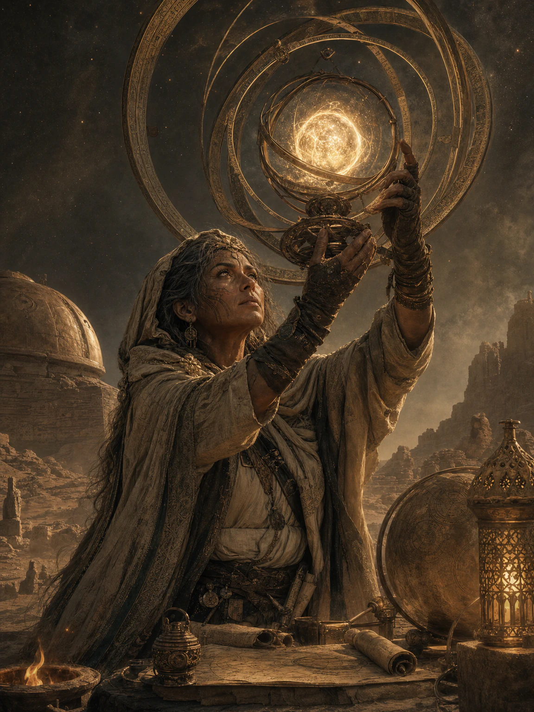

**Grok Image 2 — reviewed result**

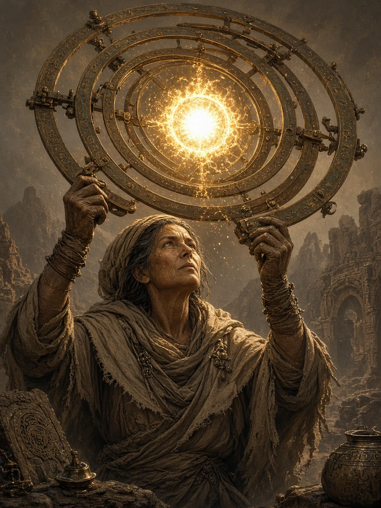
<!-- END DIRECT MODEL PAIR -->

| Registered visible style marker | GPT Image 2 | Grok Image 2 |
|---|:---:|:---:|
| Classical representational anatomy with no enclosing contour lines | YES | YES |
| Restrained natural palette plus one supernatural focal color | YES | YES |
| Symbolic mythic staging rather than explosive action | YES | YES |
| Historically tactile surfaces and physically coherent illumination | YES | YES |

**GPT Image 2 verdict: YES.** Lineless classical anatomy, restrained desert earths, a single golden supernatural focus, solemn symbolic staging, and physically lit cloth, brass, parchment and stone reproduce borderless mythic card painting.

**Grok Image 2 verdict: YES.** The aged astronomer is rendered without contour lines in a natural umber palette, holding one radiant gold armillary in a static symbolic ritual with coherent tactile cloth, metal and ruin lighting.

**Pair outcome: `BOTH`.**

**Comparison:** GPT adds more surrounding ritual objects and atmospheric depth; Grok simplifies the icon, with equally specific borderless fantasy-card realism.

**Evidence:** [`current paired profiles`](evidence/model-pair-profiles.json), [`validated original manifest`](evidence/model-pair-manifest.json), and [`independent category review`](evidence/model-pair-review-western.json).

#### `afk_ascended_hero_portrait_v1`

**Real-hit anchor:** [AFK Arena](https://ancient.lilith.com/en/news?id=350)<br>
**Reference surface:** Full-body ascended hero collection portrait<br>
**Shared prompt SHA-256:** `7b98d7afc92c35051148858dbb0e13807b49033e153f1b20b304fb177f388983`<br>
**Registered requested aspect:** `2:3`<br>
**Effective output aspects:** GPT Image 2 `2:3`; Grok Image 2 `2:3`<br>
**Model routes:** `openai/gpt-image-2` and `x-ai/grok-imagine-image-2.0`

**Exact provider prompt shared byte-for-byte by both models**

> Use case: collectible idle-RPG hero reveal and collection-screen portrait.
> Asset type: vertical full-body ascended hero key art, not a combat sprite.
> Primary request: Create an original adult moth-oracle from an ancient moonlit forest faction. Present her in elegant contrapposto with a narrow waist, sweeping layered sleeves, wing-shaped mantle panels, a crescent staff, and an original serene face. Her ribbons, antennae, leaves, and crescent ornaments should repeat one coherent botanical motif.
> Style: elongated fashion-illustration silhouette; delicate animation-like facial and shape design combined with softly painted volume; simplified anatomy, jewel-like eyes, brushed fabric gradients, ornate botanical filigree, and graceful Art Nouveau curves; dusty lavender, midnight blue, bone ivory, and small luminous mint accents.
> Composition: Show the complete uncropped figure and feet. Frame the body with decorative curves and a shallow faded moon disc, mist, and flat foliage arabesques rather than a deep scene.
> Constraints: no text, interface, faction emblem, copied costume, recognizable wings, cropped feet, gritty realism, photorealistic texture, battle scene, or unrelated ornamental clutter.

<!-- BEGIN DIRECT MODEL PAIR -->
**GPT Image 2 — reviewed result**

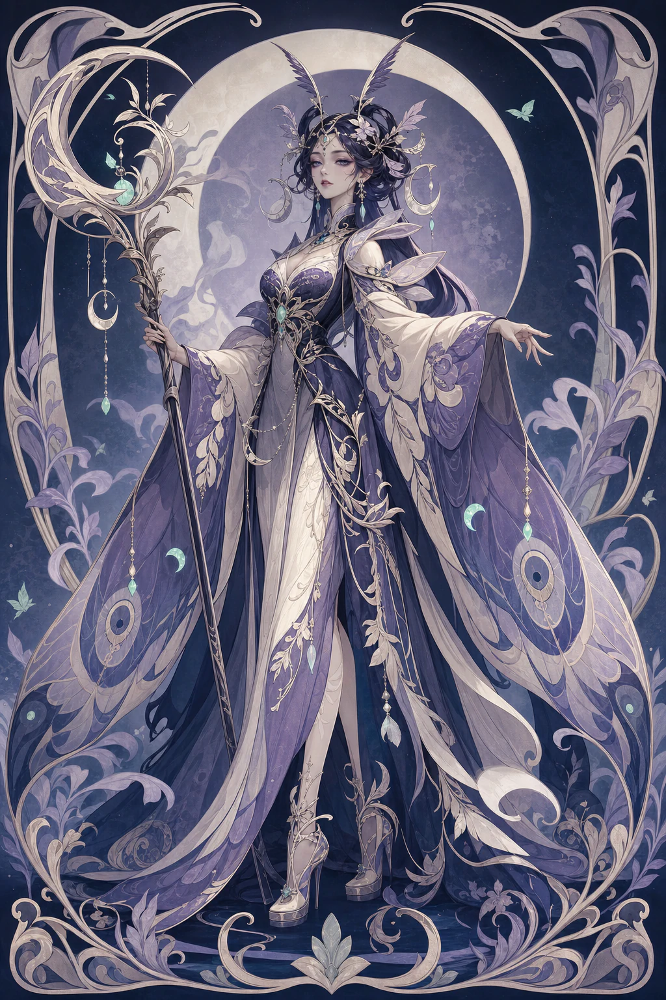

**Grok Image 2 — reviewed result**

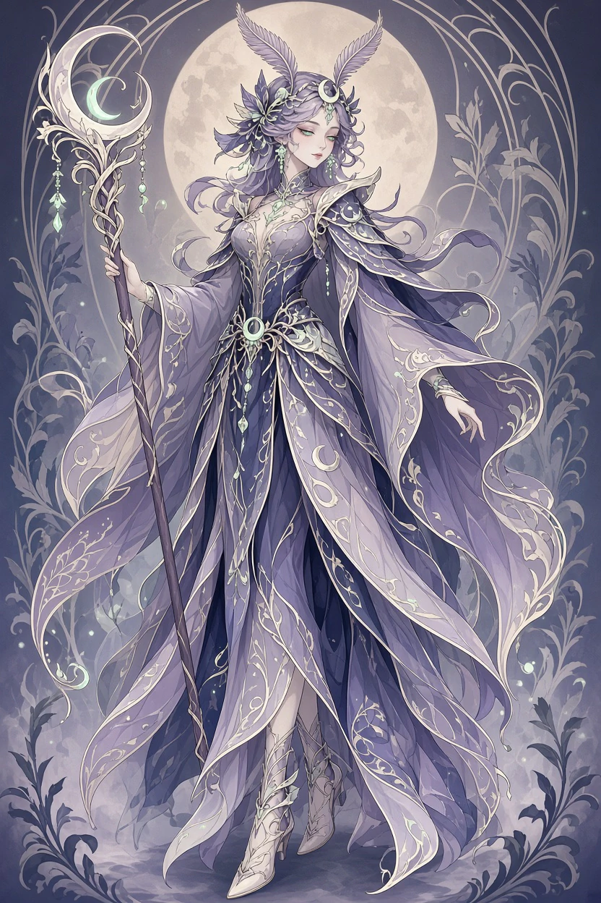
<!-- END DIRECT MODEL PAIR -->

| Registered visible style marker | GPT Image 2 | Grok Image 2 |
|---|:---:|:---:|
| Elongated fashion-illustration silhouette with elegant full-body pose | YES | YES |
| Art Nouveau curves repeated through costume effects and backdrop | YES | YES |
| Hybrid cel-shaped forms and soft painterly gradients | YES | YES |
| Limited faction palette with a shallow ornamental background | YES | YES |

**GPT Image 2 verdict: YES.** The extremely elongated full-body collection pose, repeated Art Nouveau leaf and moth curves, cel-shaped costume masses with soft gradients, and limited moonlit faction palette establish an ascended hero portrait.

**Grok Image 2 verdict: YES.** A long fashion-illustration silhouette, repeated crescent and botanical curves, clean cel-shaped garment planes softened by gradients, and a shallow lavender ornamental field retain the registered ascended collection surface.

**Pair outcome: `BOTH`.**

**Comparison:** GPT is denser and more East-Asian-gacha ornate; Grok is flatter and closer to a collection portrait, while both meet the specific Art Nouveau silhouette grammar.

**Evidence:** [`current paired profiles`](evidence/model-pair-profiles.json), [`validated original manifest`](evidence/model-pair-manifest.json), and [`independent category review`](evidence/model-pair-review-western.json).

#### `cookie_kingdom_gacha_splash_v1`

**Real-hit anchor:** [CookieRun: Kingdom](https://www.devsisters.com/en/games/cookierun-kingdom)<br>
**Reference surface:** Square character acquisition or featured-cookie illustration<br>
**Shared prompt SHA-256:** `02a7ca757549e0bb7393a25e8a17c337b56df054d6536481c2396804215cffc0`<br>
**Registered requested aspect:** `1:1`<br>
**Effective output aspects:** GPT Image 2 `1:1`; Grok Image 2 `1:1`<br>
**Model routes:** `openai/gpt-image-2` and `x-ai/grok-imagine-image-2.0`

**Exact provider prompt shared byte-for-byte by both models**

> Use case: cheerful character acquisition reveal for a collectible mobile RPG.
> Asset type: square featured-character gacha splash, not a battle sprite or kingdom environment.
> Primary request: Create an original living gingerbread astronomer called Comet Candy Cookie, but do not write the name. Build the character from a large round cookie head, tiny body, stubby limbs, icing hair, candy-glass telescope, and a cape shaped like a shooting star. Surround the triumphant pose with oversized star jellies, sugar crumbs, curved speed streaks, and a bright circular reveal burst.
> Style: unmistakably flat cookie silhouette; thick dark-chocolate outlines of nearly uniform weight; rounded corners; simple facial marks; large expressive eyes; flat confectionery colors of deep blueberry, lemon icing, raspberry, and pale sugar; only minimal soft shading; every detail should resemble edible material.
> Composition: Center the complete character and organize effects as a sticker-like circular burst that remains legible as a thumbnail.
> Constraints: no realistic human anatomy, textured painting, text, logo, interface button, copied cookie design, complex perspective, photorealistic food, or crowded background.

<!-- BEGIN DIRECT MODEL PAIR -->
**GPT Image 2 — reviewed result**

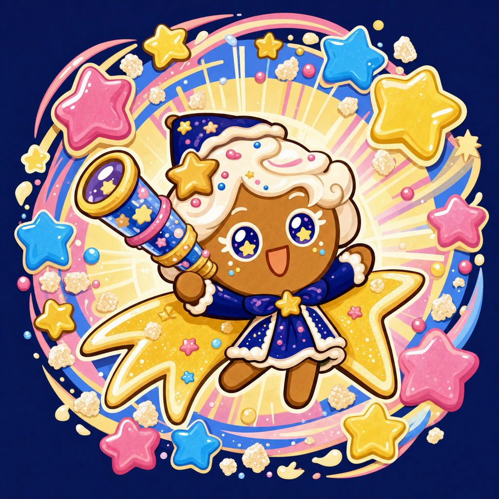

**Grok Image 2 — reviewed result**

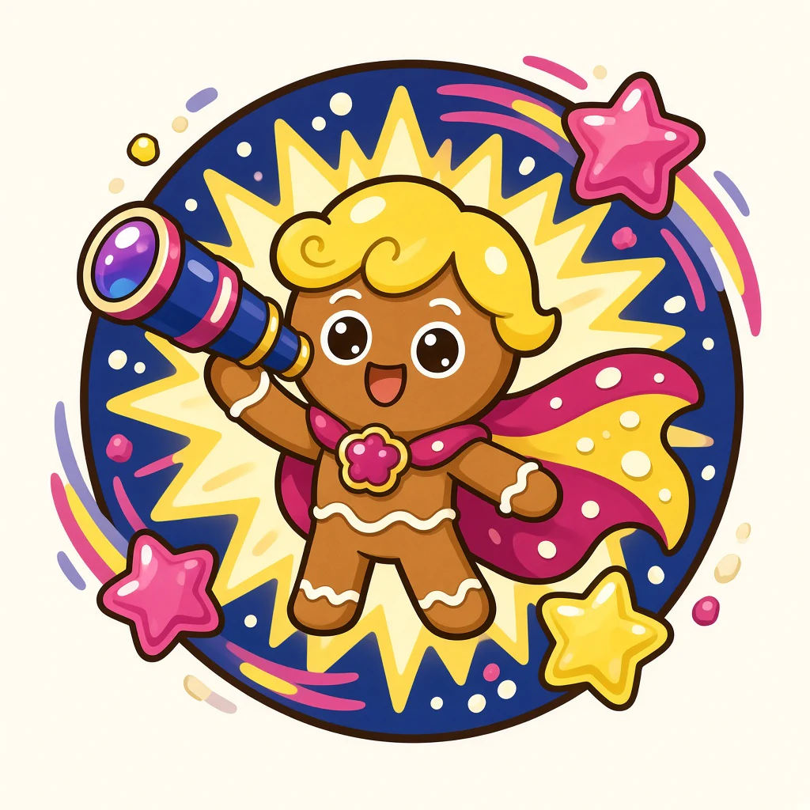
<!-- END DIRECT MODEL PAIR -->

| Registered visible style marker | GPT Image 2 | Grok Image 2 |
|---|:---:|:---:|
| Gingerbread-body construction with extremely compressed proportions | YES | YES |
| Thick chocolate-colored uniform contours and rounded geometry | YES | YES |
| Flat candy palette with very shallow shading | YES | YES |
| Sticker-like effects arranged as a circular acquisition burst | YES | YES |

**GPT Image 2 verdict: YES.** The tiny gingerbread body, chocolate-brown contour, flat candy color, shallow glossy shading, telescope prop and dense circular star burst unmistakably form a cookie-character acquisition splash.

**Grok Image 2 verdict: YES.** Grok uses the same compressed cookie construction, thick edible-brown outline, bright flat confectionery palette, minimal depth, and circular starburst reveal around the featured character.

**Pair outcome: `BOTH`.**

**Comparison:** GPT supplies a denser premium reveal burst; Grok is simpler and more sticker-flat, but both strongly reproduce the cookie gacha surface.

**Evidence:** [`current paired profiles`](evidence/model-pair-profiles.json), [`validated original manifest`](evidence/model-pair-manifest.json), and [`independent category review`](evidence/model-pair-review-western.json).

#### `angry_birds_loading_ensemble_v1`

**Real-hit anchor:** [Angry Birds 2](https://www.rovio.com/articles/rovio-games-have-surpassed-5-billion-total-downloads/)<br>
**Reference surface:** Wide small-ensemble loading or promotional illustration<br>
**Shared prompt SHA-256:** `2308ba4f0e1773a0729cd027d62e2de16dca0aa4f3a2bccc818c171239c77c30`<br>
**Registered requested aspect:** `16:9`<br>
**Effective output aspects:** GPT Image 2 `16:9`; Grok Image 2 `16:9`<br>
**Model routes:** `openai/gpt-image-2` and `x-ai/grok-imagine-image-2.0`

**Exact provider prompt shared byte-for-byte by both models**

> Use case: instantly readable comedic loading illustration for a casual mobile game.
> Asset type: wide small-ensemble promotional scene, not an app icon or cinematic movie render.
> Primary request: Show three original round orchard birds defending a basket of glowing pears from two bean-shaped burrowing thieves. Construct every creature from circles, ovals, wedges, and simple tufts; give the birds no visible arms and only tiny feet. The angriest bird is pulled backward in a leafy sling at left while the thieves react in panic at right.
> Style: thick smooth contours; bright primary colors; clean vector-like gradients; small glossy highlights suggesting polished toy surfaces without becoming fully three-dimensional; expressions driven by huge eyebrows, compressed beaks, narrowed eyes, and elastic squash-and-stretch.
> Composition: Arrange the entire cast along one rising left-to-right action curve and make the gag understandable at phone size. Keep the sunny orchard broad and simple.
> Constraints: no text, logo, realistic feathers, movie-style 3D rendering, human anatomy, copied birds, pigs, eggs, recognizable level geometry, interface, or background clutter.

<!-- BEGIN DIRECT MODEL PAIR -->
**GPT Image 2 — reviewed result**

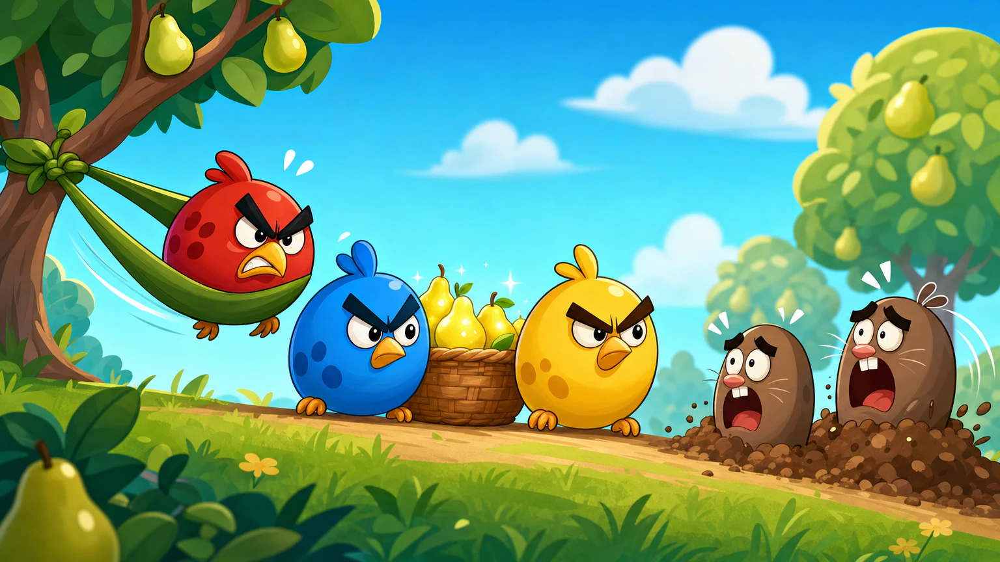

**Grok Image 2 — reviewed result**

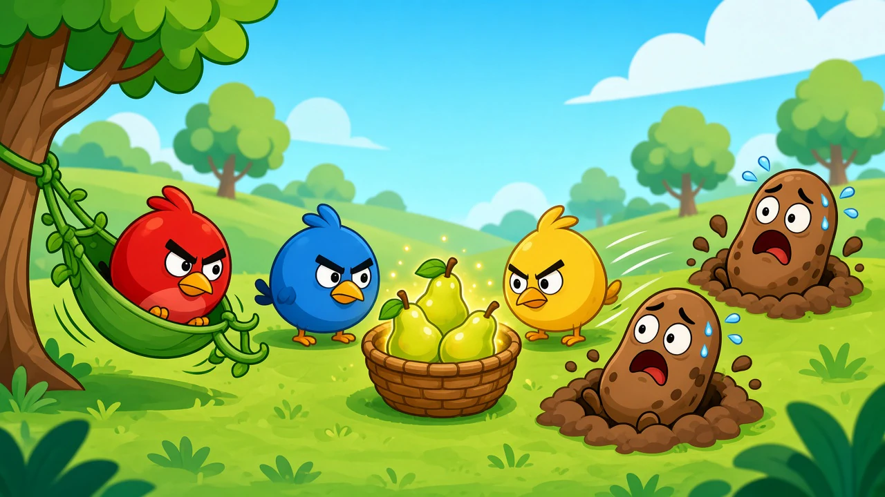
<!-- END DIRECT MODEL PAIR -->

| Registered visible style marker | GPT Image 2 | Grok Image 2 |
|---|:---:|:---:|
| Characters assembled from near-spherical geometric bodies | YES | YES |
| Extreme eyebrow-and-beak expressions with minimal anatomy | YES | YES |
| Smooth vector-like gradients and toy-polish highlights | YES | YES |
| Entire ensemble organized around one immediately readable gag | YES | YES |

**GPT Image 2 verdict: YES.** Near-spherical limbless birds, severe eyebrow-and-beak acting, smooth vector-like gradients, and a single left-to-right pear confrontation create an immediately readable casual loading-screen gag.

**Grok Image 2 verdict: YES.** The round primary-color birds, minimal anatomy, exaggerated angry brows, toy-polish shading, and frightened burrowers organized around the stolen pears retain every ensemble marker.

**Pair outcome: `BOTH`.**

**Comparison:** GPT uses richer lighting and foreground depth; Grok is cleaner and more vector-flat, with the same unmistakable casual gag language.

**Evidence:** [`current paired profiles`](evidence/model-pair-profiles.json), [`validated original manifest`](evidence/model-pair-manifest.json), and [`independent category review`](evidence/model-pair-review-western.json).

#### `pvz2_almanac_portrait_v1`

**Real-hit anchor:** [Plants vs. Zombies 2](https://www.ea.com/games/plants-vs-zombies/plants-vs-zombies-2/features)<br>
**Reference surface:** Square almanac or selection portrait for one unit<br>
**Shared prompt SHA-256:** `d5759771d908b6ee0cc5c15c214132c3da0dc453f564cd913b867d6f561e17b0`<br>
**Registered requested aspect:** `1:1`<br>
**Effective output aspects:** GPT Image 2 `1:1`; Grok Image 2 `1:1`<br>
**Model routes:** `openai/gpt-image-2` and `x-ai/grok-imagine-image-2.0`

**Exact provider prompt shared byte-for-byte by both models**

> Use case: stylized-concept
> Asset type: square almanac portrait of one original plant unit, not a full lawn battle.
> Primary request: Create a defensive garden character shaped like a trumpet cactus that blasts sticky pollen through a polished brass bell with one shallow dent. Show the complete plant in a clear three-quarter view with an oversized mouth, tiny suspicious eyes, uneven thorns, broad leaf-feet, and one ridiculous improvised accessory: a loose suburban garden-hose strap.
> Style and shape language: clean modern mobile-game cartoon rendering; lumpy asymmetrical silhouette; thick dark outlines with slight weight variation; flat saturated yellow-green and turquoise color fields; one smooth controlled gradient per form; small hard highlights. Express the mildly grotesque botanical quality through lobes, uneven thorns, and three or four deliberate pores, not through surface dirt or noise.
> Surface finish: contemporary clean digital game raster. Use clean unblemished plant skin and clean stylized brass without oxidation. Texture is sparse and object-local only.
> Composition: Make the functional joke obvious immediately. Ground the character with one small oval shadow and only a softly blurred clean fence and lawn behind it.
> Constraints: no mottled skin, stippled fill, watercolor granulation, patina, corrosion, grime, scratches, chipped finish, paper or canvas texture, global grain, faded or olive color wash, vignette, typography, stats, interface frame, realistic botanical rendering, known unit design, zombie, copied weapon, complex environment, photorealism, or multiple characters.

<!-- BEGIN DIRECT MODEL PAIR -->
**GPT Image 2 — reviewed result**

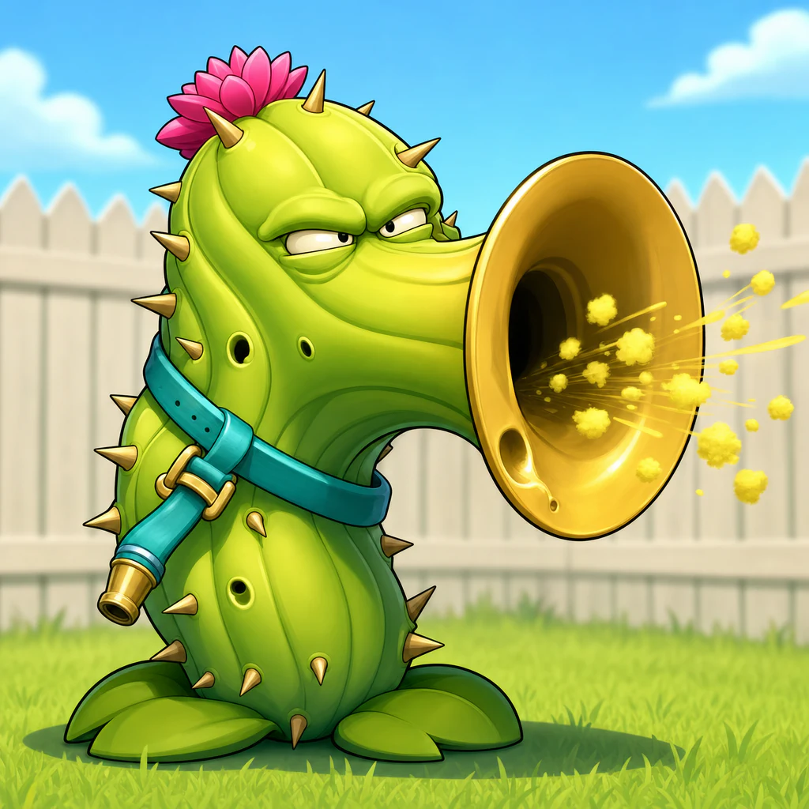

**Grok Image 2 — reviewed result**

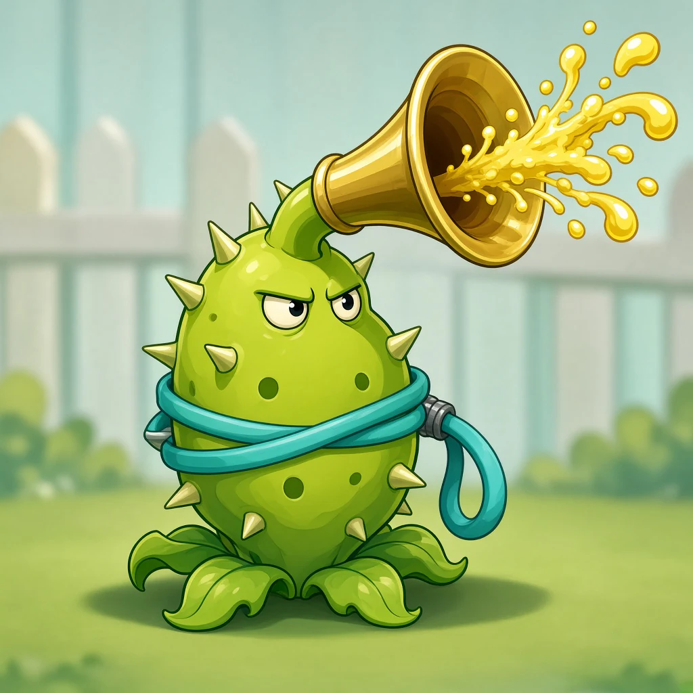
<!-- END DIRECT MODEL PAIR -->

| Registered visible style marker | GPT Image 2 | Grok Image 2 |
|---|:---:|:---:|
| Anthropomorphic plant built around one exaggerated functional feature | YES | YES |
| Irregular lumpy contour with botanical grotesquery expressed through shape design | YES | YES |
| Thick outlines, flat saturated fills, and one smooth controlled gradient per form | YES | YES |
| Clean plant skin and polished brass without weathering or global texture | YES | YES |

**GPT Image 2 verdict: YES.** A clean lumpy anthropomorphic cactus is built around an enormous polished horn, with asymmetrical spikes, thick contour, saturated fills, controlled gradients, and an absurd hose-and-clamp garden contraption; no patina or surface mottling remains.

**Grok Image 2 verdict: YES.** The clean irregular plant, oversized polished brass nozzle, annoyed face, strong outline, simple saturated volume, and wrapped household hose reproduce an almanac unit portrait without weathering or global texture.

**Pair outcome: `BOTH`.**

**Comparison:** Both remove the previous bruising and brass patina while retaining the functional plant-comedy surface; GPT is more grotesquely shaped and Grok is cleaner and more compact.

**Surface-finish revision:** The displayed GPT Image 2 and Grok Image 2 files are the accepted clean-digital revision originals. The earlier pair remains historical execution evidence and is not embedded. See the [`revision profiles`](evidence/surface-finish-profiles.json), [`revision execution`](evidence/surface-finish-execution.json), and [`revision review`](evidence/surface-finish-review.json).

**Evidence:** [`current paired profiles`](evidence/model-pair-profiles.json), [`validated original manifest`](evidence/model-pair-manifest.json), and [`independent category review`](evidence/model-pair-review-western.json).

#### `clash_royale_troop_card_v1`

**Real-hit anchor:** [Clash Royale](https://supercell.com/en/news/best-days/7600/)<br>
**Reference surface:** Vertical troop portrait inside a collection card<br>
**Shared prompt SHA-256:** `cb90e08b07ca4c5643a7dd2d583e68972a42d6862a21356bf476d5164a3d3a4d`<br>
**Registered requested aspect:** `3:4`<br>
**Effective output aspects:** GPT Image 2 `3:4`; Grok Image 2 `3:4`<br>
**Model routes:** `openai/gpt-image-2` and `x-ai/grok-imagine-image-2.0`

**Exact provider prompt shared byte-for-byte by both models**

> Use case: instantly recognizable troop artwork for a competitive mobile card collection.
> Asset type: vertical troop-card portrait without rarity border, level, cost, or interface.
> Primary request: Create an original mushroom lancer charging toward the viewer on a squat blue beetle. Give the rider an enormous mushroom-cap helmet, thick forearms, a tiny torso, a blunt wooden lance, and simplified armor plates; give the mount oversized beetle mandibles and short powerful legs.
> Style: exaggerated toy-sculpted forms; clean polished 3D-like illustration; broad color zones; soft ambient occlusion; bright rim light; restrained painted texture suggesting wood, leather, chitin, and hammered metal; royal blue opposed to warm orange-brown arena dust with a pale sky glow behind the silhouette.
> Composition: Frame the pair tightly from a low three-quarter angle so the face, lance tip, and mount read at thumbnail size. Keep the mood energetic and mischievous.
> Constraints: no card frame, number, rarity icon, text, crown, known troop, photorealism, detailed landscape, logo, interface, or realistic anatomy.

<!-- BEGIN DIRECT MODEL PAIR -->
**GPT Image 2 — reviewed result**

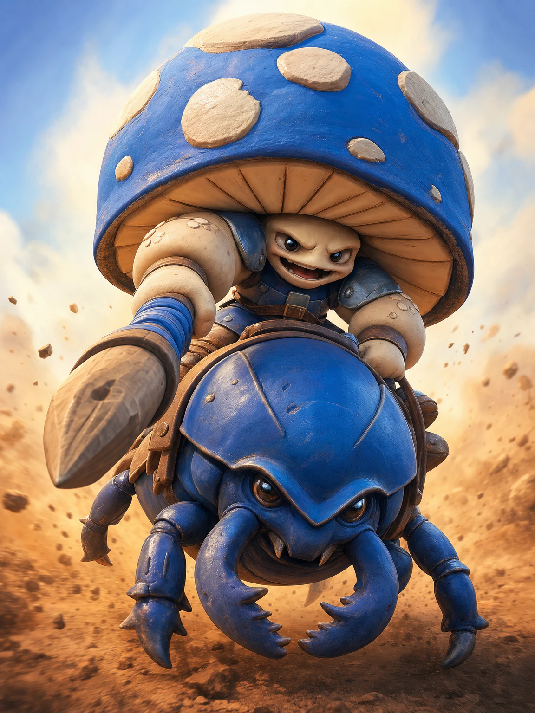

**Grok Image 2 — reviewed result**

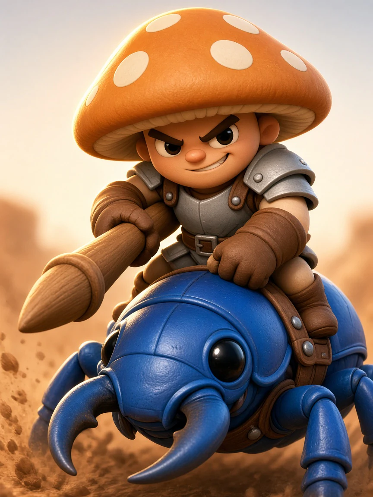
<!-- END DIRECT MODEL PAIR -->

| Registered visible style marker | GPT Image 2 | Grok Image 2 |
|---|:---:|:---:|
| Chunky toy-sculpted anatomy and greatly enlarged equipment | YES | YES |
| Tight low-angle portrait composed for thumbnail recognition | YES | YES |
| Broad blue-orange color separation with bright silhouette rim | YES | YES |
| Clean 3D-painted finish with restrained surface texture | NO | YES |

**GPT Image 2 verdict: YES.** The squat mushroom rider, enormous cap and lance, tight low-angle thumbnail pose, and blue-orange separation read as a troop-card character, though heavily weathered wood, shell and cloth exceed the restrained surface texture marker.

**Grok Image 2 verdict: YES.** Chunky toy anatomy, oversized mushroom and lance, low-angle vertical crop, blue mount against orange dust, bright rim light, and clean lightly textured 3D painting preserve all four troop-card markers.

**Pair outcome: `BOTH`.**

**Comparison:** GPT is grittier than the target but remains recognizable through shape and framing; Grok is the cleaner and more faithful toy-painted rendering.

**Evidence:** [`current paired profiles`](evidence/model-pair-profiles.json), [`validated original manifest`](evidence/model-pair-manifest.json), and [`independent category review`](evidence/model-pair-review-western.json).

#### `brawl_seasonal_loading_art_v1`

**Real-hit anchor:** [Brawl Stars](https://supercell.com/en/news/comfortable-feeling-uncomfortable/)<br>
**Reference surface:** Wide seasonal loading illustration showing several fighters<br>
**Shared prompt SHA-256:** `430c5cebc22243d1b7b3b312812393eb122d1779c6f8c0a67fded4957ed1a7af`<br>
**Registered requested aspect:** `16:9`<br>
**Effective output aspects:** GPT Image 2 `16:9`; Grok Image 2 `16:9`<br>
**Model routes:** `openai/gpt-image-2` and `x-ai/grok-imagine-image-2.0`

**Exact provider prompt shared byte-for-byte by both models**

> Use case: seasonal loading key art for a fast casual multiplayer mobile game.
> Asset type: wide themed conflict featuring a small fighter ensemble, not individual portrait icons or gameplay capture.
> Primary request: Show three original adult toy-like competitors battling over a runaway parade float in a neon desert carnival: a square-jawed ticket collector with a punch stamper, a tiny masked stunt rider on one enormous wheel, and a broad cactus mechanic wielding a foam wrench. Give every fighter a distinct oversized silhouette and readable emotional reaction.
> Style: huge heads, hands, footwear, and props; torsos and joints simplified into rounded sculpted masses; smooth colorful 3D-like shading; crisp edges; flat graphic dust clouds and starburst impacts; saturated cyan, magenta, and orange lighting.
> Composition: Arrange a clear action triangle with one foreground impact, one airborne figure, and one reacting figure. Keep the environment bold but shallow enough for phone-screen readability.
> Constraints: no words, logo, interface, copied weapon, recognizable character, realistic anatomy, detailed crowd, photorealism, gore, or visually equal background figures.

<!-- BEGIN DIRECT MODEL PAIR -->
**GPT Image 2 — reviewed result**

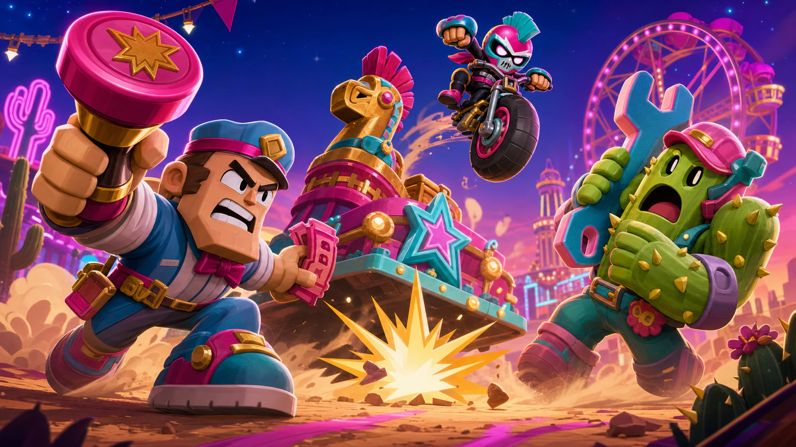

**Grok Image 2 — reviewed result**

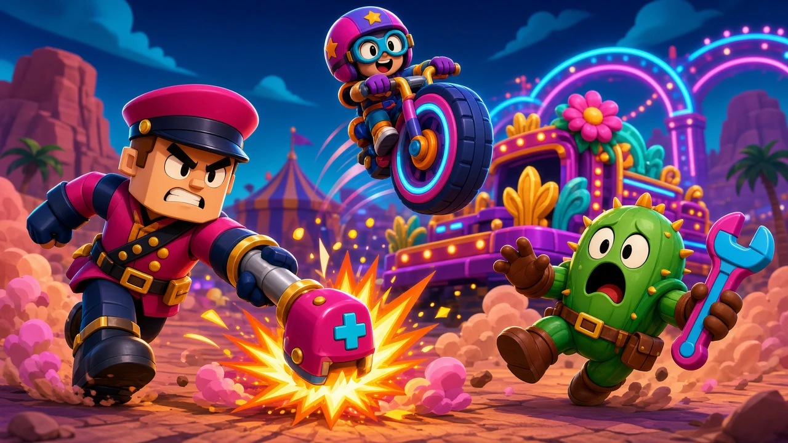
<!-- END DIRECT MODEL PAIR -->

| Registered visible style marker | GPT Image 2 | Grok Image 2 |
|---|:---:|:---:|
| Huge heads hands shoes and signature props on compressed bodies | YES | YES |
| Three-character triangular action composition | YES | YES |
| Smooth 3D-like shading combined with flat graphic impact effects | YES | YES |
| Saturated complementary lighting and shallow phone-readable depth | YES | YES |

**GPT Image 2 verdict: YES.** Three compressed fighters with huge hands, shoes and tools form a strong triangle around a flat impact burst, using smooth 3D shading, saturated cyan-magenta-orange light and shallow carnival depth.

**Grok Image 2 verdict: YES.** The oversized hammer, wrench, wheel and heads, triangular three-fighter staging, graphic ground hit, smooth toy shading and neon amusement-park palette reproduce a phone-readable seasonal loading illustration.

**Pair outcome: `BOTH`.**

**Comparison:** GPT pushes more cinematic foreshortening; Grok gives the three-character triangle a cleaner read, with equivalent seasonal-loading style control.

**Evidence:** [`current paired profiles`](evidence/model-pair-profiles.json), [`validated original manifest`](evidence/model-pair-manifest.json), and [`independent category review`](evidence/model-pair-review-western.json).

#### `rayman_gouache_platformer_world_v1`

**Real-hit anchor:** [Rayman Legends](https://www.ubisoft.com/en-us/company/about-us/our-brands/rayman)<br>
**Reference surface:** Playable hand-painted side-scrolling level vista<br>
**Shared prompt SHA-256:** `632e5e4f7852c8c49b0966e59162b9d22adbdbd569e20f7429239802115b8785`<br>
**Registered requested aspect:** `16:9`<br>
**Effective output aspects:** GPT Image 2 `16:9`; Grok Image 2 `16:9`<br>
**Model routes:** `openai/gpt-image-2` and `x-ai/grok-imagine-image-2.0`

**Exact provider prompt shared byte-for-byte by both models**

> Use case: stylized-concept
> Asset type: wide playable 2D side-scrolling level vista showing character scale, foreground footing, hazards, and a readable traversal route.
> Primary request: Set the level inside an enormous overgrown music box. Show an original limbless blue courier leaping from a felt piano hammer toward a rotating brass drum, with floating gloves and shoes clearly separated from the body. Mechanical flowers, curled vines, bellows, and music-box teeth create the path.
> Style and shape language: clean contemporary digitally painted 2D platformer art; gouache-like opaque color blocking rendered digitally; cut-paper-inspired silhouette layering without paper fibers; soft matte shadows; clean saturated color fields; deliberately irregular shape contours without fraying; decorative curls; richly colored mechanical foliage; elastic animation logic. Use plum, moss green, turquoise, and clean warm brass with spotlight-like pools guiding movement.
> Surface finish: polished modern game framebuffer. Material texture may appear only inside the specific felt, brass, leaf, and flower surfaces. Keep brass clean and stylized rather than tarnished. Keep the image plane perfectly clean.
> Composition: Establish a dark foreground silhouette for playable footing, a saturated middle layer containing hazards and pickups, and two progressively softer parallax backgrounds. Make the route travel clearly left to right.
> Constraints: no paper, canvas, or felt substrate across the frame; no full-frame grain, rubbed-pigment noise, frayed fibers, age stains, faded wash, sepia cast, tarnish overlay, vignette, scanned illustration, photographed craft diorama, interface, text, logo, photorealistic machinery, sterile straight-edged geometry, existing hero costume, purely scenic composition, hidden route, 3D-rendered materials, or realistic human anatomy.

<!-- BEGIN DIRECT MODEL PAIR -->
**GPT Image 2 — reviewed result**

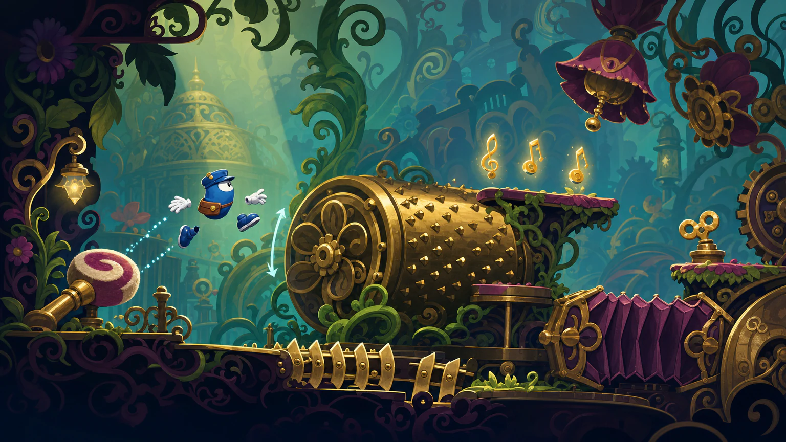

**Grok Image 2 — reviewed result**

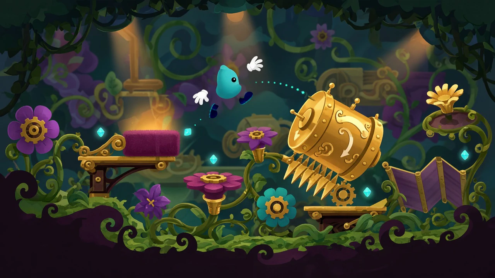
<!-- END DIRECT MODEL PAIR -->

| Registered visible style marker | GPT Image 2 | Grok Image 2 |
|---|:---:|:---:|
| Digitally rendered gouache-like color blocking and irregular silhouette edges without paper fibers | YES | YES |
| Elastic character and environmental shapes | YES | YES |
| Strong foreground gameplay and parallax-depth layer separation | YES | YES |
| Decorative readable traversal route with object-local texture and a clean image plane | YES | YES |

**GPT Image 2 verdict: YES.** Clean digitally rendered opaque color blocks, elastic floating limbs and machinery, dark foreground curls, saturated gameplay ledges, and separated parallax depth create a decorative traversable platform world without a global craft-paper substrate.

**Grok Image 2 verdict: YES.** Clean irregular silhouette layers, detached elastic hands and shoes, restrained object-local texture, strong foreground-to-backdrop separation, and an exposed sequence of platforms and hazards retain all four side-scroller markers.

**Pair outcome: `BOTH`.**

**Comparison:** Both remove the previous all-over paper and rubbed-pigment treatment: GPT is richer and more scenic, while Grok gives the cleanest and most route-explicit gameplay frame.

**Surface-finish revision:** The displayed GPT Image 2 and Grok Image 2 files are the accepted clean-digital revision originals. The earlier pair remains historical execution evidence and is not embedded. See the [`revision profiles`](evidence/surface-finish-profiles.json), [`revision execution`](evidence/surface-finish-execution.json), and [`revision review`](evidence/surface-finish-review.json).

**Evidence:** [`current paired profiles`](evidence/model-pair-profiles.json), [`validated original manifest`](evidence/model-pair-manifest.json), and [`independent category review`](evidence/model-pair-review-western.json).

#### `banner_saga_caravan_panorama_v1`

**Real-hit anchor:** [The Banner Saga](https://www.kickstarter.com/projects/stoic/the-banner-saga/description)<br>
**Reference surface:** Wide caravan-travel landscape with a tiny marching party<br>
**Shared prompt SHA-256:** `00f8f2c296bcd7f32e8a9e2173e2860ef0d8d0f6564ea10cebffc1646f1a3905`<br>
**Registered requested aspect:** `21:9`<br>
**Effective output aspects:** GPT Image 2 `21:9`; Grok Image 2 `16:9`<br>
**Model routes:** `openai/gpt-image-2` and `x-ai/grok-imagine-image-2.0`

**Exact provider prompt shared byte-for-byte by both models**

> Use case: story-map travel panorama for a solemn 2D tactical role-playing game.
> Asset type: ultrawide caravan landscape with small marching figures, not tactical combat or dialogue portrait art.
> Primary request: Show an original column of refugees crossing a frozen red-grass valley beneath three monumental stone arches. The travelers occupy only the lower tenth of the frame as small dark figures with angular cloaks, wagons, horned pack animals, and one tall plain banner, emphasizing the hostile scale of the land.
> Style: flattened mid-century animation-background design; hard-edged mountain shapes, elegant tapering trees, long horizontal snow bands, restrained surface texture, muted slate blue, weathered cream, oxblood red, charcoal, and a pale low sun producing simple graphic shadows; decisive figure contours with distant terrain kept largely lineless and shape-driven.
> Composition: Use monumental horizontal bands and ample negative sky. Maintain clear left-to-right procession and an emotion of solemn endurance rather than heroic combat.
> Constraints: no text, logo, interface, grid, specific cultural symbol, copied costume, glossy rendering, detailed faces, modern equipment, atmospheric photorealism, or fantasy spectacle effects.

<!-- BEGIN DIRECT MODEL PAIR -->
**GPT Image 2 — reviewed result**

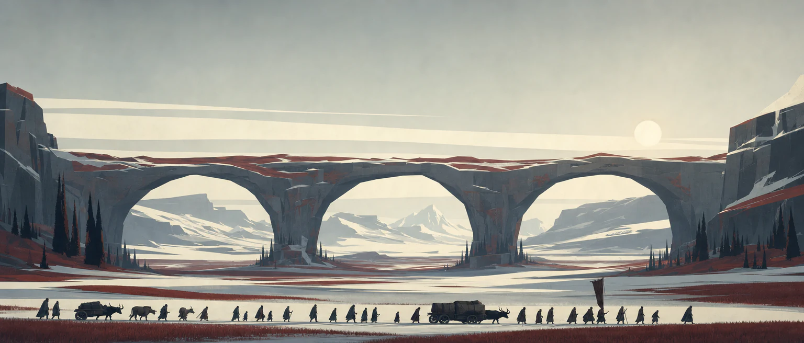

**Grok Image 2 — reviewed result**

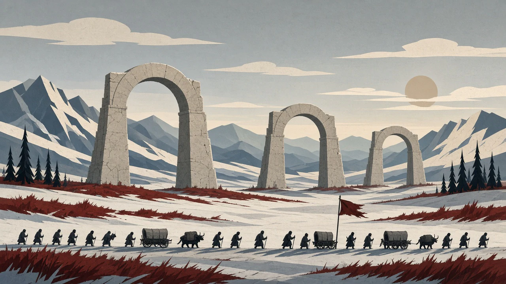
<!-- END DIRECT MODEL PAIR -->

| Registered visible style marker | GPT Image 2 | Grok Image 2 |
|---|:---:|:---:|
| Tiny caravan contrasted against monumental horizontal landscape | YES | YES |
| Flattened hard-edged mid-century background shapes | YES | YES |
| Muted Nordic palette with one recurring banner accent color | YES | YES |
| Decisive figure contours but largely lineless distant terrain | YES | YES |

**GPT Image 2 verdict: YES.** A minute dark caravan crosses a monumental ultra-wide snowfield under hard-edged flattened arches, muted blue-gray and ivory planes, one oxblood banner, crisp figures and lineless distant terrain.

**Grok Image 2 verdict: YES.** Tiny silhouetted travelers and wagons remain subordinate to austere geometric mountains and arches, using a muted Nordic palette, one red banner accent, decisive figure contours and flat distant shapes.

**Pair outcome: `BOTH`.**

**Comparison:** GPT sustains the more monumental 21:9 scale; Grok's 16:9 fallback compresses the panorama but does not materially weaken the caravan-to-landscape contrast or flattened shape language.

**Aspect-fallback note:** GPT returned the requested `21:9`. Grok exhausted the unchanged prompt at `21:9`, then returned the reviewed source output represented by the preview at `16:9`. The prompt stayed byte-identical; only the output aspect changed. See [`failure classification`](evidence/model-pair-failure-classification.json) and [`aspect-fallback execution`](evidence/model-pair-aspect-fallback-execution.json).

**Evidence:** [`current paired profiles`](evidence/model-pair-profiles.json), [`validated original manifest`](evidence/model-pair-manifest.json), and [`independent category review`](evidence/model-pair-review-western.json).

### Reading the outcomes

- `BOTH`: both models made the registered style recognizable.
- `GPT_ONLY`: GPT Image 2 made it recognizable; Grok Image 2 did not.
- `GROK_ONLY`: Grok Image 2 made it recognizable; GPT Image 2 either did not
  or returned no image. The entry and index distinguish `NO` from `BLOCKED`.
- `NEITHER`: neither model made the registered style recognizable.
- `BLOCKED` is not a style-recognition verdict. For aggregate pair outcomes only,
  a blocked output occupies the false side while remaining explicitly labeled.

A model verdict applies only to the exact prompt, prompt hash, effective aspect
ratio, route, and reviewed originals recorded here. It does not claim ownership
of a game's visual identity or authorize redistribution of game artwork. This
gallery contains generated originals, not copies of the linked reference art.

## Candidate keyword inventory

All candidates below start with evidence status `untested`. Priority values mean:
`high`, `medium`, or `low` test value; `control` for an intentionally broad
baseline; `context` for a non-style term that should remain fixed; `reject` for
a term that is already unsuitable as a canonical style ID; and `restricted`
for a term that needs extra safety, cultural, or rights review. None of these
priority values claims model recognition.

Priority is also separate from eligibility. Each tested record receives one
hard `term_kind`:

- `style_candidate`: a visible medium, line, shading, color, surface, or
  character-grammar control that may enter atomic testing;
- `diagnostic_label`: an umbrella, demographic, market, affective, or cultural
  shorthand worth probing for model behavior but not canonicalizing without
  decomposition;
- `context_only`: a production role, genre, subject, layout, camera, or pose;
  and
- `reject`: unsafe, product-derived, incoherent, or irrelevant vocabulary.

Only `style_candidate` enters the atomic promotion path. A high-priority
`diagnostic_label` may reveal a useful or stereotyped model association, while a
high-priority `context_only` term may expose a confound; neither is thereby a
style control.

### Contemporary Japanese illustration and publishing labels

| Candidate keyword or alias | Primary class | Expected signal or reason to test | Priority |
| --- | --- | --- | --- |
| `anime`, `anime style`, `Japanese anime illustration` | umbrella label | Broad baseline; likely too underspecified for micro-control | control |
| `manga`, `manga style` | umbrella/format label | May change monochrome treatment or page grammar instead of rendering | control |
| `anime cel rendering`, `cel-shaded anime` | shading and production family | Flat fills, crisp contours, discrete shadow shapes | high |
| `hard cel shading` | shading model | Sharp one- or two-band shadow boundaries | high |
| `soft cel shading` | shading model | Cel structure with selectively softened transitions | high |
| `flat-color anime` | shading model | Minimal modeled form; must not merely look unfinished | high |
| `multi-band cel shading` | shading model | Several discrete tone regions without continuous gradients | high |
| `cel-painterly hybrid`, `painterly cel` | rendering compound | Cel structure plus selective modeled brush rendering | high |
| `painterly anime` | rendering compound | Anime design grammar with continuous painted form | high |
| `semi-realistic anime` | design/rendering compound | More grounded anatomy and planes; too broad unless decomposed | medium |
| `monochrome manga ink` | medium/line family | Black ink, value grouping, no page-layout requirement | high |
| `screentone manga` | surface/shading family | Mechanical tone textures with inked contours | high |
| `halftone manga` | surface/shading alias | Possible partial alias of `screentone manga` | medium |
| `shonen manga visual dialect`, `shounen manga` | publishing dialect | Test angularity, bold contour, graphic contrast, and motion-language leakage | high |
| `shojo manga visual dialect`, `shoujo manga` | publishing dialect | Test fine line, decorative abstraction, eye treatment, and soft/open value grouping | high |
| `seinen manga visual dialect` | publishing dialect | Diverse adult-male market shorthand; likely conditional | medium |
| `josei manga visual dialect` | publishing dialect | Diverse adult-women market shorthand; likely conditional | medium |
| `kodomomuke`, `kodomo manga` | publishing dialect | Simplification and bright readability; may leak child subject matter | medium |
| `gekiga` | comic movement/dialect | Grounded anatomy, dramatic black shapes, texture, cinematic severity | high |
| `moe`, `moe-kei` | affect/design shorthand | Test soft facial grammar and endearing affect; not a rendering method | high |
| `kawaii` | affect | Rounded, low-threat, compact, bright or pastel tendencies; very broad | medium |
| `yuru-kawa`, `yurukawa` | affect/line compound | Loose, relaxed, understated cute treatment | medium |
| `kimo-kawaii` | affect compound | Grotesque-cute; likely subject leakage | low |
| `yume-kawaii` | affect/aesthetic compound | Dreamy pastel cute; likely fashion and mood leakage | low |
| `yami-kawaii` | affect/aesthetic compound | Cute-dark shorthand; safety-sensitive motif leakage makes it non-priority | restricted |
| `bishoujo`, `bishōjo` | market/character archetype | Attractive feminine character category, not a rendering style; any diagnostic test requires a clearly adult fixed subject | context |
| `bishounen`, `bishōnen` | market/character archetype | Elegant or androgynous masculine character category, not a rendering style; any diagnostic test requires a clearly adult fixed subject | context |
| `chibi` | character-design grammar | Large head, compact body, simplified extremities and features | high |
| `super-deformed`, `super deformed` | character-design grammar | Extreme deliberate proportion deformation; more precise than `SD` | high |
| `SD` | ambiguous alias | Could mean super-deformed or a technical abbreviation; test as an exact alias | high |
| `mini-character`, `mini character`, `mini-chara` | design/production shorthand | Compact variant, possibly less extreme than chibi | high |
| `puchi-character`, `petit character` | design/production shorthand | Extra-small collectible or mascot variant; weakly standardized | low |
| `kawaii mascot` | affect/design/role compound | Iconic compact forms; mixes anatomy and asset purpose | high |
| `yuru mascot` | affect/design compound | Loose, friendly municipal-style mascot shorthand; likely subject-heavy | medium |
| `heta-uma` | drawing aesthetic | Deliberately awkward or naive but compelling; risk of merely low quality | high |
| `gag manga` | genre/dialect compound | Deformation and graphic reaction language; genre confound | low |
| `visual novel illustration` | production dialect | Polished character-focused game illustration; broad | high |
| `visual novel character sprite`, `tachie` | production role/dialect | Standing character treatment; layout is not style | context |
| `visual novel event CG`, `event CG` | production role/dialect | Narrative still role; polish and composition do not define a style | context |
| `light novel illustration` | publishing dialect | Character-led polished illustration with white-space or cover/interior conventions | high |
| `otome game illustration` | market/production dialect | Refined character presentation; may change subject and framing | high |
| `anime key visual` | production role/dialect | Ensemble or promotional finish; layout-heavy | medium |
| `anime film background` | production role/dialect | Environment role; test explicit paint, depth-plane, and surface facets instead | context |
| `mobile RPG character illustration` | market/production dialect | High-finish game character rendering; broad and trend-sensitive | high |
| `mobile game card illustration`, `gacha card art` | market/production dialect | Card role and monetization context; dense effects or framing would be role leakage | context |
| `JRPG character illustration` | market/genre umbrella | Broad negative control; should not become canonical alone | control |
| `mecha anime illustration` | subject/genre compound | Mechanical subject more than style | context |
| `magical-girl illustration` | subject/genre compound | Costume and genre more than rendering | context |
| `kemono illustration` | subject morphology | Animal-humanoid design, not rendering style | context |
| `retro anime` | era umbrella | Too broad; use only as a negative control | control |
| `1970s shojo manga` | era/publishing dialect | Era plus dialect may be more separable than decade alone | medium |
| `1980s hand-painted cel anime` | era/technique compound | Analog cel edges, flat paint, period color and line tendencies | high |
| `1990s hand-painted cel anime` | era/technique compound | Compare directly with 1980s and early digital | high |
| `early-2000s digital anime` | era/technique compound | Early digital color and compositing tendencies; avoid costume confound | high |
| `contemporary digital anime` | era/technique baseline | Current broad production baseline, not an endpoint | medium |
| `four-panel manga`, `4-koma`, `yonkoma` | layout format | Sequential layout, not illustration style | context |
| `doujinshi` | publishing mode | Self-publishing category, not style | reject |
| `sakuga` | animation craft | Motion/performance term, not a still-image style | reject |

`Moe` stays in the inventory because users and models may employ it as a visual
shorthand, but research describes it primarily as a response to fictional
characters rather than one fixed style. The experiment must therefore test the
bare word and a separately authored observable-trait expansion. A bare-word
success would establish model behavior, not settle the cultural definition.

### Japanese historical painting, print, and craft lineages

| Candidate keyword or alias | Primary class | Expected signal or caveat | Priority |
| --- | --- | --- | --- |
| `ukiyo-e` | print/genre lineage | Flat shape, carved contour, period print color; likely costume and subject leakage | high |
| `Japanese woodblock print` | medium/technique | Broader process description for comparison with `ukiyo-e` | high |
| `moku-hanga` | woodblock technique | Compare exact loanword with generic process wording | medium |
| `nishiki-e` | multicolor woodblock print lineage | Rich multicolor woodblock print treatment; may default to Edo subject matter | medium |
| `shin-hanga` | modern print movement | Polished collaborative-print finish, often atmospheric | high |
| `sosaku-hanga`, `sōsaku-hanga` | creative-print movement | Ideology of self-drawing, self-carving, and self-printing; rough finish is not guaranteed | medium |
| `Rinpa`, `Rimpa` | decorative painting lineage | Bold abbreviated natural motifs, pattern, rich pigment, metallic grounds | high |
| `yamato-e` | classical painting lineage | Stylized figures, bright pigment, cloud-divided space; subject leakage likely | medium |
| `Nihonga` | modern Japanese painting tradition | Mineral-pigment-like surface and traditional material cues; internally diverse | high |
| `yoga`, `yōga` | modern Western-style painting category in Japan | Historical contrast to `Nihonga`; internally diverse and not one renderer | medium |
| `sumi-e` | ink-painting shorthand | Monochrome brush economy and tonal wash | high |
| `suibokuga` | ink-wash painting | Close alias test against `sumi-e` | high |
| `nanga`, `bunjinga` | literati painting lineage | Calligraphic brush and learned landscape conventions | medium |
| `Maruyama-Shijo`, `Shijo school` | painting lineage | Naturalistic observation with decorative brush economy | medium |
| `Tosa-school painting` | courtly painting lineage | Fine line, bright opaque color, classical subjects | low |
| `Kano-school painting` | ink/decorative lineage | Strong brush, monochrome-to-gold decorative range; very broad | low |
| `kirie` | cut-paper technique | Crisp silhouette, negative space, layered paper edges | high |
| `tarashikomi` | wet-in-wet technique | Pooled pigment or ink blooming inside forms | medium |
| `mokkotsu` | outline-free method | Boneless color or ink forms without enclosing contour | medium |
| `gofun pigment` | material/surface cue | Opaque shell-white-like highlights and matte surface | low |
| `emaki`, `emakimono` | narrative handscroll format | Composition/format more than style | context |
| `kamishibai illustration` | paper-theater role | Bold readable narrative panels; role and era compound | medium |
| `ehon illustration` | picture-book form | Too broad without period, medium, or line qualifiers | control |
| `bijin-ga` | subject genre | Pictures of beauties, not a generic style | context |
| `kacho-ga`, `kachō-ga` | subject genre | Bird-and-flower subject, not generic style | context |
| `meisho-e` | subject genre | Famous-place imagery, not generic style | context |

### Korean illustration and painting labels

| Candidate keyword or alias | Primary class | Expected signal or caveat | Priority |
| --- | --- | --- | --- |
| `manhwa` | comics umbrella | Diagnostic baseline; not one style | control |
| `webtoon` | digital-comic format | Digital publication category; vertical scrolling and full color are common, not universal | control |
| `full-color vertical webtoon` | format/production compound | Tests common mobile-panel conventions; still not a rendering style | medium |
| `Korean webtoon rendering` | market shorthand | Test model stereotype, not cultural truth | high |
| `romance-fantasy webtoon` | genre/market compound | Polished figures, fashion, glow; strong costume/content confound | medium |
| `action webtoon` | genre/market compound | Contrast, modeled bodies, effects; strong action/layout confound | medium |
| `sunjeong manhwa` | publishing category | Romance/female-market lineage; likely content leakage | medium |
| `sonyeon manhwa` | publishing category | Youth/boys-market lineage; likely action leakage | medium |
| `minhwa` | broad folk-painting category | Internally diverse and historically constructed; test named subgenres and visible facets | high |
| `sumukhwa` | ink painting | Korean ink-painting shorthand; compare with generic ink wash | high |
| `chaekgeori` | books-and-things still-life genre | Broad books-and-objects imagery; subject-bound but useful for prop scenes | high |
| `chaekgado` | bookshelf/cabinet composition | Structured shelving or cabinet arrangement; a narrower composition than `chaekgeori` | medium |
| `munbangdo` | scholar-studio genre | Objects of learning; subject-bound | medium |
| `munjado` | character/rebus folk painting | Written characters and rebus relationships are essential; requires a dedicated text-compatible, culturally reviewed carrier | restricted |
| `dancheong` | architectural polychrome system | Material, symbolic, structural, and religious context; not a generic pattern modifier | restricted |
| `jinchae`, `jinchaehwa` | Korean heavy-color painting | Dense mineral-like color and layered opaque finish; terminology and lineage need practitioner review | medium |
| `jingyeong sansuhwa`, `true-view landscape` | landscape tradition | Subject-bound | low |
| `pungsokhwa` | genre painting | Everyday-life subject genre | low |
| `dansaekhwa`, `tansaekhwa` | modern art movement | Material monochrome abstraction; low priority for game assets | low |

`Webtoon` must not be promoted as a style merely because a model emits a
vertical comic. Full color and vertical scrolling are common production
conventions, not universal requirements; any claimed rendering dialect needs
separate visible evidence.

### Chinese illustration and painting labels

| Candidate keyword or alias | Primary class | Expected signal or caveat | Priority |
| --- | --- | --- | --- |
| `manhua` | comics umbrella | Diagnostic baseline; not one style | control |
| `donghua` | animation umbrella | Medium/industry label, not a still style | control |
| `guoman` | domestic-sector shorthand | Market label, not stable visual definition | control |
| `guofeng` | fluid contemporary discourse/marketing label | Heritage cues may appear through pattern, palette, costume, or setting rather than rendering | high |
| `gufeng` | fluid contemporary ancient-style label | Often more costume and setting than rendering; not a fixed tradition | high |
| `guochao` | fluid contemporary marketing/design label | Graphic, fashion, and branding associations; not a fixed historical tradition | medium |
| `gongbi` | meticulous brush method | Controlled fine line, layered color, exact detail | high |
| `xieyi` | expressive/freehand method | Economical, spontaneous brush gestures | high |
| `baimiao` | line method | Plain ink line without shading | high |
| `mogu` | outline-free method | Boneless color forms without ink contour | medium |
| `shuimo`, `Chinese ink wash` | ink-wash tradition | Tonal ink, brush economy, paper reserve | high |
| `qinglu shanshui`, `qinglü shanshui`, `blue-green landscape painting` | landscape/color lineage | Mineral blue-green color; subject-bound | medium |
| `gongbi zhongcai`, `meticulous heavy-color painting` | method/color compound | Fine controlled line with layered saturated color | medium |
| `jiehua`, `ruled-line painting` | architectural drawing method | Ruled-line precision for buildings; strongly subject-bound | medium |
| `shan shui` | landscape genre | Subject, not general style | context |
| `Chinese ink-wash animation` | animation lineage | Economical brush forms, tonal wash, reserved paper, and frame-to-frame transformation cues | medium |
| `Dunhuang mural-inspired` | historical corpus reference | Mineral color and mural surface; requires culturally careful review | medium |
| `Tang mural-inspired` | era/corpus shorthand | Broad and subject-prone | low |
| `Chinese paper-cut` | folk medium | Strong positive/negative silhouettes and limited flat color | high |
| `nianhua` | New Year print tradition | Folk-print surface and festive iconography; subject leakage likely | medium |
| `lianhuanhua` | sequential picture-book form | Format and historical production shorthand | low |
| `yuefenpai` | calendar-poster genre | Polished period commercial illustration; layout/subject bound | medium |
| `Q-version`, `Q-style` | chibi-like market shorthand | Compare with `chibi` and `super-deformed`; exact alias may be unstable | medium |
| `wuxia`, `xianxia`, `xuanhuan` | narrative genres | Setting, costume, and effects rather than style | context |

### Global comics, publishing, and commercial-illustration labels

These labels are worth knowing, but market and format labels remain conditional
until their visible effects are isolated.

- Comics lineages: `American comic book`, `superhero comic`, `Golden Age comic`,
  `Silver Age comic`, `pulp comic`, `newspaper comic strip`, `Sunday comic`,
  `underground comix`, `alternative comic`, `indie comic`, `graphic novel`,
  `noir graphic novel`, `woodcut novel`, `European comic`, `Franco-Belgian
  comic`, `bandes dessinees`, `ligne claire`, `Marcinelle school`, `Italian
  fumetti`, `British adventure comic`, `editorial cartoon`, `caricature`.
- Book and editorial roles: `children's picture-book illustration`, `nursery-book
  illustration`, `chapter-book illustration`, `middle-grade cover
  illustration`, `young-adult cover illustration`, `storybook illustration`,
  `fairy-tale illustration`, `folk-tale illustration`, `spot illustration`,
  `editorial illustration`, `fashion illustration`, `botanical illustration`,
  `scientific illustration`, `technical illustration`, `infographic
  illustration`, `travel-poster illustration`, `pulp-magazine cover`,
  `mid-century editorial illustration`.
- Game and entertainment roles: `concept art`, `character concept art`,
  `environment concept art`, `prop concept art`, `key art`, `splash art`,
  `cutscene illustration`, `loading-screen illustration`, `collectible-card
  illustration`, `quest illustration`, `chapter illustration`, `map
  illustration`, `matte-painted background`, `parallax background`, `UI
  illustration`, `game icon`, `effect illustration`.

### Medium and production-process keywords

These are often more controllable than cultural umbrellas:

- Drawing: `graphite pencil`, `colored pencil`, `charcoal`, `chalk`, `wax
  crayon`, `oil pastel`, `soft pastel`, `marker illustration`, `pen and ink`,
  `brush and ink`, `ink wash`, `scratchboard`.
- Paint: `transparent watercolor`, `opaque watercolor`, `gouache`, `tempera`,
  `acrylic painting`, `oil painting`, `fresco`, `airbrush`, `digital painting`,
  `digital airbrush`, `matte painting`.
- Print: `woodcut`, `linocut`, `engraving`, `etching`, `lithograph`,
  `screenprint`, `silkscreen`, `stencil duplicator print`, `stencil print`, `monotype`,
  `newsprint comic`, `two-color print`, `four-color process print`.
- Constructed media: `paper-cut illustration`, `layered paper cutout`,
  `collage`, `photomontage`, `silhouette cutout`, `shadow-puppet illustration`,
  `stained-glass illustration`, `mosaic illustration`, `tapestry-like
  illustration`, `embroidered illustration`, `felt-craft illustration`,
  `papercraft`, `clay-like illustration`.
- Digital/game media: `flat vector illustration`, `geometric vector
  illustration`, `pixel art`, `1-bit pixel art`, `indexed-palette pixel art`,
  `dithered pixel art`, `high-resolution pixel art`, `isometric pixel art`,
  `voxel art`, `low-poly render`, `toon-shaded 3D`, `2D-3D hybrid`,
  `pre-rendered sprite`, `paper-cut render`, `clay-like render`.

`Risograph` is a product-derived name. It may be retained in private search
notes as an alias for model-diagnostic research, but repository prompts and
canonical profiles use `stencil duplicator print`, `stencil print grain`, and
`multi-pass print misregistration` instead.

### Line and mark-making keywords

- Contour presence: `lineless`, `contourless`, `selective outlines`, `broken
  contour`, `enclosed contour`, `colored lineart`, `dark contour`.
- Line weight: `monoline`, `uniform thin line`, `fine tapered line`,
  `variable-width ink`, `bold contour`, `heavy black outline`, `hairline
  contour`.
- Line character: `clean line art`, `rough line art`, `sketchy line art`, `loose
  pencil`, `construction sketch`, `clean ink`, `brush ink`, `calligraphic line`,
  `dry-brush line`, `ink feathering`, `wobbly hand-drawn line`, `angular line`,
  `rounded line`.
- Tone marks: `hatching`, `crosshatching`, `stipple`, `scribble shading`,
  `screentone`, `halftone dots`, `pixel clusters`, `ordered dithering`, `error
  diffusion dithering`, `paint daubs`, `palette-knife marks`.

### Shading and rendering keywords

- Flat families: `unshaded flat color`, `flat fill`, `value-blocked`, `one-band
  cel shading`, `two-band cel shading`, `multi-band cel shading`, `hard cel
  shading`, `soft cel shading`.
- Continuous families: `gradient shading`, `soft airbrush shading`, `continuous
  tonal rendering`, `painterly modeled shading`, `semi-realistic modeling`,
  `luminous glazing`, `volumetric shading`.
- Mark-based families: `crosshatched shadows`, `stippled shadows`, `screentone
  shadows`, `ink-wash shadows`, `dry-brush shadows`.
- Lighting modifiers: `flat ambient light`, `soft diffuse light`, `directional
  key light`, `rim light`, `backlight`, `high-key lighting`, `low-key lighting`,
  `emissive glow`, `graphic cast shadows`, `no photographic depth of field`.

Lighting is a style facet only when it describes the image treatment. It does
not replace a scene-lighting or camera contract.

### Palette and value keywords

- Palette size: `one-bit monochrome`, `grayscale`, `duotone`, `tritone`,
  `four-color palette`, `eight-color palette`, `sixteen-color palette`,
  `limited palette`, `indexed palette`, `full-color`.
- Value: `high-key`, `low-key`, `high contrast`, `low contrast`, `compressed
  values`, `graphic black shapes`, `pale value range`.
- Saturation and family: `pastel`, `muted`, `desaturated`, `high saturation`,
  `candy-colored`, `jewel-toned`, `earth-toned`, `neon-accented`, `fluorescent`,
  `sepia`, `faded print palette`.
- Relationships: `monochromatic`, `analogous palette`, `complementary palette`,
  `split-complementary palette`, `triadic palette`, `warm-biased`,
  `cool-biased`, `warm-cool split`, `chromatic shadows`, `selective color`,
  `color-blocked`.

### Surface and texture keywords

- Substrate: `smooth digital surface`, `paper grain`, `hot-press paper`,
  `cold-press paper`, `rough watercolor paper`, `canvas tooth`, `newsprint`,
  `fibrous handmade paper`, `aged paper`.
- Pigment and paint: `watercolor bloom`, `watercolor backrun`, `pigment
  granulation`, `gouache dry brush`, `chalk dust`, `pastel grain`,
  `colored-pencil tooth`, `crayon wax`, `paint impasto`, `matte paint`, `glossy
  airbrush`.
- Print and capture: `woodgrain`, `uneven ink coverage`, `ink bleed`,
  `screenprint distress`, `stencil print grain`, `multi-pass print misregistration`, `halftone
  screen`, `screentone`, `analog cel texture`, `film grain`, `registration
  marks`.
- Digital finish: `clean raster`, `subtle digital grain`, `clustered noise`,
  `soft bloom`, `crisp edges`, `anti-aliased edges`, `pixel-sharp edges`.

### Character proportion, face, and shape-language keywords

These affect style strongly but apply primarily to characters. They should not
be used to judge environment-only transfer.

- Measured proportion: `2-head-tall`, `2.5-head-tall`, `3-head-tall`,
  `4-head-tall`, `5-head-tall`, `6-head-tall`, `7.5-head-tall`, `8-head-tall`,
  `big-head small-body`, `compact proportions`, `elongated proportions`,
  `heroic proportions`, `adult anime proportions`.
- Build and silhouette: `rounded silhouette`, `angular silhouette`, `geometric
  shape language`, `organic shape language`, `soft shape language`, `chunky`,
  `stocky`, `slender`, `lanky`, `long-legged`, `top-heavy`, `bottom-heavy`,
  `doll-like`, `mascot-like`, `silhouette-led design`.
- Facial grammar: `oversized irises`, `small irises`, `round eyes`,
  `almond-shaped eyes`, `narrow eyes`, `single eye highlight`, `dense eye
  highlights`, `heavy eyelash emphasis`, `minimal nose`, `simplified mouth`,
  `pointed chin`, `rounded jaw`, `flat facial planes`, `modeled facial planes`,
  `doll-like face`, `graphic face`.
- Simplification: `simplified hands and feet`, `anatomically articulated hands`,
  `stubby limbs`, `slender limbs`, `broad-shouldered silhouette`, `reduced facial
  detail`, `iconic expression shapes`.

### Detail, depth, and finish keywords

- Detail: `minimalist`, `sparse detail`, `focal detail`, `uniform detail`, `dense
  detail`, `maximalist`, `ornamental`, `decorative`, `intricate`, `filigree`,
  `low-frequency shapes`, `high-frequency detail`.
- Finish: `rough sketch`, `clean finish`, `polished illustration`, `graphic
  finish`, `painterly loose finish`, `flat finish`, `semi-flat finish`,
  `luminous finish`, `matte finish`, `glossy finish`, `crisp finish`, `grainy
  finish`.
- Pictorial depth: `no depth cues`, `overlap depth`, `value-separated depth`,
  `atmospheric depth`, `linear-perspective depth`, `flattened decorative space`,
  `volumetric depth`, `layered theatrical depth`.
- Optical treatment: `no blur`, `soft focus`, `dreamy bloom`, `vignette`,
  `chromatic fringe`, `depth-of-field effect`, `motion smear`. These must not be
  confused with runtime camera or animation behavior.

### Art-history and design-movement keywords

These can be productive for cutscenes, environments, cards, UI, or promotional
art. They remain historically broad and should be paired with visible traits
rather than treated as magic words.

- Decorative and graphic: `Art Nouveau`, `Jugendstil`, `Art Deco`, `Arts and
  Crafts`, `Bauhaus`, `Constructivist`, `De Stijl`, `Suprematist`, `Futurist`,
  `Op Art`, `Pop Art`, `Psychedelic poster`, `mid-century modern`, `brutalist
  graphic design`, `retro travel poster`.
- Painterly and expressive: `Impressionist`, `Post-Impressionist`,
  `Expressionist`, `German Expressionist woodcut`, `Symbolist`, `Romantic`,
  `Rococo`, `Baroque`, `Neoclassical`, `Pre-Raphaelite`, `naive art`, `folk
  modernist`.
- Narrative and manuscript: `medieval illuminated manuscript`, `Byzantine icon`,
  `Persian miniature`, `Mughal miniature`, `Indian miniature painting`,
  `Ethiopian manuscript illumination`, `folk woodcut`, `paper theater`,
  `shadow-puppet`, `storybook engraving`.
- Folk and regional traditions requiring careful cultural review: `Mithila
  painting`, `Madhubani painting`, `Warli painting`, `Pattachitra`, `Kalamkari`,
  `Korean minhwa`, `Mexican retablo`, `papel picado`, `Dong Ho woodblock print`,
  `Chinese paper-cut`, `Japanese kirie`.

Heritage terms may carry subject, religious, ceremonial, or geographic meaning
that cannot be reduced to surface decoration. They require stronger sourcing
and review before canonical use.

### Aesthetic and story bundles that must remain contextual

The following words can create visually obvious changes, but they mix genre,
setting, fashion, mood, palette, and props. They are useful content direction,
not clean style controls:

`whimsical fantasy`, `heroic fantasy`, `dark fantasy`, `cozy fantasy`, `gothic
fantasy`, `fairy-tale`, `storybook fantasy`, `science fantasy`, `steampunk`,
`dieselpunk`, `cyberpunk`, `solarpunk`, `biopunk`, `retrofuturism`, `Afrofuturism`,
`cottagecore`, `fairycore`, `dreamcore`, `weirdcore`, `vaporwave`, `synthwave`,
`Y2K`, `dark academia`, `pastel goth`, `gothic`, `cute`, `cool`, `cinematic`,
`beautiful`, `stylized`, `premium`, `high quality`.

The quality fillers at the end should not enter canonical style records.

### Production-role vocabulary kept outside style

The experiment must name a role explicitly without treating it as style:

- Character and dialogue: `standing character illustration`, `tachie`,
  `dialogue portrait`, `bust portrait`, `visual-novel character sprite`,
  `expression portrait`, `cut-in illustration`, `UI portrait`, `avatar icon`,
  `paper-doll layer`, `costume layer`.
- Narrative and promotional: `event illustration`, `event CG`, `story still`,
  `cutscene still`, `anime key visual`, `promotional key art`, `gacha splash
  illustration`, `collectible-card illustration`, `loading-screen
  illustration`, `light-novel cover illustration`, `light-novel interior
  illustration`, `chapter illustration`.
- World and objects: `background painting`, `environment illustration`,
  `visual-novel background`, `parallax background`, `prop illustration`, `item
  card`, `inventory icon`, `skill icon`, `quest illustration`, `map
  illustration`, `tileable texture`, `decorative UI frame`, `emblem`, `badge`,
  `sticker`.
- Production sheets: `character sheet`, `model sheet`, `expression sheet`,
  `effect sheet`, `asset sheet`, `pixel sprite`, `sprite sheet`, `storyboard
  frame`, `animatic frame`.

Ambiguous words must be expanded in records: `sprite` can mean a pixel asset or
a visual-novel standing character; `CG` can mean computer graphics generally or
a visual-novel event illustration; `key visual` and `key art` are roles; `SD`
has several technical meanings.

## Terms excluded from canonical style records

- Geography alone: `Japanese`, `Chinese`, `Korean`, `Asian`, `East Asian`.
- Generic medium alone: `2D`, `digital art`, `illustration`, `anime`, `manga`.
- Business or platform tier: `mobile game`, `AAA`, `indie`, `premium`.
- Story genre alone: `romance`, `action`, `horror`, `fantasy`, `science fiction`,
  `isekai`, `wuxia`, `xianxia`.
- Subject or archetype alone: `samurai`, `shrine maiden`, `magical girl`,
  `idol`, `mecha`, `yokai`, `kemono`, `kemonomimi`, `ikemen`.
- Composition or pose: `full body`, `close-up`, `three-quarter view`,
  `isometric`, `Dutch angle`, `attack pose`, `running`, `neutral pose`.
- Release or animation craft: `OVA`, `sakuga`.
- Quality filler: `masterpiece`, `best quality`, `official art`, `trending`.
- Any named living artist, studio, franchise, character, game, proprietary asset
  pack, or `in the style of ...` construction.

`Photorealistic`, `live-action`, `cinematic photography`, and `realistic 3D
render` are retained only as optional boundary controls. They are not part of
the initial 2D-game illustration queue.

## Concept-to-asset style-retention track

The prompt gallery above tests exact model-pair outputs. This separate retention
track tests whether a neutral descriptor profile carries from concept to focused
assets through this chain:

```text
commercially proven 2D game research anchor
    -> neutral, observable descriptor profile D
    -> original concept scene C
    -> focused character, prop, or background asset E
    -> blinded consistency and control verdict
```

The intended claim is deliberately narrow: under the recorded model and date,
an exact neutral descriptor profile controlled an original concept and helped
retain the same visual language in a focused derivative asset. Four links must
be evaluated separately:

- `D -> C`: the concept expresses the pre-registered descriptors;
- `C -> E`: the focused asset preserves the selected content identity;
- `D -> E`: the focused asset independently expresses the descriptors; and
- `C <-> E`: reviewers judge both artifacts compatible with one original game
  art bible.

A famous game can be a factual research anchor, but it is not an admissible
generation keyword in this repository. A game name may appear in human-facing
research metadata and anchor IDs, but it must not appear in a provider prompt,
model-facing style descriptor, provider metadata, or submitted reference image.
Screenshots and other proprietary game art are not submitted to the model. This
follows the repository's [OSS and IP policy](../../docs/oss-ip.md) and means this
lab does **not** claim to test whether a model recognizes a named game directly.
It tests the more reusable and redistributable descriptor set derived from
observation.

### Commercial research-anchor cohort

This cohort is a purposive style-coverage sample, not a universal sales ranking.
Unit sales, players, downloads, revenue, awards, and cultural prominence are
different evidence types and must never be combined into one leaderboard. A
game enters the primary cohort only when:

1. a developer, publisher, platform owner, audited filing, or strong secondary
   report supports its commercial or iconic significance;
2. 2D or 2D-dominant art materially defines its player-facing presentation;
3. its observable treatment adds a useful contrast to the cohort; and
4. at least two analysts independently code its style facets and reconcile
   disagreements.

Each anchor records:

```text
research_anchor_id
game_name
anchor_version_or_asset_family
evidence_type
evidence_value
evidence_as_of
evidence_source
2d_relevance
observed_asset_roles
line_facets
shading_facets
color_facets
surface_facets
character_grammar
analyst_1
analyst_2
agreement_notes
neutral_profile_id
```

The initial sourced cohort and its analyst-coded profiles appear below; the
experiment protocol follows them. Commercial evidence proves only that an
anchor is worth studying; the neutral facet descriptions are analyst
observations, not claims made by the cited sales source.

The following research pool is intentionally broader than the first generation
wave. Every candidate profile remains `untested`.

| ID | Evidence-only game anchor and commercial signal | Neutral visual-analysis hypothesis | Useful concept-to-asset transfer | Candidate profile ID |
| --- | --- | --- | --- | --- |
| `a01` | **Terraria** — [70 million copies as of May 2026](https://steamcommunity.com/games/105600/announcements/detail/662735945909403987), developer announcement | Modern detail-dense side-view pixel art; crisp clusters; selective contours; tile-aligned terrain; biome-specific saturated palettes; layered scenic depth | Scene to player, tool, tile, and parallax biome; preserve effective pixel size and material clusters | `modern_tile_sideview_pixel` |
| `a02` | **Stardew Valley** — [over 41 million copies as of December 2024](https://www.stardewvalley.net/press/), developer press page | Modern low-resolution oblique top-down tile art; compact sprites; warm seasonal palettes; restrained per-object shading; high material readability | Farm scene to world-scale resident sprite, hand tool, crop, and modular tiles; larger dialogue portraits are a separate later system | `warm_tile_pixel` |
| `a03` | **Castle Crashers** — [over 20 million copies by 2019](https://blog.thebehemoth.com/category/castle-crashers/page/23/), developer post | Heavy black contour; bright flat fills; sparse cel-like shadow; compact geometric characters; clean vector-like edges; layered flat scenery | Battle scene to character, weapon, effect, and castle plate; pin original/remastered versus later redesigns before testing | `flat_bold_cartoon` |
| `a04` | **Hollow Knight** — [about 15 million copies reported from a 2025 developer interview](https://www.nintendolife.com/news/2025/08/hollow-knight-has-now-sold-almost-15-million-copies), strong secondary source | Hand-drawn 2D; clean dark contours; pale focal silhouettes; restrained character color; dark layered environments; soft atmospheric depth | Exploration scene to an original, non-mask-like traveler, relic, foreground prop, and background plate; preserve value separation | `inked_atmospheric_fantasy` |
| `a05` | **Dead Cells** — [more than 11 million players](https://motiontwin.com/), current developer page; player count, not unit sales | High-resolution pixel-rendered 2D; decisive silhouettes; dense environment texture; saturated emissive accents; strong depth separation; substantially 3D-derived animation | Combat scene to player, weapon, effect sprite, and environment module; separate runtime particles and glow from sprite style | `luminous_pixel_rendered_action` |
| `a06` | **Cuphead** — [over 3 million copies in the developer's 2018 milestone](https://studiomdhr.com/cuphead-goes-triple-platinum/); its [press kit](https://studiomdhr.com/press-kits/) documents the production treatment | Rubber-hose character grammar; variable hand-inked contour; flat cel color; watercolor environment; analog capture texture | Scene to character, prop, effect, and watercolor background; role surfaces differ but must retain one analog art direction | `analog_cel_watercolor` |
| `a07` | **Balatro** — [over 5 million units as of January 2025](https://www.playstack.com/news/balatro-5-million-copies-sold/), publisher announcement | Low-resolution card/UI raster art; hard-edged symbols; dithered texture; saturated limited colors; scanline and chromatic-fringe post-processing | Card-table system to card vignette, token, pack, icon, and abstract field; specialist UI track, not the main scene benchmark | `low_resolution_card_ui` |
| `a08` | **Shovel Knight: Treasure Trove** — [over 2 million copies by 2018](https://old.yachtclubgames.com/2018/04/two-million-copies-of-shovel-knight-sold/), developer breakdown | 8-bit-inspired modern pixel art; small deliberate palette groups; crisp clusters; chunky silhouettes; discrete shading; modern animation and parallax | Side-view concept to an original non-horned player, non-shovel tool, enemy, and tile; strongest first grid-retention test | `eight_bit_inspired_modern_pixel` |
| `a09` | **Dungeon&Fighter** — [over 850 million registered users and US$22 billion lifetime gross revenue](https://www.nexon.co.jp/en/ir/our-business/); publisher also identifies the original as a 2D side-scroller | Hand-authored pixel figures; decisive silhouettes; strong value separation; dense equipment hierarchy; oversized effect accents | Encounter to player, enemy, item, effect, and higher-detail portrait; test controlled detail translation | `high_detail_action_pixel` |
| `a10` | **MapleStory** — [over 250 million registered users and US$5 billion lifetime gross revenue](https://www.nexon.co.jp/en/ir/our-business/), publisher profile | Head-heavy compact pixel figures; rounded silhouettes; bright flat color; minimal facial marks; highly readable small props | Town to NPC sprite, monster, prop, icon, and tile; test identity under aggressive simplification | `compact_bright_pixel` |
| `a11` | **Ace Attorney series** — [15 million series unit sales as of June 30, 2026](https://www.capcom.co.jp/ir/english/business/salesdata.html), publisher data | Clean controlled contours; restrained cel shading; caricatured adult facial planes; readable reaction silhouettes; orderly interior plates | Original event scene to speaking portrait, reaction frame, evidence prop, and background plate | `clean_cel_portrait` |
| `a12` | **Puzzle & Dragons** — [64 million Japanese downloads as of June 2026](https://www.gungho.co.jp/jp/news/ccjg5s00000000z0.html) and [16 million North American downloads as of December 2025](https://www.gungho.co.jp/jp/news/ccjg5s00000000vf-att/pr_20251210.pdf); regional counts are not summed | Fine contour; dense fantasy focal rendering; dominant attribute color; cel-painterly shading; layered effect shapes | Original unit scene to full illustration, portrait crop, small icon, and effect token; reduce particles before silhouette or face | `dense_fantasy_unit` |
| `a13` | **Monster Strike** — [over 65 million users worldwide as of December 2025](https://mixi.co.jp/en/news/2026/0416/52335/), publisher statement; user count, not sales | Compact caricature-to-anime proportions; bold colored contour; bright cel/gradient finish; action-forward silhouette; medallion-friendly focal design | Original unit scene to portrait medallion, compact token, skill icon, and effect; preserve proportion and dominant color | `bright_medallion_unit` |
| `a14` | **Octopath Traveler series** — [over 7 million shipments and downloads as of March 2026](https://www.square-enix.com/asia/newsportal/en/sg/octopathtraveler0/), publisher page | Low-resolution pixel figures in dimensional, material-rich environments; atmospheric focus; volumetric light; selective edge softness | Scene to pixel figure, prop, modular background element, and effect; translate rather than copy scene lighting into the sprite | `dimensional_pixel_translation` |
| `a15` | **Dave the Diver** — [over 5 million units](https://www.nexon.co.jp/en/ir/our-business/), publisher profile | Hybrid direction: expressive high-resolution pixel figures and foreground objects with smoother or 3D depth layers, underwater light, and particles | Base underwater scene to diver, tool, fish-like original creature, prop, and background; foreground and depth layers need role-scoped facets | `pixel_foreground_smooth_depth_hybrid` |

Two independent desk-research passes were reconciled into this pool. That is
enough to propose experiments, not to promote a profile. Before generation,
the record must still pin the exact game version and asset family, preserve the
two analyst notes, and resolve any remaining facet disagreement.

Two commercially important cases are held outside the first profile wave:

- **Fate/Grand Order** is a counterexample to the assumption that a successful
  game has one illustration style. Its [official character gallery](https://fate-go.us/servant/)
  credits many illustrators. A valid test would track one newly designed
  original character from full art to portrait, battle sprite, and icon; it
  must not invent a franchise-wide house renderer.
- **Persona 5 series** has [13 million blended units/downloads as of March
  2025](https://www.segasammy.co.jp/en/ir/individual/business/), but its
  combined palette, collage geometry, typography, and brush-edged silhouettes
  create a protected-similarity risk. It remains a graphic-system research
  anchor, not a generation profile, until a neutral decomposition clearly
  avoids trade dress.

The first proof wave is deliberately only five profiles whose same global
descriptor bundle can be applied fairly to a scene, character, prop, and
background. Role-system hybrids move to a later translation wave.

| Order | Profile ID | Exact frozen descriptor bundle for the exploratory run | Nearest contrast | Primary transfers | 2026-08-24 result |
| ---: | --- | --- | --- | --- | --- |
| 1 | `constrained_low_resolution_pixel_v1` | `low-resolution pixel art; limited sixteen-color palette; one-pixel dark contours; clustered two-step shading; no gradients or antialiasing` | `luminous_highres_pixel_v1` | character, prop, background tile | `exploratory`; stopped at production-pixel gate |
| 2 | `flat_bold_cartoon_v1` | `heavy dark contour; flat saturated colors; sparse one-band cel shading; compact geometric proportions; clean vector-like edges` | `clean_cel_portrait_v1` | character, prop, background plate | `exploratory`; stopped at concept content gate |
| 3 | `inked_atmospheric_2d_v1` | `smooth dark hand-drawn contour; pale focal values; restrained low-saturation palette; soft modeled shading; layered atmospheric depth` | `flat_bold_cartoon_v1` | character, relic prop, background plate | `chain_reviewed`; `recognized_cross_role`; `reference_dominant` |
| 4 | `luminous_highres_pixel_v1` | `high-resolution pixel-rendered 2D; decisive silhouette; dense clustered texture; saturated emissive accents; strong depth-value separation` | `constrained_low_resolution_pixel_v1` | character, prop, effect, background module | `exploratory`; stopped at production-pixel gate |
| 5 | `modern_dense_pixel_v1` | `modern detail-dense pixel art; crisp pixel clusters; selective outlines; saturated local palettes; compact banded shading` | `warm_tile_pixel_v1` | character, tool, tile, layered background | `exploratory`; stopped at production-pixel and content gates |

The first row answers the user's “8-bit pixel game” example without pretending
that `8-bit` alone is a precise technical specification. Its acceptance gate is
the explicit grid, palette, contour, cluster, gradient, and antialiasing bundle.
The game name is not part of the frozen descriptor string.

The later translation wave contains `compact_bright_pixel_v1`,
`clean_cel_portrait_v1`, `dense_fantasy_unit_v1`, and
`dimensional_pixel_translation_v1`. Those systems intentionally change detail,
surface, framing, or depth treatment between roles. They use a stable global
profile plus pre-registered role facets rather than pretending that identical
surface treatment across all assets is the desired result. Balatro remains in
a separate `card_ui` track.

### From anchor observations to a neutral profile

Each profile contains at most one term from each orthogonal axis: line,
shading, color/value, surface/medium, and character grammar when applicable.
Composition, camera, genre, costume, setting, ethnicity, and asset role stay in
the content brief. The profile is rejected or rewritten if it:

- names or implies a game, franchise, character, artist, or studio;
- depends on protected iconography or trade dress;
- merely restates a production role such as `card art` or `cutscene`;
- bundles contradictory or unreviewable adjectives; or
- cannot be translated into three to five visible acceptance traits.

The exact spelling and term order are frozen for a run. A successful multi-term
profile proves control by that bundle. It does not establish that every word in
the bundle contributes; leave-one-term-out and atomic tests are required for
that stronger claim.

## End-to-end experiment

### Model scope

Model awareness is scoped to the exact provider, reported model ID, endpoint,
parameters, and test date. It is not permanent and cannot be projected onto
future model revisions. The first OpenRouter series requested
`openai/gpt-image-2`, but its buffered responses did not report a model ID. The
evidence therefore separates the requested model, authenticated endpoint ID,
and response-reported model. If the response identity cannot be established,
the run cannot be promoted as model-specific evidence.

### Original concept carrier

The same original semantic fixture is used across profiles. It contains a
character, a distinctive prop, and a reusable environment without using mood,
pose, or camera as the style signal:

```text
Create an original 2D game scene in even diffuse daylight. Show one clearly
adult field cartographer beside a small freestanding weather station. The
cartographer wears a teal coat and tan satchel. A round brass compass with one
triangular blue enamel mark rests on a plain worktable. Behind them are a low
stone shelter, three rounded hills, and a single narrow tree. Keep every named
element visible and spatially separate. Do not include words, letters, numbers,
logos, signatures, watermarks, borders, existing characters, or recognizable
franchise elements.

Style profile, preserve exactly: [EXACT NEUTRAL DESCRIPTOR PROFILE].
```

The brief controls nuisance variables but does not make pose accuracy the
research question. A profile may require another fixture only when its declared
scope excludes a scene carrier; that exception is pre-registered and cannot be
used to rescue a failed result.

Pixel runs also pre-register a nominal authoring grid and integer display scale.
The first run uses a `320 x 180` concept grid, a `48 x 64` character grid, a
`32 x 32` prop grid, and nearest-neighbor display scaling. These are technical
controls outside the style keyword block. If the provider cannot honor them,
the output can still be reviewed as `pixel_look_only` but cannot pass the
production-pixel gate.

### Wave-batched execution

A wave is the scheduling unit; each profile remains its own evidence and gate
unit. Before generation, freeze a wave manifest containing every admitted
profile, its exact descriptor bundle, expected visible traits, nearest contrast,
known confounds, applicable roles, prompt digests, required arms and sample
counts, and provider/model/settings. Run equivalent arms across the wave in a
balanced round-robin or randomized order. Do not reuse an artifact or control
arm across profile records.

OpenRouter's asynchronous Batch API is not used because it does not support
image-output jobs. Distinct prompts use independent synchronous image requests
with bounded client-side concurrency. The model's `n` parameter is only a
same-prompt variation count; it does not replace distinct arm records. The
image-generation component remains the sole retry owner for each request.

Review and advancement remain profile-local. Each profile receives its own
controls and independent review. Only a profile that passes Phase A, binds the
selected concept's SHA-256, and satisfies its pre-registered content, safety,
style, and technical gates may enter Phase B. A failed profile stops before
extraction without blocking unrelated profiles; a shared provider, model, or
settings change invalidates or splits the wave. Close the wave only after every
profile records an `advance`, `stop`, or `invalidated` decision. Batching changes
scheduling only, never controls, sample counts, blinding, evidence thresholds,
the extraction gate, or promotion requirements.

### Phase A: concept control

Before generation, register the profile, three to five expected visible traits,
one nearest contrast profile, likely confounds, and applicable asset roles.
Generate balanced arms:

| Arm | Prompt difference | What it measures |
| --- | --- | --- |
| `C0` | No style block | Stochastic and content baseline |
| `CT` | Exact target profile | Target concept control |
| `CN` | Exact nearest-neighbor profile | Specificity rather than generic styling |
| `CP` | Unrelated neutral profile, optional | Generic response to receiving any style block |

One output per arm is a stop/go screen only. Confirmation requires four fresh
outputs per required arm. A target profile is `concept_distinct` only when at
least three of four target outputs show its signatures, blinded target
assignment is at least 75%, target-versus-neighbor forced choice is at least
70%, and content, pose, costume, or layout leakage does not explain the result.

Select the source concept using a content-only rule: the first `CT` output that
passes named-element, text, safety, and technical checks. Do not select the
prettiest or most stylistically exaggerated result. Record its SHA-256 digest;
every derivative record binds to that exact concept.

If `CT` fails concept review, stop that profile. Extraction cannot repair a
concept miss and does not count as another provider retry.

### Phase B: concept-derived focused assets

The applicable targets are:

- **Character:** the same adult cartographer with the teal coat and tan satchel,
  complete readable silhouette, no added accessories, no text.
- **Prop:** the same round brass compass and triangular blue enamel mark,
  isolated and unobscured, no text or frame.
- **Background:** the same stone shelter, three hills, and narrow tree, with the
  character, worktable, and compass removed.

Not every style or game use requires an actor. An anchor may pre-register only
prop and background extraction, but every claimed cross-role profile must test
at least two applicable roles.

For each role, generate these arms while holding content facts, role,
dimensions, provider/model, and settings constant:

| Arm | Concept reference | Style block | What it measures |
| --- | --- | --- | --- |
| `RK` | Exact selected concept | Exact same profile | Intended reference-plus-keyword chain |
| `R0` | Exact selected concept | None | Continuity supplied by reference alone |
| `0K` | None | Exact same profile | Keyword portability without visual reference |
| `RN` | Exact selected concept | Nearest contrast profile | Whether descriptors can steer against the reference |

The `0K` arm receives the same textual identity facts, not an image. The `RN`
arm changes only the style block. One fresh output per arm is exploratory;
promotion evidence requires at least three per arm and three independent
reviewers. A later leave-one-term-out study is run only for profiles that
survive the main chain.

### Phase C: blinded review

Two panels answer different questions:

1. **Concept classification.** Reviewers see randomized `C0`, `CT`, and `CN`
   artifacts without prompts, arm labels, or game anchors. They assign target,
   neighbor, or neutral and explain the visible evidence.
2. **Style consistency.** Reviewers see the selected concept and coded focused
   assets without prompts, keywords, or arm labels. They score the facets below
   and answer: “Which asset looks most likely to belong to the same original
   game art bible as the concept?”

Each dimension is scored `0`, `1`, or `2`:

| Dimension | `0` | `1` | `2` |
| --- | --- | --- | --- |
| Line-language continuity | Incompatible | Mixed | Clearly shared |
| Shading continuity | Incompatible | Mixed | Clearly shared |
| Palette/value continuity | Incompatible | Mixed | Clearly shared |
| Surface/medium continuity | Incompatible | Mixed | Clearly shared |
| Detail-density continuity | Incompatible | Mixed | Clearly shared |
| Character grammar, if applicable | Incompatible | Partial | Clearly shared |
| Content identity | Wrong subject | Approximate | Defining details preserved |
| Role usability | Unusable | Conditional | Readable for declared role |
| Protected-similarity cleanliness | Recognizable leakage | Questionable | Original and clean |

Scores do not replace a short visible-trait explanation. Preserve randomized
mappings and individual reviews, not only consensus.

### How to interpret the control arms

- `RK > R0`, `RK > 0K`, and `RK > RN`: reference and descriptors cooperate.
- `RK ~= R0`, while `RN` differs: reference is sufficient; descriptors add
  little continuity but can steer.
- `RK ~= R0 ~= RN`: reference dominates; descriptor contribution is unproven.
- `RK ~= 0K`, with identity loss in `0K`: descriptors are portable and the
  reference mainly preserves identity.
- `0K` preserves style but not identity: expected keyword-only behavior.
- `RN` equals or beats `RK`: control inversion; same-profile consistency is not
  demonstrated.
- one role fails while the others pass: role-scoped drift, not global control.

### Style-specific technical gates

Visual similarity and production validity are separate. Relevant additional
gates include:

- **Pixel profiles:** deliberate stable pixel grid, consistent effective pixel
  size between concept and extraction, coherent clusters, palette discipline,
  controlled dithering, and no accidental interpolation or antialiasing. A
  high-resolution image that merely resembles pixels is labeled
  `pixel_look_only`, not a production-valid sprite.
- **Flat or cel profiles:** discrete intended value bands, stable contour
  behavior, no unexplained gradients, and silhouette readability at target
  size.
- **Ink or print profiles:** stable mark vocabulary and surface treatment
  without false text, signatures, or random hatch noise.
- **Painterly profiles:** shared edge hierarchy, brush scale, value grouping,
  and focal-detail density rather than superficial texture alone.

Technical failure does not erase a valid style-recognition observation, but it
blocks a production-control verdict.

### Evidence and verdict vocabulary

| Field | Value | Meaning |
| --- | --- | --- |
| `evidence_status` | `untested` | Text inventory only; no model evidence |
| `evidence_status` | `exploratory` | Stop/go artifacts exist; no repeatability claim |
| `evidence_status` | `chain_reviewed` | Concept, extraction controls, and blind reviews are complete |
| `evidence_status` | `superseded` | Later model/version evidence replaces the recommendation |
| `recognition_verdict` | `not_observed` | No repeatable target signal |
| `recognition_verdict` | `weak_or_unstable` | Some target signal, but inconsistent |
| `recognition_verdict` | `concept_distinct` | Profile controls the concept, transfer not yet proven |
| `recognition_verdict` | `recognized_scoped` | Control survives only declared roles or contexts |
| `recognition_verdict` | `recognized_cross_role` | Control survives at least two applicable roles |
| `recognition_verdict` | `alias_collision` | Exact term is not separable from an alias or neighbor |
| `control_verdict` | `combined_control` | `RK` demonstrates useful reference-plus-descriptor control |
| `control_verdict` | `reference_dominant` | Reference explains continuity; keyword contribution is unproven |
| `control_verdict` | `descriptor_dominant` | Descriptor is portable; reference mainly supplies identity |
| `control_verdict` | `conditional` | Useful only with an observable-trait expansion or narrow scope |
| `control_verdict` | `entangled` | Content, demographic, era, layout, pose, or role explains the change |
| `control_verdict` | `diagnostic_only` | Stable model association is stereotyped or culturally unsound |
| `control_verdict` | `rejected` | Unusable, unsafe, rights-sensitive, or irrelevant |

Common failure codes are:

```text
anchor_evidence_missing
anchor_version_not_pinned
anchor_not_2d_relevant
ip_prompt_leak
taxonomy_axis_leak
keyword_not_observed
keyword_unstable
keyword_alias_collision
keyword_confounded
keyword_scope_limited
stereotyped_association
concept_content_failure
concept_style_failure
concept_selection_bias
reference_ignored
reference_dominant
keyword_ignored
control_inversion
character_style_drift
prop_style_drift
background_style_drift
identity_drift
role_layout_failure
pixel_look_only
reviewer_disagreement
insufficient_samples
model_identity_unavailable
model_drift
protected_similarity
rights_or_provenance_blocked
```

### Secondary atomic-keyword queue

The full inventory is a backlog, not authorization for bulk generation.
Profile-level tests answer the user's end-to-end question first. Atomic probes
then determine which words provide micro-variance and which merely ride along
inside a successful bundle.

Wave 1 is limited to these contrast clusters; every row is `untested`:

| Cluster | Atomic or established exact terms | Scope |
| --- | --- | --- |
| Raster construction | `pixel art`, `limited palette`, `dithering` | Surface, color, mark construction |
| Line | `bold contour`, `clean line art`, `lineless` | Contour behavior |
| Shading | `hard cel shading`, `soft cel shading`, `painterly shading` | Value construction |
| Character grammar | `chibi`, `super-deformed`, `moe` | Proportion versus affect; `moe` is diagnostic |

`SD` is tested later as an exact ambiguous alias. Synthetic compounds such as
`2.5-head-tall chibi` are property expansions, not atomic-awareness tests.
Production roles such as `gacha card art`, `visual novel event CG`, or `anime
film background` never enter the atomic queue.

Run admitted atomic contrast clusters under the same wave rules. Freeze every
term and property expansion before the wave starts; do not add a term after
seeing another profile's output. A weak bare term may receive one separately
registered property-expansion record. A successful expansion proves descriptor
control, not awareness of the bare term.

### Evidence record

Every tested chain eventually records:

```text
research_anchor_id
anchor_version_or_asset_family
neutral_profile_id
exact_descriptor_profile
declared_scope
hypothesized_visible_traits
known_confounds
nearest_contrast_profile_id
concept_prompt_sha256
extraction_prompt_sha256s
source_concept_sha256
provider
reported_model
endpoint
parameters
seed_status
tested_at
arm_generation_ids
arm_artifact_sha256s
blind_mapping_sha256
independent_reviewers
individual_review_scores
observed_visible_traits
evidence_status
recognition_verdict
control_verdict
failure_codes
rights_status
review_notes
promoted_media_paths
```

The exact original prompt may appear in this document. Provider responses,
temporary paths, credentials, signed URLs, and private references must not be
copied here. If the provider exposes no seed, record
`seed_status: unavailable`; never invent one.

### Exploratory run 001: built-in constrained-pixel smoke

This was one `CT` stop/go artifact, not a confirmation run, blinded comparison,
or promotion candidate. The temporary application path is intentionally omitted;
the artifact digest is its stable identifier. Two independent reviewers agreed
on the content and style verdicts.

Exact prompt:

```text
Use case: stylized-concept
Asset type: exploratory 2D game concept scene for a style-control study; the scene itself must be final pixel artwork, not a painted concept sheet.
Primary request: Create one original game scene in even diffuse daylight. Show one clearly adult field cartographer beside a small freestanding weather station. The cartographer wears a teal coat and tan satchel. A round brass compass with one triangular blue enamel mark rests on a plain worktable. Behind them are a low stone shelter, three rounded hills, and one single narrow tree. Keep every named element visible, spatially separate, and easy to identify.
Style/medium, preserve exactly: low-resolution pixel art; limited sixteen-color total palette; one-pixel dark contours; clustered two-step shading; no gradients or antialiasing.
Composition/framing: landscape 16:9 wide scene; one character only; readable full silhouette; no close crop.
Lighting/mood: neutral even diffuse daylight; lighting must not introduce smooth gradients.
Technical pixel contract: visually author the scene on a nominal 320 x 180 pixel grid and show it only with integer nearest-neighbor enlargement; stable square pixel cells; coherent hand-placed pixel clusters; no interpolation, smoothing, subpixel strokes, blur, glow, film grain, or soft transparency.
Constraints: original and brand-neutral content only; no words, letters, numbers, UI, captions, logos, signatures, watermarks, borders, existing characters, or recognizable franchise elements.
Avoid: painterly concept art, vector-smooth edges, 3D rendering, fake high-resolution mosaic texture, mixed pixel sizes, excessive dithering.
```

```text
run_id: exploratory_run_001
research_anchor_id: not_bound_for_smoke
anchor_version_or_asset_family: not_applicable
neutral_profile_id: constrained_low_resolution_pixel_v1
exact_descriptor_profile: low-resolution pixel art; limited sixteen-color palette; one-pixel dark contours; clustered two-step shading; no gradients or antialiasing
declared_scope: original concept scene; planned character, prop, and background extraction
hypothesized_visible_traits:
  - no more than sixteen total colors
  - one-pixel dark contours
  - clustered two-step shading
  - no gradients or antialiasing
  - 320 x 180 authoring grid with integer nearest-neighbor display scaling
nearest_contrast_profile_id: luminous_highres_pixel_v1
concept_prompt_sha256: 75a25ce16a24618cc6b25684498c23ee8356730003b4750c397373ec258d37ee
extraction_prompt_sha256s: []
source_concept_sha256: none
provider: Codex built-in image generation tool
reported_model: unavailable
endpoint: not_exposed
parameters: not_exposed
seed_status: unavailable
tested_at: 2026-08-24
arm_generation_ids:
  CT: unavailable
arm_artifact_sha256s:
  CT: cebc10c989cae04018891242a569607455858f2b74c8a3b7fd1d745d34fe7fef
artifact_format: PNG, 8-bit RGB
artifact_bytes: 1396757
artifact_dimensions: 1672 x 941
artifact_unique_rgb_colors: 158074
blind_mapping_sha256: not_applicable
independent_reviewers: 2
individual_review_scores: not_scored; two narrative stop/go reviews
observed_visible_traits:
  - requested character, coat, satchel, compass, weather station, shelter, three hills, narrow tree, and no-text condition were present
  - cartographer role was only weakly distinguished from a generic field researcher or meteorologist
  - the output used smooth gradients, antialiased edges, multi-step tonal ramps, and inconsistent pixel-block sizes
  - contours varied in thickness
  - dimensions were not an integer nearest-neighbor multiple of 320 x 180
evidence_status: exploratory
recognition_verdict: not_observed
control_verdict: rejected
failure_codes:
  - concept_style_failure
  - pixel_look_only
  - insufficient_samples
  - model_identity_unavailable
content_verdict: pass_with_minor_ambiguity
style_verdict: fail
extraction_gate: no_go
rights_status: unapproved
review_notes: Composition may remain an unpromoted planning reference, but the artifact must not become a style source. Extraction would propagate the excessive palette, gradients, antialiasing, inconsistent grid, and variable contours.
promoted_media_paths: []
```

The exact provider-submitted prompt is preserved, but the provider/model,
endpoint, parameters, seed, and stable generation ID were not exposed. This run
cannot support a model-specific or promotion claim.

### Reviewed run 002: OpenRouter concept-to-asset control chain

This run exercised all generation and review phases with original,
brand-neutral content.
It is a profile-control study, not yet an admitted game-anchor record: candidate
research anchor `a04` motivated the profile, but the exact release, platform,
and asset family were not pinned before generation. That lineage omission
cannot be repaired retroactively and blocks promotion of the keyword as
game-derived vocabulary. The visual evidence below remains useful for the
narrower provider-route question.

The request used OpenRouter's documented
[image-generation endpoint](https://openrouter.ai/docs/guides/overview/multimodal/image-generation).
Authenticated endpoint inspection immediately before the run returned the exact
endpoint ID `openai/gpt-image-2`, consistent with OpenRouter's
[model page](https://openrouter.ai/openai/gpt-image-2). The buffered generation
responses did not independently echo a model ID, so the evidence records the
requested model and authenticated endpoint separately from
`response_reported_model: unavailable`. The documented
[Batch API](https://openrouter.ai/docs/batch-quickstart) targets chat-completion
jobs; distinct image prompts therefore ran as bounded independent synchronous
requests rather than as one asynchronous provider batch.

```text
run_id: reviewed_run_002
tested_at: 2026-08-24
research_anchor_id: none_admitted; candidate lineage a04
anchor_version_or_asset_family: not_pinned_before_run
neutral_profile_id: inked_atmospheric_2d_v1
exact_descriptor_profile: smooth dark hand-drawn contour; pale focal values; restrained low-saturation palette; soft modeled shading; layered atmospheric depth
nearest_contrast_profile_id: flat_bold_cartoon_v1
provider: openrouter
endpoint: https://openrouter.ai/api/v1/images
requested_model: openai/gpt-image-2
authenticated_endpoint_id: openai/gpt-image-2
response_reported_model: unavailable
parameters: n=1; quality=high; background=opaque; moderation=low; aspect_ratio=role_specific
seed_status: unavailable
execution: independent synchronous calls; max_concurrency=3; component owns up to six attempts
rights_status: unapproved
promoted_media_paths: []
```

#### Batch and validation ledger

Every successful response passed strict base64 decoding, PNG-signature checking,
non-empty media validation, caller validation, and an artifact-digest check.
The three retries below were transport/provider attempts owned by the component,
not semantic regenerations or nested runner retries.

| Wave | Purpose | Successful calls | Provider attempts | Cost (USD) | Result |
| --- | --- | ---: | ---: | ---: | --- |
| `001` | Five-profile exploratory concepts; `C0`, `CT`, `CN` | 15 | 15 | 1.960895 | One profile advanced |
| `002` | Four fresh confirmations for each inked-atmospheric concept arm | 12 | 12 | 1.567080 | `concept_distinct` |
| `003` | One exploratory extraction for four arms and three roles | 12 | 12 | 2.250637 | Character stayed exploratory; prop and background advanced |
| `004` | Prop and background replications two and three | 16 | 19 | 2.865316 | Cross-role chain reviewed |
| **Total** |  | **55** | **58** | **8.643928** | No media promoted |

The frozen local evidence manifests and blind mappings are identified by digest.
They remain ignored raw research material and are not publication-ready
provenance sidecars.

| Wave | Preregistration SHA-256 | Execution SHA-256 | Blind-mapping SHA-256 |
| --- | --- | --- | --- |
| `001` | `9418b03bbf92d80c628caa2c8910f7ab4f799d352e8e09f72206f2732b13aba8` | `656c2a49d76819760be6fc0d2c82e276dcf8a671f839bf460a8bb35c11923cd3` | `20eefacd1057e948cb3b9f628c1399e703a584f4378059784072a0cbcc5f38b7` |
| `002` | `f4938148b99dabd1d91773927eceba46de376c9d14b0108343eb7edcf72f977c` | `425391c2a0e161463dd31d1b3fc722e908b9285550d450f23291bde9ee7de945` | `356cee7ed5ee4f26da9d562639e170681a85ccf6adb6da988f91c23746f9804f` |
| `003` | `81c8a903c29c64cf7df5e3fc5a7db014f298ca089acf478a0c9d4c74e97ac491` | `5f0f8537f87317667a4711919e2f7b19b53379750d53ff8e4b62c231d52ea8c1` | `97027d6115fa453baaca2cc6a198b361c11c9fc34d3bf07da4ac6ec7b5ed31dc` |
| `004` | `759a133d9e4df7c81a29df4832306e57a5a61f641f80b2ca92cc3ac98d881a3b` | `9c8d5af681403af30fea9d2fa4b1a9b46e6a4b2f7506b444b6a2e5760585d6f3` | `11f39e7952f9687ca57f50218b21409bca049413ffa44c3f8f56e7c31521a09a` |

#### Phase A result

In the first screen, each of three independent reviewers correctly recovered
the target, nearest-contrast, and neutral arms on all five randomized
three-image sheets. That proves visible separation in this sample, not
production suitability or repeatability.

| Profile | Observed target signal | Gate and decision |
| --- | --- | --- |
| `constrained_low_resolution_pixel_v1` | Coarse pixel-like treatment was recognizable | More than 100,000 RGB colors, no stable logical grid, gradients, and antialiasing: `pixel_look_only`; stop |
| `flat_bold_cartoon_v1` | Heavy contour, flat saturated fills, and compact geometry were clear | A strict content review found the required blue compass mark missing; stop |
| `inked_atmospheric_2d_v1` | Smooth ink-like contour, pale focal values, restrained color, soft modeling, and atmospheric depth were clear | Content and safety passed; advance |
| `luminous_highres_pixel_v1` | Dense pixel-like surface and decisive silhouettes were recognizable | Pixel construction was technically invalid and the emissive signal was weak; stop |
| `modern_dense_pixel_v1` | Dense pixel-like clusters and saturated local color were recognizable | No stable pixel grid, plus one strict review found only two clearly dominant hills; stop |

The confirmation wave then generated four fresh `C0`, `CT`, and `CN` outputs.
Each of the three blinded reviewers classified all 12 correctly. All four `CT`
outputs showed the five registered target traits and passed the content and
safety screen. The first qualifying `CT` by generation order, not aesthetic
preference, became the source concept:

```text
concept_prompt_sha256: 21fb32867b91e4aa1192aed2289873cc6f43f9c8792337a3a69012ca3888039e
source_concept_sha256: 495dc7abaa7066fded2bbcd6df218fe2fd53a584c8dc6d3ed0b6b6650276447d
phase_a_recognition_verdict: concept_distinct
```

#### Phase B result

All reviewers saw the selected source concept and randomized focused assets,
without prompts, keywords, or arm labels. The character screen remained
exploratory at one sample per arm. Two reviewers ranked `RK` above `R0`; one
ranked `R0` above `RK`; all placed those reference-bearing target treatments
above `RN` and `0K`. This is an initial reference-dominance signal, not a
confirmed character claim.

Prop and background each reached three samples per arm and three independent
reviews:

| Role | Unblinded result | Content result | Control interpretation |
| --- | --- | --- | --- |
| Prop | `RK` labels `A/E/I` and `R0` labels `D/H/K` formed one effectively tied source-like band. `RN` labels `B/G/J` were visibly heavier, flatter, and brighter. | All `RK` and `R0` outputs retained the simple blue-mark identity. Every `0K` output introduced a large compass rose; one `RN` output did too. | Repeatable continuity, but `RK ~= R0`; reference-dominant. Mismatched descriptors still steer. |
| Background | All six `RK` and `R0` outputs formed one source-like band; reviewers' finer visual clusters crossed arm boundaries. `RN` was consistently brighter, crisper, and more saturated, although the reference moderated the flat-bold request. | `RK`, `R0`, and `RN` retained the landmarks. `0K` retained the semantic element set but materially changed the shelter, hill, scale, or location identity. | Repeatable continuity, but `RK ~= R0`; very strong reference-dominance signal. |

The keyword-only `0K` arms carried a broadly compatible inked/atmospheric
treatment into both confirmed roles, but lost defining identity. The mismatched
`RN` arms shifted both roles toward the flat-bold contrast even while using the
same reference. Together with Phase A, that is enough for bundle-level
`recognized_cross_role`; it does not establish awareness of each atomic word.
The intended combined-control claim fails because adding the same descriptors
to the reference did not measurably outperform reference-only extraction.

```text
evidence_status: chain_reviewed
recognition_verdict: recognized_cross_role
control_verdict: reference_dominant
confirmed_roles: prop, background
exploratory_roles: character
failure_codes:
  - anchor_version_not_pinned
  - reference_dominant
  - identity_drift
promotion_blockers:
  - response_model_identity_unavailable
  - rights_or_provenance_blocked
review_summary: The route recognizes and can steer the exact descriptor bundle, and the concept can yield visually consistent focused assets. In this chain, the reference—not repetition of the same keyword bundle—explains the continuity.
```

Extraction prompt digests are stable across replications. `RK` and `0K` share
prompt text and differ only by whether the exact concept reference is attached.

| Role | `RK` and `0K` prompt SHA-256 | `R0` prompt SHA-256 | `RN` prompt SHA-256 |
| --- | --- | --- | --- |
| Character | `7e79e27168e6322c7e58139b2efc61e0670a61ad672e16421bece8b6095427a2` | `26a74d54d9e0cae32a12457e127cc898de8873b5985b618ed4d5ca0f02cd4a6a` | `1ffc8b7f38330e3768cc62df5a20fa18ad12896db1e911d7030821705479e931` |
| Prop | `3ccd2abecbcaec2b6cda551fd78fba4a7a67694340684c3f9251e4de33852a50` | `b55a6a319bfab68813f0d5abd0240c716d6e643cf800edaf4d8c53efb814cf4b` | `88ff1cd9680de390031b71b1a483589cce9dfb77365cb3cd5c06ec06c1347c01` |
| Background | `6869bd44c47d01fc123d62005353b8b0343540af61426373af0cbdc7d7a2c424` | `bbe59490f147f81f4c6dd1be22d063dd8d37c05147c5075c5626f8506dcb723b` | `214c1caac7a2ebec1b59815079addf6919fbebdf44c4e2037da07b05a653f83e` |

<details>
<summary>Artifact SHA-256 registry for reviewed run 002</summary>

`wave-001` exploratory concept screen:

```text
constrained_low_resolution_pixel_v1 C0 956645aa55eb429b46a2920fc5370334b430c6752bc338000af626ad14b96aa3
constrained_low_resolution_pixel_v1 CT c4bdedc7697cb3860b68537af33827ef70d298600d31d69da11451a2d77df189
constrained_low_resolution_pixel_v1 CN 940a3274a8a8ef26be97f1825f3d99b2f0ae9da325b4843621d578f846542892
flat_bold_cartoon_v1 C0 ca03e4aecf8551b7fa0653ed5a4dd0dec0e21946e8ce95c9f85fe673cc344eb3
flat_bold_cartoon_v1 CT f11904631e338e7f4caa388db3d4eb03e1130f322bddc49319d172d3a986237d
flat_bold_cartoon_v1 CN 763885af2301837ebe502633d432893d41ff9235d12735a99a2b8c3e54360cd6
inked_atmospheric_2d_v1 C0 179c1aa15bf178e551609a44edb99c85f541a215e673ac6b6b4352ae5e4f1783
inked_atmospheric_2d_v1 CT e06264953fceb7cc6c84e26a1733d2e0c75fdc50e61ce9f7a62e0ba37c3f02d3
inked_atmospheric_2d_v1 CN 584b12cdd65dc854b84f55aea6aa1b0a3a6816dc46bba997aaaf505b66af078c
luminous_highres_pixel_v1 C0 6508289b2be57895a55d301a38d7b65b9eab7fc53a3875818964e478cecbfb2d
luminous_highres_pixel_v1 CT 342615d3de5b3bf0da8560d5e169fc72b550d192327866025937c408552c73a0
luminous_highres_pixel_v1 CN f4e265a68fe54e5bc662623299edfcbe297bad52dd0648737e49b22eada39d96
modern_dense_pixel_v1 C0 1fa06e1b70eedaef5c6daf77a650510aef5ba8d20882a40a0ff7cfd6b7b98e9b
modern_dense_pixel_v1 CT 3b97d50093fa027fe25cb5de3c3f639763f754fad3b452f7f02b7e074222395b
modern_dense_pixel_v1 CN 997a5c4287047a441c53a81a00155b95e3955bc4abe7a73f5aa0ca16a5f17b31
```

`wave-002` inked-atmospheric concept confirmation:

```text
C0 r01 2c4f61af6d326542c9ba08fabb8111eb857c45c90cdcaa9ce9a1c938d8aa9d03
C0 r02 b18595a2fa0e28edfc781e884ca2de5a28507e92a2124e988999a866546c3318
C0 r03 31e9a65511d9a3f3339b167c613bd278f6ca0cc66b33babf292e45c596de39f7
C0 r04 567969a3d1c78d25a0f9fdfa85ca05d781d015dd83e172078a24a00ae31d6f28
CT r01 495dc7abaa7066fded2bbcd6df218fe2fd53a584c8dc6d3ed0b6b6650276447d
CT r02 33e1ddeb28a4e3b8301a4df6a4e97d75bfdff867a157e94bc6d28293d09433db
CT r03 b156297ca264ecdcc5c5f720d189f7b6536ba40ff35fdcc08a989aa1f92a11de
CT r04 d843612f2e81ed60f8865abfc383f3c8fabb06c7d5245a888149cf0ff45a62f6
CN r01 5cd103a661310d7fea6f0e2e7e5e407c790a50f588b09e1f3dd580e5955914af
CN r02 f21e543ab6817fd970643d559d79b2b5bcccbd949ff71fba487880ef1f152228
CN r03 5948674b308f957bacfb74f70c71ef098c2b805091b965913bacd12178ebcc77
CN r04 651cf255bff093bca81010027ccd9ad1f78800711a3fe7c3ffc1d1389d26777d
```

`wave-003` character exploration:

```text
RK r01 5810e2ca6aaeabdd99703f007bea131129fba755fdfc7f7c728c3934a78319dc
R0 r01 26a586bf854bb2327ca67caa4f13683988d6e4f2c2c5a801c0e2b43249e7a83e
0K r01 dc5e341990c4975be22518ff3553d2e4f801e2e7d77a8a70825c822c8f4f563f
RN r01 331f96423f2e7c2ef246501c4931bf334353b43c2bb42e0d1731d11e7ccd1993
```

`wave-003` plus `wave-004` prop confirmation:

```text
RK r01 e9c0fd9d48f02628e5822851ca4003801f792a8e2cd9fbf255fab20f8082c01f
RK r02 c4d5c7e95f9c41f627337ea74b1cff45155412c1fcee97a1da7a11c3fe6727f8
RK r03 78b2bb6f49a67e677331245b59071006860d398dd9ac0bbf3904292ce620185c
R0 r01 641421b6738cc6e323617906c7546b24bbaa8285fc257f19cbd850b3fdb976f2
R0 r02 547bca6aef557b6bb93df67cffd86af57fbeced9b3cbc3946382a4f90909b73b
R0 r03 44b572fb750f50e6de9b1136d4903b410f12e08973f4fc913a6ec0999a971edb
0K r01 1751ee52b18739c83b34add7ed76c74e9bf09a557f34178a7c3e02cd1a3ed16b
0K r02 69407d184ca1484a542a9c3267dc87f13b69b2023165065444dac793b7d550f4
0K r03 ac3f1e904f3be72a0d9bda6ae1b988485016b7757bbd9258780545f9287b048a
RN r01 903bbe24aadc07dba8880bcc8e62ebde02d05d1f45541148ff3e34e09eb8f70e
RN r02 3642fe0ad589a8be1dca4657b24df80fa9a7635ff92dfdc8f2a4c0daa7aa4bd2
RN r03 f8bdc28907fe56c3354f075781c0898b0da0e6cc03e296ba400048287bbc03e6
```

`wave-003` plus `wave-004` background confirmation:

```text
RK r01 202bc0ee17ebd4946ca023269a99ad9002a1764ea6fab9ebba70568185040449
RK r02 4ae750ad2df2e9911ddd40a5413171e395b7388b2c4fe7235c35006a1f057a5d
RK r03 c26a293ad950f59f4c658d81b911995f073f26b4597dc5ae01095ac670f00e58
R0 r01 0def4ed0fd459eec191375db5fddf11c5e5bce2b43bfdfe396586808f2efbccc
R0 r02 770942286eb2ae9937c644d6e3e57546c4b4cff3bdf5c62e2c621507c5f1658f
R0 r03 6d5ed59ac1d1d11f7becead23ba3de158cbfc2b040659527eb465e74e417dbb6
0K r01 aa54d9a697348fa2be4d3f12fd3d86c75c88bd186034c67497317ff8528e4ac5
0K r02 e98bd1043ac23a67bc6c53fdb47d9db2f96001f45e1663677d7800e1acc1fa10
0K r03 1509898fdf92f81db82031eb0d8760bda3e52bde1069e822393fbd7dce31a650
RN r01 eb8d07950f31bdab1ec2d9fd35c3dc4c7a96713953a10e689e4dfc28a5be6e6e
RN r02 0b1f2687ee3e634a0d5606cc188b8c389289f30f7e950278c94176b963784cdf
RN r03 b7684baa0eb61f785818c964f22de25a476035a6fc1261c620ef799ba2a43bf6
```

</details>

## Promotion checklist

Before a result appears as a reviewed showcase:

- [ ] Raw candidates were cleaned so only the selected evidence remains.
- [ ] The exact provider/model/date and non-secret parameters are recorded.
- [ ] The exact original prompt and its digest are recorded.
- [ ] Artifact bytes and SHA-256 digests are stable.
- [ ] An independent reviewer evaluated the exact artifact against the
      pre-registered traits and nearest contrasts.
- [ ] The result is labeled accurately: one sample is never called repeatable.
- [ ] No artist, studio, franchise, product, character, signature, logo, or
      recognizable protected expression leaked into the output.
- [ ] Inputs and references, if any, have an explicit rights basis.
- [ ] The manifest and exact-image review report agree.
- [ ] Documentation and repository media gates pass.

## Research notes and sources

- The [Kyoto International Manga Museum's Manga Wall](https://kyotomm.jp/en/manga-wall/)
  organizes shonen, shojo, and seinen as readership/publishing groupings. That
  supports treating them as dialect candidates rather than fixed renderers.
- Scholarship on the [formation of shojo manga](https://academic.oup.com/hawaii-scholarship-online/book/17611/chapter-abstract/175248026)
  and the [origin of a distinctive shojo manga style](https://academic.oup.com/minnesota-scholarship-online/book/21222/chapter-abstract/180875093)
  shows that publishing history and visual conventions interact; neither can be
  reduced to a timeless single look.
- Animation scholarship warns that
  [anime is not homogeneous](https://journal.animationstudies.org/article/id/39/)
  and discusses chibi-like distortion, enlarged eyes, and simplified features as
  variable visual devices.
- A computer-graphics study defines
  [super-deformed or SD characters](https://cir.nii.ac.jp/crid/1360302870460667392)
  through exaggerated proportions such as oversized heads and short limbs. This
  makes `super-deformed` a stronger measurable candidate than geography alone.
- Research on [moe and fantasy](https://mail.japanesestudies.org.uk/articles/2009/Galbraith.html)
  describes `moe` as a response to fantasy characters rather than one specific
  style. The label remains testable as model vocabulary, but it must be
  decomposed before canonical use.
- A [Korean Culture and Information Service overview](https://www.korean-culture.org/eng/webzine/202404/sub01.html)
  describes webtoons around online serialization and the development of
  vertical scrolling, supporting the decision to keep format separate from
  rendering style.
- The Metropolitan Museum of Art distinguishes
  [ukiyo-e](https://www.metmuseum.org/ja/essays/art-of-the-pleasure-quarters-and-the-ukiyo-e-style),
  [yamato-e](https://www.metmuseum.org/fr/essays/yamato-e-painting), and the
  [Rinpa aesthetic](https://www.metmuseum.org/ja/perspectives/japan-rinpa-school-screens)
  as historically situated lineages with different media, motifs, and formal
  conventions.
- The Met's guide to
  [Chinese painting](https://www.metmuseum.org/zh/essays/chinese-painting) and
  [baimiao line drawing](https://www.metmuseum.org/exhibitions/listings/2008/anatomy-of-a-masterpiece/photo-gallery)
  supports separating brush line, ink wash, shading, and subject tradition.
- MoMA's descriptions of
  [screenprint](https://www.moma.org/collection/terms/screenprint)
  and [lithography](https://www.moma.org/collection/terms/lithography) illustrate
  why process terms should predict observable surface traits rather than serve
  as vague aesthetic labels.

## Decision log

- The canonical home is `concept-studio/style-dictionary/`, a tracked
  pre-production research directory, not a component or packaged skill.
- The first phase established the text taxonomy before any model evidence; only
  explicitly recorded profiles leave `untested`.
- The public artifact is one guide document. Machine-readable registries may be
  added only if the reviewed evidence becomes too large for this page.
- Broad regional words are negative controls, not accepted style names.
- `moe` remains a candidate but is not defined as a single visual style.
- `SD` is tested as an exact alias, while `super_deformed` is the preferred
  canonical ID.
- Production roles include actors, cutscenes, environments, props, cards, UI,
  and effects and remain separate from style.
- Photorealism is not prioritized for the first 2D-game study.
- The first OpenRouter route visibly separated all five exploratory descriptor
  profiles, but style recognition and production-valid asset construction are
  different gates; all three pixel profiles stopped before extraction.
- `inked_atmospheric_2d_v1` is recognized across prop and background roles, but
  `RK ~= R0`; the concept reference explains continuity better than repetition
  of the same descriptor bundle.
- The global game catalog is the upstream source for future keyword admission.
  Run 002 predates its pinned asset-family gate and therefore remains profile
  evidence rather than an admitted game-derived keyword record.
- No generated image is promoted or committed without independent review and
  the repository's media-rights gates.
