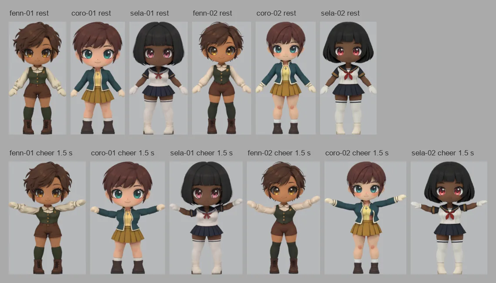
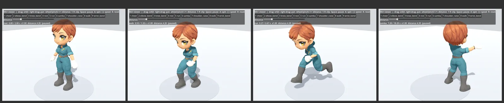
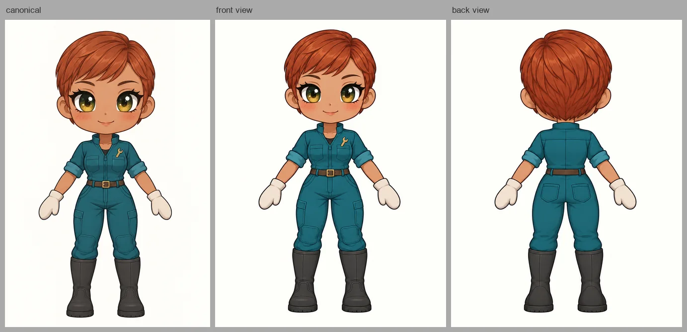
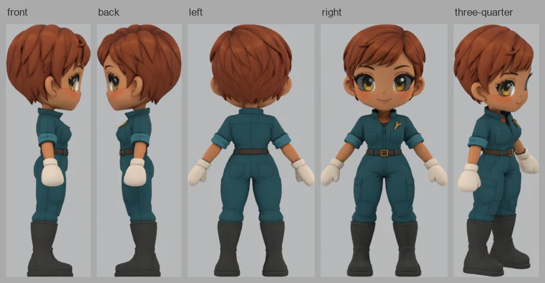
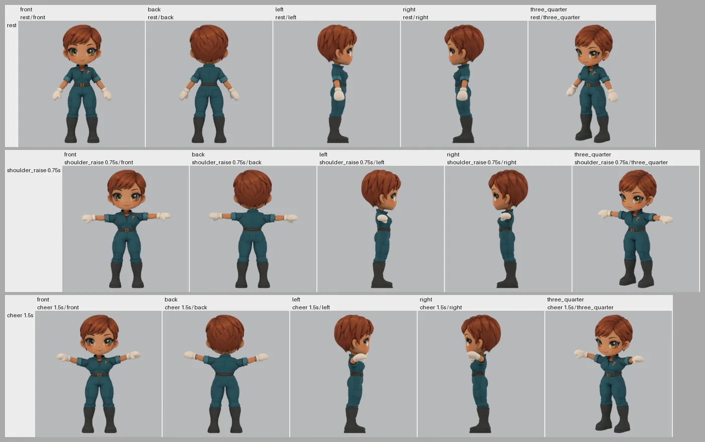
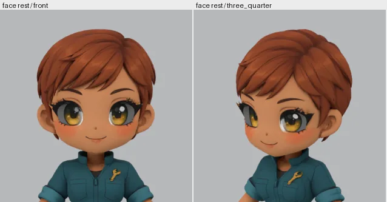
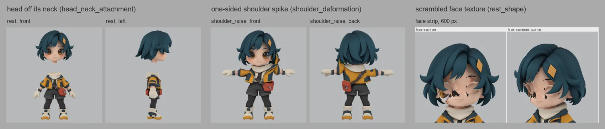
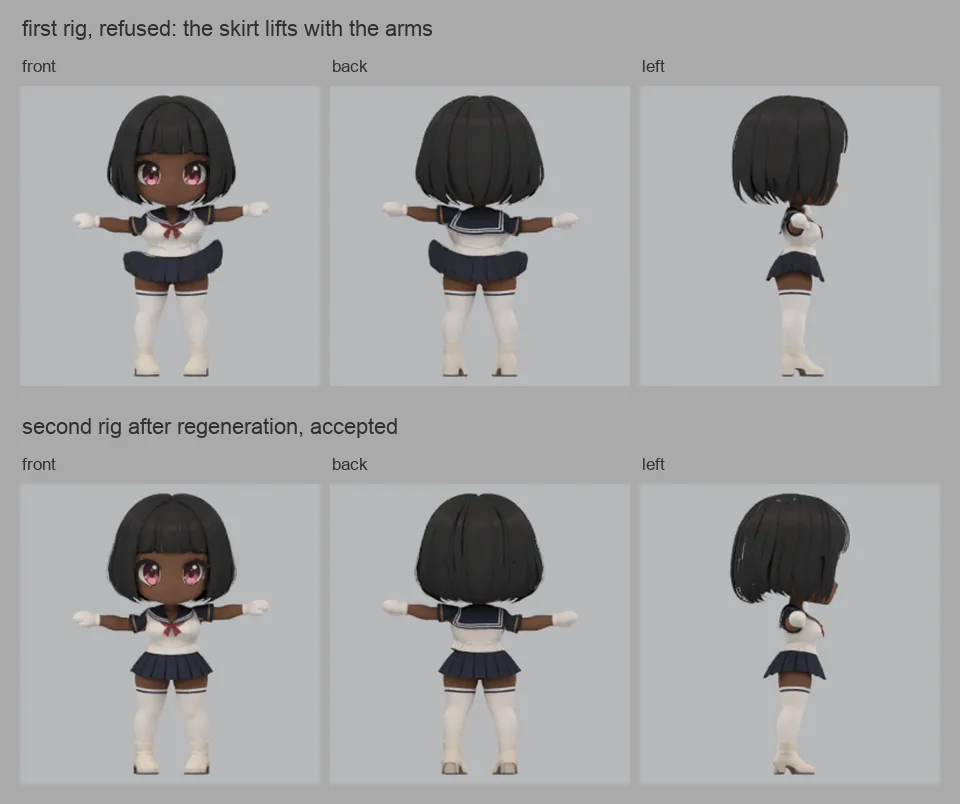

# Make a rigged 3D character from a brief

`stage-gen-character` takes one written character brief and returns a small,
textured, rigged character as a GLB with a short set of diagnostic clips, ready for a
game engine to load and drive with its own animations. Nobody sits between the stages:
an agent draws the reference sheet, a mesh provider builds the geometry, a rig provider
adds the skeleton, a local Blender worker checks every hand-off, and an independent
reviewer judges the result at the size a player would actually see it. If any stage
cannot be made good within its budget, the run stops and says why.



The six characters above are the qualification cohort for the first supported
configuration (short-haired adult SD humans with fixed mitten hands, the `whole`
partition at the `low` quality bar). Every export was rendered and judged a second
time by a reviewer that had not seen the run, and every one was confirmed. The
pipeline does not animate faces or hair, does not build animals, weapons or cloth
simulation, and does not author gameplay motion; walk, run and idle clips come from
the consumer, as the last section shows.

## What you get

A run directory with:

- `candidates/rig_01/animated.glb` (or `rig_02` after a retry): the export. One mesh
  with a matte material, a 22-joint humanoid skeleton, and six clips named `rest`,
  `shoulder_raise`, `elbow_bend`, `knee_bend`, `wrist_bend` and `cheer`. Its height is
  exactly the profile's target height, so it drops into a scene at scale.
- `nodes/*.json`: one record per stage with the reviewer's criteria, evidence sentences
  and issues, so a refusal is always explained.
- `observations/`: every render the reviewers saw, including the labeled atlases.
- `outcome.json` and `summary.json`: terminal status, node timings, provider operation
  counts and the ledger-backed cost.

The export is an ordinary GLB. The picture below is the canary character loaded in a
plain Godot scene, playing two CC0 Quaternius clips and a Mixamo samba that were
retargeted onto its skeleton by the same worker adapter the pipeline ships.



## How a run goes

The stages below are illustrated with one real run: the M3 canary "Wren", an original
brief written for the promotion check, produced by the promoted package in supported
mode (`runs/m3-canary-01/wren-01`, export SHA-256 `33b1092e…`, confirmed by an
independent review with zero provider calls).

### 1. Reference sheet

An agent reads the brief and draws a canonical character sheet, then the front and
back views the mesh provider needs. A reviewer checks that the views show one
character, that the outfit and palette agree, and that nothing is cropped or
duplicated. Proportion drift within the SD range is minor at the `low` bar; a back
view that is really a front is not.



### 2. Textured mesh

The mesh provider turns the views into one textured character. The worker normalises
it (units, orientation, ground contact) and renders five views with the matte preview
the export will wear, so raw provider gloss is never judged. The reviewer looks for a
whole body, readable texture and a coherent face.



### 3. Orientation

The mesh is placed on the ground plane facing forward and reviewed once more. For the
`whole` partition this stage is quick; for the experimental `head_body_hair` partition
it is where separately generated parts are assembled.

### 4. Skeleton, skin weights and clips

The rig provider adds bones and weights. The worker audits that the rigged mesh is the
same mesh (positions, UVs, triangles, normals), applies the matte policy, bakes the
diagnostic clips, and exports at the profile height. The reviewer then receives one
labeled atlas per pose plus a face strip and must decide in a single turn.



Rows are poses, columns are views, every cell is native pixels at twice the verdict
height, and the label in each cell says what it is. The face strip renders the rest
face at inspection height so eyes, paint and fringe can be judged strictly even at the
low bar.



### 5. Admission

The export is admitted only when the required joints all carry weight, the numeric
checks pass (height, ground, material policy, preservation), and the reviewer passed
every criterion with no blocking issue. A good-looking picture cannot waive a numeric
failure, and a clean numeric report cannot waive a visible one.

## The quality bar

`review_quality_bar: low` means usable in a mobile game at the smallest declared
gameplay height, 120 px for this profile. A defect a player would notice at that size
fails; a seam or cuff mark that only shows when magnified is recorded as a minor issue
and passes. Texture blocks only when it is scrambled, missing or the wrong object; a
small off-colour streak that reads as a hair clip or a shading band is minor even when
the reference does not show it.



The reviewer is calibrated before every candidate is qualified: ten reviews of five
frozen subjects whose expected verdicts are held by an evaluator the reviewer never
sees, with the three controls above among them. The current reviewer scored ten of ten
on every calibration since the bar was introduced. `medium` (180 px, stricter
per-boundary policy) exists but is uncalibrated; `high` is declared and refused.

## When a rig is refused

A refusal at the rig stage is not the end of the run. The pipeline regenerates the
mesh once from the same admitted references, orients and reviews it again, and rigs it
a second time; if that rig is refused too, the run fails with both verdicts on record.
A rig the worker cannot bind to the admitted mesh (changed triangle connectivity,
drifted geometry or UVs) takes the same path without spending a review.



Two of the six cohort runs went through this path and were confirmed on the second
rig. The most common refusal on this profile is a provider rig that weights a skirt hem
to the mitten hands resting against it; the pipeline refuses it rather than repairing
weights.

## Run it

Install a reviewed `stage-gen` wheel into a fresh Python environment; the launcher
freezes hash-verified installed sources into every run and refuses an editable
checkout. Blender is supplied explicitly and checked before any spend. The pipeline is
POSIX-only.

Write an experiment file. The fields that matter most are shown here; the full contract
is validated by
[`validate_experiment`](../src/stage_gen/recipes/character_3d/experiment.py) and
described in the [contract document](character-3d-contract.md).

```json
{
  "schema_version": 1,
  "experiment_id": "my_first_character_01",
  "pipeline_mode": "brief_to_rig",
  "partition_preset": "whole",
  "review_quality_bar": "low",
  "brief": {
    "description": "Create Wren, a new original adult woman in her twenties drawn as a chibi mobile-gacha character ...",
    "rights_basis": "original brief written for this run"
  },
  "profile": {"path": "profiles/sd_human_fixed.json", "sha256": "<installed profile hash>"},
  "pricing": {"path": "models/openrouter-gpt-6-astra-2026-09-11.json", "sha256": "<installed pricing hash>"},
  "agent_route": "openai/gpt-6-astra@openrouter",
  "parts": [],
  "limits": {"max_usd": "27.00", "agent_max_usd": "12.00", "max_review_rounds": 2, "max_rig_revisions": 2, "max_wall_seconds": 2700}
}
```

Keep the brief original and brand-neutral, name an adult, and describe short hair:
long hair and every other extension are outside the supported profile. Profile and
pricing hashes come from the installed package, never from another version.

Prepare offline first. This plans the 31-node graph, probes Blender and admits the
run without calling any provider:

```sh
stage-gen-character \
  --experiment /work/characters/my_first_character_01.json \
  --input-root /work/characters \
  --run-root /work/characters/runs/my_first_character_01 \
  --blender /Applications/Blender.app/Contents/MacOS/Blender \
  --admission-mode supported \
  --support-record support/whole_sd_human_fixed_hands_low.json \
  --support-record-sha256 <record hash> \
  --prepare-only
```

Then run live with the same arguments, a fresh run root, `--live` and
`STAGE_GEN_RUN_LIVE=1`. Provider keys come from the allowlisted environment loader or
an optional local `--dotenv` file; never put them in the experiment. A run takes
fifteen to twenty minutes and cost between 4.60 and 8.60 US dollars across the cohort,
the higher figure when the retry path was used.

`--admission-mode supported` is the default and needs a host support record whose
package closure matches the installed wheel; the host keeps the record for the qualified
configuration with the promotion evidence, and it admits nothing else.
`development` runs the same graph without a support claim, for trials and new
profiles. `qualification` is what a new configuration runs under while it earns a
record. Resume an interrupted or finished run with `--resume`; a finished run replays
with zero provider calls and an unchanged export hash.

## Limits

- One supported configuration: the `whole` partition of the fixed-hand SD human
  profile at the `low` bar. `head_body_hair` is experimental.
- No facial animation, hair motion, animals, weapons, cloth simulation or gameplay
  clips; the six clips are diagnostics and a cheer.
- Skirt-to-hand weight bleed from the rig provider is refused, not repaired; expect the
  retry path on outfits where the hands rest against a skirt.
- The export keeps one unreferenced texture the matte policy retired (about 3 MB); a
  consumer that cares about payload should strip it.
- POSIX only; run ledgers rely on `fcntl` locks and exchange-renames.

Everything the reviewers, budgets, recovery and support records promise is written down
exactly in the [contract document](character-3d-contract.md).
