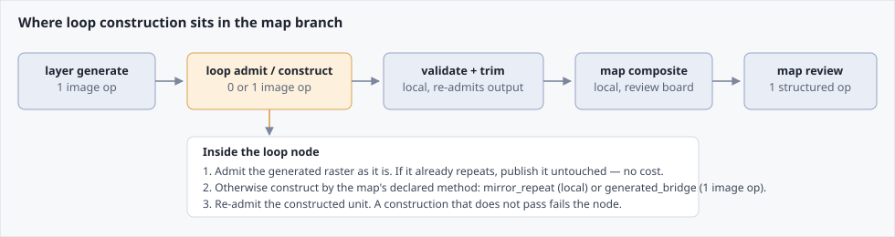
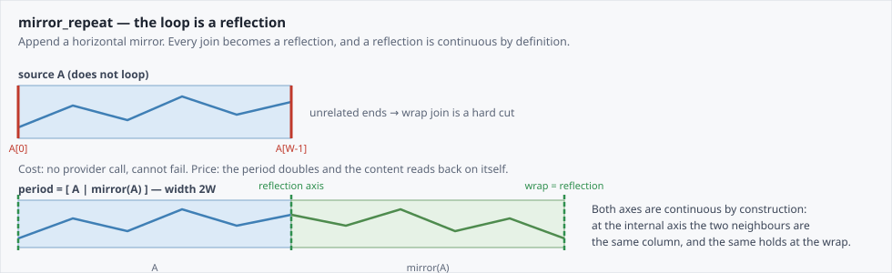
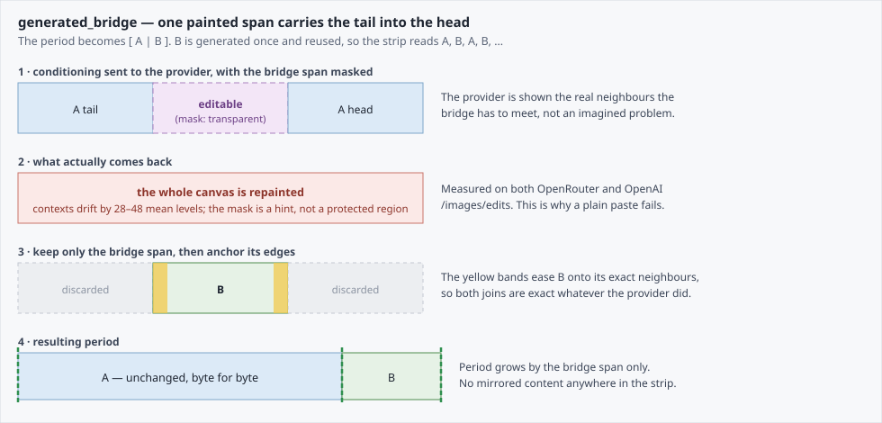
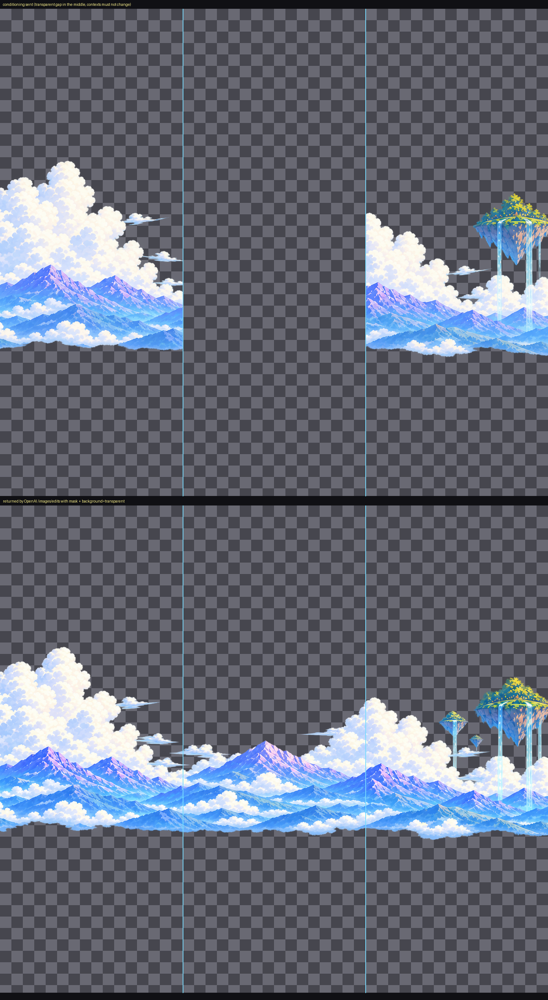

# Horizontal loop construction

> **Contract maturity: exact-current producer and consumer contract.**
>
> This document is the canonical description of how a scrolling map layer is made to repeat on its
> horizontal axis. The authored field is `continuity.loop_construction` in
> [`maps/<map_id>.toml`](spec/game/map-generation-contract.md); the deterministic constructions live
> in [`media/loop_construction.py`](../src/stage_gen/media/loop_construction.py); the graph node and
> admission policy live in the scrolling recipe.
>
> Implementation status is not an acceptance claim. A constructed loop still has to pass the map's
> semantic review before it is treated as usable art.

## The contract

> one generated layer in, one raster proven to repeat on `x` out

A side-scrolling map advances the camera indefinitely across a finite painted strip. Every
background and foreground layer therefore has to be a *repeat unit*: tiling it must produce no
visible join. `continuity.seamless_axis = "x"` declares that requirement.
`continuity.loop_construction` declares how it is satisfied when the generated raster does not
already satisfy it.

This is a producer concern end to end. The consumer receives a raster whose period is a published
fact and tiles it; it never inspects pixels, repairs seams, or infers a period.

## Where it sits



The loop node sits between layer generation and layer validation. Its operation kind follows the
selected construction's own `is_generative` declaration rather than a comparison against a
construction name: a generative construction exposes an image operation because it may need one, a
deterministic construction exposes a local operation because it never calls a provider.

## Admission comes first

Whatever construction a map declares, the node first asks the deterministic validator whether the
generated raster *already* repeats. When it does, the raster is published untouched and the node
spends nothing.

This is not a rare path. In the current Bellweather package three of eight layers — both sky plates
and one midground — are admitted directly, because the image model does sometimes return a
genuinely wrapping strip when asked for one. Constructing over a layer that already loops would
add width and artefacts for no benefit, so admission is checked before anything else runs.

A construction is therefore only ever a response to a measured failure, and the provider cost of the
whole feature is proportional to how often the model misses.

## Two axes, and why the second one matters

Constructions differ on two axes. The first decides what a layer costs; the second decides how much
its loop can be trusted, and they are not the same question.

**Agent** — whether the construction needs a provider operation. This is a structural property the
execution graph reads directly, not a note about cost.

**Guarantee** — where the loop's continuity actually comes from.

| Tier | The wrap join is continuous because... | Constructions |
| --- | --- | --- |
| `reflection` | it is a mirror, so it is continuous by geometry and cannot fail. | `mirror_repeat`, `fold_repaint` |
| `interior` | the wrap sits *inside* the canvas the provider sees, so the model paints through it as ordinary interior. | `seam_repaint` |
| `anchored` | its boundary columns were *forced* equal after the fact. | `generated_bridge` |

The tiers are ordered by how much they assume. `reflection` assumes nothing. `interior` assumes the
provider can paint continuous content through a region it can see both sides of — which is the
ordinary thing an image model is good at. `anchored` assumes the provider can meet two frozen ends
at the edge of its own canvas, which is the thing it is worst at, and then papers over the
difference.

That last tier carries a consequence worth stating on its own: **anchoring assigns the very join
that admission then measures**, so a bridged unit's join metric is 0.0 by construction and proves
nothing. See [validation](#validation-and-evidence).

### The constructions

| Construction | Agent | Guarantee | Period | Mutates source |
| --- | --- | --- | --- | --- |
| direct admission | — | source already loops | `W` | no |
| `mirror_repeat` | deterministic | `reflection` | `2W` | no |
| `generated_bridge` | generative | `anchored` | `W + bridge_span` | no |
| `seam_repaint` | generative | `interior` | `W` | **yes** |
| `fold_repaint` | generative | `reflection` | `2W` | **yes** |

### Source mutability is per-construction

`mirror_repeat` and `generated_bridge` only ever append, so the generated layer stays recoverable
from the result. The repaint constructions replace pixels around the join and it does not. Every
loop record carries `mutates_source` so no consumer has to infer it from a construction name.

## `mirror_repeat` — the baseline



Append a horizontal mirror of the source. The period becomes `[ A | mirror(A) ]`.

Both joins are continuous by construction, and for the same reason:

- at the internal axis, the last column of `A` is immediately followed by the mirror's first
  column, which *is* that same column;
- at the wrap, the last column of `mirror(A)` is `A[0]`, which is also the first column of the next
  period.

There is nothing to measure and nothing to validate — a reflection cannot be discontinuous. This is
why it is the baseline: it needs no provider, cannot fail, and works identically on opaque plates
and cut-out alpha layers.

The price is paid in composition rather than correctness. The period doubles, so the same authored
content covers half the travel; and the strip visibly reads back on itself, with each landmark
appearing twice per period, once reflected. That is acceptable for distant, low-salience layers and
conspicuous on any layer carrying a recognisable subject.

## `generated_bridge` — one painted span



Append a single generated span `B` that carries the layer's tail into its own head. The period
becomes `[ A | B ]`, tiled as `A, B, A, B, …`. Because `B`'s left neighbour is always `A`'s end and
its right neighbour is always `A`'s start, one generated span makes the whole strip loop.

The provider is shown `[ A tail | editable bridge | A head ]` with the bridge masked, and asked to
paint only the bridge.

### Why the mask is not sufficient on its own

The image endpoints available here treat a mask as a strong hint, not as a protected region. Asked
to leave the contexts untouched, the model repaints the entire canvas — on both the OpenRouter
image-reference route and OpenAI's `/images/edits` with a real `mask` field. Neither is a
latent-inpainting model.

Repainting is not the same as ruining, and the difference is what the rest of this section is
about. Once the canvas-wide shift is undone, a *texture* context comes back within about 20 levels
per channel — the same fence, redrawn. A *composed* context can come back at 90 or more, which is
not a redraw but a different arrangement: objects moved, invented, or placed across the cut.



*OpenAI `/images/edits` with a real `mask` and `background=transparent`, on a neutral checkerboard.
Top is the conditioning sent: two immutable context bands with a transparent gap between them, cyan
rules marking the bridge span. Bottom is what came back. Read it twice.*

*What works: the empty sky stays genuinely transparent, and the gap is filled with real cloud and
mountain silhouette rather than a blended approximation. This is why the provider owns the bridge's
alpha.*

*What does not: the left context's cloud mass and the right context's ridgeline are both repainted,
measured at 40.60 and 38.70 mean levels against an expected 0. Much of that figure is the canvas
shift rather than new invention — which is precisely why the shift has to be measured and undone
rather than assumed away.*

Not one content pixel of the contexts survives byte for byte — measured across every layer, both
bands, the identical fraction is 0.000%. The endpoint has no preservation primitive: it returns a
freshly generated image every time. Nothing in the prompt or the mask changes that.

Three consequences follow, and all are load-bearing:

1. **The contexts are measured before they are discarded.** They are the only instrument that
   reveals where the return landed, so they are read first; see
   [registration](#registration-landing-the-bridge-in-the-source-frame). Discarding them unexamined
   was the original design and it was exactly wrong: it threw away the evidence that the bridge was
   unusable.
2. **Only the bridge span is kept.** The context pixels themselves never reach the artifact, so
   the source survives byte for byte.
3. **The bridge is anchored.** Its outermost column is forced to its exact neighbour and the
   correction decays to zero across a short band. Anchoring makes both joins exact — but note that
   it makes them exact *by assignment*, which is why the join metric alone proves nothing about a
   bridged unit. See [validation](#validation-and-evidence).

### Registration: landing the bridge in the source frame

The endpoint regenerates the whole canvas at *its own* vertical registration. Across every bridge
run measured so far it shifts the entire strip by roughly 20 to 50 pixels, and it does so under
every prompt tried — including one that says, in as many words, to keep the same vertical
alignment and not to move or shift anything. **No prompt fixes this. It is the producer's job.**

The span it paints is coherent with the picture it drew. Cropping at fixed pixel coordinates and
pasting into the source therefore lands correct art at the wrong height, and anchoring then hides
the evidence by forcing the boundary columns to agree.

So the contexts are read before they are thrown away. We sent known pixels; measuring where they
came back recovers the translation directly, and each band yields an *independent* estimate of the
same number:

- both estimates agree — the return is a displaced copy of the conditioning. Translate the bridge
  by the negated offset and it lands;
- they disagree beyond tolerance — the return is a *different composition*, not a displaced copy.
  No single translation lands it, the bridge is unusable, and the node falls back to
  `mirror_repeat` with the rejection recorded.

Agreement is therefore both the correction and the trust signal, from one measurement and no extra
provider call. The record carries the offset, each band's estimate, the residual after correction,
and the residual without it, so a reviewer can see how far the provider drifted and how well the
correction explains it.

Registration cannot be measured by looking for preserved pixels, because there are none. It matches
*content*, on alpha-premultiplied luma so that empty regions cannot pass as agreement.

### The bridge brief is not the layer brief

The bridge request deliberately does **not** send the layer's generation brief. That brief asks for
a composition — landmarks, a windmill, broad trees, a centred rhythm — and a model given it will
compose, which is how an invented object ends up straddling the cut and being guillotined when the
span is extracted.

What the provider gets instead is a join brief: reproduce the two contexts exactly, paint only the
middle span, and keep everything painted strictly inside it. The layer's own text survives only as
a demoted *material* reference — what the layer is made of, not how to arrange it — because a
texture layer still needs to know it is drawing fence and flowers.

The brief is versioned as `LOOP_BRIDGE_BRIEF_VERSION` and bound into the loop node's cache identity,
so changing it re-runs the bridges without re-billing layer generation. The repaint constructions
carry their own `LOOP_REPAINT_BRIEF_VERSION` for the same reason and a stronger one: a repaint asks
the provider to carry existing content through a region it can see both sides of, which is a
materially different request from inventing a span between two ends it cannot see across. Sending
one brief for the other describes a canvas the provider is not looking at.

Both families also carry a `framing` constant. `join` is what ships. `restoration`, which frames the
request as restoring a mistakenly removed region, replicated better at n=7 — median residual 12.73
to 8.17, join step 1.0 to 0.0, drift outliers eliminated — and is carried alongside so the choice is
bound and reviewable rather than an untracked prompt edit. Selecting it is a separate decision from
promoting the constructions.

### The provider owns the bridge's alpha

For a cut-out layer — clouds, foliage, a village silhouette — the bridge's alpha must be real
silhouette, so it is taken from the provider along with the RGB.

The alternative, reconstructing alpha by interpolating between the two endpoint alpha profiles, was
measured and rejected. An interpolation between two profiles cannot invent an edge that is in
neither, so on a cloud layer it produces a rectangular blend with hard horizontal banding instead of
cloud edges — while passing every join metric, because the joins are not where the defect is. Layers
of this kind are the majority of a map's background, so this is the common case rather than an edge
case.

## `seam_repaint` — repaint the wrap where the provider can see it

Show the provider the wrap itself, centred: `[ A tail | A head ]`, a window of continuous artwork
whose middle is the hard cut a player would see. Mask that middle and ask for it to be repainted.
Nothing is appended; the returned span is written back over the source's tail and head, so the
period stays exactly `W`.

The returned span *straddles* the wrap, and that is the whole mechanism. Its left half belongs to
the end of the strip and its right half to the beginning, but on the provider's canvas those halves
were adjacent pixels. Whatever it painted across them is continuous because it was painting one
region, not matching two ends. This is the `interior` guarantee, and it is why the construction
does not inherit the bridge's hardest problem.

Two properties follow that no other generative construction has:

- **The period does not grow.** Authored content covers the same travel it always did.
- **The join metric is real.** Nothing here assigns the wrap columns, so admission measuring them
  is an actual measurement rather than a restatement of what anchoring just wrote.

The price is that the source is no longer recoverable: pixels near the join are replaced.

## `fold_repaint` — break the mirror without breaking the loop

Build `[ A | mirror(A) ]` as `mirror_repeat` does, then repaint only the reflection axis so the
content stops reading back on itself. The wrap fold is left untouched, so the join the loop
actually depends on is still a reflection and still cannot fail.

This is the narrow option: it costs a provider operation and keeps the doubled period, buying only
the removal of the visible symmetry. It earns its place for a layer that must not read as mirrored
and where `seam_repaint` has been rejected.

## Geometry and period consequences

| Construction | Period | Provider ops | Mirrored content |
| --- | --- | --- | --- |
| direct admission | unchanged | 0 | none |
| `mirror_repeat` | `2W` | 0 | half the period |
| `generated_bridge` | `W + bridge_span` | 1 | none |
| `seam_repaint` | `W` | 1 | none |
| `fold_repaint` | `2W` | 1 | half the period, repainted |

Layers within one map therefore end up on **different periods**, and every downstream consumer has
to treat the period as a per-layer fact:

- the runtime manifest publishes each layer's real width, and the browser tiles from that;
- the review composite tiles each layer up to a common width before stacking, because compositing
  a wider layer directly over a narrower canvas silently crops it.

Vertical placement is unaffected. Loop construction only ever appends horizontally, and the vertical
trim and placement measurement described in the
[map-generation contract](spec/game/map-generation-contract.md) run afterwards on the constructed
unit.

## Authored surface

```toml
[continuity]
seamless_axis = "x"
loop_construction = "mirror_repeat"   # map default, required
loop_fallback = "mirror_repeat"       # optional; must be deterministic

[[layer]]
layer_id = "village"
loop_construction = "seam_repaint"    # optional per-layer override
```

The map field is required: there is no safe default, because the constructions trade correctness
cost against composition cost in opposite directions and the right answer depends on what the map's
layers depict.

The per-layer field is optional and wins over the map's when present. Layers within one map do not
share a difficulty. A layer whose own ends already agree loops under any construction; a layer whose
ends disagree *in the source art* fails under all of them. A single map-wide choice cannot say so,
which is why the override exists.

`loop_fallback` is what runs when a generative construction cannot be completed. It is validated to
be deterministic: a fallback that can itself fail is not a fallback.

Everything else — context spans, repaint window and span, anchor band, brief version and framing —
is recipe-owned and versioned. It is not authored, because it describes how the provider is
conditioned rather than a creative choice.

## Cache identity

`loop_construction` is excluded from layer-generation cache identity — at both the map and the
layer level — and from the shared map direction digest. Changing a construction re-runs the loop
node and everything downstream of it, and never re-bills a layer image that would return
byte-identical.

The loop node's own identity is **scoped to the construction that layer actually selected**: its
version, its guarantee, its mutability, and only the recipe constants that construction consumes.
Deterministic constructions bind no registration or anchor version at all, because they have no
provider return to register.

This scoping is the point rather than an optimisation. The identity previously bound *every*
construction's version at once, so revising any one of them re-ran the loop node for every layer in
every map regardless of what it had selected — a cost that would grow with each construction added.

## Validation and evidence

Each loop node writes `<layer>.loop.png` and `<layer>.loop.json`. The record carries the
construction that ran, the resulting period, the provider operation count, and the admission report
for the constructed unit.

Every construction is re-admitted before it is accepted, and the layer's published artifact is
re-admitted again after the vertical trim — the bytes that ship must be the bytes that passed, and
trimming empty rows can change a raster's edge statistics.

**A bridged unit's join metric is vacuous on its own.** Anchoring assigns the boundary columns to
equal their neighbours, and admission then measures those same columns, so `color_mae` is exactly
0.0 by construction and carries no information. What actually evidences a bridge is the
registration record: agreement between the two bands, and the residual after correction. Read those,
not the join.

Deterministic admission is also not a quality verdict. It cannot see that a bridge is tonally
mismatched with the strip it joins, that a mirrored period reads as a reflection, or that a cut-out
layer came back with an opaque matte where the source is transparent. Those are the map review's
business, and its `looping_continuity` check is the gate that speaks to them.

## Failure modes

| Symptom | Cause | Where it surfaces |
| --- | --- | --- |
| Loop node fails | Constructed unit did not pass re-admission | Node error, run summary |
| A generative construction silently produced the fallback | Context bands disagreed, so the return was rejected | `rejected_construction` and `rejection` in the loop record |
| Content steps vertically at both joins | Registration not applied, or applied from a stale offset | Loop record `registration`; visible in the composite |
| An object is cut in half at a join | Provider composed across the cut line; the brief invited a composition | Map review `looping_continuity` |
| Bridge span reads as a tonal block | Provider painted the span in a different key from the strip | Map review `looping_continuity` |
| Opaque fill where the source is transparent | Cut-out alpha clause not honoured on a transparent layer | Layer validation, review board |
| Landmark appears twice per period, reflected | `mirror_repeat` on a high-salience layer | Map review `looping_continuity` |
| A join reads correctly but the layer lost content | A repaint construction replaced pixels; the source is not recoverable | Loop record `mutates_source` |
| Composite crops a layer | A consumer assumed one shared period | Composite geometry, review board |

## Related

- [Authored map-generation contract](spec/game/map-generation-contract.md) — the map surface and the
  layer placement contract that runs after construction.
- [Canonical game-generation pipeline](spec/game/generation-pipeline.md) — the executable graph the
  loop node belongs to.
- [Verified single-axis image repeat](image-repeat.md) — the provider-neutral admission, repair,
  and review component whose deterministic validator this contract uses.
