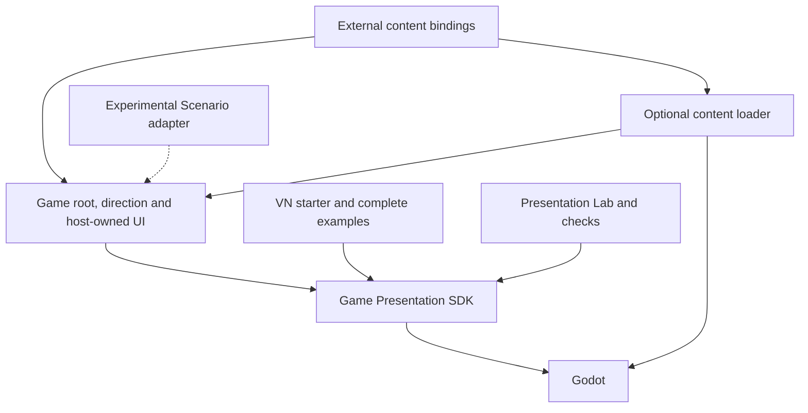

# Game Presentation SDK — successor design

> **Status: P106 design, implemented as a local canary package in P107.**
> Reviewed 2026-09-11 against the exact P01–P106 request archive, current Godot
> source and component contracts. P106 was documentation-only; see the current
> [SDK](../../godot/packages/game_presentation/addons/game_presentation/README.md) and
> [packaging](../../godot/packages/game_presentation/docs/PACKAGING.md) for P107 implementation.
> The development folder keeps its existing name; addon installation uses the
> proposed fixed path. No stable/public release or anatomy ratification is claimed.

The product is a **code-first Godot Game Presentation SDK**, a visual-novel
starter, and complete examples descended directly from Presentation Playground.
The existing experience is the implementation baseline. The SDK supplies reusable
behavior; each game owns its direction and complete interface. An experimental
Scenario adapter may expose part of that behavior later, but cannot limit SDK
evolution or become a condition for using it.

This is the canonical home for this **SDK design proposal**. It supersedes the
destination and prerequisite recommendations in the earlier promotion reviews
for this successor. It does not silently revise the incumbent Scenario or host
specifications, move source, remove games, publish media, or implement anatomy.
The [request triage](game-presentation-sdk-triage.md) accounts for every recorded
prompt, including approvals, superseded directions and non-runtime work.

## 1. Decisions carried into the design

- **Code first.** Develop a capability in the SDK, exercise it in a game, and
  expose useful portions through text when worthwhile. Preset data is useful
  without requiring a whole-game language.
- **Direct succession.** Preserve the working effects and composition. Change
  ownership or bindings where necessary; do not reimplement them to match old
  genre containers, a new reducer, or the old Scenario vocabulary.
- **One supported SDK, not a package per effect.** Names describe responsibilities
  and behaviors. A shader, preset, scene and package are different units.
- **Host-owned UI and direction.** No mandatory dialogue view, skin protocol,
  speaker-follow rule, universal scene interpreter, or common game base class.
  One discoverable master script may delegate to supporting host files.
- **Portable dependency closure.** Installing the SDK must not require this
  repository, a generation CLI, a prepared demo, a particular cast, or another
  game. Godot and the SDK's own source/resources are its runtime dependencies.
- **Scope is presentation plus small interactions.** Legacy standalone
  point-and-click compatibility, room/inventory/puzzle schemas, and the old
  room/case proof are excluded from promotion requirements. Existing fingertip
  contact remains useful. Command Link is a separate tactical presentation
  example, not the legacy point-and-click game being retired.
- **Explicit deferrals remain.** Standing-character framing parameters are
  deferred. The anatomy proposal is unratified; VLM annotation and generation
  integration are deferred. None is secretly implemented by this design.

Stable SDK releases should document and preserve their advertised interfaces;
canary carries deliberate changes and migration notes. No stable release is
declared by this document. Scenario files and their compiled representation
remain an experimental secondary surface that may lag, break or be bypassed.
Their compatibility guarantees do not flow backward into the SDK.

## 2. Taxonomy: what kind of thing is this?

| Kind | Meaning | Examples | Distribution consequence |
| --- | --- | --- | --- |
| **Capability umbrella** | A category for finding related behavior. | Actor presentation, camera, audio. | A namespace/folder, not automatically a package or base class. |
| **Mechanism** | Reusable code with explicit inputs, results, state and limits. | Actor Focus, Manpu playback, Refraction Field. | Candidate SDK component; retain its useful existing API. |
| **Preset / mode** | A named selection of an existing mechanism's behavior. | Walk-Away, Restless Bounce, Heat Haze, Waking Eye-Opening. | Ship neutral defaults where useful; games can supply alternatives. No new module per preset. |
| **Pattern** | A reusable, bounded coordination of mechanisms. | The existing three-actor Cast Transition; Establishing Shot. | Optional convenience with stated limits, not a universal director. |
| **Authored composition** | A particular arrangement, cue sequence or dramatic meaning. | Villain arrival, a mysterious detail shot, Eira's transmission. | Game/example code and content. |
| **Asset / binding** | Supplied media and the metadata needed to use it. | Actor sprite, eye point, Manpu texture, localized recording. | External to reusable behavior; no required generation provider. |
| **Host / tooling policy** | Product decisions, controls, preparation and review. | Autoplay, UI, TTS casting, Lab controls. | Template/example or development tooling; no inward SDK dependency. |

Emotion is authored interpretation. A vertical bounce does not infer anxiety;
a red field does not identify a villain. A particle texture does not determine
whether its motion is a burst or sustained emission. These distinctions keep
the vocabulary useful when the next game changes theme.

## 3. Feature census and proposed ownership

**Keep** means reuse the existing implementation, with package-local path changes
and documented current limits. **Adapt** means a specific binding/presentation
boundary remains to be separated. **Host** means deliberately retain game or
template ownership. These are design dispositions, not completed migrations.

| ID | Umbrella / feature | SDK disposition and user control | Host or asset responsibility / important limit |
| --- | --- | --- | --- |
| F01 | Motion: Presentation Animation | **Keep** scalar track validation/sampling; smooth and held changes, channel values and timing. | Consumer chooses channels/pivots. Current track limits are retained explicitly, not advertised as an arbitrary animation graph. |
| F02 | Motion: Motion Curve | **Keep** linear/eased/spring sampling and frequency/damping controls. | **Actor Blocking / Quick Approach** is host composition over this sampler: one mover, a captured center-gap target and held destination. Spring is interpolation with possible overshoot, not physics. The graph widget is Lab UI. |
| F03 | Motion: Layer Pan | **Keep** explicit-time translation, retargeting, curve and held final offset. | Host selects group membership and reference point. **Cast Pan** is its actor-group use over fixed scenery. |
| F04 | Actor presentation: Actor Focus | **Keep** actor cue/state plus bounce, scale pulse, listener dim/fade and none. | Game selects speaker/focus and when to replay. It does not force camera movement. |
| F05 | Actor presentation: Character Exit | **Keep** visible/exiting/hidden state, brightness, opacity and local motion. **Silhouette Fade**, Opacity Fade and Walk-Away are presets. | Renderer preserves source alpha and applies transforms. The matte appearance does not require a second generated silhouette sprite. |
| F06 | Actor presentation: Cast Transition | **Keep as bounded pattern**, not general choreography. Exit → optional survivor shift → entry; curve, duration and travel settings. | Current implementation requires three registered actors, two slots and a 1280-wide logical slot range. No arbitrary roster, simultaneous graph or mid-handoff retarget is promised. |
| F07 | Actor presentation: Manpu / emanata playback | **Keep** persistent cue identity, introductions, held-step loops, sprite-frame loops, custom pure sampling and independent one-shot instances. | Host supplies rasters, anchors and visibility. Sigh Puff and Sweat Drop Fall are ephemeral presets; frame timing does not generate frame art. |
| F08 | Actor presentation: expression / sprite blink | **Host** registered texture switching for current examples. | Automatic blink timing is currently integrated in the presenter. No new general face-animation module is inferred from this request. |
| F09 | Camera: Dialogue Camera | **Keep** explicit focus/wide calls, target and screen anchor, duration, zoom and coverage constraints. | Snapshots a supplied target; does not follow future speakers automatically. Current zoom is bounded to 1–4. |
| F10 | Camera: Establishing Shot | **Keep as bounded pattern** with pan/zoom, duration and optional flare envelope. | Host hides/reveals cast, places the flare, announces the location and resumes dialogue. |
| F11 | Camera: Walking Approach | **Keep** push-in plus vertical bob, cadence, settling and covered final hold. | Background-only use and the feeling of walking are authored direction. |
| F12 | Camera: Camera Drift | **Keep** supplied phase, amplitudes, periods and time, with coverage helpers. | Portrait Detail Shot, cropped face and mysterious mood are composition/art. |
| F13 | Camera: Impact Shake | **Keep** finite attack/decay and X/Y displacement composed from a base shot. | Host supplies cause, intensity and clock; required overscan must preserve background coverage. |
| F14 | Scene transitions: Eye Transition | **Keep** opening, closing, blink and waking modes, timing, peek depth and closure observations. Ship the mask shader with it. | Host decides scene replacement while covered. Edge feathering is a mask parameter; waking defocus and organic mask artwork are not implemented. |
| F15 | Scene transitions: Background Blackout | **Keep** fade/hold/restore coverage with explicit time. | Put coverage above scenery and below actors. It does not automatically select a solo actor or mean “stunned.” |
| F16 | Visual effects: Holographic Projection | **Keep shader; adapt optional material binding** for supplied texture, strength and explicit time. | Per-instance material, actor/portrait selection and floating TV frame are host-owned. Audio processing is separately selected. |
| F17 | Visual effects: Actor Halo / outer glow | **Keep** supplied alpha texture, padded display rectangle, radius, color and strength. | Host layers it behind the subject. This is sprite treatment, not baked asset generation or a face landmark. |
| F18 | Visual effects: Refraction Field | **Keep** barrier/heat modes, rect, optional noise input, strength and explicit time. | Heat Haze and refractive barrier share the mechanism. Host supplies the pixels/layers to be affected. |
| F19 | Visual effects: Ominous Corruption | **Keep** one bounded mask/area/screen treatment: darkening, mist, tint, glow, refraction and embedded procedural flecks. | Host supplies alpha/area, pattern transform and atmosphere. Its local shader flecks remain distinct from particle emitters. |
| F20 | Visual effects: Lens Flare | **Keep shader; adapt optional binding** for light position and intensity. | Optical screen overlay with a projected light source. Location/title/camera coordination stays in the establishing composition. |
| F21 | Visual effects → particles: Radial Sprite Burst | **Keep** seeded finite events, interchangeable textures, origin, outward motion, lifetime, size/spin/fade and cancellation. | Host chooses behind/around/in-front placement and event timing. Current presenter is 2D; no 3D emitter is claimed. |
| F22 | Visual effects → particles: Sprite Particle Emitter | **Keep** sustained seeded emission over a supplied region, rate/lifetime/motion, explicit advance/seek, stop-and-drain and clear. | Dust, smoke, sparks and embers are art/presets. Quiet, relay and infernal multi-emitter arrangements are host profiles. |
| F23 | Text presentation: Text Set | **Keep** instance-local language lookup, stable IDs, fallback and named substitutions. | Files, language picker, fonts and locale-switch policy are host/content concerns. No full localization framework is introduced. |
| F24 | Text presentation: reveal / Intertitle | **Keep** reveal/hold/completion state, rate and explicit advance input. | Centered black screen, protagonist monologue, dialogue layout and next scene belong to the host. The current class name does not make monologue its only use. |
| F25 | Audio presentation: Text Reveal Audio | **Keep** supplied voice playback, typing-sound fallback, silence mode, pause/stop and resumption inputs. | Host supplies text/reveal state and decides full subtitles for a ready voice. No word synchronization or automatic story advancement. |
| F26 | Audio presentation → voice processing | **Keep** private bus ownership, strength, bypass, filter reset and cleanup. Transmission Voice is the current processing preset. | Host selects actual speaking voice and projection state. Typing stays dry; DSP does not know the hologram or TTS provider. |
| F27 | Interaction: Point Contact | **Keep** same-space circular hit test, acknowledgement and reset. | Host supplies pose/target/radius, input routing, readiness, feedback and outcome. It is not a point-and-click room engine. |
| F28 | Place/location announcement | **Host** text and title timing from current concrete stage. | Reuse Text Set/animation where useful; no shared UI component or mandatory banner. |
| F29 | Opening video, loop and fade-through-black | **Host/template pattern** over Godot video playback and presentation timing. | Concrete opening route includes tactical UI/navigation. Explicit-click continuation is game policy, not a generic player's completion behavior. |
| F30 | Autoplay and reconverging choices | **Host/template policy** observing reveal, finite motion and voice completion. | Preserve configurable delays/default choices and required input; never synthesize contact or let ambient loops block progress. No shared story runner is implied. |
| F31 | Pause, replay, language changes, Lab detours | **Host composition** over documented component lifecycles. | Current in-session reconstruction is not durable or cross-version saving. Each game's state remains independent. |
| F32 | Fixed canvas / native window rendering / UI | **Template/project setup and host UI**. | Preserve proportional world elements and sharp window rendering. Full UI hierarchy, style and input remain game-owned; standing framing parameters stay deferred. |
| F33 | Voice policy, bindings and freshness | **Content/host adapter**, with semantics retained in the starter example. | Speaker defaults/per-line overrides, explicit `none`, ready/missing/stale/failed/pending distinctions, source revision and speech-only overrides; no provider access in playback. Current Afterlight policy class is not a generic SDK manifest parser. |
| F34 | Asset and geometry bindings | **Adapt a small content boundary**, not a world/game schema. Existing assets and manual attachment data remain valid inputs through explicit adapters. | Anatomy/regions/image geometry/calibration/attachment policy stay separate; see §7. Automatic annotation remains deferred. |
| F35 | Story, cast, camera direction and emotional sequences | **Host/example**. | All approved scenes and alternate replies remain Afterlight content. Villain arrival and the transmission are compositions of F01–F34, not modules named after scenes. |
| F36 | Generation, budgets, art approval and request history | **Tooling/assets/history**, outside the runtime package. | Manual CLI preparation and provenance remain useful; the SDK imports no provider, generation recipe or secret loader. |

Current source anchors: [animation](../../godot/packages/game_presentation/addons/game_presentation/motion/ANIMATION.md),
[focus](../../godot/packages/game_presentation/addons/game_presentation/actors/ACTOR_FOCUS.md),
[Manpu](../../godot/packages/game_presentation/addons/game_presentation/actors/MANPU.md),
[exits](../../godot/packages/game_presentation/addons/game_presentation/actors/CHARACTER_EXIT.md),
[handoff](../../godot/packages/game_presentation/addons/game_presentation/actors/CAST_TRANSITIONS.md),
[camera contracts](../../godot/packages/game_presentation/history/TOPOLOGY.md#component-contracts),
[fields](../../godot/packages/game_presentation/addons/game_presentation/effects/SCREEN_FIELDS.md),
[particles](../../godot/packages/game_presentation/addons/game_presentation/effects/particles/SPRITE_PARTICLE_EMITTER.md),
[burst](../../godot/packages/game_presentation/addons/game_presentation/effects/particles/SPRITE_BURST.md),
[audio](../../godot/packages/game_presentation/addons/game_presentation/audio/TEXT_REVEAL_AUDIO.md),
[voice processing](../../godot/packages/game_presentation/addons/game_presentation/audio/VOICE_PROCESSING.md),
[contact](../../godot/packages/game_presentation/addons/game_presentation/interaction/POINT_CONTACT.md).
These describe implemented local contracts, not already-installed SDK exports.

## 4. Package topology and dependency direction

Proposed delivery layout below. **These directories do not yet exist.** The
successor development project can be renamed independently of the install path.
The SDK install unit is the complete addon directory; an editor plugin or
runtime plugin registry is not required just to use its scripts.

The initial target is the current **Godot 4.7 desktop Compatibility renderer**
baseline; the locally inspected binary is 4.7.2. The starter can run offline
with supplied content and Godot alone, without Python or the preparation CLI.
Broader engine-version, renderer, mobile and web support requires separate
evidence. The current samplers may use Godot value types; this is a Godot SDK,
not an engine-independent headless simulation library.

```text
presentation-kit/                      # successor development/example project
  project.godot                       # runs example launcher / Lab
  addons/game_presentation/            # complete installable SDK payload
    README.md                         # public entry points, version, requirements
    motion/                           # scalar tracks, curves, layer pan
    actors/                           # focus, exit, Manpu, bounded cast pattern
      presets/                        # neutral behavior defaults, not character art
    camera/                           # directed shots and camera modifiers
    transitions/                      # eye timing/mask, background blackout
    effects/
      particles/                      # finite burst and sustained emitter
      shaders/                        # effects' own shaders and includes
    text/                             # Text Set, reveal/Intertitle state
    audio/                            # reveal audio, voice processing
    interaction/                      # Point Contact
    content/                          # optional local media/binding utilities
  games/
    afterlight/                       # complete direct-successor example
    command_link/                     # retained tactical example, independently optional
    presentation_lab/                 # study UI and fixtures, not SDK dependencies
  starter_source/                     # assembly input; not a second runtime tree
  tests/                              # component and host/packaging checks
  docs/                               # install, authoring, examples, limitations
```

The starter assembler produces a separate project containing a real copy of the
**same** addon payload, project settings and a small code-authored host. It does
not make a second maintained SDK implementation or reach out to a sibling
checkout. Starter source should be excluded from the development project's
Godot import scan so copied scene/script identities are not simultaneously
registered there. Full example assets arrive through a supplied content root;
large media and preparation tools are not required in the SDK archive.



Within the package, motion sampling is foundational. Actor Focus, Exit and
Manpu use it; the bounded Cast Transition additionally uses Exit and Motion
Curve. Layer Pan uses Motion Curve. Camera components use their declared
sampling/geometry helpers. Visual presenters use only their own shaders,
Godot resources and necessary package helpers. Audio, text and contact do not
depend on actor rendering. The content loader is optional: callers may supply
already-created Texture2D and AudioStream resources directly.

No inward edge may reach games, Lab, starter UI, generation tools, Scenario,
Python application code or repository fixtures. Cross-umbrella imports are
allowed where the mechanism actually needs them; folders are not rigid rings.
In particular, hologram and voice processing have no mutual dependency.

Public entry points should initially be the documented component scripts and
shader inputs, with package-local defaults. Avoid a giant facade containing
every effect or a mandatory common Effect base class. File moves must update
literal paths and shader includes; UID sidecars do not rewrite every path string.
Internal helper paths are not an extra compatibility surface merely because
the implementation is distributed as source.

### What stays outside the SDK payload

The existing integrated [stage](../../godot/games/command_link/presentation/stage.gd),
[stage profile](../../godot/games/command_link/presentation/stage_profile.gd),
[actor overlay](../../godot/games/command_link/presentation/actor_overlay.gd),
[opening](../../godot/games/command_link/presentation/opening.gd), tactical theme,
curve-graph widget, menus and QA capture adapters are concrete consumers.
Their current directory name does not make them reusable SDK code. Stage Profile
mixes art, dialogue, preview copy and tactical roles; it is not the universal
Actor definition. Afterlight's cast presenter likewise stays a game integration,
not the compulsory SDK superclass for a new game.

The minimal starter supplies an understandable host implementation of display,
input and narrative progression. Its UI and direction are intentionally editable
game code. It may demonstrate more mechanisms through optional examples; it
does not need every Afterlight cue or the whole episode in its default main file.

## 5. SDK contracts without a universal runtime

For each public component, document **inputs and units, result/state, ownership,
completion, interruption, pause/restore limits, invalid-input behavior and
dependencies**. Preserve existing method shapes unless a concrete packaging
problem requires change. Many methods return diagnostics without mutation;
others intentionally clamp, ignore a nonpositive delta or return an invalid
result. Do not claim one uniform failure protocol already exists.

| Existing interface style | Representative calls | What the host owns |
| --- | --- | --- |
| Stateless sampler | Motion Curve `sample(progress, settings)`; track sampling; Point Contact `hit_test(point, center, radius)` | Inputs, time and what to do with the result. |
| Stateful cue controller | Focus `set_focus`/`advance`/`sample`; Manpu `sync`, `emit_one_shot`, `sample_with`; Exit `exit_actor` | Routing cues, advancing time, rendering samples and clearing state. |
| Shot controller | Camera `focus`/`wide`; Walking Approach and Eye Transition start/advance/sample APIs | Target selection, scene visibility and what happens when motion finishes. |
| Rendering presenter | Field `set_rect`/`set_time`/`set_strength`; Halo geometry; burst `emit_burst`/`present` | Parenting, transformed geometry, render order and lifetime. |
| Audio owner | Text Reveal Audio `begin`/stop/pause inputs; Voice Processing output bus/reset/cleanup | Stream choice, subtitle policy, language change and teardown order. |

There is no mandatory SDK story clock, scene router or global event bus. A host
may use direct calls/signals and a few time variables. An effect completing is
information for that host, not permission to advance dialogue. Persistent drift,
ambient emission or a held blackout need not count as unfinished narrative work.

### Time and interruption

- The host provides world time, reveal/reading time and audio policy as needed.
  Monologues can pause the world while reveal/autoplay continue. This is a policy
  distinction, not a requirement to implement a new clock service.
- Advance a component once per intended tick; sample from authored/base state.
  Render or shader time must not secretly keep advancing while the host is paused.
- Components retain their own interruption behavior: clear, reset, replace,
  cancel instance, drain or skip. Do not equate these operations.
- Eye Transition's `reached_closed` records closure history, not a guarantee
  that the current sample or a presented frame is black. A large step can pass
  through closure; waking mode starts closed before its later blink. If a cut
  requires visible full coverage, the host must split/hold at the intended
  closure and present that frame before continuing.
- Camera/eye/intertitle support explicit in-memory restore; some actor behaviors
  are reconstructed by replaying known cues; Sprite Burst is reconstructed from
  event time while the sustained emitter has seek/checkpoint operations. A
  generic durable save/seek API is not implemented and is not a packaging gate.
- Hosts must stop a previous voice before replacing its binding. Tear down audio
  playback before destroying its private processing bus. No typing over speech,
  no generation during replay, and no automatic advance on audio completion.

### Coordinates and rendering

The supported presenters are principally **2D Godot canvas** components. Shared
samplers may be used by another renderer; Manpu has a Sprite3D demonstration.
That does not make the screen shaders or particle presenters 3D implementations.

For an attached source point, the conceptual mapping is:

```text
source geometry → image/crop mapping → actor placement and local motion
                → optional cast-group pan → world camera → logical screen
                → Godot window scaling
```

Scenery and environmental particles skip actor placement and cast-group pan.
Actor-attached marks and effects include the actor/group transforms once. UI and
eye coverage stay in logical screen space. A burst's origin may be captured at
emission and its particles then travel independently; it need not follow the
actor after emission merely because the origin was actor-derived.

The host declares whether it supplies world geometry or already-projected
geometry. Camera shake, zoom and cast pan must never be applied twice. Current
effect APIs constrain some transforms to positive axis-aligned scale/translation;
rotation, shear, reflection and arbitrary 3D projection must not be promised
across the package without component-specific support.

Render placement is equally explicit. Background Blackout covers the selected
environment while preserving actors. Refraction/corruption copy and affect
already-drawn content; UI should be outside those passes unless the host intends
otherwise. An alpha-shaped corruption pass limits coverage but cannot isolate
one actor's pixels from other content already composited beneath it. A halo is
behind its actor; a burst may have rear/front instances.
Lens flare uses a projected light source but draws an optical overlay. No global
mandatory layer list is needed to document these relationships.

## 6. Content loading and self-containment

The SDK must function with manually authored, generated or supplied resources.
It neither requires nor performs generation. Code/shaders and neutral behavior
presets travel with the package; character art, locations, mark art, recordings,
text, casting and artistic geometry travel with the game content.

The proposed content utility is a small explicit boundary: accept a configured
local root and relative bindings, resolve beneath that root, decode supported
media and return resources or actionable errors. An already-loaded-resource path
is equally valid. A raw-directory backend and a Godot-pack backend must be
distinguished; source-file decoding is not interchangeable with imported resource
loading in an export. No network fetcher, provider client or universal asset
registry belongs in this first SDK.

Current adaptations needed before packaging are concrete:

1. Replace hardcoded example media roots in [Afterlight's root](../../godot/games/afterlight/root.gd)
   with supplied bindings; keep the cast/story choices in that host.
2. Remove the fixed shared-art catalog dependency from the [cast presenter](../../godot/games/afterlight/cast_stage.gd).
   Do not disguise named sigh/gloom attachment offsets as universal anatomy.
3. Let any retained example loader accept the selected content backend instead
   of requiring every catalog texture to be a project-local PNG.
4. Separate SDK behavior catalogs from game art catalogs. Both may be data, but
   their ownership and replacement lifetimes differ.
5. Retain recording status and source-revision checks in an explicit content
   adapter. The existing Afterlight resolver hardcodes its protagonist, two
   languages and preparation metadata; do not promote it wholesale as generic
   audio playback.

Voice bindings must distinguish authored silence (`voice_policy: "none"`) from
missing, pending, failed and stale recordings. The host resolves speaker defaults
and line overrides, binds a ready stream, or applies its fallback. Display text
remains authoritative; sparse speech-only scripts never become subtitles. The
core audio components need streams and policy inputs, not provider voice IDs or
an ElevenLabs route. Preparing or refreshing files stays an explicit outside task.

External content is not synonymous with remote hosting. A documented local media
directory is sufficient for the first reproducible template. An export can
bundle its selected content; an asset root supplied to the game is distinct from
the package's own implementation resources.

## 7. Anatomy and placement: preserve the separation

The [canonical anatomy/visual-geometry proposal](actor-anatomy-visual-geometry.md)
remains a separate, unratified source of future semantics. Its proposed sparse
COCO-based landmarks, optional mouth/face region, uncertainty and transform
rules are not silently made public SDK fields here.

For the first SDK, consumers can accept explicit manual points/rectangles in a
declared space, or a caller-provided adapter that resolves them. Existing eye,
face, contact and Manpu coordinates must keep their actual meanings. An artistic
Manpu anchor is not renamed to a head joint or anatomical eye. Later anatomy
adoption should feed the same consumer inputs, preserving intentional offsets.

| Placement need | Geometry input | Decision still owned by the host |
| --- | --- | --- |
| Manpu / sigh / sweat | A resolved attachment point, size reference and space | Mark side, clearance, motion, timing and optional override. |
| Radial burst / sustained particles | Resolved origin or region, texture pool and transform | Capture/follow behavior, scale, depth, duration and atmosphere. |
| Camera close-up | Focus point or region and available background bounds | Headroom, target, zoom, timing and maximum useful crop. |
| Halo / corruption | Source alpha plus displayed bounds or explicit coverage | Radius, padding, layer and visual treatment. |
| Contact | Pose-appropriate target and hit radius | Readiness, accessibility, feedback and story outcome. |

When required geometry is unavailable, the host chooses an explicit override,
permitted fallback, omission or refusal. Contract-shaped metadata does not imply
that every asset can support every feature. A wrist does not provide a fingertip
pose; a portrait does not provide full-body anatomy; alpha bounds do not measure
true body size. Keep the existing calibration authority separate. Do not block
packaging on VLM accuracy, a new rig, or the deferred standing-framing work.

## 8. Example composition and extension workflow

A new game's master script selects prepared content, constructs the components
it uses, creates its own UI, and directs its scene. It may delegate texture
presentation, dialogue controls or complex sequences to its own supporting files.
It does not need to subclass Afterlight or select a genre package to obtain a
camera or Manpu controller.

For the existing transmission example, the host selects a framed portrait and
laboratory background, starts the hologram material, binds a ready voice to a
private Transmission Voice bus, displays full subtitles, and advances only by
its chosen manual/autoplay policy. On leaving, it stops speech and clears visual
and audio processing. Each mechanism is independent; the meaningful combination
is the scene's code.

For a future feature, first decide whether it is new settings/art, another
composition, or genuinely new behavior. Add a preset for the first, host code
for the second, or an SDK component/API extension for the third. Exercise the
result in a game and Lab when inspection helps. Only then consider a Scenario
spelling. Code callbacks such as Manpu's pure sampler remain legitimate extension
points; they need not become serializable expressions.

An optional Scenario adapter should name supported capabilities, parameters and
its SDK compatibility version. Unsupported content is reported, not flattened
into a lower-fidelity scene. It may be removed or revised during incubation.
It does not own SDK method names, replace host direction, or require a universal
intermediate representation for all Godot code. General point-and-click game
logic remains outside its scope.

## 9. Promotion work and acceptance, after design review

P106 identified the following bounded implementation sequence. P107 implements
steps 1–4 and the SDK entry-point/support-record part of step 5; the current
[verification record](../../godot/packages/game_presentation/history/QA.md#sdk-package-and-content-boundary-p107)
records actual evidence. Legacy retirement is still a separate change.

1. **Package existing mechanisms.** Move eligible code with shaders/includes,
   neutral defaults, UIDs and documentation into one addon payload. Keep the
   named bounded patterns honest. Move integrated tactical/UI helpers to their
   consumer rather than redesigning them to appear agnostic.
2. **Make content replaceable.** Add the minimal binding/root adapters above.
   Rebind the existing game without altering approved text, art or direction.
3. **Assemble the starter and example workspace.** A fresh standalone Godot
   project consumes a copied SDK payload and supplied content. Preserve the
   independent Lab. No second complete game or new asset generation is required
   to demonstrate this installation boundary.
4. **Verify the actual boundary.** Run existing component and Afterlight checks,
   then import/run the starter outside this checkout and exercise an export.
   Check lifecycle combinations that relocation/binding changes actually touch.
   Do not repeat every historical visual audition or promise untested platforms.
5. **Update entry points and support records.** Declare the SDK version and
   supported Godot/rendering baseline; remove obsolete demo/template references
   within the separately authorized retirement scope. No old runtime parity
   requirement is inherited merely from a historical promotion proposal.

Packaging acceptance requires the SDK's static/dynamic resource references to
resolve within its payload, zero game/fixture/provider dependencies, two
independent instances where state matters, and a new host able to change assets
and direction without editing SDK internals. Complete Afterlight remains the
regression example. Historical QA is evidence for local behavior. P107 adds fresh standalone import,
execution and exported-pack evidence; it does not claim all-platform verification.

Track script/shader UID sidecars with their source and move them together.
Exclude Godot's import cache, captures, build products and credentials. Track
import settings when tracked imported resources need them; do not confuse those
settings with the disposable cache. Ship package-local shader/preset resources
in exports. Preserve media provenance across real content-package boundaries;
this design does not authorize media publication or regenerate anything.
See [Godot UID guidance](https://godotengine.org/article/uid-changes-coming-to-godot-4-4/)
and [version-control guidance](https://docs.godotengine.org/en/stable/tutorials/best_practices/version_control_systems.html).

The existing [host contract](../../godot/games/_shared/docs/formats/host-contract.md) requires generated-run
documents and restricts engine behavior to its host layer. This SDK deliberately
supports Godot-native presentation and code-authored games. It should not be
placed in the incumbent pure family layer merely to acquire canonical status.
That contract's applicability and the retired entry points need an explicit,
scoped decision during implementation; no rewrite of gnode, generation recipes
or unrelated gameplay families follows from this design.

## 10. Deliberate limits and review points

- P107 accepts the package name/install path and publishes the initial local
  canary inventory inside the addon. A stable release must separately name its
  supported API subset; source availability is not a promise that every internal
  helper is permanent.
- Some visual bindings are still integrated (hologram, lens flare, blink,
  location announcements, title video). The census explicitly chooses what
  needs a small adapter and what remains host code.
- Existing methods and numeric limits remain the baseline. Cast Transition's
  fixed slot bounds and the 2D transform restrictions are visible limitations,
  not already-generalized behavior.
- SDK-supported explicit manual geometry is sufficient initially. P100 anatomy,
  its VLM evaluation, automatic annotation, standing framing, complete Scenario
  coverage and generation-pipeline integration remain separate work.
- Runtime relocation, a new example export, legacy deletion, commits/releases
  and media publication are not outcomes of this design pass.

The installation goal is concrete: a new project receives the addon and starter,
supplies its own content and host direction, and uses the working presentation
mechanisms without importing Afterlight. Afterlight keeps the full experience
that motivated the SDK.
