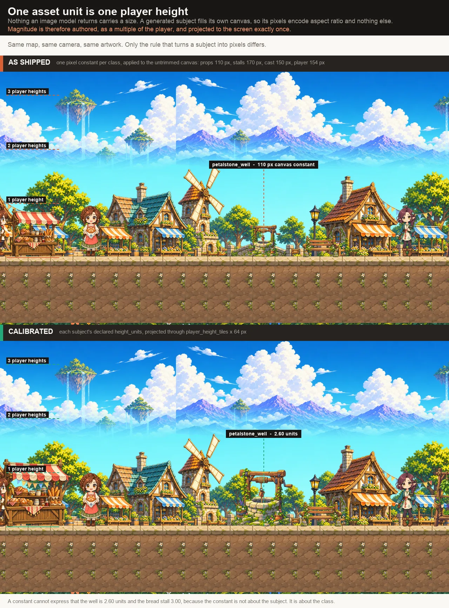

# Asset unit

> **Contract maturity: ratified TO-BE master.**
>
> This document defines the canonical asset unit for generated game packages:
> what one unit is, which entity classes declare it, how a declaration is
> resolved and admitted, and how a consumer projects it onto the screen.
>
> It does not claim runtime support, enumerate implementation status, track
> migration work, or serve as a project plan. The measurements that motivate
> every choice here are recorded in
> [Asset scale study](../research/asset-scale-study.md).



*Composited by `scripts/render_asset_scale_figures.py` from the
`bellweather-prepared-v11-bound` package; the manifest digest it was rendered
from is recorded in
[Reproducing the measurements](../research/asset-scale-study.md#reproducing-the-measurements).*

## The unit

**One asset unit is one canonical player height.** The player is `1.0` by
definition. Every other subject in a game package states its magnitude as a
multiple of that.

The unit is deliberately anatomical-free. A head, a shoulder width, or any
other body part is a property of the *art style* rather than of the world: at
`heads_tall = 2.25` a head is 0.44 of the figure, at realistic proportions it
is 0.125, and a size vocabulary built on one is unusable in the other. The
player is invariant across every build a game may author, so no style
parameter enters the vocabulary at all.

The unit is also not a pixel. `player_height_tiles` is the single place in a
package where the unit meets a render projection; a consumer multiplies
through it exactly once. Nothing else in an authored contract is expressed in
pixels.

### Relationship to neighbouring vocabularies

| Vocabulary | What it describes | Relationship |
| --- | --- | --- |
| `[proportion] heads_tall` | Internal build — how a figure is *drawn* | Orthogonal. Never converted to or from the asset unit. |
| `player_height_tiles` | The render projection of the unit | The one conversion seam. |
| Map occupancy cell / terrain atlas cell | The world grid | A tile. The player is `player_height_tiles` tiles tall. |
| `rise_tiles` | Authored ladder height | Already tile-expressed. Unchanged, and not restated in asset units. |

`heads_tall` and the asset unit answer different questions and must not be
reconciled. A figure at the right magnitude with the wrong build is a distinct
defect, caught by proportion review rather than by scale admission.

## Ownership

- `stage_gen.components.game_contract` owns the `[scale]` vocabulary, the step
  ladder, the floor, and validation that every declared class resolves.
- `stage_gen.components.game_content` owns the per-entity declaration fields
  and their bounds.
- `stage_gen.media.comparison_plate` owns deterministic plate composition and
  the structured judging call. It is provider-neutral and is shared with
  [Motion rebase](motion-rebase.md).
- `stage_gen.recipes.scrolling_preview.asset_unit` owns resolution, subject
  measurement, the plate's step ladder, admission, and the published
  calibration record.
- `web/lib/runtime` owns the projection from calibration to screen pixels and
  the registration of a scaled subject against the walk surface.

No generic component imports side-view or gameplay scale semantics. The image
model owns appearance only. Deterministic code owns measurement, arithmetic,
admission, and composition. A vision model owns exactly one judgement, defined
under [Recovering an undeclared magnitude](#recovering-an-undeclared-magnitude).

## Declaration

Magnitude is authored, not discovered. Measurement establishes a consistent
ruler; it never supplies the intended size.

```toml
[scale]
unit = "player_height"
player_height_tiles = 2.40
minimum = 0.25
steps = [0.25, 0.5, 0.75, 1.0, 1.5, 2.0, 3.0]

[scale.ranks]
common = 0.5
uncommon = 0.65
elite = 0.85
boss = 1.5
```

Each entity states `height_units`, or inherits it. Declarations are bounded to
`[minimum, 32.0]` and rounded to two decimal places.

| Class | Authority | Inheritance |
| --- | --- | --- |
| Player | `1.0` by definition | none; stating it is an error |
| NPC | `height_units` on the entity | the cast's build, via `heads_tall` and `by_body_kind` |
| Mob | `[scale.ranks]`, keyed by `rank` | none; `height_units` overrides for silhouette shape only |
| Prop, item, portal | `height_units` on the entity | the nearest step at or above `minimum` |
| Ladder | `rise_tiles` | none; the field already states world size exactly |

Two authorities for one measurement is a defect. A class that already states
its magnitude in another vocabulary does not gain a second field.

### The floor

Nothing the player can interact with resolves below `minimum`. The floor is a
legibility rule, not a realism rule: a subject drawn smaller than a quarter of
the player is not a readable target at any viewport this profile supports. It
binds props, items and mobs alike, and it binds a declaration that would
otherwise resolve under it.

### Mob magnitude is a design decision

A mob has no real-world referent, so its magnitude is not a fact to recover.
It is a gameplay parameter, and it resolves from `MobContent.rank` so that
**silhouette height carries threat**: a player reads danger from a size ladder
before reading the artwork.

Two invariants follow, and both are admitted rather than assumed:

- resolved magnitude is monotonic in rank; and
- no non-boss mob resolves above `1.0`.

`height_units` on a mob adjusts silhouette shape within its tier. It does not
reorder the ladder.

## Measurement

A declaration is a magnitude. Turning it into a draw scale requires knowing how
many source pixels *this particular artwork* spent on one unit.

```
source_px_per_unit = subject_extent_px / height_units
sprite_scale       = (player_height_tiles * tile_px) / source_px_per_unit
```

`sprite_scale` is uniform on both axes, always. Width and height are never set
independently.

### Pose-free subjects

For a prop, item, portal, ladder or identity concept, the subject's alpha
bounding box **is** the measurement. It is exact by construction, costs
nothing, and needs no reference object: a subject with no pose has no
distinction between its extent and its stature.

Measurement runs on the trimmed subject. A subject measured against its
untrimmed canvas measures the canvas, because a generated subject is
normalized to fill its frame and therefore encodes aspect ratio and nothing
else about its size.

### Actors

An actor's extent is not its stature — a crouch is shorter because of the pose
and a mis-scaled sheet is shorter because of the artwork, and an alpha box
cannot separate the two. This contract therefore measures **one state per
actor**: its declared baseline, which is an upright rest pose.

```
source_px_per_unit = baseline_subject_extent_px / height_units
```

Every other state of that actor reaches its scale through a multiplier against
that baseline, owned by [Motion rebase](motion-rebase.md). Measuring a second
state here would create a second authority for the same quantity.

One scale per atlas, applied to every frame of it. It is never re-derived per
frame: per-frame refitting is what makes a collapsed pose shrink and a lunging
pose grow.

## Recovering an undeclared magnitude

Where a package carries artwork whose magnitude was never declared, the
declaration is recovered by **multiple choice on a composited plate**, not by
estimation.

The plate is built deterministically after generation: the canonical player is
drawn at a fixed height, and the subject is drawn beside it once per entry in
`steps`. A vision model selects the entry that reads correctly. It emits an
index, never a number, never a coordinate, and never a pixel count.

This is the only judgement a model makes about scale, and it is a recognition
task rather than a measurement task. The composited plate is not a fiducial: a
reference object placed inside a generation is redrawn by the provider and
carries no ground truth, whereas a plate assembled locally from published bytes
is exact.

The recovered value is a **proposed declaration**, subject to review. It is
never multiplied into pixels directly.

## Anchor and registration

Magnitude is half of placement. Every subject is anchored at its ground
contact, expressed against its own published artwork.

```
origin = (pivot_x_normalized, ground_contact_y_normalized)
scale  = sprite_scale                     # uniform, both axes
y      = walk_surface_y
```

- `ground_contact_y_normalized` is the lowest painted row of the subject.
- `pivot_x_normalized` is the alpha-weighted horizontal centroid of rows within
  0.08 units of contact, so a lunging pose stays registered on the planted foot
  rather than on its bounding box.
- A motion atlas publishes both **per cell**. One value per actor sinks a
  crouch and floats a jump.
- A prone or collapsed pose takes its scale from its atlas's rebase multiplier,
  which is pose-free, so the body renders short because the pose is short.
- An airborne pose records contact and clamps it for placement, because
  physics owns vertical displacement.

## Admission

Scale admission fails closed. A rejected artifact is never clamped into range:
a silently rescaled subject is far harder to notice than a stage that fails.

| Gate | Rule |
| --- | --- |
| Declaration resolves | Every entity resolves a `height_units` at or above `minimum`. |
| Rank monotonicity | Resolved mob magnitude is monotonic in `rank`; no non-boss exceeds `1.0`. |
| Baseline present | An actor declares a baseline state, and that state carries a published atlas. |
| Entity consistency | `source_px_per_unit` sits within a bounded factor of the entity's own identity concept. |
| Derived extent | Derived width in units is bounded; downscale ratio above the warn threshold is recorded as a diagnostic. |

## Published calibration

Every calibrated subject publishes one record. A manifest re-derives it from
the published bytes and rejects a record it cannot reproduce; it never reads a
declaration and trusts it.

```json
"calibration": {
  "height_units": 1.0,
  "height_units_source": "authored",
  "source_px_per_unit": 227.1,
  "measured_sha256": "…",
  "downscale_ratio": 3.55,
  "cells": [
    { "index": 0, "ground_contact_y_normalized": 1.0, "pivot_x_normalized": 0.48 }
  ]
}
```

`height_units_source` is one of `authored`, `rank`, `recovered`, or
`inherited`, so a reader can tell a designed magnitude from a recovered one
without consulting the package.

## Consumer projection

A consumer holds exactly one scale constant and derives everything else.

```ts
const TILE_PX = 64;                                   // render projection only
const scale = (c: Calibration) =>
  (manifest.scale.player_height_tiles * TILE_PX) / c.source_px_per_unit;
```

No per-class height constant exists in a consumer. A boss is large because it
is authored large, not because a consumer multiplies a shared constant.

Gameplay metrics are expressed in the same world grid the unit projects onto,
so a jump arc is comparable to the player's own magnitude without arithmetic:

| Metric | Expressed as |
| --- | --- |
| Jump apex, ladder apex | tiles |
| Walk and run speed | tiles per second |
| Gravity | tiles per second squared |
| Combat reach, facing deadzone | tiles |
| Hitbox | `height_units` and the trimmed subject aspect |

## Classes that do not participate

Not every drawn thing has a world magnitude, and giving one to a subject that
lacks it is the category error this contract exists to prevent.

| Class | Why it is excluded |
| --- | --- |
| Terrain atlas | The atlas cell *is* the unit. Magnitude is the grid, already exact. |
| Parallax layers | Registered by exact frame-relative anchor against the painted frame. A layer is a plate, not a subject. |
| Dialogue portrait | A bust is a crop, not a figure. Its height is a panel layout decision. |
| UI panels | Screen furniture, owned by `ui.toml`. |

A midground layer painted with architecture carries an implied object scale
that this contract does not reach. Bringing foreground subjects into agreement
makes that disagreement more visible rather than less, and resolving it is a
separate concern from the asset unit.

## Related contracts

- [Motion rebase](motion-rebase.md) — cross-state coherence within one actor,
  which composes with the magnitude defined here.
- [Asset scale study](../research/asset-scale-study.md) — the measurements and
  the units that were rejected.
- [Sprite-sheet slicing and instance recovery](sprite-sheet-processing.md) —
  component extraction and ground-contact measurement.
- [Scrolling-preview terrain atlas](terrain-atlas.md) — the grid the unit
  projects onto.
- [Authored game contract schema](game/authored-contract-schema.md) — currently
  executable authored fields.
- [Actor boundary and semantic review](actor-boundary-and-semantic-review.md) —
  the geometry-versus-semantics boundary this contract observes.
