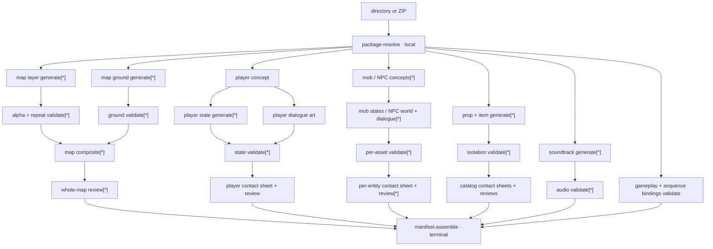

# Canonical game-generation pipeline

> **Contract maturity: current executable overview.**
>
> This is the canonical human overview of prepared-game generation. The typed package graph is
> the machine authority, and the compact graph contract embedded below is checked against the
> Bellweather fixture. Text-only prompt planning, `WorldSpec`, `VillageSpec`, map books, and the
> former Wave A/Wave B stage barriers are not inputs to this pipeline.

## Authority and source topology

| Boundary | Current authority |
| --- | --- |
| Authored package membership and cross-contract closure | [`game_package.py`](../../../src/stage_gen/orchestration/game_package.py) |
| Asset-level fan-out, dependencies, outputs, cache inputs, and provider routes | [`package_graph.py`](../../../src/stage_gen/recipes/scrolling_preview/package_graph.py) |
| Dependency scheduling, resource gates, result contracts, and trace | [`execution_graph.py`](../../../src/stage_gen/orchestration/execution_graph.py) |
| Scrolling-preview resolve/plan/dispatch composition | [`package_executor.py`](../../../src/stage_gen/recipes/scrolling_preview/package_executor.py) |
| Leaf provider retries, decoding, validation, and atomic persistence | Provider-neutral components and adapters |
| Runtime artifact binding | Terminal manifest contract; connected in Checkpoint 5 |

The scrolling-preview executor is deliberately thin. It resolves one directory or ZIP, asks the
recipe to construct the graph, and gives that graph to generic orchestration. It does not plan a
game, hide asset fan-outs inside a coarse stage, or implement provider retry loops.

`stage-gen generate` now requires `--input` pointing to a prepared directory or ZIP whose root
contains `game.toml`. There is no bare-prompt fallback. Provider-backed package execution remains
fail-closed until the world and content handlers are connected; the implemented `--dry-run` path
uses the same graph and scheduler with deterministic fake operations.

## Current boundary graph



`[*]` means a package-derived fan-out. Each concrete entity, state, layer, ground, prop, item, and
track is a stable typed node. The terminal manifest depends on every enabled branch; it is never
written after a partial required run.

## Machine-checked graph contract

The embedded contract is intentionally content-insensitive where content does not change
topology. A changed prompt, image byte, or selected model changes node cache keys and
`graph_sha256`, but not `topology_sha256`. Adding a map, entity, state, or dependency changes the
topology and therefore this checked snapshot.

<!-- pipeline-graph-contract:start -->
```json
{
  "kind": "prepared-game-execution-graph-contract-v1",
  "fixture_ref": "library/games/bellweather",
  "graph_schema_version": 1,
  "topology_sha256": "cb6b4b7fc0dc2410abd2de95daea2c24d6b3579c3a0b811272bf335911bfbf76",
  "node_count": 192,
  "terminal_node_id": "manifest-assemble",
  "operation_counts": {
    "local": 92,
    "image_generation": 82,
    "structured_generation": 15,
    "music_generation": 3
  },
  "resources": [
    {
      "resource_id": "local",
      "max_in_flight": 32,
      "requests_per_minute": null,
      "rate_limit_owner": "none"
    },
    {
      "resource_id": "openai-image",
      "max_in_flight": null,
      "requests_per_minute": 150,
      "rate_limit_owner": "provider_adapter"
    },
    {
      "resource_id": "openrouter-structured",
      "max_in_flight": null,
      "requests_per_minute": null,
      "rate_limit_owner": "none"
    },
    {
      "resource_id": "openrouter-music",
      "max_in_flight": null,
      "requests_per_minute": null,
      "rate_limit_owner": "none"
    }
  ]
}
```
<!-- pipeline-graph-contract:end -->

Remote provider resources have no scheduler concurrency ceiling. The direct OpenAI adapter owns
the configured 150-IPM request-start pacing for this Tier 4 deployment and intentionally allows
earlier slow requests to remain in flight. Other deployments must set their active project tier;
the value is not a universal model constant.

## Bellweather operation topology

The normal first-pass graph contains 100 provider operations. Provider transport retries and
later semantic regenerations are not counted as new graph nodes; their actual calls must be
reported by the owning node.

| Domain | Concrete expansion | Image | Structured | Music | Local |
| --- | --- | ---: | ---: | ---: | ---: |
| Maps | 2 maps × (4 layers + 1 ground), validation, composite, map review | 10 | 2 | 0 | 12 |
| Player | concept, 9 two-facing states, dialogue, validations, board, review | 11 | 1 | 0 | 11 |
| Mobs | 6 mobs × (concept + 5 states + validations + board + review) | 36 | 6 | 0 | 36 |
| NPCs | 4 NPCs × (concept + world + dialogue + validations + board + review) | 12 | 4 | 0 | 12 |
| Props | 8 isolated props, validations, one board, one review | 8 | 1 | 0 | 9 |
| Items | 5 isolated items, validations, one board, one review | 5 | 1 | 0 | 6 |
| Soundtrack | 3 generated tracks and technical validations | 0 | 0 | 3 | 3 |
| Package / gameplay / manifest | package closure, bindings, terminal assembly | 0 | 0 | 0 | 3 |
| **Total** | **192 nodes** | **82** | **15** | **3** | **92** |

Each state image is one accepted state-sheet operation, not one call per animation frame. Player
states include both required facings. Concept nodes intentionally precede actor state nodes to
anchor identity; unrelated actors, maps, catalogs, and tracks do not wait for one another.

## Scheduling semantics

The generic executor repeatedly starts every node whose declared prerequisites succeeded:

- ready siblings run concurrently; only local work uses a resource semaphore;
- a node never starts before all prerequisites finish successfully;
- one failure marks only its descendants `skipped`;
- unrelated running or ready siblings are not cancelled;
- the scheduler calls a node handler once and never retries provider work;
- provider components remain the sole retry owners, with at most six attempts;
- provider adapters retain their request-start pacing; and
- terminal success requires `manifest-assemble` to succeed.

The resource-aware Bellweather projection uses planning assumptions of 120 seconds per image,
30 seconds per structured review, and 180 seconds per music operation. With the Tier 4
adapter-owned 150 image starts per minute, the projected terminal offset is **295.65 seconds
(4m 55.65s)**. This is a scheduling estimate, not a live latency claim.

The graph carries a broad **USD 3.655–20.00 budgetary allowance**: USD 0.04–0.20 per image,
USD 0.005–0.08 per structured operation, and USD 0.10–0.80 per music operation. These are
conservative planning inputs, not a canonical provider price sheet. Current provider pricing and
returned usage remain operational evidence and must be refreshed at the live-provider gate.

## Cache identity and retry ownership

Every node cache key includes its stable ID and operation contract version, selected provider and
model, digests of validated authored inputs and references, and ordered prerequisite cache keys.
Cache admission additionally validates actual upstream artifact digests as lineage. Path
existence alone is never a hit. A changed model, prompt, reference byte, dependency contract, or
upstream artifact invalidates the relevant reuse boundary.

`attempts` in a trace belongs to the component-owned provider operation. The scheduler does not
wrap it in another retry loop. A semantic regeneration is a new provider operation and must
increase `provider_operations`; it is not disguised as a transport retry. The base projection
counts one successful provider operation per provider node.

## Persisted execution evidence

| File | Contract |
| --- | --- |
| `package.json` | Captured package identity, stable IDs, and root digests |
| `execution-plan.json` | Nodes, dependencies, resources, outputs, cache keys, models, and estimates |
| `execution-projection.json` | Resource spans, critical path, call counts, time, and budget range |
| `execution-trace.jsonl` | Immutable run/node events with queue, duration, cache, attempts, calls, and errors |
| `execution-summary.json` | Terminal status and per-node result projection |
| `dry-run/*.json` | Fake artifacts used to validate content and lineage cache behavior |

Trace records contain portable artifact references, hashes, and sanitized errors. They do not
contain credentials, authorization headers, signed URLs, temporary paths, or absolute inputs.

```bash
uv run stage-gen package plan --input library/games/bellweather
uv run stage-gen generate \
  --input library/games/bellweather \
  --dry-run \
  --output /tmp/bellweather-dry-run
```

`--failure-node <node_id>` injects a deterministic failure. Reusing `--cache-dir` proves warm
cache behavior. Neither command requires or calls a provider.

## Change protocol

Update this document and its embedded contract in the same change whenever package inputs, node
fan-out, dependencies, provider multiplicity, resources, scheduling, retries, cache identity,
trace fields, persisted outputs, or manifest prerequisites change. Run:

```bash
uv run pytest tests/contract/test_generation_pipeline_docs.py
uv run python scripts/check_docs.py
```

Live latency, price, quota, and semantic media acceptance are dated evidence. They must not be
silently promoted into permanent graph truth.
