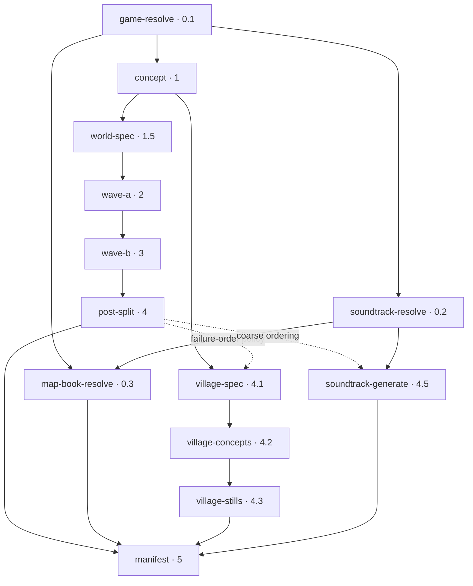
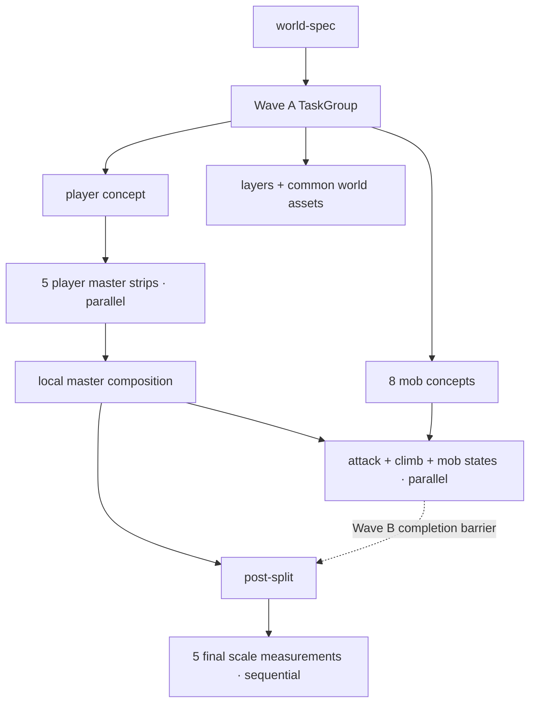

# Canonical game-generation pipeline

> **Contract maturity: current executable overview.**
>
> This document is the canonical human overview of the game-generation pipeline. The typed
> recipe graph remains the machine authority, and the graph contract embedded below is checked
> against that implementation. `CURRENT` describes behavior implemented in the live repository;
> `TARGET` describes an intended change and never implies runtime support.

## Authority and scope

The authored [`game.toml` contract](authored-contract-schema.md) owns durable game direction. The
[`scrolling-preview` recipe graph](../../../src/stage_gen/recipes/scrolling_preview/stages.py) owns
how that direction is resolved into generated assets. The
[`ScrollingPreviewExecutor`](../../../src/stage_gen/recipes/scrolling_preview/executor.py) owns
the asset-level fan-outs, reviews, and deterministic transforms inside the coarse recipe stages.
The [runner](../../../src/stage_gen/orchestration/runner.py) owns execution order and run summary
persistence.

This document connects those authorities. It does not move recipe behavior into `game.toml`, make
the canonical demo package a generator, or make the optional web preview a contract authority.
The selected repository game and its authored closure remain defined by the
[canonical game package](../../game-package.md).

Authority is owned by boundary rather than one blanket precedence list:

| Boundary | Authority |
| --- | --- |
| Executable top-level topology and current ordering | Typed recipe graph and runner |
| Human pipeline topology, operation placement, and cross-boundary overview | This document |
| Leaf dimensions, layout, semantic acceptance, and media contracts | Focused asset specifications |
| Current models, endpoints, credentials, and provider limitations | Provider operations document and adapters |
| Persisted public shapes | Their validated contract models and schemas |
| Selected repository game and authored closure | Canonical game-package selector and validator |

The graph snapshot below deliberately excludes prompts, content digests, absolute paths, callable
identities, and provider timing. Those values are either content-specific, checkout-specific, or
operational rather than topological.

## Boundary overview


The request may bind `game.toml`, `soundtrack.toml`, a map book, a character profile, visual
content controls, a style selector, and an optional village. Binding resolution is local and
digest-checked. Generated bytes do not become valid merely because a provider returned HTTP 200;
each artifact must satisfy its media, semantic, provenance, and cache contracts before manifest
admission. Repository publication remains a separate reviewed rights decision.

## CURRENT top-level graph

The following graph is the repository-selected canonical game request reached through
`library/games/main.toml`. Arrows are declared prerequisites. They do **not** imply that the current
runner schedules ready branches concurrently.



Solid edges carry an artifact or authored contract. Dotted edges are current policy or coarse
ordering barriers. Optional nodes are absent when their binding or opt-in is absent.

The minimal prompt-only graph is:

```text
concept -> world-spec -> wave-a -> wave-b -> post-split -> manifest
```

### Machine-checked graph contract

`tests/contract/test_generation_pipeline_docs.py` compares this block with the live stage resolver.
Node order is significant because the current runner executes the returned tuple in order.
Dependency order is normalized because dependency edges are set-like.

<!-- pipeline-graph-contract:start -->
```json
{
  "kind": "scrolling-preview-stage-graphs-v1",
  "selector_ref": "library/games/main.toml",
  "graphs": {
    "minimal": {
      "nodes": [
        {"id": "concept", "wave": "1", "depends_on": []},
        {"id": "world-spec", "wave": "1.5", "depends_on": ["concept"]},
        {"id": "wave-a", "wave": "2", "depends_on": ["world-spec"]},
        {"id": "wave-b", "wave": "3", "depends_on": ["wave-a"]},
        {"id": "post-split", "wave": "4", "depends_on": ["wave-b"]},
        {"id": "manifest", "wave": "5", "depends_on": ["post-split"]}
      ]
    },
    "canonical_game": {
      "nodes": [
        {"id": "game-resolve", "wave": "0.1", "depends_on": []},
        {
          "id": "soundtrack-resolve",
          "wave": "0.2",
          "depends_on": ["game-resolve"]
        },
        {
          "id": "map-book-resolve",
          "wave": "0.3",
          "depends_on": ["game-resolve", "soundtrack-resolve"]
        },
        {"id": "concept", "wave": "1", "depends_on": ["game-resolve"]},
        {"id": "world-spec", "wave": "1.5", "depends_on": ["concept"]},
        {"id": "wave-a", "wave": "2", "depends_on": ["world-spec"]},
        {"id": "wave-b", "wave": "3", "depends_on": ["wave-a"]},
        {"id": "post-split", "wave": "4", "depends_on": ["wave-b"]},
        {
          "id": "village-spec",
          "wave": "4.1",
          "depends_on": ["concept", "post-split"]
        },
        {
          "id": "village-concepts",
          "wave": "4.2",
          "depends_on": ["village-spec"]
        },
        {
          "id": "village-stills",
          "wave": "4.3",
          "depends_on": ["village-concepts"]
        },
        {
          "id": "soundtrack-generate",
          "wave": "4.5",
          "depends_on": ["post-split", "soundtrack-resolve"]
        },
        {
          "id": "manifest",
          "wave": "5",
          "depends_on": [
            "map-book-resolve",
            "post-split",
            "soundtrack-generate",
            "village-stills"
          ]
        }
      ]
    }
  }
}
```
<!-- pipeline-graph-contract:end -->

This checked projection covers the minimal graph and the selected canonical package. The recipe's
focused tests remain authoritative for every optional-feature combination.

## Conditional graph composition

| Input | Added or changed nodes | Current dependency effect |
| --- | --- | --- |
| `theme` | `theme-compile` at 0.5 | `concept` waits for the compiled plan unless a style selector is also present. |
| `style_anchor` | `style-select` at 0.75 | The selector waits for `theme-compile` when both are present; `concept` waits for the selector. |
| `character_profile` | `profile-resolve` at 0.25 | `wave-a` additionally waits for the resolved profile. |
| `game` | `game-resolve` at 0.1 | `concept` additionally waits for the game contract; game-directed mobs gain attack art and directed village residents use stills. |
| `soundtrack` | `soundtrack-resolve` at 0.2 and `soundtrack-generate` at 4.5 | Requires `game` and `map_book`; the manifest waits for generated tracks. |
| `map_book` | `map-book-resolve` at 0.3 | Requires `game` and `soundtrack`; the manifest waits for the resolved book. |
| `village` | `village-spec`, `village-concepts`, and one resident terminal stage | A game-directed run ends in `village-stills`; an undirected run ends in `village-strips`. |
| `character_heads_tall` | No stage node | Changes prompt/cache identity and player proportions inside existing stages. |
| `transparency_mode` | No top-level stage node | Selects native alpha, compatibility background removal, or degraded chroma processing inside image operations. |

## Stage catalog and operation contracts

The counts below are first-pass operations before provider retries, semantic regeneration, or
fallback generation. `L` is the accepted parallax-layer count, `N` is the mob count, and `T` is
the authored soundtrack-track count. The current world contract fixes `N = 8`; validation permits
`L = 2..5`.

| Stage | Reads | Publishes | External operations |
| --- | --- | --- | --- |
| `game-resolve` | Digest-bound `game.toml` binding | `game_<tag>.json` plus provenance | Local only |
| `soundtrack-resolve` | Digest-bound soundtrack binding and resolved game | `soundtrack_<tag>.json` plus provenance | Local only |
| `map-book-resolve` | Game, soundtrack, and digest-locked map book | `map_book_<tag>.json` plus provenance | Local only |
| `profile-resolve` | Digest-bound character profile | Canonical profile JSON plus provenance | Local only |
| `theme-compile` | Prompt and numeric content controls | Validated scrolling direction plan | 1 structured call |
| `style-select` | Canonical style vocabulary and optional theme plan | Selected style-anchor contract | 1 structured call |
| `concept` | Prompt, game direction, optional theme/style | Opaque 1536×1024 style-root PNG | 1 image call |
| `world-spec` | Concept image and effective direction | Validated world bible: layers, mobs, obstacles, and items | 1 structured vision call |
| `wave-a` | Concept, world bible, optional game/profile | Layers, tileset, player and mob concepts, obstacles, items, inventory, portal, ladder | `L + 17` image calls |
| `wave-b` | Player and mob concepts, game motion direction | Player state/attack/climb art, mob state art, reviews, and scale records | Base: 23 image + 40 structured; game-directed: 31 image + 56 structured |
| `post-split` | One already-composed `character_<tag>_combined.png` player master | Five final runtime strips and final-byte scale records | Local slicing + 5 structured vision calls |
| `village-spec` | Concept and optional game direction | Validated village bible | 1 structured vision call |
| `village-concepts` | Village bible and concept | Four resident turnarounds and one fixture sheet | 5 image calls |
| `village-stills` / `village-strips` | Each resident turnaround | Four reviewed resident runtime assets and scale records | 4 image + 8 structured calls |
| `soundtrack-generate` | Resolved soundtrack | One normalized MP3 per track | `T` music calls plus local audio normalization |
| `manifest` | Every required validated terminal artifact | `manifest_<tag>.json` plus provenance | Local only |
| runner summary | Executed stage outcomes | `run.json` (`recipe_run_v3`) | Local only |

For the selected canonical game-directed village request, the first-pass total is `L + 58` image
operations, 71 structured operations, and `T` music operations. A `theme` or `style_anchor` opt-in
adds one structured operation apiece. The selected soundtrack currently declares three tracks.
Native-alpha mode performs no background-removal calls. Compatibility `ai` mode adds one
background-removal operation for each generated transparent artifact; `chroma` replaces that
operation with deterministic local keying. See [provider operations](../../providers.md) and the
detailed [asset contracts](../asset-contracts.md).

### Current capability-route projection

This table is a convenience projection of the current composition, not the provider authority.
The [provider operations document](../../providers.md), configuration, and adapters own these
time-sensitive defaults and must be re-verified before changing an adapter or model ID.

| Capability | Current model and route |
| --- | --- |
| Native image generation | Direct OpenAI `gpt-image-2`; `/v1/images/generations` without references and `/v1/images/edits` with references |
| Compatibility image generation | OpenRouter `openai/gpt-image-2`; `/api/v1/images` |
| Structured text and vision | OpenRouter `openai/gpt-5.6-sol`; `/api/v1/chat/completions` with strict JSON Schema output |
| Music generation | OpenRouter `google/lyria-3-pro-preview`; `/api/v1/chat/completions` with audio modality |
| Compatibility background removal | fal `fal-ai/birefnet/v2`; synchronous model endpoint, used only by `ai` transparency |

## CURRENT internal data flow and parallelism



Current execution semantics are important:

- The runner awaits top-level stages in tuple order. It does not schedule all ready `depends_on`
  nodes concurrently.
- Wave A uses one `asyncio.TaskGroup` for all first-wave image assets.
- Wave B runs five player master strips in parallel, waits for all five, composes the master, then
  runs player attack/climb and mob-state work in a second fan-out.
- Village concepts and resident outputs each use their own fan-out.
- Post-split's five scale measurements and soundtrack tracks are currently sequential loops.
- Direct OpenAI image starts are currently paced at five per minute. The limiter controls request
  start rate rather than the number of requests already in flight.
- A top-level failure stops later stages. A failed task inside one `TaskGroup` cancels its siblings.

Actor assets additionally pass a per-artifact acceptance chain. Steps that do not apply to a
particular artifact are omitted, but their order is fixed:

```text
cache/lineage check
  -> image generation
  -> media + alpha + grid validation
  -> atomic candidate artifact + provenance persistence
  -> facing review
  -> build/proportion gate
  -> bounded semantic regeneration when rejected
  -> scale measurement on final accepted bytes
  -> accepted artifact/review/scale closure
```

The current coarse edges mix several meanings:

| Edge | Meaning today |
| --- | --- |
| `wave-a -> wave-b` | Coarse stage barrier. Individual actor states really need their matching concept, not every Wave A artifact. |
| `wave-b -> post-split` | Coarse stage barrier. Post-split consumes the player master, not all mob outputs. |
| `post-split -> village-spec` | Failure-policy barrier. `village-spec` reads the concept; it waits so an optional village failure cannot abort mandatory artwork. |
| `post-split -> soundtrack-generate` | Ordering barrier. Soundtrack generation reads the resolved soundtrack, not player artifacts. |

Data prerequisites, preflight gates, resource limits, priority, and optional-branch failure policy
must remain distinguishable in any future scheduler.

## Validation, cache, retry, and publication

- Contract resolvers reject digest mismatch, cross-game ownership, traversal, and symlink escape
  before provider-backed work.
- Cache reuse validates artifact bytes and lineage; path existence alone is insufficient.
- Each provider operation has one retry owner and at most six attempts: one initial attempt plus
  five retries with capped backoff.
- Facing or scale-derived build rejection may trigger bounded semantic image regeneration. These
  are new generation operations rather than transport retries.
- Media and sheet validation stays inside the image operation's six-attempt retry owner. Selected
  exhausted sheet shapes may then enter explicit recipe fallbacks.
- A scale-measurement transport, schema, or vision failure retries that structured operation and
  then fails; it does not independently regenerate image art.
- Artifacts are persisted atomically with adjacent provenance only after validation succeeds.
- The manifest is terminal and waits for every enabled required branch. Generated media remains
  unapproved for repository publication until its independent review and rights gates pass.

The run summary records run timing, executed stage outcomes, artifacts, and the final status. It
does not currently persist the resolved DAG, asset-task spans, provider latency, queue time, cache
decisions, or an immutable invocation history.

## TARGET evolution — not implemented

The intended evolution preserves the contracts above while making the execution model explicit:

1. Accept a digest-bound concept package as an alternative to generating the concept image from
   a prompt. The imported reference remains the visual root; it does not become `game.toml`.
2. Replace coarse Wave A/Wave B barriers with typed asset-level nodes so each actor branch may
   advance when its own prerequisite is ready.
3. Schedule ready nodes through resource-aware queues, with provider start rate, maximum in-flight
   work, priority, and failure domain represented independently from data dependencies.
4. Persist the resolved graph and append-only run, stage, asset, cache, retry, rate-limit, provider,
   validation, and persistence spans.
5. Keep `run.json` as the compatibility/latest summary while giving every invocation an immutable
   identity and graph digest.

Until those changes ship, diagrams must continue to label the top-level runner as sequential.

## Change protocol

Update this document in the same change whenever any of these boundaries change:

- recipe stages, ordering, waves, conditions, or `depends_on` edges;
- asset fan-out, per-asset prerequisites, semantic review, fallback, or failure policy;
- authored game, soundtrack, map, profile, concept-package, or recipe input composition;
- provider route, operation multiplicity, transparency processing, retries, or resource limits;
- cache identity, output filenames, manifest requirements, run-summary shape, or scheduler behavior.

When the top-level graph changes, update the Mermaid diagram, graph-contract JSON, stage table, and
focused tests together. Run:

```bash
uv run pytest tests/contract/test_generation_pipeline_docs.py
uv run python scripts/check_docs.py
```

Operational latency, cost, and provider quota are dated observations rather than graph semantics.
Record them in benchmark or trace evidence and link them from here only when the evidence is
portable and retained.

The checked JSON currently enforces the minimal and selected canonical top-level graphs. The
stage catalog, asset-level diagram, operation counts, and internal scheduling remain manually
reviewed projections because Wave A and Wave B leaf nodes are still imperative executor logic.
Making those leaves typed graph nodes is required before CI can enforce the complete internal DAG.
