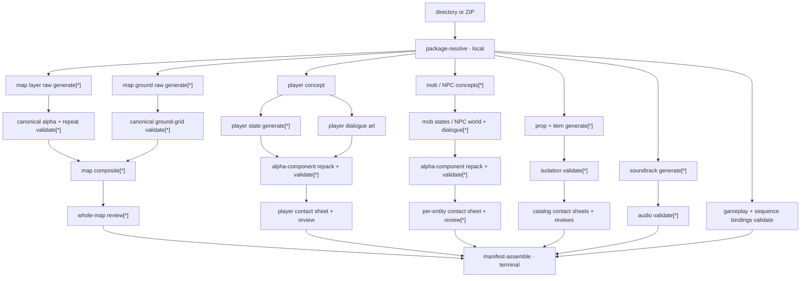

# Canonical game-generation pipeline

> **Contract maturity: current executable overview.**
>
> This is the canonical human overview of prepared-game generation. The typed package graph is
> the machine authority, and the compact graph contract embedded below is checked against the
> Bellweather fixture. Text-only prompt planning, `WorldSpec`, `VillageSpec`, map books, and the
> former Wave A/Wave B stage barriers are not inputs to this pipeline.

## Authority and source topology

| Boundary | Current authority |
| --- | --- |
| Authored package membership and cross-contract closure | [`game_package.py`](../../../src/stage_gen/orchestration/game_package.py) |
| Asset-level fan-out, dependencies, outputs, cache inputs, and provider routes | [`package_graph.py`](../../../src/stage_gen/recipes/scrolling_preview/package_graph.py) |
| Dependency scheduling, resource gates, result contracts, and trace | [`execution_graph.py`](../../../src/stage_gen/orchestration/execution_graph.py) |
| Scrolling-preview resolve/plan/dispatch composition | [`package_executor.py`](../../../src/stage_gen/recipes/scrolling_preview/package_executor.py) |
| Prepared-package map execution, canonicalization, cache, and review | [`prepared_world.py`](../../../src/stage_gen/recipes/scrolling_preview/prepared_world.py) |
| Prepared-package cast, catalog, soundtrack, binding, and review execution | [`prepared_content.py`](../../../src/stage_gen/recipes/scrolling_preview/prepared_content.py) |
| Leaf provider retries, decoding, validation, and atomic persistence | Provider-neutral components and adapters |
| Runtime artifact binding and atomic publication | [`prepared_manifest.py`](../../../src/stage_gen/recipes/scrolling_preview/prepared_manifest.py) |

The scrolling-preview executor is deliberately thin. It resolves one directory or ZIP, asks the
recipe to construct the graph, and gives that graph to generic orchestration. It does not plan a
game, hide asset fan-outs inside a coarse stage, or implement provider retry loops.

`stage-gen generate` now requires `--input` pointing to a prepared directory or ZIP whose root
contains `game.toml`. There is no bare-prompt fallback. `--checkpoint world` executes only the
map-review targets and their complete dependency closure. `--checkpoint content` independently
executes cast, catalog, soundtrack, and stable-ID binding targets and their dependency closure.
Neither paid bounded checkpoint can assemble a manifest. `--checkpoint integration` is a
provider-free terminal operation over accepted artifact roots. It validates the complete
package-derived runtime closure, applies caller-ordered corrective-run precedence, atomically
publishes one immutable run, and emits `prepared-game-runtime-v1`. The `--dry-run` path still
exercises the complete graph with deterministic fake operations.

## Current boundary graph



`[*]` means a package-derived fan-out. Each concrete entity, state, layer, ground, prop, item, and
track is a stable typed node. The terminal manifest depends on every enabled branch; it is never
written after a partial required run.

## Machine-checked graph contract

The embedded contract is intentionally content-insensitive where content does not change
topology. A changed prompt, image byte, or selected model changes node cache keys and
`graph_sha256`, but not `topology_sha256`. Adding a map, entity, state, or dependency changes the
topology and therefore this checked snapshot.

<!-- pipeline-graph-contract:start -->
```json
{
  "kind": "prepared-game-execution-graph-contract-v1",
  "fixture_ref": "library/games/bellweather",
  "graph_schema_version": 1,
  "topology_sha256": "87c8f7e4961b6ec1d2f9d76e624a4a75afb5fd5e0068703402964f4dcc804704",
  "node_count": 192,
  "terminal_node_id": "manifest-assemble",
  "operation_counts": {
    "local": 92,
    "image_generation": 82,
    "structured_generation": 15,
    "music_generation": 3
  },
  "resources": [
    {
      "resource_id": "local",
      "max_in_flight": 32,
      "requests_per_minute": null,
      "rate_limit_owner": "none"
    },
    {
      "resource_id": "openai-image",
      "max_in_flight": null,
      "requests_per_minute": 150,
      "rate_limit_owner": "provider_adapter"
    },
    {
      "resource_id": "openrouter-structured",
      "max_in_flight": null,
      "requests_per_minute": null,
      "rate_limit_owner": "none"
    },
    {
      "resource_id": "openrouter-music",
      "max_in_flight": null,
      "requests_per_minute": null,
      "rate_limit_owner": "none"
    }
  ]
}
```
<!-- pipeline-graph-contract:end -->

Remote provider resources have no scheduler concurrency ceiling. The direct OpenAI adapter owns
the configured 150-IPM request-start pacing for this Tier 4 deployment and intentionally allows
earlier slow requests to remain in flight. Other deployments must set their active project tier;
the value is not a universal model constant.

## Bellweather operation topology

The normal first-pass graph contains 100 provider operations. Provider transport retries and
later semantic regenerations are not counted as new graph nodes; their actual calls must be
reported by the owning node.

| Domain | Concrete expansion | Image | Structured | Music | Local |
| --- | --- | ---: | ---: | ---: | ---: |
| Maps | 2 maps × (4 layers + 1 ground), validation, composite, map review | 10 | 2 | 0 | 12 |
| Player | concept, 9 canonical-source states, dialogue, validations, board, review | 11 | 1 | 0 | 11 |
| Mobs | 6 mobs × (concept + 5 states + validations + board + review) | 36 | 6 | 0 | 36 |
| NPCs | 4 NPCs × (concept + world + dialogue + validations + board + review) | 12 | 4 | 0 | 12 |
| Props | 8 isolated props, validations, one board, one review | 8 | 1 | 0 | 9 |
| Items | 5 isolated items, validations, one board, one review | 5 | 1 | 0 | 6 |
| Soundtrack | 3 generated tracks and technical validations | 0 | 0 | 3 | 3 |
| Package / gameplay / manifest | package closure, bindings, terminal assembly | 0 | 0 | 0 | 3 |
| **Total** | **192 nodes** | **82** | **15** | **3** | **92** |

Each state image is one accepted state-strip operation, not one call per animation frame. Actor
motion has one recipe-owned source facing rather than authored left/right coverage. Concept nodes
intentionally precede actor state nodes to anchor identity; unrelated actors, maps, catalogs, and
tracks do not wait for one another.

The live World checkpoint is the exact 25-node closure rooted at both map-review nodes: one
package capture, 10 image edits, 12 local canonicalization/composition operations, and two
structured reviews. It cannot schedule any cast, catalog, soundtrack, gameplay-binding, or
manifest node. Each layer and ground generation writes a retained `*.raw.png`; only its dependent
validator may write the canonical runtime-facing PNG.

The live Content checkpoint is the exact 167-node closure rooted at every cast/catalog review,
every soundtrack validation, and `gameplay-bindings-validate`: one package capture, 72 image
operations, 13 structured reviews, three music operations, and 79 local nodes. It cannot schedule
map or manifest nodes. Twenty-four identity/catalog images are initially independent; each actor's
state and dialogue descendants become ready immediately after that actor's concept succeeds.
Soundtrack generation, gameplay binding, unrelated actors, and unrelated catalogs overlap.

Every actor motion-state provider output is retained as a native-alpha 4-column by 1-row
`*.source.png`. Before runtime publication, its local validation node runs
`alpha-component-repack-v1`: threshold native alpha at greater than 16, find 8-connected
components, retain candidates whose area is at least 2% of thresholded visible area (with a
32-pixel floor), select the largest required count, order them by source row and horizontal
centroid, and translate them without rescaling into equal canonical cells with 12-pixel transparent
gutters. The resulting `*.png`, not the provider source, is the runtime artifact.

This deliberately simple default is stronger than equal-XY slicing but is not semantic instance
ownership. It can drop detached weapons, projectiles, magic, debris, or other components below the
selection boundary. When more candidates exist than required, it retains the largest required
count and records a warning; when fewer principal components exist than required, it fails closed.
The validation record binds source/output digests, placements, rejected-component facts, retained
alpha, and this caveat. Smarter component attachment or segmentation is not silently invoked.

Ordinary side-view states contain four right-facing frames; the runtime mirrors that canonical
source for left-facing play. Player `climb` is the explicit exception: it is rear-facing and is not
mirrored during ladder traversal. Facing is therefore a recipe/runtime projection contract, not
authored game-content input, and `content/player.toml` has no `required_facings` field. Generating
both directions is intentionally forbidden by the canonical path because it adds cross-row
consistency work without a runtime consumer. Separately authored directions may become an explicit
future opt-in for asymmetric handedness, but are not accepted silently.

Dialogue provider atlases use a deterministic row-major 2-by-2 or 3-by-N requested layout derived
from the authored expression count. Their local validation nodes apply the same alpha-component
repacker with centered placement and permit only the declared leading cells; unused canonical cells
remain transparent. Local validators persist dimensions, source and canonical digests, component
selection, cell placement, source facing where applicable, runtime-mirroring policy,
state/expression stable IDs, and alpha facts; they never use AI background removal. Prop and item
nodes produce one isolated native-alpha asset per stable ID. Contact sheets consume repacked
atlases and remain deterministic review artifacts, not runtime atlases.

## Scheduling semantics

The generic executor repeatedly starts every node whose declared prerequisites succeeded:

- ready siblings run concurrently; only local work uses a resource semaphore;
- a node never starts before all prerequisites finish successfully;
- one failure marks only its descendants `skipped`;
- unrelated running or ready siblings are not cancelled;
- the scheduler calls a node handler once and never retries provider work;
- provider components remain the sole retry owners, with at most six attempts;
- provider adapters retain their request-start pacing; and
- full-run success requires `manifest-assemble` to succeed; a bounded checkpoint succeeds only
  when every explicit target succeeds.

The resource-aware Bellweather projection uses planning assumptions of 120 seconds per image,
30 seconds per structured review, and 180 seconds per music operation. With the Tier 4
adapter-owned 150 image starts per minute, the projected terminal offset is **295.65 seconds
(4m 55.65s)**. This is a scheduling estimate, not a live latency claim.

The graph carries a broad **USD 3.655–20.00 budgetary allowance**: USD 0.04–0.20 per image,
USD 0.005–0.08 per structured operation, and USD 0.10–0.80 per music operation. These are
conservative planning inputs, not a canonical provider price sheet. Current provider pricing and
returned usage remain operational evidence and must be refreshed at the live-provider gate.

## Cache identity and retry ownership

Every node cache key includes its stable ID and operation contract version, selected provider and
model, digests of validated authored inputs and references, and ordered prerequisite cache keys.
Cache admission additionally validates actual upstream artifact digests as lineage. Path
existence alone is never a hit. A changed model, prompt, reference byte, dependency contract, or
upstream artifact invalidates the relevant reuse boundary.

`attempts` in a trace belongs to the component-owned provider operation. The scheduler does not
wrap it in another retry loop. A semantic regeneration is a new provider operation and must
increase `provider_operations`; it is not disguised as a transport retry. The base projection
counts one successful provider operation per provider node.

## Persisted execution evidence

| File | Contract |
| --- | --- |
| `package.json` | Captured package identity, stable IDs, and root digests |
| `execution-plan.json` | Nodes, dependencies, resources, outputs, cache keys, models, and estimates |
| `execution-projection.json` | Resource spans, critical path, call counts, time, and budget range |
| `execution-trace.jsonl` | Immutable run/node events with queue, duration, cache, attempts, calls, and errors |
| `execution-summary.json` | Terminal status and per-node result projection |
| `maps/*/layers/*.raw.png` | Retained provider layer output and provider provenance |
| `maps/*/layers/*.png` | Deterministically canonicalized horizontal repeat unit |
| `maps/*/layers/*.repeat.png` | Three-repeat checkerboard evidence for visual review |
| `maps/*/ground.raw.png` | Retained provider ground-atlas output and provider provenance |
| `maps/*/ground.png` | Canonical 12-by-4 ground topology |
| `maps/*/composite.png`, `review.json` | Whole-map composition and structured semantic verdict |
| `content/{players,mobs,npcs}/*/concept.png` | Canonical generated actor identity and provider provenance |
| `content/{players,mobs}/*/states/*.source.png` | Retained native-alpha provider motion source and provider provenance |
| `content/{players,mobs}/*/states/*.png`, `*.validation.json` | Alpha-component-repacked 4-by-1 runtime strip plus selection, placement, loss, and lineage facts |
| `content/{players,npcs}/*/dialogue.source.png` | Retained native-alpha provider dialogue source and provider provenance |
| `content/{players,npcs}/*/dialogue.png`, `dialogue.validation.json` | Row-major alpha-component-repacked authored-expression atlas plus deterministic report |
| `content/{players,mobs,npcs}/*/contact-sheet.png`, `review.json` | Deterministic actor board and independent structured verdict |
| `content/{props,items}/*.png` | One native-alpha isolated asset per stable ID |
| `content/{props,items}/contact-sheet.png`, `review.json` | Deterministic catalog board and independent structured verdict |
| `content/coverage-matrix.json`, `gameplay.bindings.json` | Required authored coverage and verified stable-ID relationships |
| `soundtrack/*.mp3`, `*.validation.json` | Generated audio, provider provenance, duration/container facts, and explicit listening status |
| `dry-run/*.json` | Fake artifacts used to validate content and lineage cache behavior |
| `manifest.json` | Portable `prepared-game-runtime-v1` authored projection and SHA-bound runtime closure |

Trace records contain portable artifact references, hashes, and sanitized errors. They do not
contain credentials, authorization headers, signed URLs, temporary paths, or absolute inputs.

```bash
uv run stage-gen package plan --input library/games/bellweather
uv run stage-gen generate \
  --input library/games/bellweather \
  --dry-run \
  --output /tmp/bellweather-dry-run

uv run stage-gen generate \
  --input library/games/bellweather \
  --checkpoint world \
  --output /tmp/bellweather-world

uv run stage-gen generate \
  --input library/games/bellweather \
  --checkpoint content \
  --output /tmp/bellweather-content

uv run stage-gen generate \
  --input library/games/bellweather \
  --checkpoint integration \
  --artifact-root /tmp/bellweather-actor-correction \
  --artifact-root /tmp/bellweather-content \
  --artifact-root /tmp/bellweather-world \
  --output out/bellweather-prepared-v1
```

`--failure-node <node_id>` injects a deterministic dry-run failure. Reusing `--cache-dir` proves
content-and-lineage validated warm-cache behavior. Package planning and dry-run do not call a
provider. `--checkpoint world` requires direct OpenAI image and OpenRouter structured
capabilities. `--checkpoint content` additionally requires OpenRouter music generation and local
`ffprobe` technical inspection. Listening acceptance remains a separate human verdict and is
never inferred from a valid audio container. `--checkpoint integration` performs no provider
operations and requires no provider credential; it fails before publication when any expected
runtime artifact is absent or unsafe.

## Change protocol

Update this document and its embedded contract in the same change whenever package inputs, node
fan-out, dependencies, provider multiplicity, resources, scheduling, retries, cache identity,
trace fields, persisted outputs, or manifest prerequisites change. Run:

```bash
uv run pytest tests/contract/test_generation_pipeline_docs.py
uv run python scripts/check_docs.py
```

Live latency, price, quota, and semantic media acceptance are dated evidence. They must not be
silently promoted into permanent graph truth.
