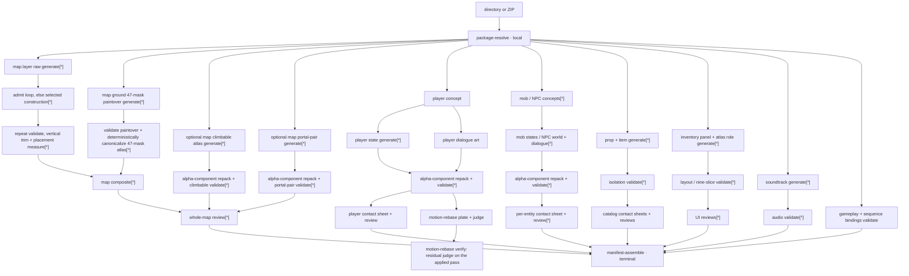

# Canonical game-generation pipeline

> **Contract maturity: current executable overview.**
>
> This is the canonical human overview of prepared-game generation — the
> side-view platformer recipe's pipeline (`2d/sideview/platformer` in the
> [asset taxonomy](../asset-taxonomy.md)). The sibling
> [runner](runner.md), [dialogue-scene](../dialogue-scene-assets.md), and
> [point-and-click room](pointclick-room.md) recipes each declare their own graph
> document kind, and their node tables are not folded into the platformer
> snapshot below. Only the platformer and the runner carry a checked graph
> contract block; the dialogue-scene and point-and-click graphs are held to their
> shapes by their own recipe tests instead, which is weaker and worth closing. So does
> [universe](../universe/generation-v1.md), which is not a game at all: it
> builds a storyworld package to read rather than a package to play, and seals
> two graphs because the size of its gallery is a result of its first phase. The typed package graph is
> the machine authority, and the compact graph contract embedded below is checked against the
> Bellweather fixture. Text-only prompt planning, `WorldSpec`, `VillageSpec`, map books, and the
> former Wave A/Wave B stage barriers are not inputs to this pipeline.

Every node in this graph is **typed**. It persists a `type_id` — a taxonomy path from the
[asset taxonomy](../asset-taxonomy.md), such as `2d/sideview/platformer/motion_atlas.generate` —
plus the `params` that distinguish one instance of that type from another, the typed `ports` it
publishes (each an artifact reference, its payload kind, and its provenance sidecar), and the
`card` a reader needs to see what the node is told: its static prompt or packaged template, and
the derived reference inputs it pulls from upstream ports. Nodes emitted by a subgraph template
also stamp the `template_id` that produced them. Dispatch is a registry lookup over `type_id`
([`package_types.py`](../../../src/stage_gen/recipes/sideview_platformer/package_types.py) declares
the recipe's whole type census); it is not a regex over node identifiers, and no reader recovers a
node's kind from an output path convention.

## Authority and source topology

| Boundary | Current authority |
| --- | --- |
| Authored package membership and cross-contract closure | [`game_package.py`](../../../src/stage_gen/orchestration/game_package.py) |
| Asset-level fan-out, dependencies, typed ports, cache inputs, and provider routes | [`package_graph.py`](../../../src/stage_gen/recipes/sideview_platformer/package_graph.py) |
| The recipe's node-type census: `type_id`, view archetype, capability and features, attempt policy, per-type cache contract version | [`package_types.py`](../../../src/stage_gen/recipes/sideview_platformer/package_types.py) |
| Dependency scheduling, resource gates, result contracts, and trace | [`gnode`](../../../src/gnode/) — [`graph.py`](../../../src/gnode/graph.py), [`schedule.py`](../../../src/gnode/schedule.py), [`trace.py`](../../../src/gnode/trace.py) |
| Prepared-game document vocabulary over that engine | [`execution_graph.py`](../../../src/stage_gen/recipes/sideview_platformer/execution_graph.py) |
| Provider routes a plan may use, and the features each declares | [`package_graph.py`](../../../src/stage_gen/recipes/sideview_platformer/package_graph.py) via [`binding.py`](../../../src/gnode/binding.py) |
| Side-view platformer resolve/plan/dispatch composition | [`package_executor.py`](../../../src/stage_gen/recipes/sideview_platformer/package_executor.py) |
| Prepared-package map execution, canonicalization, cache, and review | [`prepared_world.py`](../../../src/stage_gen/recipes/sideview_platformer/prepared_world.py) |
| Prepared-package cast, catalog, UI, soundtrack, binding, and review execution | [`prepared_content.py`](../../../src/stage_gen/recipes/sideview_platformer/prepared_content.py) |
| Leaf provider retries, decoding, validation, and atomic persistence | Provider-neutral components and adapters |
| Runtime artifact binding and atomic publication | [`prepared_manifest.py`](../../../src/stage_gen/recipes/sideview_platformer/prepared_manifest.py) |

The side-view platformer executor is deliberately thin. It resolves one directory or ZIP, asks the
recipe to construct the graph, and gives that graph to generic orchestration. It does not plan a
game, hide asset fan-outs inside a coarse stage, or implement provider retry loops.

The runner uses the same genre-neutral captured-package boundary, including for
a runner-only root, and then builds `sideview-runner-execution-graph-v1`.
`runner-track-v4` has a closed ground union. The atlas branch retains its one
paintover plus local canonicalization. The `runner-structural-ground-v1` branch
fans each authored segment into local occupancy-guide composition, one native-
alpha GPT Image 2 paintover, and local exact-occupancy canonicalization. One
additional local node extracts the first segment's generated right two-column
apron as a canonical shared seam bridge. Every segment canonicalizer consumes
that same bridge: its right edge receives bridge column 0 and its left edge
receives bridge column 1, so every A-to-B join reconstructs the original
continuous two-column generated material. Each published segment remains
`columns * 64` by `rows * 64`, while authored occupancy remains collision
authority. Its terminal node emits `sideview-runner-runtime-v13`. The exact
fixture fan-out and provider-operation counts are machine-checked in
[`runner.md`](runner.md); changing that fan-out requires regenerating its
embedded contract in this same change.

Runner planning refuses an image model outside the verified GPT Image 2 native-alpha model
family before graph execution. Its generative loop node additionally requires the route's
`masked_edit` capability; a binding that only advertises reference images cannot plan that node.
Runner soundtrack nodes compile the shared soundtrack contract together with a recipe-owned
`soundtrack_direction`: the first beat establishes the rhythmic engine, short action cells and
clear transients sustain forward motion, and RPG exploration, town-theme, pastoral, cinematic,
rubato, ambient, and long-form orchestral development are excluded. Planning and execution use
the same compiled direction, so this genre input is part of the provider node's cache identity.

`stage-gen generate` requires `--input` pointing to a prepared directory or ZIP whose root
contains `game.toml`. There is no bare-prompt fallback. The runner recipe is a single-shot graph:
its live call executes the complete selected member and assembles `sideview-runner-runtime-v13`.
The platformer recipe remains checkpointed. `--checkpoint world` executes everything the map
reviews read - each map's composite and presentation validations - and their complete dependency
closure, and not the reviews themselves. `--checkpoint content` independently executes cast,
catalog, UI, soundtrack, and stable-ID binding targets and their dependency closure, again with
each review replaced by what it reads. A semantic review is evidence for an operator rather than a
gate the manifest consumes, so it is paid for on request: `--checkpoint world-review` and
`--checkpoint content-review` run the reviews over a closure the cache already holds.
`--checkpoint soundtrack` is that closure narrowed to the soundtrack's own targets. It exists
because a track's cache identity is its own authored entry and nothing else, so a rewritten
creative brief re-bills exactly one track -- while the full content closure also carries every
actor, catalog and interface terminal, and regenerates any whose contract has moved since the
last accepted run. Editing a piece of music must not replace reviewed art, so the slice is
declared rather than left to the operator to avoid. Neither paid bounded checkpoint can
assemble a manifest. `--checkpoint integration` is a provider-free terminal
operation over accepted artifact roots. It validates the complete package-derived runtime closure,
applies caller-ordered corrective-run precedence, atomically publishes one run whose tag is
immutable by default, and emits `prepared-game-runtime-v12`. The `--dry-run` path exercises the
selected complete graph with deterministic fake operations.

## Current boundary graph



`[*]` means a package-derived fan-out. Each concrete entity, state, layer, ground, prop, item, UI
role, and track is a stable typed node. The terminal manifest depends on every enabled branch; it is never
written after a partial required run.

## Machine-checked graph contract

The embedded contract is intentionally content-insensitive where content does not change
topology. A changed prompt, image byte, or selected model changes node cache keys and
`graph_sha256`, but not `topology_sha256`. Adding a map, entity, state, or dependency changes the
topology and therefore this checked snapshot.

<!-- pipeline-graph-contract:start -->
```json
{
  "kind": "prepared-game-execution-graph-contract-v1",
  "fixture_ref": "library/games/bellweather",
  "graph_schema_version": 1,
  "topology_sha256": "61af6a11d4b4fcb2eb2d91c48b00e820353a7d251b80e7bc5c127263d71a4fdb",
  "node_count": 230,
  "terminal_node_id": "manifest-assemble",
  "operation_counts": {
    "local": 107,
    "image_generation": 96,
    "structured_generation": 24,
    "music_generation": 3
  },
  "resources": [
    {
      "resource_id": "local",
      "max_in_flight": 32,
      "requests_per_minute": null,
      "rate_limit_owner": "none"
    },
    {
      "resource_id": "openai-image",
      "max_in_flight": null,
      "requests_per_minute": 150,
      "rate_limit_owner": "provider_adapter"
    },
    {
      "resource_id": "openrouter-structured",
      "max_in_flight": null,
      "requests_per_minute": null,
      "rate_limit_owner": "none"
    },
    {
      "resource_id": "openrouter-music",
      "max_in_flight": null,
      "requests_per_minute": null,
      "rate_limit_owner": "none"
    }
  ]
}
```
<!-- pipeline-graph-contract:end -->

For this exact captured Bellweather closure, the content-sensitive execution-plan identity is
`graph_sha256 = e9d00e67e346cc36035f2a07bf5e791b9a0704ddd2eabf73c689c7f1cb379cb5`.
Unlike the embedded topology contract, that value changes when prompt, reference, model, or other
cache-key input bytes change without adding or removing a node.

Remote provider resources have no scheduler concurrency ceiling. The direct OpenAI adapter owns
the configured 150-IPM request-start pacing for this Tier 4 deployment and intentionally allows
earlier slow requests to remain in flight. Other deployments must set their active project tier;
the value is not a universal model constant.

## Bellweather operation topology

The normal first-pass graph contains 123 provider operations. Provider transport retries and
later semantic regenerations are not counted as new graph nodes; their actual calls must be
reported by the owning node.

| Domain | Concrete expansion | Image | Structured | Music | Local |
| --- | --- | ---: | ---: | ---: | ---: |
| Maps | 2 maps × (terrain topology design, 4 layers + 1 ground), 8 loop passes split provider-assisted or local by each layer's own selected construction, 2 map-local portal pairs, 1 map-local climbable atlas, validation, composite, map review | 17 | 4 | 0 | 19 |
| Player | concept, 11 canonical-source states, dialogue, validations, board, review, two motion-rebase judgements - a first pass over a locally composited plate, then a residual verification over a plate composed with that pass applied | 13 | 3 | 0 | 13 |
| Mobs | 6 mobs × (concept + 5 states + validations + board + review) | 36 | 6 | 0 | 36 |
| NPCs | 4 NPCs × (concept + front-facing world atlas + dialogue + validations + board + review) | 12 | 4 | 0 | 12 |
| Props | 8 isolated props, validations, one board, one review | 8 | 1 | 0 | 9 |
| Items | 5 isolated items, validations, one board, one review | 5 | 1 | 0 | 6 |
| Projectiles | 1 isolated projectile, single-subject validation, one board, one review; the whole domain is absent for a package that declares no projectile catalog, and present whenever it declares one, whether or not a weapon currently fires it | 1 | 1 | 0 | 2 |
| UI | one inventory panel plus three shared sheet roles (`panel_frame`, four-state `button_rect`, the fixed-vocabulary `preview_icons` grid), deterministic layout/alpha, nine-slice or glyph-registration validation, one review each | 4 | 4 | 0 | 4 |
| Soundtrack | 3 generated tracks and technical validations | 0 | 0 | 3 | 3 |
| Package / gameplay / manifest | package closure, bindings, terminal assembly | 0 | 0 | 0 | 3 |
| **Total** | **230 nodes** | **96** | **24** | **3** | **107** |

Each state image is one accepted state-strip operation, not one call per animation frame. Actor
motion has one recipe-owned source facing rather than authored left/right coverage. Concept nodes
intentionally precede actor state nodes to anchor identity; unrelated actors, maps, catalogs, and
tracks do not wait for one another.

Actor-content playback is a separate identity boundary from generation sampling. Each authored
motion resolves `hold`, `loop`, `once`, or `gameplay_driven` playback, an ordered subset of
canonical frame indices, and timeline cadence when applicable. The recipe still requests four
source poses and the canonicalizer still publishes four frames. `manifest-assemble` projects both
facts as `source_frame_count` and `playback`; runtime consumers must not infer selection, cadence,
or repetition from actor role or state names.

Every player motion atlas is a separate provider call, so nothing in the pixels ties their draw
scale together, and an alpha bounding box cannot separate a short pose from a small drawing. The
`motion-rebase` node per player therefore composites every frame of every state onto one banded
plate - uniform scale within a band, the baseline repeated in each - and a vision judge returns
one multiplier per state against the `idle` baseline. Its `motion-rebase-verify` successor closes
the loop: it composes a second plate with those multipliers already applied, so the judge reads
only the small residual that remains, and the two readings multiply into the published record.
Neither plate costs generation - both are assembled locally from bytes that have already shipped,
so a provider cannot redraw them - and the judging is two structured operations for the whole
actor rather than one per state. `manifest-assemble` republishes the admitted record as
`player.calibration`, re-derived from the run artifact rather than trusted, and the consumer
multiplies it with the baseline's anchor instead of re-measuring. See
[Motion rebase](../motion-rebase.md).

NPC `world_orientation` is catalog-wide because the current NPC catalog has one shared world
camera treatment. Bellweather sets it to `front`. Each NPC still authors an ordinary `motions`
entry: its `idle` generation requests four front-facing candidates, while `hold` playback selects
canonical frame zero. The front-facing source is not mirrored. This reuses the player/mob playback
vocabulary rather than introducing an NPC-only still-animation taxonomy.

Structured actor review receives that exact playback projection. A `hold` motion is judged for
motion semantics only at its selected canonical frame; unselected generated candidates remain
subject to identity, facing, scale, registration, and alpha checks but are not runtime motion
coverage.

Player `crouch` is the current explicit vocabulary boundary: gameplay authorizes the posture while
player content requests its visual motion. The provider receives four stationary, feet-planted low
crouch phases—not crawl locomotion—and the authored playback consumes all four as a 6 fps loop.
Canonical generation publishes the state like every other player motion. Consumers may retain
crouch mechanics and show a diagnostic fallback when presentation media is incomplete.

The package-resolution edge into each independent domain is a scheduling barrier, not cache
lineage. It proves the entire package was validated before provider work can start, while each node
hashes only the authored bytes and upstream artifacts it actually consumes. Consequently a
playback-only package edit changes package and manifest identity without invalidating image,
structured-review, or music nodes. Content-producing dependencies such as actor concept to motion
generation remain cache-lineage dependencies.

The live World checkpoint is the exact 39-node closure rooted at each map's composite and
presentation validations: one package capture, 17 image generations or edits, 19 map-local
canonicalization/composition operations, and two structured operations - one terrain topology
design per map. The two map reviews sit one edge above it and belong to `world-review`, a 41-node
closure whose only additional spend is those two structured operations. Neither can schedule any
cast, catalog, soundtrack, gameplay-binding, or manifest node. Each layer, ground, climbable, and portal generation writes a retained `*.raw.png`;
only its dependent validator may write the canonical runtime-facing PNG.

Each ground image operation receives the attributed 12-by-4 topology template as its strict first
edit target, the attributed Godot grid crop as redundant topology-only input, and its map-authorized
visual references as appearance-only inputs. The request asks the
model to paint contextual cap, fill, exposed sides, bevels, corners, and concavities inside all 47
terrain cells while preserving the cyan lattice, magenta empty regions, and checker placeholder.
Cap and fill are biome roles rather than hard-coded grass and dirt. The retry-owning image component
validates the fitted guide lattice, topology drift, painted variation, and direct connector alpha.
Its dependent local node extracts deterministic magenta chroma alpha to
**deterministically assemble 47-mask atlas** cells, harmonizes legal connector
edges, clears the placeholder, validates direct connectors, and emits the canonical
1440-by-480 atlas plus `ground.evidence.png` composed from that map's authored occupancy. The current
local compositor is `terrain-atlas-paintover-canonicalization-v3`. Its identity and the template,
topology-reference, and lookup digests participate in generation and local assembly cache keys;
occupancy changes the local
evidence, composite, review, bindings, and manifest projection without invalidating the
appearance-only paintover call.

Optional map-local climbable and portal branches begin alongside layers and ground. `climbable-atlas-v1`
requests one complete tall native-alpha subject and deterministically repacks it into a canonical
1-by-1 canvas. `portal-pair-1x2-v1` requests exactly two isolated native-alpha structures, entry on
the left and exit on the right, and repacks them into a canonical 1-by-2 canvas. The validators
enforce transparent borders, subject count, functional silhouette or compatible pair scale, and
persist per-asset validation reports. The map review waits for every declared presentation
validator as well as the layer-and-ground composite. Gameplay still owns climb permission and
transition relationships; generation does not infer either from appearance.

The terrain node is the one place a camera declaration reaches generation. `[camera]` is a
runtime block and enters no image digest, but a walkable surface the runtime cannot bring into
frame is unplayable, so `camera.follow_axes` bounds the designer's framing ceiling and is part of
the terrain node's identity. Retuning the camera therefore re-composes geometry and leaves every
appearance call untouched. This is why the camera was moved out of `[view]`: while it lived there
it entered `map_direction`, and a field no prompt reads re-billed every layer, ground, climbable,
and portal image for the map.

Climbable cache identity is split the same way the ground's is. The atlas draws each declared
variant exactly once, so its mode, selected references, and the declared ladders and ropes with
their prompts are generation identity: the variant count is the atlas cell count and the prompts
are the request. `climbable.placements` is placement-only. Where an instance stands cannot change
how the variant is drawn, so moving a climbable changes the local isolation validator, composite,
map review, bindings, and manifest projection without invalidating the appearance-only atlas call.
Placement geometry is still checked on every edit: bottom-supported terrain attachment and the
exposed upper deck exactly `rise_tiles` above it are enforced against the map's authored occupancy
when the package resolves, ahead of any node.

The live Content checkpoint is the exact 171-node closure rooted at what every cast/catalog/UI
review reads, every soundtrack validation, the motion-rebase verification, and
`gameplay-bindings-validate`: 79 image operations, two structured operations (the motion-rebase
judge and its verification), three music operations, and 87 local nodes including package capture.
The eighteen reviews belong to `content-review`, a 180-node closure whose only additional spend is
those eighteen structured operations. Neither can schedule map or manifest nodes. Twenty-eight identity/catalog/UI images are initially independent; each actor's
state and dialogue descendants become ready immediately after that actor's concept succeeds.
Soundtrack generation, gameplay binding, unrelated actors, and unrelated catalogs overlap.

The UI inventory branch consumes root `ui.toml`, its selected package references, and the exact
packaged `inventory_template.png` bytes. Its image request asks for native alpha only outside the
panel and explicitly requires alpha 255 throughout the panel middle and all eight empty slots. The
template alpha already encodes that transparent-exterior/opaque-panel boundary so high-fidelity
image editing does not receive conflicting pixel evidence. The local validator verifies the
1536-by-1024 RGBA canvas, requires alpha 16 or below at the canvas border and across at least 10% of
the canvas, and requires the inset panel core and slot interiors at alpha 250 or above. It then
normalizes only already-transparent pixels to alpha 0 and the core to alpha 255; it does not infer a
silhouette or perform AI background removal. One independent structured review judges style and layout. The
runtime manifest publishes the resolved V1 geometry and alpha policy with the artifact.

The two UI atlas roles run as one generic typed triplet (`ui_atlas.generate` / `.validate` /
`.review`) fanned out over the role parameter: `panel_frame` is one nine-slice body, `button_rect`
is a four-body state sheet (normal, hover, pressed, disabled). Each generate node renders its
geometry template from the role's declared record at run time and hands it to the provider after
the authored references; the cache key hashes that record rather than template bytes, so a
rasterizer change cannot re-bill an image while a geometry change must. Provider output is gated
inside the single retry owner: the canvas border and at least 10% of the canvas at alpha 16 or
below, exactly the declared number of opaque bodies detected from alpha and registered to the
declared cells in reading order, every state sharing the normal body's silhouette (IoU at least
0.97, size delta at most 4 px) while differing from it, a flat centre with text contrast, and
a band fill the sheet passes: `stretch` when every edge band rebuilds from one 8-pixel strip
within 6/255 mean error, else `tile` when each band's two ends meet within 8/255 over the band's
own texture floor. Insets widen from the template guide to where the drawn corner ornament
really ends, capped at twice the guide, and every body is measured with the sheet's widest
insets because that is how a runtime slices it. The local validate node normalizes only the
admitted alpha boundary, writes the detected cells, per-side insets, content rects, and
admitted `band_fill` as the role's validation record, and composes review evidence that
re-draws every body through the admitted nine-slice at a wider and a taller size. One
structured review per role judges style coherence, ornament placement, state order, and the
text-free rule. The manifest publishes each role's resolved geometry from that record beside
the artifact; no consumer rediscovers it from pixels.

Every actor motion-state provider output is retained as a native-alpha 4-column by 1-row
`*.source.png`. Before runtime publication, its local validation node runs
`alpha-component-repack-v3`: threshold native alpha at greater than 16, find 8-connected
components, retain candidates whose area is at least 2% of thresholded visible area (with a
32-pixel floor), select the largest required count, order them by source row and horizontal
centroid, and translate them without rescaling into equal canonical cells with 12-pixel transparent
gutters. If weak-alpha contact fuses the base pass below the required count, the local processor
progressively finds exactly the required number of stronger-alpha cores, requires one core in each
expected source lattice slot and coverage of every base principal component, and deterministically
partitions the original base support among them by multi-source 8-neighbor geodesic flood. This
preserves meaningful antialiasing and bridge pixels while assigning each to one frame. Sources that
already pass the base extraction keep their v1 canonical PNG bytes exactly. The resulting `*.png`,
not the provider source, is the runtime artifact.

This deliberately simple default is stronger than equal-XY slicing but is not semantic instance
ownership. It can drop detached weapons, projectiles, magic, debris, or other components below the
selection boundary. When more candidates exist than required, it retains the largest required
count and records a warning; when neither the base pass nor the constrained high-alpha fallback
proves the required ownership, it fails closed.
The validation record binds source/output digests, placements, rejected-component facts, retained
alpha, and this caveat. Smarter component attachment or segmentation is not silently invoked.

Ordinary side-view states contain four right-facing frames; the runtime mirrors that canonical
source for left-facing play. The player climb states are the explicit exception: `climb_ladder` and
`climb_rope` are rear-facing and are not mirrored during climbable traversal. They are also the only
states that leave the shared four-cell 1536x1024 strip, because a climb has two distinct poses and a
four-cell strip spends two of its cells on near-duplicates: each carries two cells on a 2464x3328
canvas, which keeps the same cell aspect while giving the figure roughly eleven times the painted
area. Which of the two a map requires is decided by the climbable roles it places, not by the
`climb` movement alone, so a package that places a rope while declaring only `climb_ladder` is
rejected rather than silently drawn as a ladder climb. They are also the only states that register
against the top of their cell rather than the bottom: a climber hangs from its hands, so the grip is
what stays put while the feet rise to meet it. That is authored as `anchor` on the motion rather
than decided by the recipe, because unlike facing it depends on what the model actually drew. Facing is therefore a recipe/runtime projection contract, not
authored game-content input, and `content/player.toml` has no `required_facings` field. Generating
both directions is intentionally forbidden by the canonical path because it adds cross-row
consistency work without a runtime consumer. Separately authored directions may become an explicit
future opt-in for asymmetric handedness, but are not accepted silently.

Dialogue provider atlases use a deterministic row-major 2-by-2 or 3-by-N requested layout derived
from the authored expression count. Their local validation nodes apply the same alpha-component
repacker with centered placement and permit only the declared leading cells; unused canonical cells
remain transparent. Local validators persist dimensions, source and canonical digests, component
selection, cell placement, source facing where applicable, runtime-mirroring policy,
state/expression stable IDs, and alpha facts; they never use AI background removal. Prop and item
nodes produce one isolated native-alpha asset per stable ID. Contact sheets consume repacked
atlases and remain deterministic review artifacts, not runtime atlases.

## Scheduling semantics

The generic executor repeatedly starts every node whose declared prerequisites succeeded:

- ready siblings run concurrently; only local work uses a resource semaphore;
- a node never starts before all prerequisites finish successfully;
- one failure marks only its descendants `skipped`;
- unrelated running or ready siblings are not cancelled;
- the scheduler calls a node handler once and never retries provider work;
- provider components remain the sole retry owners, with at most six attempts;
- provider adapters retain their request-start pacing; and
- full-run success requires `manifest-assemble` to succeed; a bounded checkpoint succeeds only
  when every explicit target succeeds.

The resource-aware Bellweather projection uses planning assumptions of 120 seconds per image,
30 seconds per structured review, and 180 seconds per music operation. With the Tier 4
adapter-owned 150 image starts per minute, the projected terminal offset is **311.05 seconds
(5m 11.05s)**. This is a scheduling estimate, not a live latency claim.

The graph carries a broad **USD 4.26–23.52 budgetary allowance**: USD 0.04–0.20 per image,
USD 0.005–0.08 per structured operation, and USD 0.10–0.80 per music operation. These are
conservative planning inputs, not a canonical provider price sheet. Current provider pricing and
returned usage remain operational evidence and must be refreshed at the live-provider gate.

## Cache identity and retry ownership

Every node cache key includes its stable ID and operation contract version, selected provider and
model, ingest-computed digests of validated authored inputs, the authored digests of their
references, and ordered prerequisite cache keys.
Consumer-only presentation is an explicit exception at the paid boundary: root contact-shadow
settings and per-layer contrast, saturation, atmospheric wash, and detail blur are excluded from
generation, local layer admission, map composite, and semantic-review cache identities. They enter
only package resolution and provider-free `manifest-assemble`, so tuning the accepted runtime look
cannot schedule or invalidate a provider call.
Cache admission additionally validates actual upstream artifact digests as lineage. Path
existence alone is never a hit. A changed model, prompt, reference byte, dependency contract, or
upstream artifact invalidates the relevant reuse boundary.

Reuse is namespaced per recipe branch: `sideview-platformer-world-v1` covers map work and
`sideview-platformer-content-v1` covers cast, catalog, UI, soundtrack, and binding work. Each
node type additionally carries its own `contract_version`, so a changed contract invalidates one
kind of work while a namespace bump invalidates that whole branch.

Prop contact measurement is a local validation and publication boundary, not an image-generation
operation. The prop PNG remains unchanged. The validator thresholds native alpha, rejects tiny
detached fragments, retains meaningful components, and publishes the lowest meaningful contact as
`ground_contact_y_normalized`. The runtime uses that explicit coordinate as its vertical origin;
it does not align the transparent canvas edge or infer contact independently.

`attempts` in a trace belongs to the component-owned provider operation. The scheduler does not
wrap it in another retry loop. A semantic regeneration is a new provider operation and must
increase `provider_operations`; it is not disguised as a transport retry. The base projection
counts one successful provider operation per provider node.
Runner provider nodes also publish a versioned attempt-ledger artifact containing the exact prompt
digest, neutral `not_selected` ordinals for attempts whose failure stage is not known at this
boundary, the selected provider output digest when one exists, and whether the installed output is
provider, fallback, local, or absent. Cache replay preserves this original generation provenance
byte-for-byte. Cache hit/miss state remains execution telemetry instead of rewriting the dependency
artifact and invalidating child lineage.

## Persisted execution evidence

The recipe this pipeline belongs to is persisted as `recipe: "sideview-platformer"`, and its
execution documents declare the matching kinds: `sideview-platformer-execution-graph-v1` for the
plan, `-event-v1` for each trace record, `-summary-v1`, `-projection-v1`, and
`-view-v1` at `schema_version` 3 for the derived run view. The sibling recipes declare their own
kinds, so a reader never has to infer which recipe wrote a run directory.

| File | Contract |
| --- | --- |
| `package.json` | Captured package identity, stable IDs, and the closure digest |
| `execution-plan.json` | Typed nodes (`type_id`, `params`, `ports`, `card`, `template_id`), dependencies, resources, cache keys, models, and estimates |
| `execution-projection.json` | Resource spans, critical path, call counts, time, and budget range |
| `execution-trace.jsonl` | Immutable run/node events with queue, duration, cache, attempts, calls, and errors |
| `execution-summary.json` | Terminal status and per-node result projection |
| `execution-view.json` | Derived read-only join of plan and trace for rendering, written on demand by `stage-gen export-view`; hard-drop versioned — consumers refuse an unknown version and re-export instead of migrating |
| `maps/*/layers/*.raw.png` | Retained provider layer output and provider provenance |
| `maps/*/layers/*.png` | Deterministically canonicalized horizontal repeat unit |
| `maps/*/layers/*.repeat.png` | Three-repeat checkerboard evidence for visual review |
| `maps/*/ground.raw.png` | Retained provider-generated 47-mask ground paintover and provider provenance |
| `maps/*/ground.png` | Canonical 1440-by-480 47-mask terrain atlas with 120-by-120 RGBA cells |
| `maps/*/ground.evidence.png` | Deterministic composition of the canonical atlas through the map-authored occupancy |
| `maps/*/climbable.raw.png`, `climbable.png`, `climbable.validation.json` | Optional map-local climbable atlas source, canonical isolated 1-by-N presentation, and deterministic per-variant cell facts |
| `maps/*/portal.raw.png`, `portal.png`, `portal.validation.json` | Optional map-local portal source, canonical isolated 1-by-2 pair, and deterministic facts |
| `maps/*/composite.png`, `review.json` | Whole-map composition and structured semantic verdict |
| `content/{players,mobs,npcs}/*/concept.png` | Canonical generated actor identity and provider provenance |
| `content/{players,mobs}/*/states/*.source.png` | Retained native-alpha provider motion source and provider provenance |
| `content/{players,mobs}/*/states/*.png`, `*.validation.json` | Alpha-component-repacked 4-by-1 runtime strip plus selection, placement, loss, and lineage facts |
| `content/{players,npcs}/*/dialogue.source.png` | Retained native-alpha provider dialogue source and provider provenance |
| `content/{players,npcs}/*/dialogue.png`, `dialogue.validation.json` | Row-major alpha-component-repacked authored-expression atlas plus deterministic report |
| `content/{players,mobs,npcs}/*/contact-sheet.png`, `review.json` | Deterministic actor board and independent structured verdict |
| `content/{props,items}/*.png` | One native-alpha isolated asset per stable ID |
| `content/props/*.validation.json` | Deterministic alpha-component ground contact for each prop; tiny detached and low-alpha contamination is excluded |
| `content/{props,items}/contact-sheet.png`, `review.json` | Deterministic catalog board and independent structured verdict |
| `ui/inventory_panel.png` | Canonical inventory panel with validated layout and alpha contract |
| `ui/{panel_frame,button_rect}.raw.png` | Retained native-alpha provider atlas sheet and provider provenance |
| `ui/{panel_frame,button_rect}.png`, `*.validation.json`, `*.evidence.png` | Alpha-normalized nine-slice sheet, the detected cells / insets / content rects / admitted band fill, and the re-drawn review evidence |
| `content/coverage-matrix.json`, `gameplay.bindings.json` | Required authored coverage and verified stable-ID relationships |
| `soundtrack/*.mp3`, `*.validation.json` | Generated audio, provider provenance, duration/container facts, and explicit listening status |
| every declared port, under `--dry-run` | A small `dry-run-artifact-v1` document at each port a node declares, written through the same node cache as a live run, so a rehearsal exercises the cache and lineage rules a live run will meet |
| `manifest.json` | Portable `prepared-game-runtime-v12` authored projection, runtime-only layer/contact-shadow presentation, prop ground contacts, front-facing NPC playback, and SHA-bound runtime closure |

Trace records contain portable artifact references, hashes, and sanitized errors. They do not
contain credentials, authorization headers, signed URLs, temporary paths, or absolute inputs.

## Per-block versions

`manifest.json` is a set of named blocks, and its root carries a `blocks` table: block key to
the block's own version, `platformer-<key>-block-v1` today for every block the consumer parses
(`presentation`, `scale`, `maps`, `player`, `mobs`, `npcs`, `props`, `items`, `projectiles`,
`ui`, `soundtrack`, `gameplay`, `scenarios`, `closure`), plus two a package authors or leaves
out - `score` and `timers`, absent from the table and the document when not authored, so the
runtime's `score` and `timers` families seal quiet. A block whose shape moves bumps its own
version in `PLATFORMER_MANIFEST_BLOCKS` and in the parser that reads it; nothing else moves. The
document's `kind` moves on structural change only - the set of blocks or the root fields - which
is contract rule C-R3 in [game-contract.md](../../game-contract.md). The consumer gates every
block it parses and its refusal names the block. The current table is generated into
[contract-identities.md](../../contract-identities.md). The root once carried `style`, `proportion`,
`universe` and `canonical_game_sha256`; no consumer read them, and under C-R6 they left in
v12 rather than gain a version.

## Runtime closure roles

Every artifact in `manifest.json`'s closure declares what it is published for. The role is chosen
at the publication site in [`prepared_manifest.py`](../../../src/stage_gen/recipes/sideview_platformer/prepared_manifest.py)
and stated once, beside the path, in `runtime_artifact_closure`.

| Role | Meaning | Members |
| --- | --- | --- |
| `asset` | Media this package publishes as its own content. Bound by name somewhere in the manifest, and a consumer enumerating what the game is made of must account for all of them. | Map layers, ground atlas, optional climbable and portal sheets, actor concepts, motion atlases, dialogue atlases, props, items, projectiles, inventory panel, nine-slice atlas roles, soundtrack tracks |
| `provenance` | Records and judged plates the run ships so it can be re-derived and audited. Their readable values are already inlined in the manifest, so nothing fetches them to present the game. | `maps/*/layers/*.validation.json`, `maps/*/climbable.validation.json`, `maps/*/terrain.json`, `content/players/*/motion-rebase*.json`, `content/players/*/motion-rebase*-plate.png`, `ui/*.validation.json` |

Nothing observable separates the two, which is why the role is declared rather than inferred: a
judged comparison plate is a PNG under `content/` exactly like the artwork it was composed from,
and a measured placement record is JSON exactly like generated terrain geometry.

Integration enforces the partition before it writes anything: every `asset` must be bound by the
manifest, and every manifest binding must be published as an `asset`. Adding an artifact to the
closure therefore means choosing its role, and a consumer never has to guess. Consumers validate
the vocabulary and may present, list, or ignore an artifact by role, but must not classify by
filename, directory, or media type.

```bash
uv run stage-gen package plan --input library/games/bellweather
uv run stage-gen generate \
  --input library/games/bellweather \
  --dry-run \
  --output /tmp/bellweather-dry-run

uv run stage-gen generate \
  --input library/games/bellweather \
  --checkpoint world \
  --output /tmp/bellweather-world

uv run stage-gen generate \
  --input library/games/bellweather \
  --checkpoint content \
  --output /tmp/bellweather-content

uv run stage-gen generate \
  --input library/games/bellweather \
  --checkpoint integration \
  --output out/bellweather-prepared-v1
```

`--failure-node <node_id>` injects a deterministic dry-run failure. Reusing `--cache-dir` proves
content-and-lineage validated warm-cache behavior. Package planning and dry-run do not call a
provider. `--checkpoint world` requires direct OpenAI image and OpenRouter structured
capabilities. `--checkpoint content` additionally requires OpenRouter music generation and local
`ffprobe` technical inspection. Listening acceptance remains a separate human verdict and is
never inferred from a valid audio container. `--checkpoint integration` runs the terminal
`manifest-assemble` node's whole dependency closure as a graph run over the cache: every node
the cache holds is restored into the run exactly as the paid checkpoints restore it, admission
included, local nodes re-run for free, and every provider backend refuses, so a paid artifact
the cache does not hold stops the run naming the checkpoint that produces it. Nothing is spent
by construction. The graph, projection, trace and summary of that run sit beside the published
directory as `.<tag>.integration-<invocation>`; the published directory holds the manifest and
exactly the bytes it binds. `--artifact-root` names an accepted run directory integration may
read *after* the cache for an artifact the cache lacks; it never overrides one the cache holds.

A published run tag names exactly one byte set, because prose, reviews, and research cite runs by
digest. Integration is deterministic, so republishing an identical closure over an existing output
directory is a no-op reported as `disposition: unchanged` rather than a conflict. Publishing
*different* bytes under a tag that already exists changes what every citation of it means, so it
requires `--replace-output`; the report then carries `disposition: replaced` and the
`replaced_manifest_sha256` that was destroyed. Replacement retires the previous run to a sibling
temporary directory only after the new run is fully assembled, and restores it if the install
fails, so a tag never resolves to a partial run.

## Change protocol

Update this document and its embedded contract in the same change whenever package inputs, node
fan-out, dependencies, provider multiplicity, resources, scheduling, retries, cache identity,
trace fields, persisted outputs, or manifest prerequisites change. Run:

```bash
uv run pytest tests/contract/test_generation_pipeline_docs.py
uv run python scripts/check_docs.py
```

Live latency, price, quota, and semantic media acceptance are dated evidence. They must not be
silently promoted into permanent graph truth.
