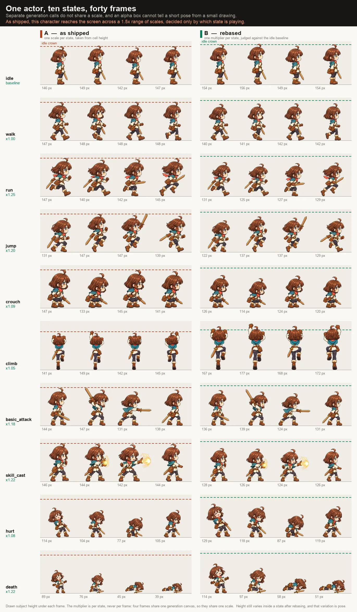

# Motion rebase

> **Contract maturity: ratified TO-BE master.** Scope: the side-view platformer
> recipe's motion atlases (`2d/sideview/platformer` in the
> [asset taxonomy](asset-taxonomy.md)).
>
> This document defines how an actor's motion atlases are brought into
> agreement with one another: what the baseline is, what the judging atlas
> contains, what a judge returns, and how a consumer composes the result.
>
> It does not claim runtime support, enumerate implementation status, track
> migration work, or serve as a project plan. It is scoped to coherence within
> one actor; magnitude across entities is [Asset unit](asset-unit.md). The
> measurements behind both are in
> [Asset scale study](../research/asset-scale-study.md).

## What this contract is for

An actor's motion states are generated in separate provider calls, and separate
calls do not share a scale. The published atlases therefore disagree about how
large the character is drawn, and the disagreement is invisible in the alpha:
a crouch is shorter because of the pose, and a mis-scaled sheet is shorter
because of the artwork, and a bounding box cannot tell those apart.

Motion rebase resolves that disagreement. It answers exactly one question —
**is this the same character, drawn at the same scale, as the baseline?** — and
it answers it as a ratio.

It deliberately does not answer *how big the character is*. That is a magnitude,
it is authored, and it belongs to [Asset unit](asset-unit.md).



*Composited by `scripts/render_asset_scale_figures.py` from the
`bellweather-prepared-v11-bound` package; the manifest digest it was rendered
from is recorded in
[Reproducing the measurements](../research/asset-scale-study.md#reproducing-the-measurements).
The multipliers it draws are one reading of that build's artwork, not an
authored declaration.*

## Ownership

- `stage_gen.media.comparison_plate` owns deterministic plate composition and
  the structured judging call. It is provider-neutral and knows nothing about
  actors, states, or games.
- `stage_gen.recipes.scrolling_preview.motion_rebase` owns the baseline rule,
  the judging atlas layout, admission, and the published rebase record.
- `web/lib/sideview-platformer` owns composition of the rebase with the actor's magnitude.

The image model owns appearance only. Deterministic code owns plate assembly,
admission, and arithmetic. A vision model owns one judgement: a multiplier per
state, relative to a baseline it can see.

## The baseline

Every actor names one **baseline state**. It is `idle` for the shipped actor
profiles.

The baseline carries two requirements, and both are contract rather than
convention:

- It is an **upright rest pose**. Ratios alone cannot recover stature, so any
  consumer that needs a character's standing height — camera framing, hitbox
  derivation, a name label offset — reads it from the baseline frame. A
  baseline drawn crouched or airborne silently corrupts all of them.
- It is the state whose magnitude [Asset unit](asset-unit.md) measures. Only
  the baseline frame is measured; every other state reaches its scale through
  its multiplier. Measuring more than one state would create a second
  authority for the same quantity.

The baseline's own correctness is not checked here. It is checked against the
player by the asset unit's comparison plate, which is what closes the loop:
neither contract validates itself.

## The judging atlas

One plate per actor. It carries **every frame of every motion atlas** for that
actor, composited locally from published bytes.

- **One uniform source scale** across every frame. Nothing is normalised, fit,
  or padded to a common height: a state the model drew small must look small,
  because that is the signal being read.
- Frames are grouped by state, on a shared ground line per group, with the
  baseline group marked.
- The baseline's crown height is drawn across every group as a reference rule.
- Each frame is labelled with its state, its frame index, and its height as a
  percentage of the baseline.

The plate is not a fiducial. A reference composited into a *generation* is
redrawn by the provider and carries no ground truth; a plate assembled locally
from bytes that have already shipped is exact, costs no provider operation, and
cannot be redrawn.

## What the judge returns

One multiplier per **state**, relative to the baseline, which is `1.00` by
definition. The judge returns no absolute size, no pixel count, no coordinate,
and no per-frame value.

```json
"state_rebase": {
  "baseline_state": "idle",
  "states": { "idle": 1.00, "walk": 1.00, "run": 1.25, "crouch": 1.09,
              "climb": 1.05, "basic_attack": 1.18, "hurt": 1.08, "death": 1.22 }
}
```

Multipliers are bounded to `[0.2, 5.0]` and rounded to two decimal places. A
reading outside the band is rejected rather than clamped.

The band is wide on purpose. Measured on the canonical actor, the climb strips
are generated on a 1115x2850 canvas against the master states' 457x799 and are
drawn roughly 3.7 times larger, needing a multiplier near `0.27`. Separately
generated atlases genuinely disagree by more than a factor of two — that is the
whole reason this contract exists — so a band tight enough to reject the
reference game would be a bug rather than a safety rail.

### The verification pass

The judging is closed-loop: two readings, not one.

The first reading is taken across atlases that genuinely disagree — the whole
reason this contract exists — so the judge is comparing a head drawn at three
hundred pixels against one drawn at ninety. That is the hard form of the task,
and its error shows up as over- and under-correction on exactly the states
whose canvases differ most.

The second reading removes that condition instead of repeating it. A
**verification plate** is composed with the first pass already applied: each
state's frames are pre-scaled by their judged multiplier, so if the first pass
were perfect, the character would read at an identical size in every group.
The judge is asked only for the residual — a correction near `1.0` — and the
published multiplier is the product of the two readings.

Corrections are bounded to `[0.5, 2.0]`, and the band is deliberately narrow
where the first pass's band is deliberately wide. A residual outside it does
not mean the artwork disagrees more than expected; it means the first pass
failed, and compounding a failed reading with a large "correction" would
launder it. The stage fails closed instead.

The verification plate keeps every plate invariant: every frame of every
state, bands where sizes still demand them, the baseline repeated in each. It
adds none of its own — pre-scaling by a judged multiplier is not normalising,
because what is being erased is the disagreement already measured, not the
signal.

### Per state, not per frame

The four frames of one motion atlas share a single generation canvas, and
therefore share a single scale. Head mass, limb bulk and line weight are
constant across an atlas's frames while only the pose changes — including where
the painted box collapses entirely, as a prone frame does.

A frame's height is therefore **pose**, and pose is preserved. Refitting per
frame is exactly what makes a collapsed pose shrink and a lunging pose grow, and
it is prohibited.

Showing every frame on the plate is nonetheless required. It is what makes the
one-scale-per-atlas claim checkable rather than assumed, and it is how a genuine
per-frame anomaly would be seen at all.

### Plate capacity

The binding constraint is the total pixel budget of one vision input after
downscaling, not the frame count, so a near-square grid is worth far more than a
strip. A forty-frame plate laid out as paired state groups holds roughly two
hundred pixels per frame, which is comfortable; the practical ceiling is near
sixty frames.

The plate is **intra-actor by construction** and never holds a cast, so the
ceiling is not close: a ten-state actor is forty frames, a five-state creature
is twenty.

Where an actor does exceed one plate, it is split — and **the baseline group is
repeated in every tile**. Tiles judged without a shared baseline drift against
each other, which reintroduces the original defect one level up.

## Admission

Rebase admission fails closed. A rejected reading is never clamped: a silently
rebased actor is harder to notice than a stage that fails.

| Gate | Rule |
| --- | --- |
| Baseline declared | The actor names a baseline state, and that state has a published atlas. |
| Baseline identity | The baseline multiplier is exactly `1.00`, in both readings. |
| Coverage | Every published motion atlas for the actor resolves a multiplier, in both readings. |
| Band | Every first-pass multiplier lies within `[0.2, 5.0]`; every verification correction lies within `[0.5, 2.0]`; every composed multiplier lies within `[0.2, 5.0]`. |
| Plate lineage | Each plate's digest covers every frame it composited, and every one is a published artifact of this actor at its current revision. |
| Freshness | A rebase record is stale when any of the atlases it covers changes, and a stale record is refused rather than reused. The verification stage re-admits the first-pass record against a plate rebuilt from current bytes, so a first pass that outlived its artwork is refused rather than corrected. |

## Published record

The rebase is published on the actor, beside its magnitude, and re-derived from
the published bytes rather than read and trusted.

```json
"calibration": {
  "height_units": 2.40,
  "source_px_per_unit": 326.3,
  "baseline_state": "idle",
  "state_rebase": { "idle": 1.00, "run": 1.25, "death": 1.22 },
  "plate_sha256": "…",
  "verification_plate_sha256": "…"
}
```

`height_units` and `source_px_per_unit` are the asset unit's, measured on the
baseline frame alone. `baseline_state`, `state_rebase` and the plate digests
are this contract's. `state_rebase` is the composed value — first pass times
verification correction — and the run record keeps both factors beside it,
so a reader can see what each pass contributed. The split is deliberate: the first pair is authored input and
its measurement, the second is derived output, and neither is ever authored by
hand. A per-state multiplier is a property of the artwork and changes whenever
the artwork does, so writing one into a package would create an authority that
goes stale without any signal.

## Consumer composition

The two contracts multiply. Magnitude sets how large the actor is; rebase makes
every state of that actor agree.

```ts
const scale = (c: Calibration, state: string) =>
  (manifest.scale.player_height_tiles * TILE_PX / c.source_px_per_unit)
  * c.state_rebase.states[state];
```

`setScale`, uniform on both axes, applied when a state's texture is bound. It is
never re-derived from a frame's dimensions, and `setDisplaySize` is never used
on an actor: it fixes a scale from whichever frame is current and then lets the
drawn size follow every subsequent texture's cell geometry, which is the defect
this contract removes.

Stature varies across states after rebasing, and that variation is pose. A
consumer must not normalise it, and must not treat a sprite's height as the
character's height — an overhead reach legitimately exceeds the baseline. Read
stature from the baseline frame.

## What this contract does not do

| Concern | Owner |
| --- | --- |
| How large an actor is relative to the world | [Asset unit](asset-unit.md) |
| Whether the baseline itself is correctly sized | [Asset unit](asset-unit.md), via its comparison plate |
| Internal proportion — a build wrong against its own `heads_tall` | Proportion review |
| Registration and ground contact | [Asset unit](asset-unit.md) |
| Props, items, portals, terrain, layers | Not applicable; a subject with one artifact has no cross-state problem |

A uniformly rebased actor can still be drawn with the wrong build, and rebasing
cannot repair that. Rebase makes an actor internally consistent; it does not
make it correct.

## Related contracts

- [Asset unit](asset-unit.md) — magnitude, declaration, registration.
- [Asset scale study](../research/asset-scale-study.md) — the measurements, and
  the single-feature approach this contract replaced.
- [Sprite-sheet slicing and instance recovery](sprite-sheet-processing.md) —
  component extraction the plate composites from.
- [Actor boundary and semantic review](actor-boundary-and-semantic-review.md) —
  the geometry-versus-semantics boundary both contracts observe.
