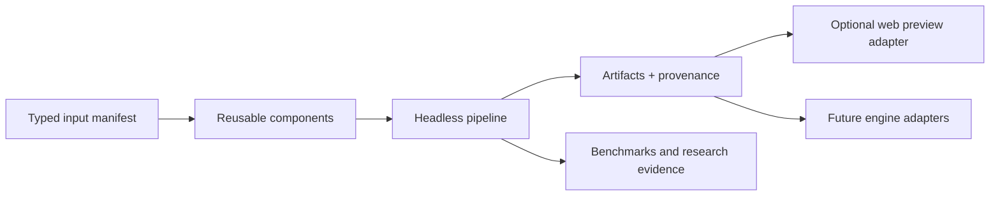

# System overview

`stage-gen` is a headless orchestration surface over reusable 2D media
components. It produces validated artifacts and provenance for games and game
tools; it does not own gameplay or require a particular runtime.

## Topology

- `components/` owns provider adapters and deterministic media operations.
- `stage-gen/` owns CLI/server orchestration, run state, manifests,
  benchmarks, and research workflows.
- `web/` is an optional consumer that visualizes output and demonstrates one
  scrolling-world recipe.
- `docs/` records contracts, verified provider behavior, policies, and recipe
  evidence.

The dependency direction is one way. A component does not import a pipeline;
a pipeline does not import a preview; a preview does not become an implicit
validator for the reusable component.

## Component graph

A pipeline builds a directed acyclic graph from explicit inputs. Independent
nodes may run concurrently; dependent nodes receive artifacts through typed
results or a manifest. A recipe decides which component families to compose.

Examples of reusable operations include:

- image generation from text and optional references;
- background removal and mask extraction;
- media validation and deterministic normalization;
- grid/sheet slicing and packing;
- structured text/vision design data; and
- music generation and audio inspection.

A recipe may request platformer motion names, top-down props, dialogue
portraits, interface panels, or a particular projection. That vocabulary is
recipe input, not a hidden property of the underlying provider or media
component.

## Run contract

Every headless run has:

1. a validated input manifest;
2. a deterministic run identifier when all identity-bearing inputs are stable;
3. an isolated output directory;
4. component-level progress and failure state;
5. resumable skip-if-valid behavior;
6. artifact results with adjacent provenance; and
7. a top-level run manifest that records the graph and final status.

An artifact is valid only after media inspection succeeds. HTTP success or a
non-empty URL is insufficient. Partial files do not satisfy the cache.

## Reliability

Every provider/network call receives five blind retries with capped backoff.
Transport failures and silent contract failures use the same retry boundary.
Inputs/references are read and hashed once outside the loop when safe; every
attempt records non-secret diagnostics. Deterministic post-processing is
separate from provider retries and is safe to rerun.

See [the component contract](../component-contract.md) and
[provider operations](../providers.md).

## Provenance

The run manifest links each artifact to its component, exact provider/model or
endpoint, prompt and non-secret parameters, input hashes, attempt count,
timestamp, media facts, post-processing, and output hash. Provenance supports
debugging and reproducibility; it is not an IP license.

## First recipe and preview

The existing detailed asset contracts describe a side-view scrolling-world
recipe: a concept root, parallax layers, terrain tiles, character/mob sheets,
props, items, inventory, and portals. Those contracts remain useful as the
first comprehensive integration case.

The browser preview composes that recipe into a scene with a horizontal camera,
heightmap terrain, movement, interactions, and portals. All of those choices
stay under `web/`. A different recipe or engine can consume the same generic
component results through a different manifest/adapter.

See [scrolling-preview asset contracts](asset-contracts.md) and the
[web preview boundary](../web-preview.md).

## Game engine

No engine is selected for future gameplay. The current browser adapter is not
the default production target. Dedicated 2D engines, including Godot, may be
evaluated with alternatives once export manifests are stable; see
[game-engine evaluation](../game-engine-evaluation.md).
