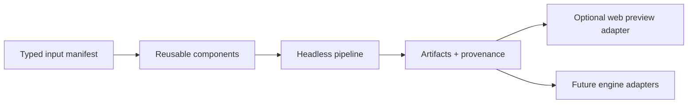

# System overview

`stage-gen` is a headless orchestration surface over reusable 2D media
components. It produces validated artifacts and provenance for games and game
tools; it does not own gameplay or require a particular runtime.

## Topology

- `gnode` ring 1 owns the provider-neutral modality service contracts and
  ring 2 the first-party vendor adapters (`gnode.providers.*`);
  `src/stage_gen/components/` owns application components, and
  `src/stage_gen/providers/` keeps only adapters for application-owned
  component protocols.
- `src/stage_gen/media/` owns deterministic inspection and normalization.
- `src/stage_gen/recipes/` owns recipe graphs and manifests;
  `src/stage_gen/orchestration/` owns concrete provider composition, run state,
  and summaries.
- `src/stage_gen/interfaces/` exposes the Python CLI, which is the only way to
  start a run.
- `web/` is an optional consumer that previews published packages, explores
  their bound closure, and reads exported runs back; it starts nothing.
- `docs/` records contracts, verified provider behavior, policies, and recipe
  evidence.

The dependency direction is one way. A component does not import a pipeline;
a pipeline does not import a preview; a preview does not become an implicit
validator for the reusable component.

## Component graph

A recipe declares a directed acyclic graph from explicit inputs. Dependent nodes
receive artifacts through typed results or a manifest, and a recipe decides
which component families to compose. Concurrency is an execution property, not
an implication of the declared edges: the engine schedules every node by data
availability under declared resource gates. See the
[canonical game-generation pipeline](game/generation-pipeline.md) for the
machine-checked current graph.

Examples of reusable operations include:

- image generation from text and optional references;
- background removal and mask extraction;
- media validation and deterministic normalization;
- [sprite-sheet component recovery and packing](sprite-sheet-processing.md), with a minimal
  alpha-connected-component repacker implemented and richer geometry/ownership still planned;
- structured text/vision design data; and
- music generation and audio inspection.

A recipe may request platformer motion names, top-down props, dialogue
portraits, interface panels, or a particular projection. That vocabulary is
recipe input, not a hidden property of the underlying provider or media
component.

## Run contract

Every headless run has:

1. a validated input manifest;
2. a deterministic run identifier when all identity-bearing inputs are stable;
3. an isolated output directory;
4. component-level progress and failure state;
5. resumable skip-if-valid behavior;
6. artifact results with adjacent provenance; and
7. a persisted execution plan, an append-only execution trace, and a run
   summary — the documents the read-only run viewer consumes.

An artifact is valid only after media inspection succeeds. HTTP success or a
non-empty URL is insufficient. Partial files do not satisfy the cache.

## Reliability

Every provider/network call receives one initial attempt plus five blind
retries with capped backoff: six attempts at most.
Transport failures and silent contract failures use the same retry boundary.
Inputs/references are read and hashed once outside the loop when safe; every
attempt records non-secret diagnostics. Deterministic post-processing is
separate from provider retries and is safe to rerun.

See [the component contract](../component-contract.md) and
[provider operations](../providers.md).

## Provenance

The recipe manifest links each artifact to its component, exact provider/model or
endpoint, prompt and non-secret parameters, input hashes, attempt count,
timestamp, media facts, post-processing, and output hash. Provenance supports
debugging and reproducibility; it is not an IP license.

## Recipes and preview

Four recipes compile onto the one engine: `sideview-platformer`,
`sideview-runner`, `dialogue-scene`, and `pointclick-room`. Each declares its
own graph document kind, so no recipe can read another's plan, and none may
define another's assumptions or artifact layout.

The existing detailed asset contracts describe the first of them, the side-view
platformer recipe: a concept root, parallax layers, terrain tiles, character/mob
sheets, props, items, inventory, and portals. Those contracts remain useful as
the first comprehensive integration case.

The browser preview composes that recipe into a scene with a horizontal camera,
heightmap terrain, movement, interactions, and portals. All of those choices
stay under `web/`. A different recipe or engine can consume the same generic
component results through a different manifest/adapter.

See [side-view platformer asset contracts](asset-contracts.md) and the
[web preview boundary](../web-preview.md).

The `sideview-runner` sibling resolves the same prepared-package container but
owns reaction-fair authored segment admission, structural-ground or atlas
presentation, a combined avatar state machine, auto-run difficulty, pickups,
hazards, and runner audio. It emits `sideview-runner-runtime-v6`; the fixed-step
consumer under `web/lib/sideview-runner/` owns camera, collision, streaming,
and play presentation. Its [runner specification](game/runner.md) owns the
exact contracts and machine-checked graph snapshot.

The `dialogue-scene` sibling recipe packages one caller-directed appearance
concept, a finite set of static expression variants for that identity, and
portable scene data for the Visual Novel Scene Kit. Its
[asset contract](dialogue-scene-assets.md) and
[deferred animation notes](../dialogue-scene-animation.md) preserve the same
headless-recipe and downstream-consumer boundary. It compiles onto the same
engine under its own graph document kind.

The `pointclick-room` sibling recipe packages one fixed painted room, its
cursor-driven hotspots, an inventory, and a puzzle declared as data and proven
finishable before any generation is paid for. Its
[room specification](game/pointclick-room.md) owns the authored
`pointclick-room-v2` contract, the graph, and the `pointclick-room-runtime-v2`
manifest the `/room/<tag>` consumer under `web/lib/pointclick/` renders from.

Every genre that plays a conversation walks the same machine. The village
dialogue box in the platformer and the visual-novel scene are two presentations
of one ordered cursor over beats, kept in `web/lib/dialogue/` free of any
engine, manifest, or genre vocabulary — each consumer owns only how it draws
the ends. That boundary is what lets a conversation become a node later without
either genre owning the answer. The [scenario contract](game/scenario.md)
records the next step: one data-only text IR with a closed statement
vocabulary, admitted by a reachability proof the way the room's puzzle already
is, deliberately built here rather than adopted from a narrative engine whose
script is code.

The Python package under `src/stage_gen/` is the sole headless implementation.
Node and TypeScript are confined to the optional `web/` adapter.

## Game engine

No engine is selected for future gameplay. The current browser adapter is not
the default production target. Dedicated 2D engines, including Godot, may be
evaluated with alternatives once export manifests are stable; see
[game-engine evaluation](../game-engine-evaluation.md).
