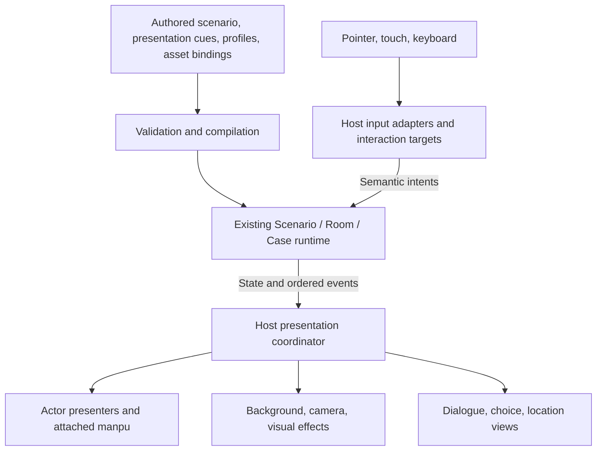

# Presentation promotion review

**Successor scope update, P102–P106:** the [SDK design](../../../docs/research/game-presentation-sdk-design.md)
now proposes direct succession through supported Godot code, a starter and
complete examples. Scenario is experimental; legacy room/point-and-click parity
and a second-genre proof are not prerequisites. The review below is historical,
not a competing current promotion plan. No runtime migration has occurred.

Historical P28 proposal, qualified by P29. Use [current status](CURRENT_STATUS.md)
for implemented features and open work; later audio, camera and game additions
do not retroactively change the evidence recorded in this review.

Date: 2026-09-10. Request: [P28](USER_PROMPTS.md#p28).
Status: proposal based on source review. No extraction, public contract change,
or promotion has been performed. Names below are working recommendations.

**P29 qualification:** [Promotion readiness and composition](PROMOTION_READINESS.md)
recommends further bounded evidence before freezing these boundaries. The host
mapping below describes the incumbent and the initial P28 proposal; it does not
establish the existing template structure as the approved target architecture.

The recommended destination is a shared **Scene Presentation** layer composed
with the existing Scenario, dialogue, room, and case runtimes. The spike has
proved a substantial conversation presentation vocabulary. Its fingertip
interaction proves an actor-local interaction target; it does not establish
general point-and-click room gameplay by itself.

## What already exists

The production [Scenario contract](../../../docs/spec/game/scenario.md) owns
executable narrative: lines, choices, conditions, flags, actor staging, and
endings. Its Godot [runtime](../../runtime/families/scenario/runtime.gd) already
serves standalone dialogue and case composition. The
[dialogue leaf](../../runtime/hosts/common/dialogue_leaf.gd) renders that state.

The existing [room runtime](../../runtime/genres/pointclick_room/state.gd) owns
hotspots, inspect/use, item selection, inventory, prerequisites, reveals, and
puzzle effects. The [case runtime](../../runtime/genres/case/runtime.gd) composes
rooms and dialogue with persistent progress and backlog. These responsibilities
have existing implementations to assess for retention or adaptation. The spike's story router and in-memory
resume should not become a second narrative or save system.

The broader [dialogue and cutscene sequence design](../../../docs/spec/game/dialogue-and-cutscene-sequences.md)
is explicitly a proposed destination. The current executable Scenario subset
does not already implement its general timed tracks, camera cues, or gameplay
gates. Promotion must deliberately introduce a supported subset and reject
unsupported input, rather than assume the proposal is implemented.

## Taxonomy: capabilities, implementations, and authored content

Use **Scene Presentation** as the umbrella. A capability is a responsibility;
it need not immediately become an independently packaged module.

| Capability | Reusable responsibility | Presets or authored content |
| --- | --- | --- |
| Actor Presentation | Render pose/expression, visibility, focus, visual effects, and entry/exit lifecycle. | Bounce, scale pulse, listener dimming, Opacity Fade, Silhouette Fade, hologram material and parameters. |
| Manpu Presentation | Attach a reaction to an actor-local anchor, maintain its own animation lifecycle, and inherit world framing. | The eight marks, who reacts, placement offsets, shake/pulse/fade presets, and timing. |
| Scene Staging and Camera Direction | Own background framing, actor placement, camera motion, and coordinated presentation cues. | Establishing-shot and close-up profiles; the departure, survivor shift, and arrival choreography; lens flare settings. |
| Interaction Target | Transform local hit geometry, enforce input eligibility, and emit an interaction intent. | Mira's fingertip geometry and contact feedback. Scenario owns the meaning of pairing and whether it blocks progress. |
| Presentation Animation | Sample scalar tracks and motion curves consistently; provide common timing/composition primitives. | Bounce, shake, fade, pulse, easing, and spring parameters. This is shared support code, not a gameplay system per animation. |
| Presentation UI | Reusable dialogue, choices, location announcement, and navigation views with input behavior. | Tactical palette, typography, clipped panels, spacing, and action styles form a skin/profile. |

Actor focus, exit, and manpu introduction can share animation sampling while
retaining separate lifecycles. A focus change should not restart a departing
actor, and replaying one reaction should not restart all reactions.
Similarly, a per-actor hologram shader, a lens flare overlay, and an exit
transition are different uses of presentation effects; they do not each require
a new gameplay module. Keep this vocabulary distinct from the existing
`families/effects` registry, which applies semantic gameplay outcomes.

**Custom does not mean impossible to abstract.** The mechanism can be reused
while direction remains authored. The story decides that Lena receives a
close-up over three lines, then leaves while Mira moves and Sera arrives. The
runtime executes that direction. Character art, expression bindings, source
anchors, location names, lighting anchors, dialogue, choices, shot timing, and
the tactical skin remain content. There is no need to invent a universal rule
that decides those creative choices.

Demo routes, the motion graph editor, galleries, and capture scripts remain
showcase and verification tools. Preserve the spike as a behavioral reference
until replacement slices are proven.

## Topology and ownership

This diagram shows runtime data flow, not code import permissions:

The coordinator schedules presentation, completion, and cancellation. It does
not choose narrative branches or run a second story interpreter. Scenario
remains action-driven; the host supplies presentation time. An explicitly
blocking cue delays permitted advancement through an agreed completion policy.
The presenter may need to retain a departing sprite until its exit finishes,
even after a semantic hide event has been emitted.

Use the repository's [existing topology](../../../godot/README.md) and
[host contract](../../../docs/spec/game/host-contract.md):

- `src/stage_gen/components/scenario/`: authored contract, validation, compilation.
- `godot/families/scenario/`: shared narrative state and ordered semantic events.
- `godot/genres/pointclick_room/` and `godot/genres/case/`: existing genre rules and composition.
- `godot/hosts/common/`: shared Godot presenters, controls, materials, input geometry, and asset loading once reuse is demonstrated.
- `godot/hosts/<recipe>/`: genre-specific host composition and adapters.
- Pure algorithms can be shared inward only when they meet the family boundary and have actual independent consumers.

The host contract requires evidence from two genres before declaring a family.
Three actors and eleven demo routes inside one spike do not meet that test.
`RefCounted` alone does not make a class engine-free: file reads, Godot vectors,
resources, materials, and scene nodes still belong at the host boundary.
Nothing here belongs in `gnode`, and gameplay promotion does not require an
asset-generation pipeline. Prepared assets can satisfy explicit runtime roles.

## What promotion requires

1. **Define a small supported contract.** Agree on stable actor, cue, statement,
   and target identities; coordinate spaces and source-art anchors; preset
   references; composition channels; sequential/parallel execution; blocking
   behavior; and interruption, pause, replay, and restoration semantics. A
   future skip policy should have explicit cue behavior when supported. Avoid
   an unbounded timeline language or arbitrary embedded script commands.
2. **Separate loading, state, and rendering.** The current stage combines asset
   loading, UI, presentation, interaction, and QA. Several controllers read JSON
   directly. The cast handoff specifically assumes three registered actors and
   two visible positions. Move those assumptions into authored data or explicitly
   bounded profiles before claiming general reuse. Preserve production actor
   slots and source-framing semantics when integrating camera movement.
3. **Integrate with the incumbent dialogue lifecycle.** The existing leaf renders
   discrete Scenario changes immediately. Consume its ordered events, including
   initial events, and introduce explicit presentation completion/cancellation
   behavior. Establish one owner for camera transforms, input, focus composition,
   and saved presentation state. The current generated UI-sheet requirements
   also need an explicit code-skin mode if this UI is adopted.
4. **Prove transfer and compatibility.** Run the same capability with a different
   cast, composition, and authored scene. For shared-family status, show a second
   actual genre consumer. Verify incumbent narrative results remain equivalent
   on the same input unless a deliberately versioned feature changes them.
5. **Pass the relevant production gates.** Check timing across frame partitions,
   interruptions and restoration, hidden/exiting targets, coordinate transforms,
   overlapping input, and camera bounds. Add production boundary checks and
   native render review, including standalone/export loading and font behavior.
   Existing spike captures are useful evidence but do not prove host integration.
   Asset publication and rights review remain separate from code promotion.

The recommended first slice is **Actor Presentation with attached Manpu in the
existing dialogue leaf**, proving focus, a matte exit, and independent reaction
animation on a second authored conversation. Follow with camera/choreography
and explicit interaction gates. Each slice can be promoted on its own evidence;
finishing every possible VN or room feature is not a prerequisite.

Audio remains deferred. Retain the requirement that a character presentation
such as holographic transmission can later select matching voice processing,
without introducing audio implementation in this promotion scope.

## Review evidence

This was a source and architecture review. No runtime checks were rerun and no
production code was changed for P28. Existing prototype validation remains in
[QA.md](QA.md); it is not a claim that the proposed integration passes those gates.
