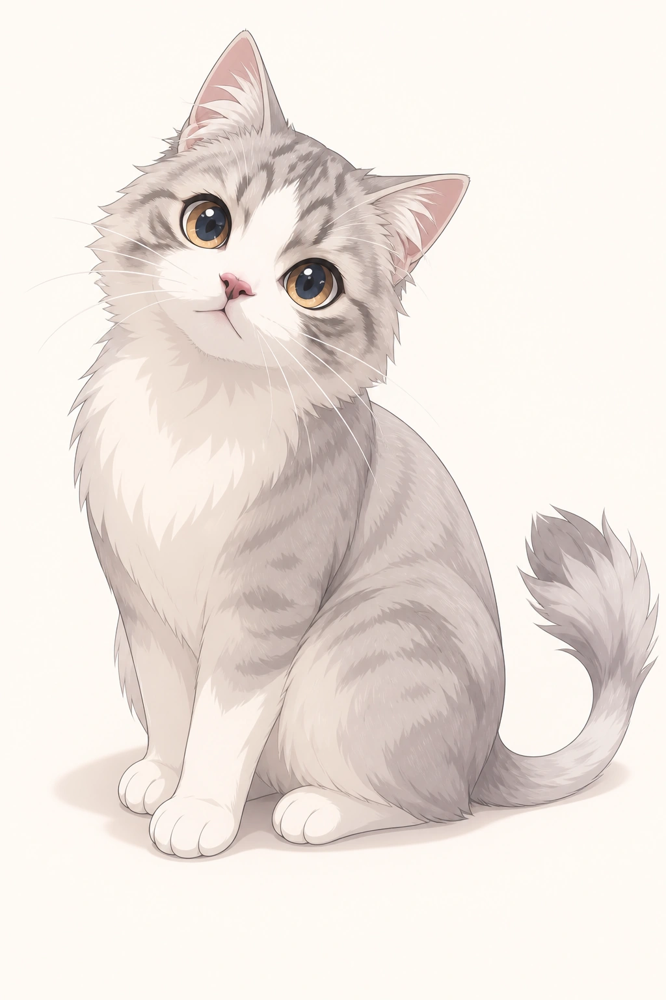
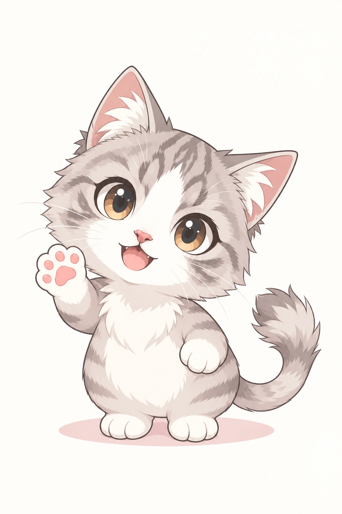

# Helix

Helix is a male cat based on the owner's pet. He is the library's first animal
character, with a seated anime-cat representation and an anthropomorphic SD
interpretation.

| | Current direction |
| --- | --- |
| Identifier | `helix` |
| Character | Male cat |
| Appearance | Round, curious face; large dark eyes with amber rims; pink nose; silver-gray tabby markings; white facial blaze, muzzle, chest, and paws; slender tail with a fluffy tip |

His familiar, curious expression anchors both representations. His background
is open for further development.

## Anime cat

A complete seated cat with natural feline proportions, clean anime outlines,
and simplified shading. His face, coat pattern, and tuft-ended tail define the
character across styles.

## Flat anthropomorphic SD

A standalone super-deformed (SD) concept with an oversized head, a compact round
body, and very short legs with broad paws tucked beneath his belly. His upright
stance and waving forepaw give him an anthropomorphic pose, while his fur, paws,
cat ears, and tail retain his feline identity without clothing. Flat colors and
simple shading keep the shapes clear.

