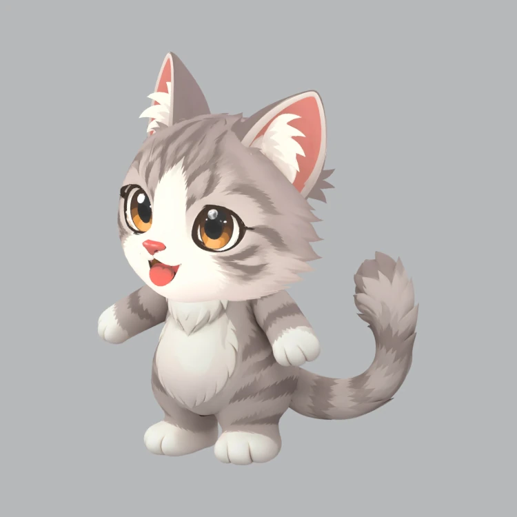

# Helix

Helix is a male cat based on the owner's pet. He is the library's first animal
character, with a seated anime-cat representation and an anthropomorphic SD
interpretation.

| | Current direction |
| --- | --- |
| Identifier | `helix` |
| Character | Male cat |
| Appearance | Round, curious face; large dark eyes with amber rims; pink nose; silver-gray tabby markings; white facial blaze, muzzle, chest, and paws; slender tail with a fluffy tip |

His familiar, curious expression anchors both representations. His background
is open for further development.

## Anime cat

A complete seated cat with natural feline proportions, clean anime outlines,
and simplified shading. His face, coat pattern, and tuft-ended tail define the
character across styles.

## Flat anthropomorphic SD

A standalone super-deformed (SD) concept with an oversized head, a compact round
body, and very short legs with broad paws tucked beneath his belly. His upright
stance and waving forepaw give him an anthropomorphic pose, while his fur, paws,
cat ears, and tail retain his feline identity without clothing. Flat colors and
simple shading keep the shapes clear.

## 3D SD

A textured, rigged interpretation of the anthropomorphic SD artwork in a neutral
stance. It preserves Helix's oversized round head, amber eyes, white muzzle and
belly, gray tabby markings, broad paws, and curved tail with its tufted tip.
The Stage Gen pipeline created AI-generated reference views and meshes from the
owner's original artwork, then assembled and rigged the character.

[Download the self-contained GLB](sd_3d.glb), inspect its
[source and generation record](sd_3d.json), or read the
[independent visual review](sd_3d.visual-review.md).

The model embeds its textures and a 29-joint skeleton shared by the body, head
and tail skins. Six original diagnostic clips cover shoulder raising, elbow and
knee bending, paw curling, a short cheer and tail wagging; rest is the bind pose.
The reviewed pipeline result needed no correction after admission. The head and
face remain fixed shapes, with no facial or secondary-fur animation. Sampled
Samba poses show a minor belly/hip fold during some bent-leg movements, so this
representation does not certify polished motion for every animation. The preview
is rendered from this GLB. Samba footage remains with the local marketing
handoff; retargeting and runtime setup belong to the consuming project.
