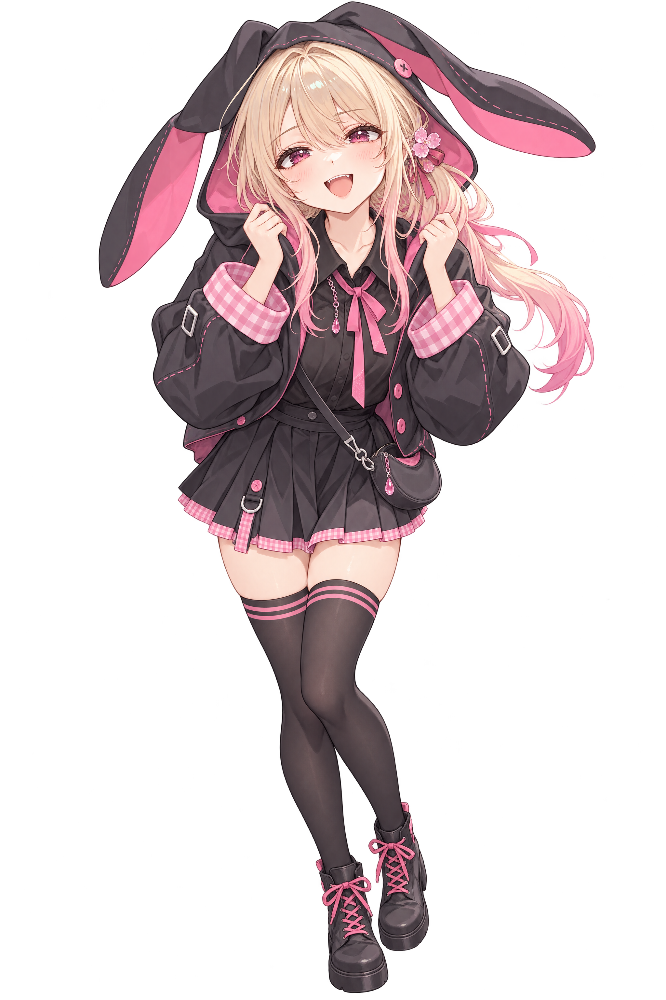
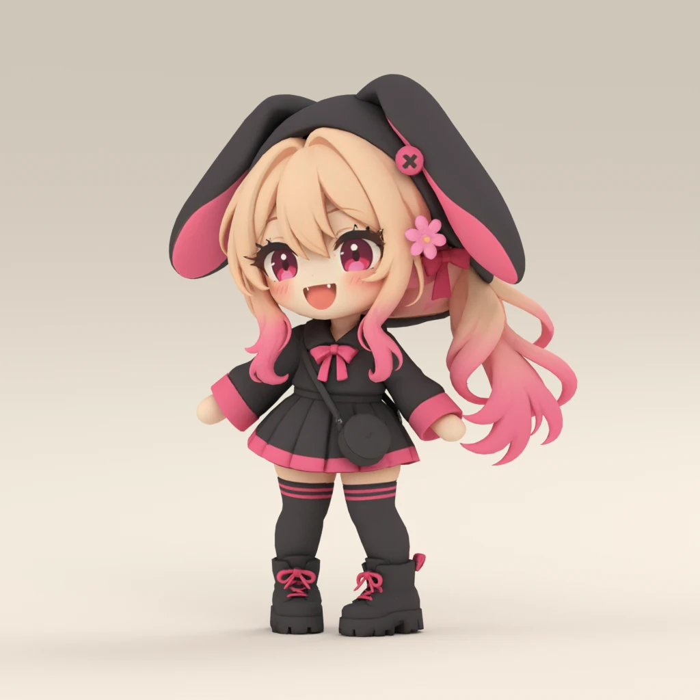

# Nami

Nami is the repository's mascot and first canonical character. Her artwork
includes two illustration poses and detailed and flat SD concepts.

| | Current direction |
| --- | --- |
| Identifier | `nami` |
| Character | Adult human woman; rabbit-themed clothing |
| Personality | Warm, playful, welcoming, and a little mischievous |
| Appearance | Slender build; pale blonde hair fading to pink; magenta eyes; pink flower-and-ribbon hair ornament |
| Current outfit | Charcoal rabbit-ear hood and jacket, pink gingham accents, pleated skirt, thigh-high stockings, platform boots, and a small crossbody bag |

She enjoys drawing people into a shared moment and meeting hesitation with a
playful invitation. Her background is open for further development.

## Bunny-hood illustration

These two distinct poses in the same outfit form her first illustration representation,
stored directly in this character directory. Alternate clothing and neutral body
references have not been added.

### Full body

The overall silhouette, outfit, and expressive standing pose.

### Reaching pose

An upper-body pose with a foreshortened hand reaching toward the viewer.

## SD representations

Both styles are kept as standalone concept art.

### Detailed SD

A standalone super-deformed (SD) concept illustration with an oversized head,
compact proportions, chunky boots, and a welcoming wave. It explores Nami's
silhouette and personality while preserving her rabbit hood, pink-tipped hair,
magenta eyes, and charcoal-and-pink outfit.

### Flat SD

A simpler chibi interpretation with a larger head, shorter body, cleaner shapes,
and reduced texture. Solid pink cuffs and skirt trim replace the gingham, while
the waving pose and defining character features remain recognizable.

### 3D SD

A textured, rigged interpretation of the flat SD artwork, with a neutral stance
and fixed mitten hands. It preserves the floppy rabbit hood, long pink-tipped
hair, flower ornament, charcoal-and-pink outfit, striped stockings, platform
boots and crossbody bag.

[Download the self-contained GLB](sd_3d.glb), inspect its
[source and generation record](sd_3d.json), or read the
[independent visual review](sd_3d.visual-review.md).

The model embeds its textures and humanoid skeleton. Hair, hood ears and clothing
have no secondary-motion simulation; fingers and facial features are fixed.
The automatic rigs pulled hair and skirt geometry with arm movements, so this
representation includes local skin-weight corrections followed by independent
motion review. The six bundled clips cover rest, shoulder, elbow, knee and wrist
checks, plus a short cheer. The preview is rendered from this GLB. Animation
retargeting and runtime setup belong to the consuming project.
