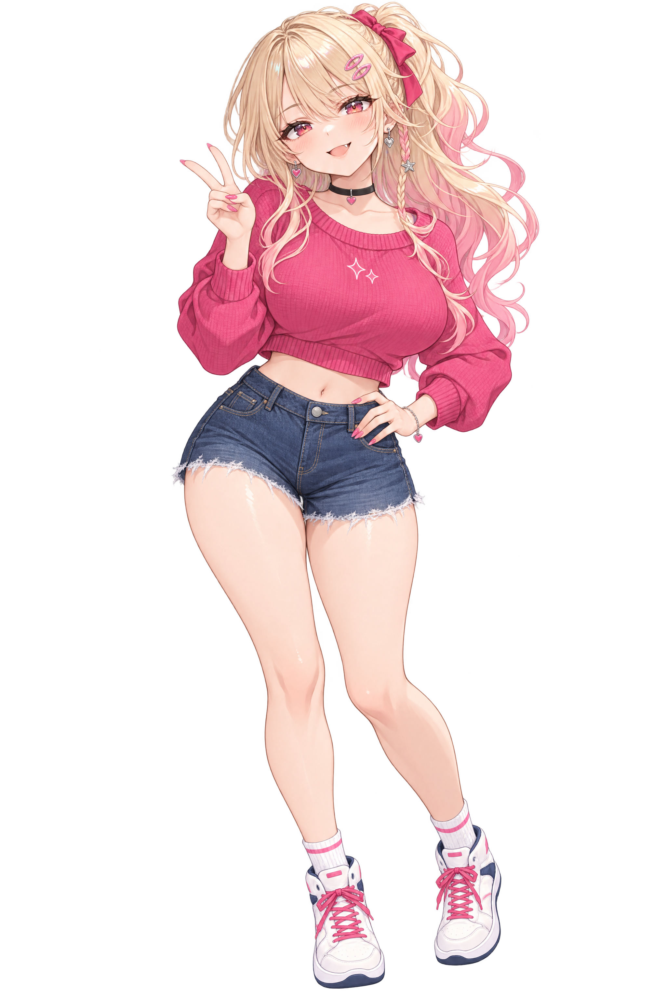
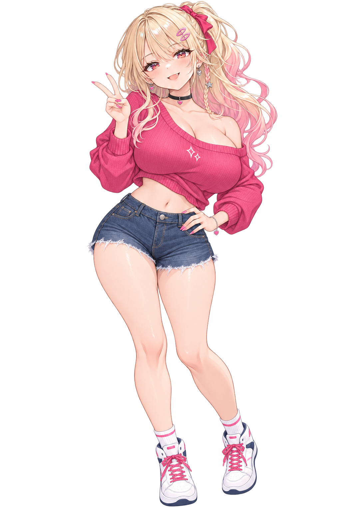
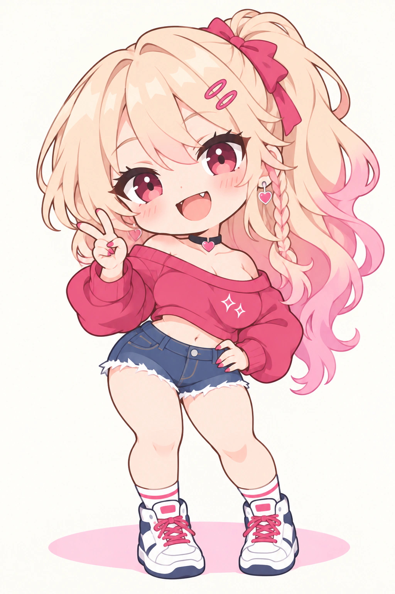
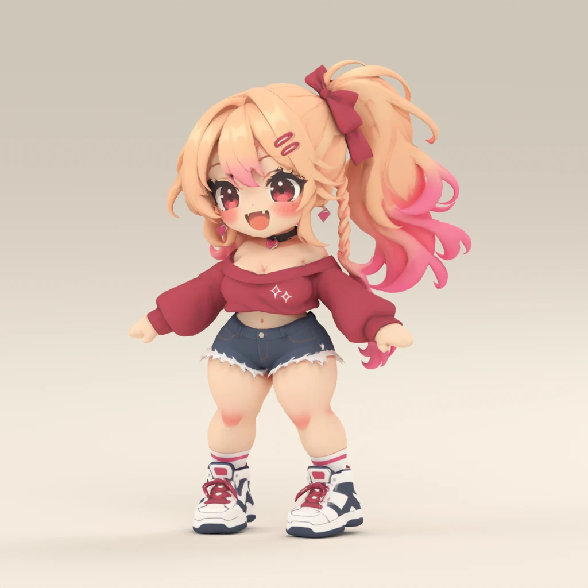

# Riko

Riko is a canonical character with an exaggerated hourglass silhouette and bright
contemporary streetwear. Her illustrations explore fitted and loose sweater outfits
and a flat SD interpretation.

| | Current direction |
| --- | --- |
| Identifier | `riko` |
| Character | Adult human woman; exaggerated feminine proportions |
| Personality | Confident, playful, outgoing, and warmly teasing |
| Appearance | Full bust, defined waist, rounded hips, fuller thighs, and long legs; honey-blonde hair with pink ends, a high side ponytail, and rose-coral eyes |
| Current outfit | Raspberry cropped sweater, high-waisted denim shorts, white high-top sneakers with pink laces, and small heart-and-star accessories |

Riko turns casual outings into small adventures, usually with a joke and a bold
outfit. Her teasing makes people feel included; beneath the confident first
impression, she is quick to welcome someone into the group. Her background is
open for further development.

## Fitted sweater

A relaxed standing pose with a peace sign and one hand at her waist. The fitted
sweater and shorts make her silhouette easy to read.

## Loose sweater

A full-body variation with a fuller bust and a loose, off-shoulder raspberry
sweater. The dropped neckline and uneven cropped hem reveal more of her shoulder,
upper chest, and waist. Her standing pose, denim shorts, and sneakers carry across
both illustrations. This image has a transparent background.

## Flat SD

A standalone super-deformed (SD) concept with an oversized head, compact curvy
silhouette, short limbs, and chunky sneakers. Flat colors and simple shading
replace the detailed textures while keeping her pink-tipped ponytail, peace sign,
loose raspberry sweater, and denim shorts recognizable.

## 3D SD

A textured, rigged interpretation of the flat SD artwork, with a neutral stance
and fixed mitten hands. It preserves the compact curvy silhouette, pink-tipped
side ponytail and bow, loose raspberry sweater, denim shorts and chunky
white-and-pink sneakers.

[Download the self-contained GLB](sd_3d.glb), inspect its
[source and generation record](sd_3d.json), or read the
[independent visual review](sd_3d.visual-review.md).

The model embeds its textures and humanoid skeleton. Hair and clothing have no
secondary-motion simulation; fingers and facial features are fixed. The automatic
rigs pulled the ponytail with arm movements, so this representation includes a
local hair-weight correction followed by independent motion review. The six
bundled clips cover rest, shoulder, elbow, knee and wrist checks, plus a short
cheer. The preview is rendered from this GLB. Animation retargeting and runtime
setup belong to the consuming project.
