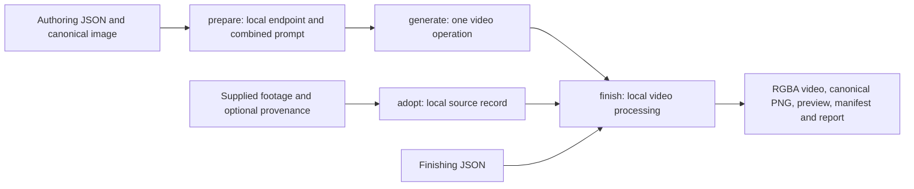

# Movie sprite body idle

This recipe produces a transparent looping body video, a first-frame canonical,
previews and processing metadata. It composes the
[movie sprite component](../../components/movie_sprite/README.md) through the
[public pipeline harness](../../pipeline/README.md). The
[user guide](../../../../docs/movie-sprite.md) covers motion authoring and the CLI.

The public factory is `create_pipeline(finish_ref=..., authoring_ref=...,
settings=GenerationSettings(...), routes=..., generator=...)`. Alternatively,
provide `supplied_video_ref` and optional `supplied_provenance_ref` instead of
`authoring_ref`. Every reference is relative to the explicit `input_root`.
Optional `rights` records caller-owned rights without granting review or publication.

## Graph and operations



The factory chooses either `prepare → generate → finish` or `adopt → finish`.
It does not combine the two source branches. Public targets select the dependency
closure of `prepare`, `generate` or `finish`, or `adopt`/`finish` for supplied input.
Generation consumes identical explicit start/end images. There are no middle-frame
or extra-reference ports. Facial repaint is a separate existing recipe downstream
of `body/canonical.png`; it is not a node in this graph.

Preparation, adoption and finishing make zero provider calls. Generation is one
logical operation with the injected service's single retry owner and at most six
dispatches. The factory does not select a model, read credentials or own a budget.
The application host supplies these. Planning validates inputs, controls and route
features without opening that host. Actual output dimensions, duration and complete
decodability are validated inside the service's retry loop.

## Cache and lineage

The graph uses the harness's atomic artifact/sidecar publication, cache admission,
trace, run manifest and read-only inspection. Source input digests, rights, compiler
identity, generation settings, candidate identity and resolved route bind the
relevant stages. Finishing controls and component implementation bind finishing.
Changing only retiming, masks or export settings can reuse the selected generated
source. Changing the candidate deliberately invalidates generation.

The generated source must retain the exact admitted prompt, route, parameters and
both endpoint role/digest records. Supplied video retains its original source record
and rights; it is not rewritten as a current-template generation. Unknown origin is
recorded as local adoption, not inferred. Imported records with private paths,
signed references or credentials are rejected.

Cache reuse validates bytes and lineage. Finishing additionally verifies manifest,
canonical and per-frame report consistency. A replay with a missing generation
cache fails without dispatching a provider. Use a fresh output directory for each
run; output and cache roots use the existing harness confinement rules.

The harness ID is `movie_sprite_body_idle`; `movie_sprite/body/idle` names the
user-facing capability. Persisted request template identity is
`movie-sprite-idle-v2`. Historical takes retain their original prompt and template;
promotion does not relabel them or promise identical new generations.

## Runnable offline example

The example authors an original geometric transparent sprite and a lossless clip.
It requires FFmpeg and makes no provider calls:

```sh
uv run python src/stage_gen/recipes/movie_sprite_body_idle/examples/supplied_clip/make_inputs.py /tmp/movie-inputs
uv run stage-gen-movie-sprite body idle run --input-root /tmp/movie-inputs --source actor.mkv --finish finish.json --output-root /tmp/movie-run --cache-root /tmp/movie-cache
uv run stage-gen-movie-sprite inspect /tmp/movie-run
```

The same [definition](examples/supplied_clip/pipeline.py) works with
`stage-gen pipeline plan|run`. Python callers import `create_pipeline` and use
`stage_gen.pipeline.plan` and `run`; no checkout-relative runtime paths are needed.

Tests exercise all RGBA pixels, playback rate, exact canonical, frame archive,
cache hits and corruption, source lineage, route admission, injected generation
validation and costs. The installed-wheel probe runs outside the checkout. The
component separately tests the native finishing algorithms; live provider
canaries and human motion review remain distinct evidence.
