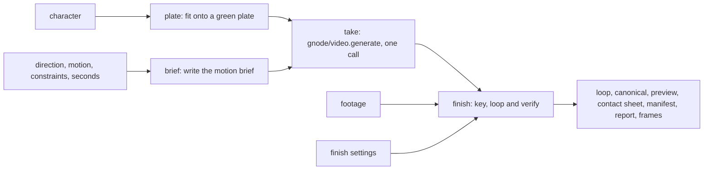

# Movie sprite: contract

> **Checked by:** `tests/contract/test_workflow_contract_docs.py`.

Turn one character picture into a transparent looping body video, its exact first frame, a preview and their records. The face is held still, so the portrait-motion workflow can add blinks and mouth shapes to the finished `canonical.png` separately; that workflow is not a step of this one.

The workflow is a gnode workflow file, [`workflow.yaml`](workflow.yaml), over its own node types in [`nodes/`](nodes/) and gnode's standard `video.generate`; `gnode plan|run movie-sprite` plans and runs it, from this checkout or an installed wheel. `gnode schema movie-sprite` prints its inputs as JSON Schema:

- `character`, a picture on a transparent background, **or** `footage`, a clip made elsewhere (MP4, or Matroska with alpha). The plan refuses both, and neither.
- `direction`, `requested_motion` and `constraints`: the author's words for the motion, each optional.
- `seconds` (3 to 10), `resolution` (`360p`, `720p`, `1080p`, `4k`) and `aspect_ratio` (`9:16`, `16:9`) of the take.
- `finish`: a JSON file of finishing settings, validated by the [movie sprite component](../../components/movie_sprite/README.md) before anything runs.

## Graph and calls



With a `character`, the plan has four steps: `plate`, `brief`, `take` and `finish`. With `footage`, it has `finish` alone, and makes no call.

- **plate** crops the character's visible silhouette, scales it uniformly into a 720×1280 (or 1280×720) frame with a margin, and composites it onto flat green, never repainting the art. The plate is both ends of the take, so its pixels are part of the paid request.
- **brief** writes the take's prompt: the standing-idle template, [`prompts/idle.md`](prompts/idle.md), then the author's direction, requested motion and constraints, each as its own section. With none at all, a quiet listening idle is asked for.
- **take** is one `video.generate` call on the route the workflow's [`gnode.yaml`](gnode.yaml) names by default: fal's Gemini Omni Flash image-to-video route, with the plate as the first and the last frame. The route needs `first_last_frame`, which the plan checks before any spend; the plan prices it per second at the take's resolution. A run makes it only with `--live` (`live=True` in Python) and a fal key.
- **finish** is the component's finishing: green chroma extraction with despill, optional held regions and local repairs, an optical-flow loop closure, and playback retiming. It is local and free, and verifies every decoded output frame.

```python
import gnode

result = gnode.run("movie-sprite", input_files=["take.yaml"], live=True, max_usd=2)
result.deliver({"loop": "sprites/idle.mkv", "canonical": "sprites/idle.png"})
```

The take is a long provider job. gnode records the job before it is submitted and once fal takes it, so a run that stops while the clip renders collects it next time instead of paying for it again; a submission whose answer never arrived stops the take for a person (`gnode jobs`). The adapter retries a submission only when fal answered that it took nothing. A job fal failed, or a clip whose size or length is not what was asked for, fails the step: drawing again is a new paid take, made with `gnode reroll`, never a silent retry.

## Cache and identity

Each step's identity is its node type's locked version ([`gnode.lock`](gnode.lock); the node modules' sources and Stage Gen's movie sprite component count as their source) and what it reads. The take's call is kept in gnode's call cache by its capability, route, request (the prompt, the plate's digest, length, resolution and aspect ratio) and take number, so changing only the finishing settings reruns `finish` alone and bills nothing, and a reroll is a new take. Changing the template, the plate's fit or the brief's wording changes the request, and with it the bill.

A take answered by a provider earlier, under the same request, is reused from the cache whatever run made it.

## Outputs

Under the run folder's `outputs/`:

- `loop.mkv`: lossless FFV1 Matroska with straight RGBA and no audio, encoded bit-exact, so the same frames are the same file.
- `canonical.png`: the loop's exact first frame; the face workflow starts from it.
- `preview.mp4`: a silent H.264 preview over a dark background, without transparency.
- `contact_sheet.png`: sampled frames on light, dark and checkerboard grounds.
- `manifest.json` (`movie_sprite_body`): size, frame count, playback seconds and rate, alpha mode, and digests.
- `report.json` (`movie_sprite_body_processing`): the settings used, the source facts, and a hash of every frame.
- `frames.zip`: every frame as a numbered PNG, when the finishing settings set `export_frames`.

The finish step's view plays the preview and shows the contact sheet with the report's checks; the take's view plays the take.

## Graph

gnode plans the committed sample's take path offline; this is the shape of that plan. `scripts/write_workflow_contracts.py --write` regenerates the block, and the check above fails when it drifts:

<!-- pipeline-graph-contract:start -->
```json
{
  "graph_kind": "gnode-graph-v2",
  "topology_sha256": "8fe00c409807766aa7300acb2df7d49bcc77dbdd697eb58fa0ebb569405c5ef9",
  "node_count": 4,
  "operation_counts": {
    "local": 3,
    "video_generate": 1
  },
  "outputs": [
    "outputs/canonical.png",
    "outputs/contact_sheet.png",
    "outputs/frames.zip",
    "outputs/loop.mkv",
    "outputs/manifest.json",
    "outputs/preview.mp4",
    "outputs/report.json"
  ],
  "type_ids": [
    "movie_sprite/brief",
    "movie_sprite/finish",
    "movie_sprite/plate",
    "movie_sprite/take"
  ]
}
```
<!-- pipeline-graph-contract:end -->

## Runnable offline example

`inputs/supplied_clip/make_inputs.py <directory>` draws an original geometric actor as a still and as a twelve-frame lossless clip, without a provider, and writes `take.yaml` (the still, for planning a take) and `clip.yaml` (the clip, finished as footage):

```sh
uv run python src/stage_gen/workflows/movie_sprite/inputs/supplied_clip/make_inputs.py /tmp/movie-inputs
uv run gnode plan movie-sprite --inputs /tmp/movie-inputs/take.yaml
uv run gnode run movie-sprite --inputs /tmp/movie-inputs/clip.yaml
uv run gnode inspect movie-sprite --verify
```

Tests run the take path offline with a stand-in for the video call, the footage path for real, and the importer that makes an example from a run. The installed-wheel probe runs outside the checkout. Live provider canaries and human motion review remain separate evidence.
